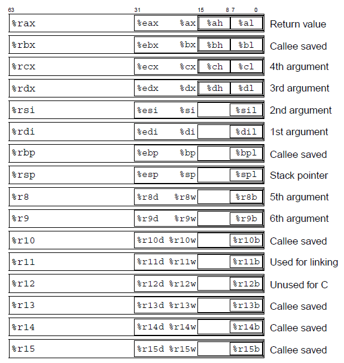
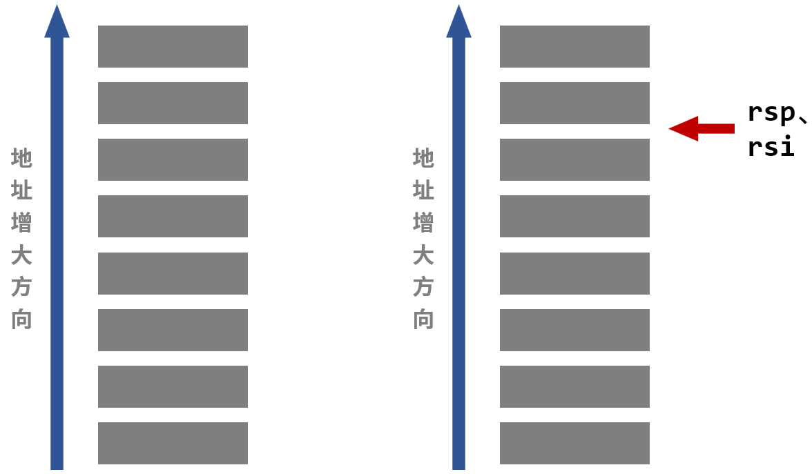

# Bomb Lab

## 简介

### 实验要求

**题目要求：** 运行 bomb 后在 6 个 phase 输入正确的内容，输入正确 bomb 程序才能继续运行，输入错误就会 bomb!  。如果是CMU的学生，每个人获得的炸弹是不一样的（高超的 反作弊技巧），每次爆炸会扣0.5分，扣满20分为止。不过我们作为自学党，没有这个限制，用的是自学用bomb，随便炸，根本不虚，不过为了达成良好的学习效果，还是尽可能减少爆炸次数。

实验文件
-  [bomb](../labs/bomb/bomb) 程序文件
-  [bomb.c](../labs/bomb/bomb.c) 包括题目要求和 bomb 实现的代码框架，无法编译。

### 阅读源码

```c
#include <stdio.h>
#include <stdlib.h>
#include "support.h"
#include "phases.h"

/* 
 * Note to self: Remember to erase this file so my victims will have no
 * idea what is going on, and so they will all blow up in a
 * spectaculary fiendish explosion. -- Dr. Evil 
 */

FILE *infile;

int main(int argc, char *argv[])
{
    char *input;

    /* Note to self: remember to port this bomb to Windows and put a 
     * fantastic GUI on it. */

    /* When run with no arguments, the bomb reads its input lines 
     * from standard input. */
    if (argc == 1) {  
	infile = stdin;
    } 

    /* When run with one argument <file>, the bomb reads from <file> 
     * until EOF, and then switches to standard input. Thus, as you 
     * defuse each phase, you can add its defusing string to <file> and
     * avoid having to retype it. */
    else if (argc == 2) {
	if (!(infile = fopen(argv[1], "r"))) {
	    printf("%s: Error: Couldn't open %s\n", argv[0], argv[1]);
	    exit(8);
	}
    }

    /* You can't call the bomb with more than 1 command line argument. */
    else {
	printf("Usage: %s [<input_file>]\n", argv[0]);
	exit(8);
    }

    /* Do all sorts of secret stuff that makes the bomb harder to defuse. */
    initialize_bomb();

    printf("Welcome to my fiendish little bomb. You have 6 phases with\n");
    printf("which to blow yourself up. Have a nice day!\n");

    /* Hmm...  Six phases must be more secure than one phase! */
    input = read_line();             /* Get input                   */
    phase_1(input);                  /* Run the phase               */
    phase_defused();                 /* Drat!  They figured it out!
				      * Let me know how they did it. */
    printf("Phase 1 defused. How about the next one?\n");

    /* The second phase is harder.  No one will ever figure out
     * how to defuse this... */
    input = read_line();
    phase_2(input);
    phase_defused();
    printf("That's number 2.  Keep going!\n");

    /* I guess this is too easy so far.  Some more complex code will
     * confuse people. */
    input = read_line();
    phase_3(input);
    phase_defused();
    printf("Halfway there!\n");

    /* Oh yeah?  Well, how good is your math?  Try on this saucy problem! */
    input = read_line();
    phase_4(input);
    phase_defused();
    printf("So you got that one.  Try this one.\n");
    
    /* Round and 'round in memory we go, where we stop, the bomb blows! */
    input = read_line();
    phase_5(input);
    phase_defused();
    printf("Good work!  On to the next...\n");

    /* This phase will never be used, since no one will get past the
     * earlier ones.  But just in case, make this one extra hard. */
    input = read_line();
    phase_6(input);
    phase_defused();

    /* Wow, they got it!  But isn't something... missing?  Perhaps
     * something they overlooked?  Mua ha ha ha ha! */
    
    return 0;
}
```

源码即为 `bomb.c` ，可以看到这个程序的主要逻辑大概是：每个阶段都是通过 `phase_x` 函数来实现的，而 `phase_x` 函数的参数是 `input`，也就是我们输入的字符串。所以，我们的目标就是**通过分析 `phase_x` 函数来找到正确的 `input`**。

根据题目的要求以及提示，**可以将`bomb`可执行文件反汇编，对汇编语言代码进行逆向分析**。

### 工具列表

`objdump`-用于反汇编二进制对象文件

`VS Code`-用于查看反汇编后的结果与文本文件的编写，详见环境构建

`gdb`-用于运行时单步调试与查看运行时内存与寄存器信息

### gdb 指令

| 指令  | 全称  | 功能  |
|---|---|---|
|  gdb filename |   | 开始调试程序  |
|  r | run  | 开始执行程序，直到下一个断点或程序结束；run 1 2 3，开始运行病传入参数 1 2 3  |
|  q | quit  | 退出 GDB 调试器  |
|  ni | nexti  | 执行下一条指令，但不进入函数内部  |
|  si | stepi  | 执行当前指令，如果是函数调用则进入函数  |
|  b |  break | 在指定位置设置断点  |
|  d |  delete 1 | 删除断点1  |
|   |  clear sum | 删除sum函数入口的断点  |
|  c |  cont |  从当前位置继续执行程序，直到下一个断点或程序结束 |
|  p |  print | 打印变量的值  |
|  x |   | 打印内存中的值；</br>`x/w $rsp`	解析在rsp所指向位置的word；</br>`x/2w $rsp` 解析在rsp所指向位置的两个word；</br>`x/2wd $rsp` 解析在rsp所指向位置的word，以十进制形式输出	  |
|  j |  jump | 跳转到程序指定位置  |
|  disas |   | 反汇编当前函数或指定的代码区域  |
|  layout asm |   | 显示汇编代码视图  |
|  layout regs |   | 显示当前的寄存器状态和它们的值  |

关于 `p` 和 `x`，最重要的就是记得 `p` 命令用于打印表达式的值，而 `x` 命令则主要用于检查内存的内容。几个常用示例如下：

```bash
p $rax  # 打印寄存器 rax 的值
p $rsp  # 打印栈指针的值
p/x $rsp  # 打印栈指针的值，以十六进制显示
p/d $rsp  # 打印栈指针的值，以十进制显示

x/2x $rsp  # 以十六进制格式查看栈指针 %rsp 指向的内存位置 M[%rsp] 开始的两个单位。
x/2d $rsp # 以十进制格式查看栈指针 %rsp 指向的内存位置 M[%rsp] 开始的两个单位。
x/2c $rsp # 以字符格式查看栈指针 %rsp 指向的内存位置 M[%rsp] 开始的两个单位。
x/s $rsp # 把栈指针指向的内存位置 M[%rsp] 当作 C 风格字符串来查看。

x/b $rsp # 检查栈指针指向的内存位置 M[%rsp] 开始的 1 字节。
x/h $rsp # 检查栈指针指向的内存位置 M[%rsp] 开始的 2 字节（半字）。
x/w $rsp # 检查栈指针指向的内存位置 M[%rsp] 开始的 4 字节（字）。
x/g $rsp # 检查栈指针指向的内存位置 M[%rsp] 开始的 8 字节（双字）。

info registers  # 打印所有寄存器的值
info breakpoints  # 打印所有断点的信息

delete breakpoints 1  # 删除第一个断点，可以简写为 d 1
```

这些命令在 `/` 后面的后缀（如 `2x、2d、s、g、20c`）指定了查看内存的方式和数量。具体来说：

- 第一个数字（如 `2、20`）指定要查看的单位数量。

- 第二个字母（如 `x、d、s、g、c`）指定单位类型和显示格式，其中：
  - `c` / `d` / `x` 分别代表以字符、十进制、 十六进制格式显示内存内容。
  - `s` 代表以字符串格式显示内存内容。
  - `b` / `h` / `w` / `g` 分别代表以 1 / 2 / 4 / 8 字节为单位（`unit`）显示内存内容。当使用 `x/b`、`x/h`、`x/w`、`x/g` 时，`unit` 会记录对应改变，直到再次使用这些命令。

### x86-64 寄存器



更多指令可以参考：
- [gdb 指令](http://csapp.cs.cmu.edu/2e/docs/gdbnotes-x86-64.pdf)           
- [马天猫的CS学习之旅](https://zhuanlan.zhihu.com/deeplearningcat) 
  
## 实验解析

### 反编译

首先让我们来反编译一下整个 `bomb` 这个二进制程序：

```bash
objdump -d bomb > bomb.asm
```

运行 bomb 程序，并使用 `layout asm`、`layout regs` 开启视图，方便分析。

```bash
gdb run
layout asm
layout regs
```


### phase_1

```asm
0000000000400ee0 <phase_1>:
  400ee0:	48 83 ec 08          	sub    $0x8,%rsp
  400ee4:	be 00 24 40 00       	mov    $0x402400,%esi
  400ee9:	e8 4a 04 00 00       	callq  401338 <strings_not_equal>
  400eee:	85 c0                	test   %eax,%eax
  400ef0:	74 05                	je     400ef7 <phase_1+0x17>
  400ef2:	e8 43 05 00 00       	callq  40143a <explode_bomb>
  400ef7:	48 83 c4 08          	add    $0x8,%rsp
  400efb:	c3                   	retq   
```

注意此处需要结合 x86-64 寄存器，**明确每个寄存器的作用**

- 第2行，为函数分配栈帧（`%rsp`为栈指针）
- 第3行，设置函数`strings_not_equal`传入参数,（`%esi`为栈指针）函数第二个参数
- 第4行，调用函数 `strings_not_equal`，从字面意思理解，猜想如果传入字符串不同，则返回0
- 第5、6行，函数`strings_not_equal`的返回值储存在`%eax`中（`%eax`表示函数返回值），判断其是否为0，若为0，则跳至第8行，函数返回，炸弹拆除成功；若不为0，则跳至第7行
- 第7行，调用`explode_bomb`函数，从字面意思理解，炸弹爆炸了。
- 第8行，清理栈空间

**调试步骤:**

```bash
gdb run 
file bomb
b *0x400ee4
r
x/s 0x402400  # 正确答案
quit
```

**重新启动**

```bash
gdb
layout regs
layout asm
file bomb
b phase_2
r
# 输入正确答案
Phase 1 defused. How about the next one?
c
```

### phase_2

```asm
0000000000400efc <phase_2>:
  400efc:	55                   	push   %rbp         ; 被调用者保存
  400efd:	53                   	push   %rbx         ；被调用者保存
  400efe:	48 83 ec 28          	sub    $0x28,%rsp   ; 分配40字节栈空间
  400f02:	48 89 e6             	mov    %rsp,%rsi    ; rsi = rsp (栈顶地址作为参数)
  400f05:	e8 52 05 00 00       	callq  40145c <read_six_numbers>    ; 调用read_six_numbers，读取6个数到栈上
  400f0a:	83 3c 24 01          	cmpl   $0x1,(%rsp)              ; 比较栈顶第一个数是否等于1
  400f0e:	74 20                	je     400f30 <phase_2+0x34>    ; 如果等于1，跳转到400f30
  400f10:	e8 25 05 00 00       	callq  40143a <explode_bomb>    ; 否则爆炸
  400f15:	eb 19                	jmp    400f30 <phase_2+0x34>    ; 跳转（冗余，因为爆炸后不会继续）
  ; 循环部分
  400f17:	8b 43 fc             	mov    -0x4(%rbx),%eax          ; 取前一个数（rbx-4）到eax
  400f1a:	01 c0                	add    %eax,%eax                ; eax = eax * 2
  400f1c:	39 03                	cmp    %eax,(%rbx)              ; 比较当前数(rbx指向)是否等于前一个数的两倍        
  400f1e:	74 05                	je     400f25 <phase_2+0x29>    ; 相等则跳转
  400f20:	e8 15 05 00 00       	callq  40143a <explode_bomb>    ; 否则爆炸
  400f25:	48 83 c3 04          	add    $0x4,%rbx                ; rbx + 4 指向下一个数
  400f29:	48 39 eb             	cmp    %rbp,%rbx                ; 比较rbx是否达到rbp（结束位置）
  400f2c:	75 e9                	jne    400f17 <phase_2+0x1b>    ; 未达到则继续循环
  400f2e:	eb 0c                	jmp    400f3c <phase_2+0x40>    ; 达到则跳出循环，函数结束
  ; 初始化循环指针
  400f30:	48 8d 5c 24 04       	lea    0x4(%rsp),%rbx           ; rbx指向第二个数（地址为rsp+4）
  400f35:	48 8d 6c 24 18       	lea    0x18(%rsp),%rbp          ; rbp指向结束位置（rsp+24，即第六个数之后）
  400f3a:	eb db                	jmp    400f17 <phase_2+0x1b>    ; 跳转到循环开始
  ; 清理栈并返回
  400f3c:	48 83 c4 28          	add    $0x28,%rsp
  400f40:	5b                   	pop    %rbx
  400f41:	5d                   	pop    %rbp
  400f42:	c3                   	retq
```

接下来将逐步分析代码

#### step 1

```asm
  400efc:	55                   	push   %rbp
  400efd:	53                   	push   %rbx
  400efe:	48 83 ec 28          	sub    $0x28,%rsp
```

- 第 2、3 行：将**被调用者保存寄存器的值**入栈
- 第 4 行：分配栈帧

#### step 2

```asm
  400f02:	48 89 e6             	mov    %rsp,%rsi
  400f05:	e8 52 05 00 00       	callq  40145c <read_six_numbers>
```
- 第 5 行：将栈顶指针`%rsp`传递给`%rsi`
- 第 6 行：**将`%rsi`作为参数调用`read_six_number`**
- 从字面意思理解，本题是要我们输入`6`个数字。这里`mov %rsp,%rsi`的目的是保存`caller`中栈顶的位置，方便在`read_six_numbers`中进行改值。我们不妨反汇编`read_six_numbers`

此时栈的情况为



#### step3 反汇编 read_six_number

因为此时栈中的值从`read_six_number`中获取，所以不妨进入 `read_six_number`看一下其汇编实现

```asm
(gdb) disassemble read_six_numbers
Dump of assembler code for function read_six_numbers:
   0x000000000040145c <+0>:     sub    $0x18,%rsp       ; 分配 24 字节栈空间
   0x0000000000401460 <+4>:     mov    %rsi,%rdx        ; rdx = rsi (第 1 个整数地址)
   0x0000000000401463 <+7>:     lea    0x4(%rsi),%rcx   ; rcx = rsi + 4 （第 2 个整数地址）
   0x0000000000401467 <+11>:    lea    0x14(%rsi),%rax  ; rax = rsi + 20（第 6 个整数地址）
   0x000000000040146b <+15>:    mov    %rax,0x8(%rsp)   ; rsp + 8 = 第 6 个整数地址
   0x0000000000401470 <+20>:    lea    0x10(%rsi),%rax  ; rax = rsi + 16（第 5 个整数地址）
   0x0000000000401474 <+24>:    mov    %rax,(%rsp)      ; rsp = 第 5 个整数地址
   0x0000000000401478 <+28>:    lea    0xc(%rsi),%r9    ；r9 = rsi + 12 （第 4 个整数地址）
   0x000000000040147c <+32>:    lea    0x8(%rsi),%r8    ；r8 = rsi + 8  （第 3 个整数地址）
   0x0000000000401480 <+36>:    mov    $0x4025c3,%esi   ；esi = 格式字符串地址（"%d %d %d %d %d %d"）
   0x0000000000401485 <+41>:    mov    $0x0,%eax        ; eax = 0（清除返回值）
   0x000000000040148a <+46>:    callq  0x400bf0 <__isoc99_sscanf@plt> 调用 sscanf
   0x000000000040148f <+51>:    cmp    $0x5,%eax        ； 检查返回值（成功解析的整数数量）
   0x0000000000401492 <+54>:    jg     0x401499 <read_six_numbers+61> ；若 >5（即6个）则跳转
   0x0000000000401494 <+56>:    callq  0x40143a <explode_bomb>        ; 否则引爆炸弹
   0x0000000000401499 <+61>:    add    $0x18,%rsp       ; 恢复栈指针
   0x000000000040149d <+65>:    retq                    ; 返回
End of assembler dump. 
```

在`read_six_numbers`中，它使用了传入的`rsi`（即`phase_2`的`rsp`）作为数组基址，然后计算出6个地址：

**在这个函数中，要做到传6个参数，用来存储6个输入的数字**。

`sscanf`这个函数，有`8`个参数:
- 第一个是`input`
- 第二个是输入的模式串
- 之后`6`个是读取`6`个的值存的地址，因为最多只能传6个寄存器参数，所以最后两个把内存地址存在栈中 。六个地址分别存在`%rdx, %rcx, %r8, %r9, (%rsp), 8(%rsp)`处，同时也在`0x0(%rsi), 0x4(%rsi), 0x8(%rsi), 0xc(%rsi), 0x10(%rsi), 0x14(%rsi)`处。

由于`phase_2`函数中的栈指针`rsp`与这个函数中的`rsi`相等，所以把所有参数存在`rsi`之前的位置的目的是在返回`phase_2`函数后，能够**直接利用`phase_2`函数的栈指针来连续地访问这6个数字**

**在 `read_six_numbers` 中**：
| 表达式 | 内容 | 物理指向 |
|--------|------|----------|
| `%rsi` | 地址1 | `phase_2.rsp + 0` |
| `%rsi+4` | 地址2 | `phase_2.rsp + 4` |
| `%rsi+8` | 地址3 | `phase_2.rsp + 8` |
| `%rsi+0xC` | 地址4 | `phase_2.rsp + 12` |
| `(%rsp)` | 地址5 | `phase_2.rsp + 16` |
| `8(%rsp)` | 地址6 | `phase_2.rsp + 20` |

返回phase_2函数后，利用栈顶指针调用就是：`%rsp` `%rsp+0x4` `%rsp+0x8` `%rsp+0xc` `%rsp+0x10` `%rsp+0x14`

**总结：** 两个函数不共用同一个栈帧（各自的rsp不同），但是read_six_numbers将数据写入了phase_2的栈帧（通过phase_2传递过来的rsp值，即rsi）。

#### step4 返回 phase_2 

```asm
0000000000400efc <phase_2>:
  400efc:	55                   	push   %rbp         ; 被调用者保存
  400efd:	53                   	push   %rbx         ；被调用者保存
  400efe:	48 83 ec 28          	sub    $0x28,%rsp   ; 分配40字节栈空间
  400f02:	48 89 e6             	mov    %rsp,%rsi    ; rsi = rsp (栈顶地址作为参数)
  400f05:	e8 52 05 00 00       	callq  40145c <read_six_numbers>    ; 调用read_six_numbers，读取6个数到栈上
  400f0a:	83 3c 24 01          	cmpl   $0x1,(%rsp)              ; 比较栈顶第一个数是否等于1
  400f0e:	74 20                	je     400f30 <phase_2+0x34>    ; 如果等于1，跳转到400f30
  400f10:	e8 25 05 00 00       	callq  40143a <explode_bomb>    ; 否则爆炸
  400f15:	eb 19                	jmp    400f30 <phase_2+0x34>    ; 跳转（冗余，因为爆炸后不会继续）
  ; 循环部分
  400f17:	8b 43 fc             	mov    -0x4(%rbx),%eax          ; 取前一个数（rbx-4）到eax
  400f1a:	01 c0                	add    %eax,%eax                ; eax = eax * 2
  400f1c:	39 03                	cmp    %eax,(%rbx)              ; 比较当前数(rbx指向)是否等于前一个数的两倍        
  400f1e:	74 05                	je     400f25 <phase_2+0x29>    ; 相等则跳转
  400f20:	e8 15 05 00 00       	callq  40143a <explode_bomb>    ; 否则爆炸
  400f25:	48 83 c3 04          	add    $0x4,%rbx                ; rbx + 4 指向下一个数
  400f29:	48 39 eb             	cmp    %rbp,%rbx                ; 比较rbx是否达到rbp（结束位置）
  400f2c:	75 e9                	jne    400f17 <phase_2+0x1b>    ; 未达到则继续循环
  400f2e:	eb 0c                	jmp    400f3c <phase_2+0x40>    ; 达到则跳出循环，函数结束
  ; 初始化循环指针
  400f30:	48 8d 5c 24 04       	lea    0x4(%rsp),%rbx           ; rbx指向第二个数（地址为rsp+4）
  400f35:	48 8d 6c 24 18       	lea    0x18(%rsp),%rbp          ; rbp指向结束位置（rsp+24，即第六个数之后）
  400f3a:	eb db                	jmp    400f17 <phase_2+0x1b>    ; 跳转到循环开始
  ; 清理栈并返回
  400f3c:	48 83 c4 28          	add    $0x28,%rsp
  400f40:	5b                   	pop    %rbx
  400f41:	5d                   	pop    %rbp
  400f42:	c3                   	retq
```

- 第7，8，9行，比较(%rsp)与1是否相等，不相等则引爆。可知第一个数为 1
- 查看初始化循环指针部分（20行）。
  - 第20行：第2个数存在`0x4(%rsp)`中，设为`num_2`，则初始化后`(%rbx)=num_2`；
  - 第21行：将`rbp`指向结束位置（`rsp+24`，即第六个数之后）
- 进入循环
  - 第11、12行：取前一个数（`rbx-4`）到`eax`，将`eax`翻倍
  - 第 13 行：**比较当前数(`rbx`指向)是否等于前一个数的两倍**
  - 第 14、15 行：相等则继续循环，不相等则爆炸
  - 剩余：继续取下一个值，并和结束位置`rbp`进行比较，未达到则继续循环


### phase_3

```asm
0000000000400f43 <phase_3>:
  ; ===== 函数初始化 =====
  400f43:	48 83 ec 18          	sub    $0x18,%rsp           ; 分配 24字节栈空间
  400f47:	48 8d 4c 24 0c       	lea    0xc(%rsp),%rcx       ; rcx = rsp+0xc（第二个整数的存储地址）
  400f4c:	48 8d 54 24 08       	lea    0x8(%rsp),%rdx       ; rdx = rsp+0x8（第一个整数的存储地址）
  400f51:	be cf 25 40 00       	mov    $0x4025cf,%esi       ; esi = 格式字符串地址（通过 GDB 可查为 "%d %d"）
  400f56:	b8 00 00 00 00       	mov    $0x0,%eax            ; eax = 0（清空返回值）
  400f5b:	e8 90 fc ff ff       	callq  400bf0 <__isoc99_sscanf@plt> ; 调用 sscanf 读取输入
  ; ===== 输入验证 =====
  400f60:	83 f8 01             	cmp    $0x1,%eax                    ; 比较 sscanf 返回值（成功读取的参数数量）
  400f63:	7f 05                	jg     400f6a <phase_3+0x27>        ; 若返回值 > 1（即成功读取两个整数），跳转
  400f65:	e8 d0 04 00 00       	callq  40143a <explode_bomb>        ; 否则引爆炸弹（输入不足两个整数）
  ; ===== 分支索引检查 =====
  ; 索引 0 分支
  400f6a:	83 7c 24 08 07       	cmpl   $0x7,0x8(%rsp)         ; 比较第一个整数和 7
  400f6f:	77 3c                	ja     400fad <phase_3+0x6a>  ; 若第一个整数 > 7（无符号），跳转至炸弹
  400f71:	8b 44 24 08          	mov    0x8(%rsp),%eax         ; eax = 第一个整数（分支索引）
  400f75:	ff 24 c5 70 24 40 00 	jmpq   *0x402470(,%rax,8)     ; 跳转到 [0x402470 + rax*8] 中保存的地址处
  ; ===== 分支表（根据索引跳转至此）=====
  ; 索引 0 分支
  400f7c:	b8 cf 00 00 00       	mov    $0xcf,%eax             ; eax = 0xCF (207)
  400f81:	eb 3b                	jmp    400fbe <phase_3+0x7b>  ; 跳转到公共比较代码
  ; 索引 2 分支
  400f83:	b8 c3 02 00 00       	mov    $0x2c3,%eax            ; eax = 0x2C3 (707)
  400f88:	eb 34                	jmp    400fbe <phase_3+0x7b>  
  ; 索引 3 分支
  400f8a:	b8 00 01 00 00       	mov    $0x100,%eax            ; eax = 0x100 (256)
  400f8f:	eb 2d                	jmp    400fbe <phase_3+0x7b>  
  ; 索引 4 分支
  400f91:	b8 85 01 00 00       	mov    $0x185,%eax            ; eax = 0x185 (389)
  400f96:	eb 26                	jmp    400fbe <phase_3+0x7b>  
  ; 索引 5 分支
  400f98:	b8 ce 00 00 00       	mov    $0xce,%eax             ; eax = 0xCE (206)
  400f9d:	eb 1f                	jmp    400fbe <phase_3+0x7b> 
  ; 索引 6 分支
  400f9f:	b8 aa 02 00 00       	mov    $0x2aa,%eax            ; eax = 0x2AA (682)
  400fa4:	eb 18                	jmp    400fbe <phase_3+0x7b>  
  ; 索引 7 分支
  400fa6:	b8 47 01 00 00       	mov    $0x147,%eax            ; eax = 0x147 (327)
  400fab:	eb 11                	jmp    400fbe <phase_3+0x7b>  
  ; 非法索引处理
  400fad:	e8 88 04 00 00       	callq  40143a <explode_bomb>  ; 引爆炸弹（索引 > 7）
  400fb2:	b8 00 00 00 00       	mov    $0x0,%eax              ；eax = 0
  400fb7:	eb 05                	jmp    400fbe <phase_3+0x7b>  ；无条件跳转值 400fbe
  ; ===== 索引 1 分支（特殊位置）=====
  400fb9:	b8 37 01 00 00       	mov    $0x137,%eax            ; eax = 0x137 (311)
  ; ===== 公共比较代码 =====
  400fbe:	3b 44 24 0c          	cmp    0xc(%rsp),%eax         ; 比较 eax 和第二个输入整数
  400fc2:	74 05                	je     400fc9 <phase_3+0x86>  ; 若相等，跳转至安全退出
  400fc4:	e8 71 04 00 00       	callq  40143a <explode_bomb>  ; 否则引爆炸弹
  ; ===== 安全退出 =====
  400fc9:	48 83 c4 18          	add    $0x18,%rsp             ; 恢复栈指针
  400fcd:	c3                   	retq                          ; 函数返回
```

逐步阅读源码：

- 第 2 3 行指定了两个数字的位置分别在栈空间`%rsp+0x8`和`%rsp+0xc`。然后，`phase_3`函数调用`sscanf`，传递的参数如下：
  - 第一个参数（`rdi`）应该是输入字符串的地址（在调用`phase_3`之前已经设置好，没有在给出的代码中显示）。
  - 第二个参数（`rsi`）是格式字符串地址（`0x4025cf`，通过前面的`mov`指令设置）。通过`x/s 0x4025cf` 查看地址中存储的为 `%d %d`
  - 第三个参数（`rdx`）是第一个整数的地址（即`rsp+8`）。
  - 第四个参数（`rcx`）是第二个整数的地址（即`rsp+12`）

- 第 7，8，9 行对`scanf`函数返回值进行校验，即对输入数字的数量进行了校验，输入不足2个数字就引爆炸弹

- 第 11，12 行，说明了第一个数字应该小于等于7
- 第 14 行要求跳转到`[0x402470 + rax*8]` 地址处，此时 `rax` 指向第一个数，同时已知此时第一个数小于 7, 假设为 1 ，则此时地址值为 `0x402478`，则需要跳转至内存 `0x402478` 中的地址
  ```bash
  (gdb) x/gx 0x402478
  0x402478:       0x0000000000400fb9
  ```
- 通过上述方式可以确定对应索引分支，以及分支中的操作

| 索引（第一个整数 rsp + 0x8） | 分支操作 |
| --- | --- |
| 0   | 将 0xcf（207）移入 %eax |
| 1   | 将 0x137（311）移入 %eax |
| 2   | 将 0x2c3（707）移入 %eax |
| 3   | 将 0x100（256）移入 %eax |
| 4   | 将 0x185（389）移入 %eax |
| 5   | 将 0xce（206）移入 %eax |
| 6   | 将 0x2aa（682）移入 %eax |
| 7   | 将 0x147（327）移入 %eax |

- 如果索引数值 大于 7 则引爆炸弹
- 之后则进入比较操作，比较从`%eax`中取出的值与输入第二个数的值`%rsp+0xc`，如果相等则退出，不相等则爆炸。


总结：本函数的目标是输入`索引:值`，使其与预置的索引和值相同。

### phase_4

```asm
；会被 phase_4 调用
0000000000400fce <func4>:
  400fce:	48 83 ec 08          	sub    $0x8,%rsp              ; 在栈上分配8字节空间
  400fd2:	89 d0                	mov    %edx,%eax              ; 将第三个参数(edx)复制到eax
  400fd4:	29 f0                	sub    %esi,%eax              ; eax = eax - esi (计算区间长度)
  400fd6:	89 c1                	mov    %eax,%ecx              ; 将结果复制到ecx
  400fd8:	c1 e9 1f             	shr    $0x1f,%ecx             ; 逻辑右移31位，获取符号位
  400fdb:	01 c8                	add    %ecx,%eax              ; 加上符号位（处理负数情况）
  400fdd:	d1 f8                	sar    %eax                   ; 算术右移1位（相当于除以2）
  400fdf:	8d 0c 30             	lea    (%rax,%rsi,1),%ecx     ; ecx = rax + rsi（计算区间中点）
  400fe2:	39 f9                	cmp    %edi,%ecx              ; 比较输入值(edi)与中点值(ecx)
  400fe4:	7e 0c                	jle    400ff2 <func4+0x24>    ；如果输入值 >= 中点值，跳转到400ff2
  400fe6:	8d 51 ff             	lea    -0x1(%rcx),%edx        ; 否则更新上界：edx = ecx - 1
  400fe9:	e8 e0 ff ff ff       	callq  400fce <func4>         ; 递归调用func4（左半区间）
  400fee:	01 c0                	add    %eax,%eax              ; 返回值乘以2
  400ff0:	eb 15                	jmp    401007 <func4+0x39>    ; 跳转到函数返回点
  400ff2:	b8 00 00 00 00       	mov    $0x0,%eax              ; 初始化返回值为0
  400ff7:	39 f9                	cmp    %edi,%ecx              ; 再次比较输入值与中点值
  400ff9:	7d 0c                	jge    401007 <func4+0x39>    ; 如果中点值 >= 输入值，跳转到返回点
  400ffb:	8d 71 01             	lea    0x1(%rcx),%esi         ; 否则更新下界：esi = ecx + 1
  400ffe:	e8 cb ff ff ff       	callq  400fce <func4>         ; 递归调用func4（右半区间）
  401003:	8d 44 00 01          	lea    0x1(%rax,%rax,1),%eax  ; eax = 2*rax + 1（返回值处理）
  401007:	48 83 c4 08          	add    $0x8,%rsp              ; 恢复栈指针
  40100b:	c3                   	retq                          ; 函数返回

000000000040100c <phase_4>:
  40100c:	48 83 ec 18          	sub    $0x18,%rsp             ; 分配 24 字节栈空间
  401010:	48 8d 4c 24 0c       	lea    0xc(%rsp),%rcx         ; rcx = rsp+0xc（第二个整数的存储地址）
  401015:	48 8d 54 24 08       	lea    0x8(%rsp),%rdx         ; rdx = rsp+0x8（第一个整数的存储地址）
  40101a:	be cf 25 40 00       	mov    $0x4025cf,%esi         ；读入字符格式 "%d %d"
  40101f:	b8 00 00 00 00       	mov    $0x0,%eax              ; 清空eax
  401024:	e8 c7 fb ff ff       	callq  400bf0 <__isoc99_sscanf@plt> ； 调用sscanf 函数
  ; 返回值数量校验
  401029:	83 f8 02             	cmp    $0x2,%eax              ; 检查是否成功读取两个整数
  40102c:	75 07                	jne    401035 <phase_4+0x29>  ；输入参数不等于 2 则爆炸
  40102e:	83 7c 24 08 0e       	cmpl   $0xe,0x8(%rsp)         ; 比较第一个整数与14
  401033:	76 05                	jbe    40103a <phase_4+0x2e>  ; 如果<=14则跳过爆炸
  401035:	e8 00 04 00 00       	callq  40143a <explode_bomb>  ; 引爆炸弹（无效输入）
  40103a:	ba 0e 00 00 00       	mov    $0xe,%edx              ; 设置func4第三个参数(edx=14)
  40103f:	be 00 00 00 00       	mov    $0x0,%esi              ; 设置func4第二个参数(esi=0)
  401044:	8b 7c 24 08          	mov    0x8(%rsp),%edi         ; 设置func4第一个参数(edi=输入值)
  401048:	e8 81 ff ff ff       	callq  400fce <func4>         ; 调用func4函数
  40104d:	85 c0                	test   %eax,%eax              ；检查func4返回值是否为0
  40104f:	75 07                	jne    401058 <phase_4+0x4c>  ; 非0则爆炸
  401051:	83 7c 24 0c 00       	cmpl   $0x0,0xc(%rsp)         ; 检查第二个整数是否为0
  401056:	74 05                	je     40105d <phase_4+0x51>  ; 为0则跳过爆炸
  401058:	e8 dd 03 00 00       	callq  40143a <explode_bomb>  ; 引爆炸弹（条件不满足）
  40105d:	48 83 c4 18          	add    $0x18,%rsp             ; 恢复栈指针
  401061:	c3                   	retq                          ; 函数返回
```

#### step1 phase_4 整体解读

phase_4 输入 2 个 参数，且跳过炸弹需满足如下条件：

- 输入两个参数
- 第一个参数 <= 14，且参数输入 func_4 后使得 func_4 返回为0
- 第二个参数为 0

#### step2 func_4

由 step 1 可知，需要 func4 返回 0。

分析 `func_4` 发现其为二叉搜索递归函数，写出其 c 语言代码

```c
int func4 ( int edi, int esi, int edx )//初始值:edi=num1,esi=0x0,edx=0xe
{// 返回值为eax
    eax = edx - esi;  //3、4行
    eax = (eax + (eax >> 31)) >> 1;  //5-8行
    ecx = eax + esi;  //9行
    if(edi < ecx) 
        return  2 * func4(edi, esi, edx - 1); //14行
    else if (edi > ecx)
        return  2 * func4(edi, esi + 1, edx) + 1; //21行
    else
        return  0;
}
```

在区间`[esi, edx]`中查找`edi`。返回值规则：

- 找到确切值：返回`0`
- 在左子树搜索：返回`2 * func4()`
- 在右子树搜索：返回`2 * func4() + 1`


当 `edi`（即输入的第一个整数 x）等于递归过程中某一层的中间值 `ecx` 时，函数返回 `0`。由于 edx 初始值为 0xe (14)。因此

- 第一层命中为 7
- 第二层命中为 3
- 第三层命中为 1
- 第四层命中为 0

因此 phase_4 的 最终解为如下其一：

```bash
7 0
3 0
1 0
0 0
```

### pahse_5

```asm
0000000000401062 <phase_5>:
  401062:	53                   	push   %rbx                   ；将 rbx 中的值压入栈
  401063:	48 83 ec 20          	sub    $0x20,%rsp             ；分配32字节的栈内存空间
  401067:	48 89 fb             	mov    %rdi,%rbx              ；将第一个参数 rdi（字符串地址）保存到 rbx
  ； 栈溢出保护：将金丝雀值存在栈偏移 0x18 处
  40106a:	64 48 8b 04 25 28 00 	mov    %fs:0x28,%rax          ；将%fs:0x28 保存到 rax 中
  401071:	00 00 
  401073:	48 89 44 24 18       	mov    %rax,0x18(%rsp)        ；将金丝雀值由 rax 存入栈偏移 0x18 处
  401078:	31 c0                	xor    %eax,%eax              ；eax（返回值） 清零
  40107a:	e8 9c 02 00 00       	callq  40131b <string_length> ；调用 string_length 函数，参数为 rdi（即我们输入的字符串）
  40107f:	83 f8 06             	cmp    $0x6,%eax              ；字符串长度是否 大于 6，eax 为string_length 的返回值
  401082:	74 4e                	je     4010d2 <phase_5+0x70>  ；如果等于 6 则跳转至 4010d2
  401084:	e8 b1 03 00 00       	callq  40143a <explode_bomb>  ; 否则爆炸
  401089:	eb 47                	jmp    4010d2 <phase_5+0x70>  ；跳转至循环准备（冗余）
  ；循环开始：处理输入字符串的每个字符（共 6 次）
  40108b:	0f b6 0c 03          	movzbl (%rbx,%rax,1),%ecx     ；取第 %rax 个字符到 %ecx
  40108f:	88 0c 24             	mov    %cl,(%rsp)             ；将字符的低8位（即cl）存入栈顶（rsp指向的位置）
  401092:	48 8b 14 24          	mov    (%rsp),%rdx            ；从栈顶取出该字符
  ; 注意：这里实际上只用了低8位，然后通过and操作取低4位
  401096:	83 e2 0f             	and    $0xf,%edx              ; 取字符的低 4 位
  401099:	0f b6 92 b0 24 40 00 	movzbl 0x4024b0(%rdx),%edx    ; 从 0x4024b0 + 索引 取字符
  ；将edx的低8位（即dl）存入栈中偏移0x10(%rsp) + rax的位置（也就是一个数组，起始地址为rsp+0x10）
  4010a0:	88 54 04 10          	mov    %dl,0x10(%rsp,%rax,1)  
  4010a4:	48 83 c0 01          	add    $0x1,%rax              ； rax + 1
  4010a8:	48 83 f8 06          	cmp    $0x6,%rax              ; 比较 rax 是否等于 6 
  4010ac:	75 dd                	jne    40108b <phase_5+0x29>  ；不相等则继续循环
  ; 循环结束：添加字符串终止符
  4010ae:	c6 44 24 16 00       	movb   $0x0,0x16(%rsp)        ; 在数组末尾添加 '\0'
  ; 比较生成的字符串与目标字符串
  4010b3:	be 5e 24 40 00       	mov    $0x40245e,%esi         ; 第二个参数,目标字符串地址 (0x40245e)
  4010b8:	48 8d 7c 24 10       	lea    0x10(%rsp),%rdi        ; 第一个参数，即栈上生成的字符串地址（起始地址rsp+0x10）
  4010bd:	e8 76 02 00 00       	callq  401338 <strings_not_equal> ; 比较字符串
  4010c2:	85 c0                	test   %eax,%eax              ; 测试结果
  4010c4:	74 13                	je     4010d9 <phase_5+0x77>  ；相等则跳转至安全退出
  4010c6:	e8 6f 03 00 00       	callq  40143a <explode_bomb>  ；否则引爆炸弹
  4010cb:	0f 1f 44 00 00       	nopl   0x0(%rax,%rax,1)       ; 空操作 (对齐)
  4010d0:	eb 07                	jmp    4010d9 <phase_5+0x77>  ; 跳转至安全退出
  ; 长度检查通过后的入口 (初始化循环索引)
  4010d2:	b8 00 00 00 00       	mov    $0x0,%eax              ; %rax = 0 (循环索引)
  4010d7:	eb b2                	jmp    40108b <phase_5+0x29>  ; 跳转到循环体
  ; 安全退出：检查金丝雀值并恢复栈
  4010d9:	48 8b 44 24 18       	mov    0x18(%rsp),%rax        ；加载保存的金丝雀值 
  4010de:	64 48 33 04 25 28 00 	xor    %fs:0x28,%rax          ; 与原始金丝雀值比较
  4010e5:	00 00 
  4010e7:	74 05                	je     4010ee <phase_5+0x8c>  ；相等则跳转
  4010e9:	e8 42 fa ff ff       	callq  400b30 <__stack_chk_fail@plt>  ； 不相等则表明栈损坏，报错
  4010ee:	48 83 c4 20          	add    $0x20,%rsp             ；恢复栈指针
  4010f2:	5b                   	pop    %rbx                   ；恢复 %rbx
  4010f3:	c3                   	retq                          ；返回  

```

通过阅读源码发现：函数目标是读取一个长度为6的字符串，**对于每个字符截取后四位数字，用来作为index**，获取另一个字符串里对应的字符，并保存起来，产生一个新的长度为6的字符串，要求等于另一个字符串。

通过解析可以看到`0x4024b0`中内容为：`maduiersnfotvbylSo you think you can stop the bomb with ctrl-c, do you?`
目标字符串`0x40245e`中为`flyers`。6个字符分别出现在str1的第9位，第15位，第14位，第5位，第6位，第7位。

**输入的字符串后四位的二进制只要分别表示`9,15,14,5,6,7`即可**，查阅ASCII表可得

```txt
ionefg
```

### phase_6

```asm
00000000004010f4 <phase_6>:
  4010f4: 41 56                  push   %r14                   ; 保存被调用者寄存器 r14
  4010f6: 41 55                  push   %r13                   ; 保存 r13
  4010f8: 41 54                  push   %r12                   ; 保存 r12
  4010fa: 55                     push   %rbp                   ; 保存 rbp
  4010fb: 53                     push   %rbx                   ; 保存 rbx
  4010fc: 48 83 ec 50            sub    $0x50,%rsp              ; 为局部变量分配 80 字节栈空间

  ; r13 = rsp, 用来作为 read_six_numbers 的存储位置
  401100: 49 89 e5               mov    %rsp,%r13              
  401103: 48 89 e6               mov    %rsp,%rsi               ; rsi = &numbers[0]
  401106: e8 51 03 00 00         callq  40145c <read_six_numbers> ; 读入 6 个整数存入栈

  40110b: 49 89 e6               mov    %rsp,%r14               ; r14 保存输入数组首地址
  40110e: 41 bc 00 00 00 00      mov    $0x0,%r12d               ; r12d = 0 (外层循环计数器)

; -------- 第一部分：检查输入范围和唯一性 --------
loop_outer:
  401114: 4c 89 ed               mov    %r13,%rbp                ; rbp = 当前数字指针
  401117: 41 8b 45 00            mov    0x0(%r13),%eax            ; eax = 当前数字
  40111b: 83 e8 01               sub    $0x1,%eax                 ; 数字 - 1
  40111e: 83 f8 05               cmp    $0x5,%eax                 ; 检查是否 <= 5
  401121: 76 05                  jbe    .L_ok_range               ; 如果在 1~6 范围内，继续
  401123: e8 12 03 00 00         callq  40143a <explode_bomb>     ; 否则爆炸

.L_ok_range:
  401128: 41 83 c4 01            add    $0x1,%r12d                ; 外层循环计数 +1
  40112c: 41 83 fc 06            cmp    $0x6,%r12d                ; 检查是否完成 6 次
  401130: 74 21                  je     .L_done_outer             ; 是则跳出外层循环

  ; 内层循环检查重复
  401132: 44 89 e3               mov    %r12d,%ebx                ; ebx = 外层计数
loop_inner:
  401135: 48 63 c3               movslq %ebx,%rax                 ; 扩展 ebx 到 rax
  401138: 8b 04 84               mov    (%rsp,%rax,4),%eax        ; eax = 第 ebx 个数字
  40113b: 39 45 00               cmp    %eax,0x0(%rbp)            ; 与当前数字比较
  40113e: 75 05                  jne    .L_no_dup                 ; 不相等 → 继续
  401140: e8 f5 02 00 00         callq  40143a <explode_bomb>     ; 相等 → 爆炸
.L_no_dup:
  401145: 83 c3 01               add    $0x1,%ebx                 ; 内层计数 +1
  401148: 83 fb 05               cmp    $0x5,%ebx                 ; 是否检查完最后一个
  40114b: 7e e8                  jle    loop_inner                ; 还没检查完 → 循环
  40114d: 49 83 c5 04            add    $0x4,%r13                 ; r13 += 4 (下一个数字)
  401151: eb c1                  jmp    loop_outer                ; 继续外层循环

; -------- 第二部分：数字映射（7 - 输入值） --------
.L_done_outer:
  401153: 48 8d 74 24 18         lea    0x18(%rsp),%rsi           ; rsi = 输入数组末尾地址
  401158: 4c 89 f0               mov    %r14,%rax                 ; rax = 输入数组起始
  40115b: b9 07 00 00 00         mov    $0x7,%ecx                 ; ecx = 7
map_loop:
  401160: 89 ca                  mov    %ecx,%edx                 ; edx = 7
  401162: 2b 10                  sub    (%rax),%edx               ; edx = 7 - 当前值
  401164: 89 10                  mov    %edx,(%rax)               ; 存回当前值
  401166: 48 83 c0 04            add    $0x4,%rax                 ; rax += 4 (下一个数)
  40116a: 48 39 f0               cmp    %rsi,%rax                 ; 处理到末尾了吗？
  40116d: 75 f1                  jne    map_loop                  ; 没到就继续

; -------- 第三部分：将数字转换成链表节点指针 --------
  40116f: be 00 00 00 00         mov    $0x0,%esi                  ; esi = 0 (索引)
  401174: eb 21                  jmp    build_loop_check

; --- 遍历链表到对应节点 ---
traverse:
  401176: 48 8b 52 08            mov    0x8(%rdx),%rdx             ; 移动到下一个节点
  40117a: 83 c0 01               add    $0x1,%eax                  ; 步数+1
  40117d: 39 c8                  cmp    %ecx,%eax                  ; 到目标节点了吗？
  40117f: 75 f5                  jne    traverse                   ; 否 → 继续走
  401181: eb 05                  jmp    build_store

; --- 初始链表头 ---
get_head:
  401183: ba d0 32 60 00         mov    $0x6032d0,%edx              ; edx = 链表头地址

; --- 存储节点指针到新数组 ---
build_store:
  401188: 48 89 54 74 20         mov    %rdx,0x20(%rsp,%rsi,2)     ; 存指针到新位置
  40118d: 48 83 c6 04            add    $0x4,%rsi                  ; esi += 4
  401191: 48 83 fe 18            cmp    $0x18,%rsi                  ; 处理6个节点了吗？
  401195: 74 14                  je     build_done

build_loop_check:
  401197: 8b 0c 34               mov    (%rsp,%rsi,1),%ecx         ; ecx = 第 i 个数字
  40119a: 83 f9 01               cmp    $0x1,%ecx                  ; 如果是 1
  40119d: 7e e4                  jle    get_head                   ; 从链表头取
  40119f: b8 01 00 00 00         mov    $0x1,%eax                  ; 否则从1开始计数
  4011a4: ba d0 32 60 00         mov    $0x6032d0,%edx              ; 链表头地址
  4011a9: eb cb                  jmp    traverse                   ; 遍历链表

; -------- 第四部分：重建链表顺序 --------
build_done:
  4011ab: 48 8b 5c 24 20         mov    0x20(%rsp),%rbx             ; rbx = 新链表第一个节点
  4011b0: 48 8d 44 24 28         lea    0x28(%rsp),%rax             ; rax = 第二个节点指针位置
  4011b5: 48 8d 74 24 50         lea    0x50(%rsp),%rsi             ; rsi = 末尾指针位置
link_loop:
  4011ba: 48 89 d9               mov    %rbx,%rcx                   ; rcx = 当前节点
  4011bd: 48 8b 10               mov    (%rax),%rdx                 ; rdx = 下一个节点
  4011c0: 48 89 51 08            mov    %rdx,0x8(%rcx)              ; 当前节点->next = 下一个
  4011c4: 48 83 c0 08            add    $0x8,%rax                   ; 处理下一个指针
  4011c8: 48 39 f0               cmp    %rsi,%rax                   ; 到末尾了吗？
  4011cb: 74 05                  je     link_end
  4011cd: 48 89 d1               mov    %rdx,%rcx                   ; rcx = 下一个节点
  4011d0: eb eb                  jmp    link_loop                   ; 循环

link_end:
  4011d2: 48 c7 42 08 00 00 00 00 movq   $0x0,0x8(%rdx)             ; 最后一个节点 next = NULL

; -------- 第五部分：验证链表按值降序 --------
  4011da: bd 05 00 00 00         mov    $0x5,%ebp                   ; 需要检查 5 次
check_loop:
  4011df: 48 8b 43 08            mov    0x8(%rbx),%rax              ; rax = 下一个节点
  4011e3: 8b 00                  mov    (%rax),%eax                 ; eax = 下一个节点的值
  4011e5: 39 03                  cmp    %eax,(%rbx)                 ; 当前节点值 >= 下一个节点值？
  4011e7: 7d 05                  jge    .L_ok                       ; 否则爆炸
  4011e9: e8 4c 02 00 00         callq  40143a <explode_bomb>
.L_ok:
  4011ee: 48 8b 5b 08            mov    0x8(%rbx),%rbx              ; rbx = 下一个节点
  4011f2: 83 ed 01               sub    $0x1,%ebp                   ; 循环计数 -1
  4011f5: 75 e8                  jne    check_loop                  ; 继续

; -------- 收尾 --------
  4011f7: 48 83 c4 50            add    $0x50,%rsp                  ; 释放栈空间
  4011fb: 5b                     pop    %rbx
  4011fc: 5d                     pop    %rbp
  4011fd: 41 5c                  pop    %r12
  4011ff: 41 5d                  pop    %r13
  401201: 41 5e                  pop    %r14
  401203: c3                     retq

```

#### 功能概述

1. 读取 6 个整数 到栈`rsp`中。地址：`401106`
2. 检查合法性。地址`40110e`
   - 每个数必须在 1~6 之间。
   - 所有数字必须唯一（不允许重复）。
3. 数字映射，将每个数 x 替换为 7 - x（一种倒序映射）。 地址：`401153`
4. 数字转链表节点：
   - 程序内有一个固定链表（地址： 0x6032d0）
   - 根据数字值取链表中对应的n个节点，存储到一个新数字中。
5. 重建链表顺序：按映射后的数字顺序将这些节点重新链接。地址：`40116f`
6. 验证新链表是否按值降序排列，地址：`4011d2`
   - 如果链表不是从大到小排列 → 爆炸。
   - 满足条件则通过。

#### 查看链表内容

```sh
(gdb) x/d 0x6032d0
0x6032d0 <node1>:       332
(gdb) x/d 0x6032e0
0x6032e0 <node2>:       168
(gdb)  x/d 0x6032f0
0x6032f0 <node3>:       924
(gdb)  x/d 0x603300
0x603300 <node4>:       691
(gdb)  x/d 0x603310
0x603310 <node5>:       477
(gdb)  x/d 0x603320
0x603320 <node6>:       443
```

所以降序节点顺序为：

```text
node3 -> node4 -> node5 -> node6 -> node1 -> node2
```

那么 7 减去上述值后答案为

```text
4 3 2 1 6 5
```

### phase_7

## 问答

### Q1: 汇编中如何区分 `$0x...` 是立即数还是地址

**A:**
所有 `$0x...` 都是立即数，这是 AT\&T 汇编语法规则。语法上它们都是立即数，但可以通过寄存器用途、地址范围、调试器输出推断其语义（数值或地址）。

---

### Q2: `__isoc99_sscanf` 函数详解

1. **函数功能**
   `__isoc99_sscanf` 是 C 标准库函数 `sscanf` 的特定实现，用于从字符串中格式化读取输入，将结果存储到指定变量，返回成功解析的参数数量。

   ```c
   int sscanf(const char *str, const char *format, ...);
   ```

2. **参数传递机制**（System V AMD64 ABI）

   | 参数顺序 | 寄存器   | 当前值                |
   | ---- | ----- | ------------------ |
   | 参数1  | `rdi` | 输入字符串地址（外部传入）      |
   | 参数2  | `rsi` | `0x4025cf`（格式字符串）  |
   | 参数3  | `rdx` | `rsp+8`（第一个整数地址）   |
   | 参数4  | `rcx` | `rsp+0xc`（第二个整数地址） |

---

### Q3: `read_six_numbers` 函数详解

#### 1. 核心功能

从输入字符串中解析 6 个整数并存储到调用者提供的栈空间中。若解析数量不足 6，则引爆炸弹。

#### 2. 参数传递

**phase\_6 → read\_six\_numbers**

| 参数顺序 | 寄存器   | 值        | 说明                  |
| ---- | ----- | -------- | ------------------- |
| 参数1  | `rdi` | 输入字符串地址  | 例如 `0x6038c0`       |
| 参数2  | `rsi` | 整数存储起始地址 | 例如 `0x7fffffffdcf0` |

**read\_six\_numbers → \_\_isoc99\_sscanf**

| 参数顺序 | 位置    | 值           | 说明                            |
| ---- | ----- | ----------- | ----------------------------- |
| 1    | `rdi` | 输入字符串地址     | 调用函数传入                        |
| 2    | `rsi` | `0x4025c3`  | 格式字符串地址 `"%d %d %d %d %d %d"` |
| 3    | `rdx` | `%rsp + 0`  | 第 1 个整数地址                     |
| 4    | `rcx` | `%rsp + 4`  | 第 2 个整数地址                     |
| 5    | `r8`  | `%rsp + 8`  | 第 3 个整数地址                     |
| 6    | `r9`  | `%rsp + 12` | 第 4 个整数地址                     |
| 7    | 栈     | `%rsp + 16` | 第 5 个整数地址（压栈）                 |
| 8    | 栈     | `%rsp + 20` | 第 6 个整数地址（压栈）                 |

#### 3. 关键操作流程

**phase\_6 准备阶段**

```asm
sub $0x50, %rsp        ; 分配栈空间
mov %rsp, %r13         ; 保存存储地址
mov %rsp, %rsi         ; 设置参数2
call read_six_numbers
```

**read\_six\_numbers 内部**

```asm
; 1. 准备地址
lea 0x14(%rsi), %rax  ; 第6整数地址
push %rax
lea 0x10(%rsi), %rax  ; 第5整数地址
push %rax

; 2. 设置格式字符串
mov $0x4025c3, %esi

; 3. 调用 sscanf
callq __isoc99_sscanf

; 4. 检查返回值
cmp $0x5, %eax
jg  success
callq explode_bomb
```

#### 4. 内存布局示例

```
+-----------------+ <-- 初始 %rsp
| 整数1 (4字节)   |  <-- rdx
+-----------------+
| 整数2 (4字节)   |  <-- rcx
+-----------------+
| 整数3 (4字节)   |  <-- r8
+-----------------+
| 整数4 (4字节)   |  <-- r9
+-----------------+
| 整数5 (4字节)   |  <-- 栈参数1
+-----------------+
| 整数6 (4字节)   |  <-- 栈参数2
+-----------------+
```

