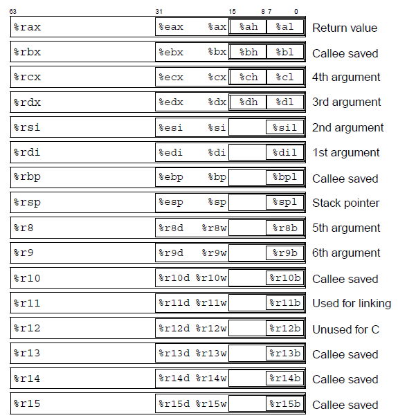

# Bomb Lab

## 简介

### 实验要求

**题目要求：** 运行 bomb 后在 6 个 phase 输入正确的内容，输入正确 bomb 程序才能继续运行，输入错误就会 bomb!  。如果是CMU的学生，每个人获得的炸弹是不一样的（高超的 反作弊技巧），每次爆炸会扣0.5分，扣满20分为止。不过我们作为自学党，没有这个限制，用的是自学用bomb，随便炸，根本不虚，不过为了达成良好的学习效果，还是尽可能减少爆炸次数。

实验文件
-  [bomb](../labs/bomb/bomb) 程序文件
-  [bomb.c](../labs/bomb/bomb.c) 包括题目要求和 bomb 实现的代码框架，无法编译。

### 阅读源码

```c
#include <stdio.h>
#include <stdlib.h>
#include "support.h"
#include "phases.h"

/* 
 * Note to self: Remember to erase this file so my victims will have no
 * idea what is going on, and so they will all blow up in a
 * spectaculary fiendish explosion. -- Dr. Evil 
 */

FILE *infile;

int main(int argc, char *argv[])
{
    char *input;

    /* Note to self: remember to port this bomb to Windows and put a 
     * fantastic GUI on it. */

    /* When run with no arguments, the bomb reads its input lines 
     * from standard input. */
    if (argc == 1) {  
	infile = stdin;
    } 

    /* When run with one argument <file>, the bomb reads from <file> 
     * until EOF, and then switches to standard input. Thus, as you 
     * defuse each phase, you can add its defusing string to <file> and
     * avoid having to retype it. */
    else if (argc == 2) {
	if (!(infile = fopen(argv[1], "r"))) {
	    printf("%s: Error: Couldn't open %s\n", argv[0], argv[1]);
	    exit(8);
	}
    }

    /* You can't call the bomb with more than 1 command line argument. */
    else {
	printf("Usage: %s [<input_file>]\n", argv[0]);
	exit(8);
    }

    /* Do all sorts of secret stuff that makes the bomb harder to defuse. */
    initialize_bomb();

    printf("Welcome to my fiendish little bomb. You have 6 phases with\n");
    printf("which to blow yourself up. Have a nice day!\n");

    /* Hmm...  Six phases must be more secure than one phase! */
    input = read_line();             /* Get input                   */
    phase_1(input);                  /* Run the phase               */
    phase_defused();                 /* Drat!  They figured it out!
				      * Let me know how they did it. */
    printf("Phase 1 defused. How about the next one?\n");

    /* The second phase is harder.  No one will ever figure out
     * how to defuse this... */
    input = read_line();
    phase_2(input);
    phase_defused();
    printf("That's number 2.  Keep going!\n");

    /* I guess this is too easy so far.  Some more complex code will
     * confuse people. */
    input = read_line();
    phase_3(input);
    phase_defused();
    printf("Halfway there!\n");

    /* Oh yeah?  Well, how good is your math?  Try on this saucy problem! */
    input = read_line();
    phase_4(input);
    phase_defused();
    printf("So you got that one.  Try this one.\n");
    
    /* Round and 'round in memory we go, where we stop, the bomb blows! */
    input = read_line();
    phase_5(input);
    phase_defused();
    printf("Good work!  On to the next...\n");

    /* This phase will never be used, since no one will get past the
     * earlier ones.  But just in case, make this one extra hard. */
    input = read_line();
    phase_6(input);
    phase_defused();

    /* Wow, they got it!  But isn't something... missing?  Perhaps
     * something they overlooked?  Mua ha ha ha ha! */
    
    return 0;
}
```

源码即为 `bomb.c` ，可以看到这个程序的主要逻辑大概是：每个阶段都是通过 `phase_x` 函数来实现的，而 `phase_x` 函数的参数是 `input`，也就是我们输入的字符串。所以，我们的目标就是**通过分析 `phase_x` 函数来找到正确的 `input`**。

根据题目的要求以及提示，**可以将`bomb`可执行文件反汇编，对汇编语言代码进行逆向分析**。

### 工具列表

`objdump`-用于反汇编二进制对象文件

`VS Code`-用于查看反汇编后的结果与文本文件的编写，详见环境构建

`gdb`-用于运行时单步调试与查看运行时内存与寄存器信息

### gdb 指令

| 指令  | 全称  | 功能  |
|---|---|---|
|  gdb filename |   | 开始调试程序  |
|  r | run  | 开始执行程序，直到下一个断点或程序结束；run 1 2 3，开始运行病传入参数 1 2 3  |
|  q | quit  | 退出 GDB 调试器  |
|  ni | nexti  | 执行下一条指令，但不进入函数内部  |
|  si | stepi  | 执行当前指令，如果是函数调用则进入函数  |
|  b |  break | 在指定位置设置断点  |
|  d |  delete 1 | 删除断点1  |
|   |  clear sum | 删除sum函数入口的断点  |
|  c |  cont |  从当前位置继续执行程序，直到下一个断点或程序结束 |
|  p |  print | 打印变量的值  |
|  x |   | 打印内存中的值；</br>`x/w $rsp`	解析在rsp所指向位置的word；</br>`x/2w $rsp` 解析在rsp所指向位置的两个word；</br>`x/2wd $rsp` 解析在rsp所指向位置的word，以十进制形式输出	  |
|  j |  jump | 跳转到程序指定位置  |
|  disas |   | 反汇编当前函数或指定的代码区域  |
|  layout asm |   | 显示汇编代码视图  |
|  layout regs |   | 显示当前的寄存器状态和它们的值  |

关于 `p` 和 `x`，最重要的就是记得 `p` 命令用于打印表达式的值，而 `x` 命令则主要用于检查内存的内容。几个常用示例如下：

```bash
p $rax  # 打印寄存器 rax 的值
p $rsp  # 打印栈指针的值
p/x $rsp  # 打印栈指针的值，以十六进制显示
p/d $rsp  # 打印栈指针的值，以十进制显示

x/2x $rsp  # 以十六进制格式查看栈指针 %rsp 指向的内存位置 M[%rsp] 开始的两个单位。
x/2d $rsp # 以十进制格式查看栈指针 %rsp 指向的内存位置 M[%rsp] 开始的两个单位。
x/2c $rsp # 以字符格式查看栈指针 %rsp 指向的内存位置 M[%rsp] 开始的两个单位。
x/s $rsp # 把栈指针指向的内存位置 M[%rsp] 当作 C 风格字符串来查看。

x/b $rsp # 检查栈指针指向的内存位置 M[%rsp] 开始的 1 字节。
x/h $rsp # 检查栈指针指向的内存位置 M[%rsp] 开始的 2 字节（半字）。
x/w $rsp # 检查栈指针指向的内存位置 M[%rsp] 开始的 4 字节（字）。
x/g $rsp # 检查栈指针指向的内存位置 M[%rsp] 开始的 8 字节（双字）。

info registers  # 打印所有寄存器的值
info breakpoints  # 打印所有断点的信息

delete breakpoints 1  # 删除第一个断点，可以简写为 d 1
```

这些命令在 `/` 后面的后缀（如 `2x、2d、s、g、20c`）指定了查看内存的方式和数量。具体来说：

- 第一个数字（如 `2、20`）指定要查看的单位数量。

- 第二个字母（如 `x、d、s、g、c`）指定单位类型和显示格式，其中：
  - `c` / `d` / `x` 分别代表以字符、十进制、 十六进制格式显示内存内容。
  - `s` 代表以字符串格式显示内存内容。
  - `b` / `h` / `w` / `g` 分别代表以 1 / 2 / 4 / 8 字节为单位（`unit`）显示内存内容。当使用 `x/b`、`x/h`、`x/w`、`x/g` 时，`unit` 会记录对应改变，直到再次使用这些命令。

### x86-64 寄存器



更多指令可以参考：
- [gdb 指令](http://csapp.cs.cmu.edu/2e/docs/gdbnotes-x86-64.pdf)           
- [马天猫的CS学习之旅](https://zhuanlan.zhihu.com/deeplearningcat) 
  
## 实验解析

### 反编译

首先让我们来反编译一下整个 `bomb` 这个二进制程序：

```bash
objdump -d bomb > bomb.asm
```

运行 bomb 程序，并使用 `layout asm`、`layout regs` 开启视图，方便分析。

```bash
gdb run
layout asm
layout regs
```


### phase_1

```asm
0000000000400ee0 <phase_1>:
  400ee0:	48 83 ec 08          	sub    $0x8,%rsp
  400ee4:	be 00 24 40 00       	mov    $0x402400,%esi
  400ee9:	e8 4a 04 00 00       	callq  401338 <strings_not_equal>
  400eee:	85 c0                	test   %eax,%eax
  400ef0:	74 05                	je     400ef7 <phase_1+0x17>
  400ef2:	e8 43 05 00 00       	callq  40143a <explode_bomb>
  400ef7:	48 83 c4 08          	add    $0x8,%rsp
  400efb:	c3                   	retq   
```

注意此处需要结合

- 第2行，为函数分配栈帧
- 第3行，设置函数strings_not_equal传入参数
- 第4行，调用函数strings_not_equal，从字面意思理解，猜想如果传入字符串不同，则返回0
- 第5、6行，函数strings_not_equal的返回值储存在%eax中，判断其是否为0，若为0，则跳至第8行，函数返回，炸弹拆除成功；若不为0，则跳至第7行
- 第7行，调用explode_bomb函数，从字面意思理解，炸弹爆炸了。