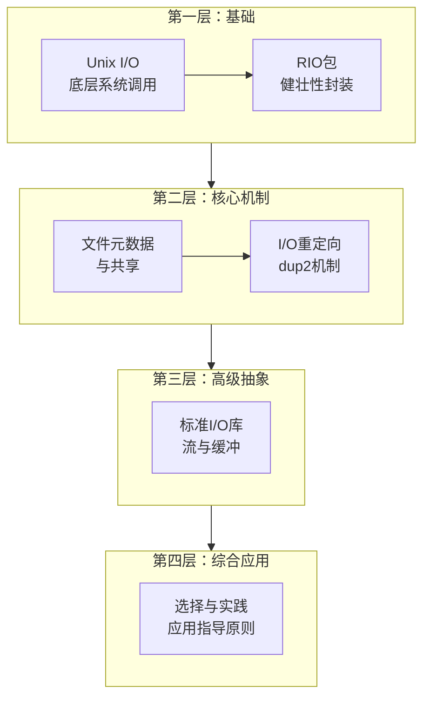

# Chapter 10 系统级 I/O（System-Level I/O）

> **课程对应**：CMU 15-213 Lecture 19–20 — System-Level I/O
> **教材章节**：CSAPP 第 10 章

---

## 一、第 10 章整体递进关系（Why this order）

第 10 章不是并列知识点，而是一条**"逐层抽象 + 逐步工程化"**的 I/O 学习链路。

### 逻辑主线与递进关系

**逻辑主线**：内核最原始接口 → 真实世界的问题 → 工程化解决方案 → 高级抽象 → 使用取舍

**第 10 章四层递进结构图**



**第 10 章递进关系总览表**

| 学习阶段 | 教材小节 | 角色定位 | 核心问题/目的 | 关键内容 |
|---------|---------|---------|-------------|---------|
| **第 1 阶段** | 10.1–10.4 Unix I/O | 机制层（Mechanism） | **I/O 的本质是什么** | • 揭示 I/O 的底层本质：文件描述符、系统调用、字节流抽象<br>• 文件描述符的概念<br>• 系统调用的直接使用<br>• 最底层、最直接的 I/O 接口 |
| **第 2 阶段** | 10.5 RIO | 工程补丁层（Engineering Fix） | **如何处理不足值（short counts）等实际问题** | • 发现 Unix I/O 的现实问题：short counts、信号中断、线程安全<br>• 处理 short counts 的健壮性<br>• 线程安全性<br>• 缓冲优化<br>• 网络编程中的实用性 |
| **第 3 阶段** | 10.6–10.9 Metadata / Sharing / Redirection | 系统语义层（Semantics） | **I/O 如何与系统其他部分协作** | • 深入理解 I/O 与进程、文件系统的交互<br>• 文件元数据和系统调用<br>• 进程间文件共享机制<br>• I/O 重定向的实现原理<br>• Shell 的工作机制 |
| **第 4 阶段** | 10.10 Standard I/O | 抽象层（Abstraction） | **为什么还需要 stdio？它能带来什么好处？** | • 理解更高级的抽象：缓冲、格式化、流<br>• 缓冲机制的效率提升<br>• 格式化 I/O 的便利性<br>• 高级抽象带来的易用性<br>• 适用场景和局限性 |
| **第 5 阶段** | 10.11 Closing Remarks | 决策层（Trade-off） | **如何在实际编程中做出正确的 I/O 函数选择** | • 综合应用：不同场景下的选择策略<br>• Unix I/O vs Standard I/O vs RIO<br>• 性能、安全性、易用性的权衡<br>• 实际应用中的最佳实践 |

---

## 二、Unix I/O 模型（§10.1）

**核心思想**：Linux 将所有 I/O 设备统一抽象为**文件**，提供少量、简洁的系统调用接口。

**Unix 文件就是 m 个字节的序列**：B₀, B₁, …, Bₘ₋₁

**所有 I/O 设备均表现为文件**：
- `/dev/sda2`（磁盘分区）
- `/dev/tty2`（终端）
- `/dev/kmem`（内核内存镜像）
- `/proc`（内核数据结构）

### 2.1 Unix 文件类型

| 类型 | 说明 |
|------|------|
| **普通文件（Regular file）** | 包含任意数据；应用区分文本/二进制，内核不区分 |
| **目录（Directory）** | 包含文件名→文件的映射链接；至少含 `.`（自身）和 `..`（父目录） |
| **套接字（Socket）** | 用于与另一台机器上的进程进行网络通信 |
| **命名管道（Named pipe）** | 进程间通信 |
| **符号链接（Symbolic link）** | 指向另一个文件 |
| **字符/块设备（Character/Block device）** | 字符设备按字节流，块设备按块操作 |

### 2.2 五个基本操作

| 操作 | 系统调用 | 说明 |
|------|---------|------|
| 打开文件 | `open()` | 内核返回**文件描述符（fd）** |
| 关闭文件 | `close()` | 释放描述符 |
| 读文件 | `read()` | 从当前文件位置读取字节 |
| 写文件 | `write()` | 向当前文件位置写入字节 |
| 移动位置 | `lseek()` | 显式修改文件位置（offset） |

### 2.3 文件描述符（File Descriptor, fd）

一个**小的非负整数**，是进程级别的 I/O 句柄。内核记录所有关于打开文件的信息，应用程序只需记住描述符。

**预定义文件描述符**：

| fd | 名称 | 符号常量 | C 库对应 |
|----|------|---------|---------|
| 0 | 标准输入 | `STDIN_FILENO` | `stdin` |
| 1 | 标准输出 | `STDOUT_FILENO` | `stdout` |
| 2 | 标准错误 | `STDERR_FILENO` | `stderr` |

---

## 三、打开与关闭文件（§10.2）

```c
#include <sys/types.h>
#include <sys/stat.h>
#include <fcntl.h>

int open(char *filename, int flags, mode_t mode);
// 返回：成功返回fd（总是当前最小未使用描述符），出错返回 -1
```

**常用 flags**：

| flags | 含义 |
|-------|------|
| `O_RDONLY` | 只读 |
| `O_WRONLY` | 只写 |
| `O_RDWR` | 读写 |
| `O_CREAT` | 不存在则创建 |
| `O_TRUNC` | 存在则截断为0 |
| `O_APPEND` | 每次写之前移动到文件末尾 |

```c
/* 创建或覆盖文件 */
fd = open("foo.txt", O_WRONLY|O_CREAT|O_TRUNC, S_IRUSR|S_IWUSR);

int close(int fd);  // 返回：成功0，出错-1
```

> **陷阱**：忘记 `close` 导致文件描述符泄漏；关闭已关闭的描述符会出错；在多线程中注意并发关闭。

---

## 四、读写文件（§10.3）

```c
#include <unistd.h>

ssize_t read(int fd, void *buf, size_t n);
// 返回：实际读取字节数，EOF返回0，出错-1

ssize_t write(int fd, const void *buf, size_t n);
// 返回：实际写入字节数，出错-1
```

### 不足值（Short Count）——最常见的陷阱！

`read`/`write` 实际传输字节数**可能少于请求的 n 字节**：

| 场景 | 原因 |
|------|------|
| 读磁盘文件遇到 EOF | 剩余字节不足 n |
| 从终端读取 | 每次读到换行符就返回 |
| 读写网络 Socket 或 Unix 管道 | 内核缓冲区限制 |
| 被信号中断（`EINTR`）| 系统调用提前返回 |

**Short counts 永远不会发生的情况**：
- 从磁盘文件读取（除 EOF 之外）
- 写入磁盘文件

**结论**：读写网络或管道时，**必须循环调用** `read`/`write` 直到满足要求。

**简单示例**（逐字节复制 stdin → stdout）：

```c
#include "csapp.h"
int main(void) {
    char c;
    while (Read(STDIN_FILENO, &c, 1) != 0)
        Write(STDOUT_FILENO, &c, 1);
    exit(0);
}
```

---

## 五、RIO 健壮 I/O 包（§10.5）

CSAPP 提供的封装库，处理不足值，提供两套函数：

### 5.1 无缓冲 RIO（适合二进制数据）

```c
ssize_t rio_readn(int fd, void *usrbuf, size_t n);
ssize_t rio_writen(int fd, void *usrbuf, size_t n);
```

内部循环直到读/写满 n 字节或 EOF/错误。适合网络程序中高效传输二进制数据。

### 5.2 带缓冲 RIO（适合文本行读取）

```c
typedef struct {
    int rio_fd;
    int rio_cnt;           // 内部缓冲区剩余字节数
    char *rio_bufptr;      // 下一个未读字节指针
    char rio_buf[RIO_BUFSIZE];  // 内部缓冲区（8192字节）
} rio_t;

void rio_readinitb(rio_t *rp, int fd);
ssize_t rio_readlineb(rio_t *rp, void *usrbuf, size_t maxlen);  // 读一行
ssize_t rio_readnb(rio_t *rp, void *usrbuf, size_t n);          // 读n字节
```

带缓冲版本将多次小 `read` 合并为一次大 `read`，降低系统调用开销。带缓冲的 RIO 是**线程安全**的，可以在同一描述符上任意交错使用。

```c
/* 典型用法：逐行读取 HTTP 请求 */
rio_t rio;
char buf[MAXLINE];
rio_readinitb(&rio, connfd);
rio_readlineb(&rio, buf, MAXLINE);  // 读取请求行
```

---

## 六、文件元数据（§10.6）

```c
#include <sys/stat.h>
int stat(const char *filename, struct stat *buf);
int fstat(int fd, struct stat *buf);
```

`struct stat` 关键字段：

| 字段 | 类型 | 含义 |
|------|------|------|
| `st_size` | `off_t` | 文件字节大小 |
| `st_mode` | `mode_t` | 文件类型和权限位 |
| `st_mtime` | `time_t` | 最后修改时间 |
| `st_ino` | `ino_t` | inode 编号 |
| `st_nlink` | `nlink_t` | 硬链接数 |
| `st_uid` / `st_gid` | `uid_t` / `gid_t` | 所有者 ID |

```c
/* 判断文件类型 */
S_ISREG(st.st_mode)   // 普通文件
S_ISDIR(st.st_mode)   // 目录
S_ISSOCK(st.st_mode)  // Socket

/* 权限位 */
S_IRUSR  // 用户读
S_IWUSR  // 用户写
S_IXUSR  // 用户执行
```

---

## 七、共享文件（§10.7）

内核维护**三个层次的数据结构**，理解它们是理解 I/O 共享的关键：

```
进程 A 描述符表          文件表（全局）          v-node 表（全局）
┌────┬──────────┐    ┌──────────────────┐    ┌───────────────┐
│ fd │ *file_t  │───▶│ refcnt=1         │───▶│ st_mode       │
│  3 │          │    │ file_pos=0       │    │ st_size       │
└────┴──────────┘    │ *v-node          │    │ ...           │
                     └──────────────────┘    └───────────────┘
```

1. **描述符表（Descriptor table）**：每个进程独有，描述符表条目指向文件表条目
2. **打开文件表（Open file table）**：所有进程共享；每条目含当前文件位置、引用计数（refcnt）、指向 v-node 的指针
3. **v-node 表（v-node table）**：所有进程共享；含 `stat` 结构的大部分信息（类型、权限、大小等）

**关键规则**：

| 场景 | 结果 |
|------|------|
| 同一进程两次 `open` 同一文件 | 两个独立的文件表条目，各有独立文件位置 |
| `fork` 后父子进程 | 共享同一文件表条目（共享文件位置，refcnt 增加） |
| 不同进程 `open` 同一文件 | 各自的文件表条目，但指向同一 v-node |

> **实践意义**：父进程写入后子进程的读取位置也会前进（因为共享文件表条目）；这是 Shell 管道的实现基础。

---

## 八、I/O 重定向（§10.8）

```c
#include <unistd.h>
int dup2(int oldfd, int newfd);
// 将 newfd 重定向到 oldfd 指向的文件表条目
// 如果 newfd 已打开，先关闭它
```

```c
/* 将标准输出重定向到文件 */
int fd = open("output.txt", O_WRONLY|O_CREAT|O_TRUNC, 0666);
dup2(fd, STDOUT_FILENO);  // fd=1 现在指向 output.txt
close(fd);                 // 关闭原始描述符（文件仍打开）
```

**Shell 中 `>` 的实现原理**：`fork` 后，子进程在 `exec` 前先执行 `dup2`，使 fd=1 指向目标文件，父进程不受影响。

```
重定向前：                     重定向后（dup2(fd, 1)）：
fd=1 → stdout 文件表条目       fd=1 → foo.txt 文件表条目
fd=4 → foo.txt 文件表条目      fd=4 → foo.txt 文件表条目（之后关闭）
```

---

## 九、标准 I/O 库（§10.9）

C 标准库（`stdio.h`）在 Unix I/O 上层提供带缓冲的封装，将打开的文件建模为**流（stream）**：

| 功能 | 函数 |
|------|------|
| 打开/关闭 | `fopen`, `fclose` |
| 读写字符 | `fgetc`, `fputc` |
| 读写行 | `fgets`, `fputs` |
| 读写块 | `fread`, `fwrite` |
| 格式化 | `printf`, `scanf`, `fprintf`, `fscanf` |
| 控制缓冲 | `fflush`, `setbuf`, `setvbuf` |

每个 C 程序以三个预定义流开始：`stdin`、`stdout`、`stderr`。

**缓冲模式**：

| 模式 | 触发写入时机 | 适用场景 |
|------|------------|---------|
| **全缓冲（fully buffered）** | 缓冲区满或 `fflush` | 磁盘文件 |
| **行缓冲（line buffered）** | 遇换行符或 `fflush` | 终端（stdout） |
| **无缓冲（unbuffered）** | 立即写入 | `stderr` |

> **网络编程陷阱**：`FILE*` 内部缓冲与 Socket 双工语义不兼容，在双工通信（读+写同一 fd）时易出错。**网络代码中应使用 RIO 而非标准 I/O**。

---

## 十、三种 I/O 方式对比

### 10.1 优缺点比较

| 特性 | Unix I/O（低级） | Standard I/O | RIO |
|------|---------------|-------------|-----|
| **开销** | 最低 | 中（有缓冲） | 低 |
| **格式化** | 无 | 有（printf/scanf） | 无 |
| **Short count 处理** | 手动处理 | 自动（磁盘） | 自动 |
| **异步信号安全** | 是 | 否 | 部分（rio_writen）|
| **线程安全** | 是 | 是（某些情况下） | 是 |
| **网络套接字** | 兼容 | 不推荐 | 推荐 |
| **文件元数据访问** | 完全访问 | 有限 | 有限 |

### 10.2 I/O 选择建议（§10.10）

| 使用场景 | 推荐方案 | 原因 |
|---------|---------|------|
| 磁盘/终端文件的文本读写 | **Standard I/O** | 缓冲+格式化，使用方便 |
| 信号处理器中的 I/O | **Unix I/O**（`write`） | 异步信号安全 |
| 网络套接字读写 | **RIO** 或 Unix I/O | 避免 stdio 缓冲问题 |
| 二进制数据/原始字节流 | **Unix I/O** 或 **RIO** | 精确控制 |
| 需要精确控制文件偏移 | **Unix I/O**（`lseek`） | stdio 无法精确控制 |

**通用原则**：尽可能使用最高级别的 I/O；在不适合的场合降级使用。

---

## 十一、与其他章节的逻辑联系

| 章节 | 联系 |
|------|------|
| **第8章（ECF）** | `read` 被信号中断返回 `EINTR`，需要重启系统调用；这是 RIO 处理的问题之一 |
| **第9章（VM）** | `mmap` 将文件映射为内存，是 I/O 与虚拟内存的交叉点 |
| **第11章（网络）** | Socket 也是文件描述符，本章的 `read`/`write`/`dup2` 直接用于网络编程 |
| **第12章（并发）** | 多线程共享文件描述符需要同步；`select`/`epoll` 实现 I/O 多路复用 |

---

## 十二、要点速览

1. **一切皆文件**：Unix I/O 的统一抽象——磁盘/终端/网络/管道共用 `read`/`write`。
2. **不足值是常态**：网络 Socket 读写必须循环，使用 RIO 封装避免 Bug；磁盘文件读写不会有 short count（EOF 除外）。
3. **三层数据结构**：描述符表（进程级）→ 文件表（全局）→ v-node 表（全局）；`fork` 后父子进程共享文件表条目。
4. **`dup2` 实现重定向**：Shell 的 `>` 和 `|` 均依赖此系统调用，在 `fork+exec` 之间完成。
5. **网络中避免标准 I/O**：`FILE*` 缓冲与 Socket 双工不兼容，改用 RIO 或裸 Unix I/O；信号处理器中只能用 Unix I/O。
