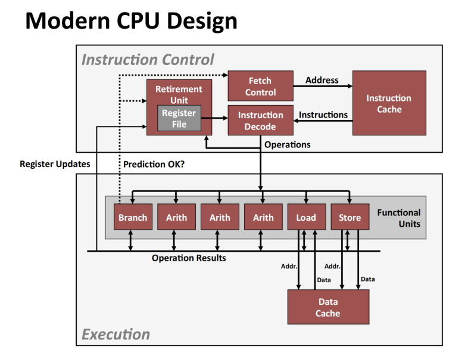
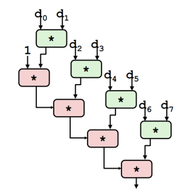
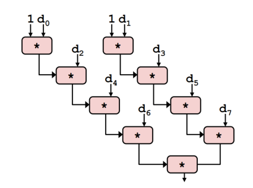
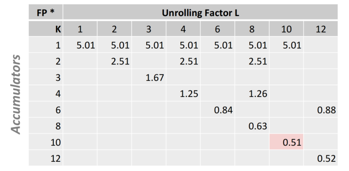
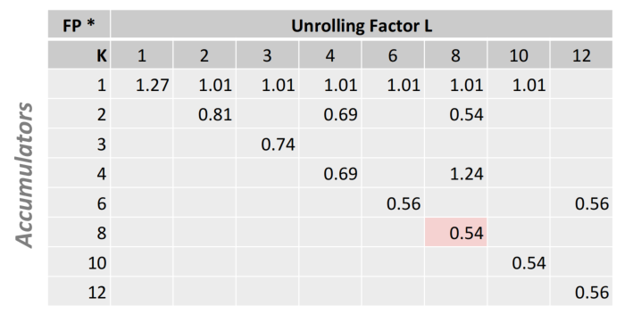

# 🧩 程序优化 — 全面学习笔记

## 一、概述（Overview）

本文涉及的优化措施不针对任何特定设备,提及的编译器是基于GCC开展

### 1.1 优化的重要性与多层级特性

**性能影响因素**

- **算法复杂度（大O表示法）**：决定渐进行为
- **常数因子**：决定实际运行速度，可差10倍以上

```c
// 慢速版本 - O(n²)
for(i=0; i<strlen(s); i++) { process(s[i]); }

// 快速版本 - O(n)
int len = strlen(s);
for(i=0; i<len; i++) { process(s[i]); }
```

**优化层次架构**
```
算法层 → 数据表示层 → 过程层 → 循环层 → 指令层
```

**系统理解要求**
- 编译与执行机制
- 现代 CPU 架构（流水线、超标量、乱序执行）
- 内存层次结构（缓存、局部性原理）
- 性能剖析工具与瓶颈识别
- 代码可读性与维护性平衡

### 1.2 编译器优化能力

| 优化类别  | 技术    | 效果     |
| ----- | ----- | ------ |
| 寄存器优化 | 图着色分配 | 减少内存访问 |
| 指令选择  | 模式匹配  | 高效指令序列 |
| 指令调度  | 流水线填充 | 提升 ILP |
| 死代码消除 | 可达性分析 | 减少冗余计算 |

**算法选择与常数因子关系**
- 大O复杂度：决定算法随输入规模的增长趋势
- 常数因子：决定算法在特定规模下的实际性能
- 实际建议：先选择正确的大O算法，再优化常数因子

### 1.3 编译器局限性

**基本约束的深层影响**
```c
// 编译器无法优化的典型场景
void process(int *x, int *y) {
    *x = 10;      // 写操作
    *y = 20;      // 编译器不能假设x≠y，无法重排序
    result = *x;  // 必须重新读取，不能直接用10
}
```

**语言特性导致的优化障碍**
- **指针别名**：C/C++的指针运算导致内存引用不确定性
- **volatile变量**：强制内存访问，阻止寄存器缓存
- **函数副作用**：I/O操作、全局状态修改

**分析范围限制详解**
- **过程内分析（Intra-procedural）**：单个函数内部的优化
- **过程间分析（Inter-procedural）**：GCC在单个文件内的跨函数优化
- **全程序分析（Whole-program）**：理论可行但工程代价过高

**静态信息局限的具体表现**
```c
// 编译时无法确定的优化机会
int process(int n) {
    if (n > 1000) {
        return complex_algorithm(n);
    } else {
        return simple_algorithm(n);
    }
}
// 编译器无法知道n的典型值，难以优化分支预测
```

---

## 二、通用优化策略

### 2.1 代码移动（Code Motion）深度解析

**不变式计算外移**

gcc o1 级别上山会进行优化

```c
// 优化前：每次循环都重新计算
for(int j=0; j<n; j++) {
    int index = n * i;  // 循环不变式计算
    array[index + j] = b[j];
}

// 优化后：计算移出循环
int base = n * i;  // 预计算
for(int j=0; j<n; j++) {
    array[base + j] = b[j];
}
```

**循环不变式识别模式**
- 不依赖于循环变量的表达式
- 无副作用的纯函数调用
- 固定偏移量的地址计算

### 2.2 强度缩减（Reduction in Strength）

**定义**:强度缩减是一种编译器优化技术，通过用低成本操作替代高成本操作来提升性能。

**操作代价层次结构**（以Intel x86为例）
```
最快：位操作(AND/OR/SHIFT) → 加法/减法 → 乘法 → 除法(最慢)
```

**优化原理**

- 目标：减少计算代价（CPU cycles）
- 思路：将“强操作”（如乘法、除法）替换为“弱操作”（如加法、位移）
- 关键：保持计算结果等价，同时降低执行时间。

**强度缩减转换表**

| 原操作  | 优化操作 | 条件     |
| ---- | ---- | ------ |
| x*16 | x<<4 | 2的幂次乘法 |
| x/8  | x>>3 | 无符号数   |
| x%16 | x&15 | 2的幂次取模 |
| x*15 | (x<<4)-x | 常数分解优化 |


```c
# 优化前
for (int i =0 ; i < n; i++){
    int ni = n*i;
    for (int j =0 ;j <n; j++){
        a[ni +j] = b[j];
    }
}

# 加法优于乘法
int ni = 0；
for (int i =0 ; i < n; i++){
    for (int j =0 ;j <n; j++){
        a[ni +j] = b[j];
    }
    ni += n；
}

```

**效果依赖因素**

**与硬件实现密切相关**：不同 CPU 的乘法、除法、移位指令代价差异较大。
    - 例如：在 Intel Nehalem 架构中，
      - 整数乘法 ≈ 3 个 CPU 周期
      - 移位操作 ≈ 1 个周期或更少
    - 某些CPU具有专用乘法器，简单乘法可能快于复杂移位序列

优化收益取决于指令执行的相对成本，需要结合具体架构的指令延迟和吞吐量数据

### 2.3 公共子表达式共享（Share Common Subexpressions）

**定义:** 共享公共子表达式是一种编译器优化技术，通过识别并重用重复计算的表达式来减少不必要的计算量。

**核心思想：** 计算一次，多次使用，减少 CPU 运算次数、寄存器压力和执行时间。

```c
// 优化前 3个乘法运算 i * n,(i-1)*n, (i+1)*n
/* sum neighbors of i,j */
up    = val[(i - 1) * n + j     ];
down  = val[(i + 1) * n + j     ];
left  = val[i * n       + j - 1 ];
right = val[i * n       + j + 1 ]
sum = up + down + left + right;

// 优化后 1 个乘法运算  i * n
long inj = i*n + j;
up    = val[ inj - n ];
down  = val[ inj + n ];
left  = val[ inj - 1 ];
right = val[ inj + 1 ]
sum = up + down + left + right;
```


```c
// 优化前：重复计算相同表达式
double x = (a*b) + c;
double y = (a*b) + d;  // a*b重复计算

// 优化后：共享计算结果
double temp = a * b;
double x = temp + c;
double y = temp + d;
```

**GCC 实现情况**

- GCC 编译器会在 `-O1` 级别进行该优化
- `-O1` 属于轻度优化级别：
  - 平衡编译时间与执行性能
  - 不会显著增加编译复杂度
  - 自动进行常见的局部优化（如常量传播、死代码删除、公共子表达式消除等）

**可用表达式分析（Available Expressions Analysis）**
- 数据流分析技术，跟踪表达式的可用性
- 在基本块边界维护表达式可用性信息
- GCC在-O1级别启用，平衡编译时间与优化效果

**复杂场景的公共子表达式**
```c
// 结构体字段访问优化
for(int i=0; i<n; i++) {
    total += data[i].x * data[i].y + data[i].x * data[i].z;
}
// 优化：提取公共因子data[i].x
```

---

## 三、优化障碍

### 3.1 过程调用

**问题背景**

下列代码随着字符串长度的增加，耗时会随之二次增加。
- 问题在于`strlen`方法，在每个循环中都会调用一次，其调用次数等于字符串串长度。
- `N` 次调用 `strlen`，需要时间`N,N-1,N-2,...,1`，整体性能为 $O(N^2)$

```c
void lower(char *s){
    size_t i;
    for(i = 0; i < strlen(s); i++){
        if (s[i] >= 'A' && s[i] <= 'z')
            s[i] -= ('A' - 'a')
    }
}

// 优化
void lower(char *s){
    size_t i;
    size_t len = strlen(s);
    for(i = 0; i < len; i++){
        if (s[i] >= 'A' && s[i] <= 'z')
            s[i] -= ('A' - 'a')
    }
}
```

```c
// strlen 实现
size_t stelen(const char *s){
    size_t length = 0;
    while(*s != '\0'){
        s++;
        length++;
    }
    retrun length;
}
```


*为什么编译器不能将`strlen`移出内层循环*

**原因分析**
过程调用可能有副作用（Side Effects）。
   - 函数调用可能 修改全局状态。
   - 同一函数在不同时间调用时，可能返回不同结果。
   - 其行为可能依赖于程序的外部或全局状态（如全局变量、I/O、信号等）。
   - 甚至其他函数（如 lower()）可能与 strlen() 产生隐式交互。
> 🧠 编译器无法安全判断函数是否“纯净”（无副作用），因此不敢随意优化。

**编译器限制**
- 编译器通常将函数调用视为黑箱（black box）：不清楚其内部逻辑和副作用。因此在函数调用附近的优化能力较弱。

- 举例：无法确定 strlen(s) 是否总是返回同样的结果。

**解决方法：**

- 使用内联函数（Inline Functions）。GCC在使用-O1选项时会这样做（仅限单个文件内）。**内联优化的条件与限制**
  - **同一编译单元**：GCC只能在当前文件内实施内联
  - **函数体积阈值**：避免代码膨胀的启发式规则
  - **调用频率**：高频调用函数优先内联
  - **递归处理**：有限深度的递归展开
  
- 手动进行代码移动（Code Motion）**手动优化策略对比如下：**

    | 策略 | 适用场景 | 优缺点 |
    |------|----------|--------|
    | 预计算外提 | 纯函数、确定性调用 | 简单有效，可读性好 |
    | 内联声明 | 小函数、性能关键路径 | 可能增加代码体积 |
    | 函数重构 | 复杂调用模式 | 改善模块化，长期可维护 |

**核心思想**：*“过程调用打断优化路径。”* 要让编译器能优化，就需*减少函数调用的不确定性*，或通过*内联与手动重构*恢复优化机会。


### 3.2 内存别名(Memory Aliasing)

**内存别名**：当两个不同的内存引用（变量或指针）指向同一存储位置时，就发生了别名。GCC编译器无法识别内存别名。

```c
int *p = &x;
int *q = &x;   // p 和 q 是别名
*p = 10;
printf("%d", *q); // 输出 10
```

```c
// 优化前代码
/* sum rows is of n X n martix a and store in vector b */
void sum_rows1(double *a, double *b, long n){
    long i, j;
    for(i = 0; i < n; i++){
        b[i] = 0;
        for(j = 0;j < n; j++){
            b[i] += a[i*n + j];
        }
    }
}

# sum_rows2 inner loop
.L4:
    movsd (%rsi, %rax, 8), %xmm0       # FP load
    addsd (%rsi), %xmm0                # FP add
    movsd %xmm0, (%rsi, %rax, 8)       # FP store
    addq  $8, %rdi
    cmpq  %rcx, %rdi
    jne   .L4

// 优化后代码-移除别名
void sum_rows2(double *a, double *b long n){
    long i,j;
    for(i = 0; i < n; i++){
        double val =0;
        for(j = 0;j < n; j++){
            val += a[i *n + j];
        }
        b[i] = val;
    }
}

# sum_rows2 inner loop
.L10:
    addsd (%rdi), %xmm0     # FP load + add
    addq  $8, %rdi
    cmpq  %rax, %rdi
    jne   .L10
```

**问题原因**
- 在 C语言 中别名现象十分常见，因为：
  - 允许 **指针运算** 和 **地址算术操作**。
  - 允许 **直接访问结构体和数组存储**。
  - **数组重叠**：memcpy、memmove等操作的源和目标重叠
- 这种灵活性使编译器难以确定：
  - 两个指针是否指向同一地址。
  - 某次写操作是否会影响其他变量的值。

>⚠️ 结果：编译器必须保持保守，不敢随意优化（如寄存器缓存、循环外提）。

**解决方案**

✅ 方法1：使用局部变量（Local Variables）

- 将中间结果存入局部变量，**减少指针引用**，降低别名风险。
- 特别是在**循环中累加**时，效果显著。

✅ 方法2：**向编译器明确说明无别名**：在 C99 中，可以使用 restrict 关键字 告诉编译器指针不重叠。

```c
// 明确告知编译器指针不重叠
void vector_add(int *restrict dest, 
                const int *restrict src1,
                const int *restrict src2, 
                int n) {
    for(int i=0; i<n; i++) {
        dest[i] = src1[i] + src2[i];  // 编译器可向量化优化
    }
}
```

✅ 方法3：**局部变量累积优化技术**
```c
// 优化前：多次内存访问
double sum = 0;
for(int i=0; i<n; i++) {
    sum += data[i];  // 每次迭代都读写内存中的sum
}

// 优化后：寄存器累积
double sum = 0;
double temp = 0;     // 寄存器累积
for(int i=0; i<n; i++) {
    temp += data[i]; // 在寄存器中操作
}
sum = temp;          // 最终写回内存
```

> ✨ **核心思想**： “别名让编译器不敢假设独立性。” 通过局部变量隔离或明确声明无别名，可以让编译器放心地执行更激进的优化。

---

## 四、利用指令级并行性（Instruction-Level Parallelism, ILP）

**指令级并行性（ILP）** 是指处理器能够在**同一时刻并行执行多条指令**的能力。充分利用 ILP 可以显著提升程序性能。

**本章思路**

```txt
基准测试：向量归约 - 建立性能衡量基础 (4.1)
    ↓
现代CPU设计与性能限制 - 问题根源分析 (4.2)  
    ↓
循环展开 初步尝试 (4.3.1) → 重新关联变换，关键突破 (4.3.2) → 多累积变量深化，深度扩展(4.3.3)
    ↓
系统化展开与累积 - 科学调优 (4.3.4)
    ↓
SIMD向量化 - 硬件极致 (4.3.5)
```

### 4.1 基准测试：向量归约

#### 实验说明

**基准测试设计**：定义向量数据结构`vec`，包含长度和数据指针

定义一个函数，从数组中取出索引值对应的元素，传递一个指针，然后该指针被赋值为数组中索引对应的元素。

```c
/* data structure for vectors */
typedef struct{
    size_t len;
    data_t *data;
} vec;

/* retrieve vector element and store at val */
int get_vec_element(*vec v, size_t idx, data_t *val){
    if (idx >= v ->len )
        return 0;
    *val = v -> data[idx];
    return 1;
}
```

- **变量控制**：
  - 数据类型：可以将 data_t 声明为不同类型，用来观察性能如何随数据类型变化而变化
    - int
    - long
    - float
    - double
  - 同时使用了2个宏定义 IDENT 和 OP
    - OP 定义为加法，IDENT 则为 0，加法(`+`/`0`)
    - OP 定义为乘法，IDENT 则为 1，乘法(`*`/`1`)
  - 共计有8中方法

**测试函数**

- `combine1`函数计算向量元素的和或乘积

```c
void combine1(vec_ptr v, data_t *dest){
    long int i;
    *dest = IDENT;
    for (i = 0; i < vec_length(v); i++){
        data_t val;
        get_vec_element(v, i, &val);
        *dest = *dest OP val
    }
}
```


#### 性能测量方法

- **CPE(cycles per element)指标**：处理一个元素所花的时间周期。每个元素周期数，表示每个操作所需的平均时钟周期数。用来衡量在`vectors` 或 `list` 上运算的程序性能指标
- **计算公式**：`T = CPE × n + Overhead`
- **测量原理**：通过不同向量长度下的运行时间，计算CPE作为拟合直线斜率

#### 实验结果

- 未优化的 `Combine1`
- `Combine1 -O1`
- 基础优化 `combine4`
  - **代码移动**：将`vec_length`调用移出循环
  - **消除边界检查**：直接访问向量数据，避免每次迭代检查
  - **临时变量累积**：使用局部变量`t`累积结果，减少内存访问

```c
void combine4(vec_ptr v, data_t *dest){
    long i;
    long length = vec_length(v);
    data_t *d = get_vec_start(v);
    data_t t = IDENT;
    for(i = 0; i < length; i++){
        t = t OP d[i];
    }
    *dest = t;
}
```

| 方法 | 整数加法 | 整数乘法 | 双精度FP加法 | 双精度FP乘法 |
|------|----------|----------|--------------|--------------|
| 未优化组合 | 22.68 | 20.02 | 19.98 | 20.18 |
| Combine1 -O1 | 10.12 | 10.12 | 10.17 | 11.14 |
| Combine4 | 1.27 | 3.01 | 3.01 | 5.01 |


- **Combine4优化效果**：相比-O1版本，性能提升8-10倍
- **延迟界限逼近**：优化后CPE接近各操作的固有延迟
- **开销消除**：主要消除了过程调用和内存访问的开销

> 1.27 3.01 5.01 这些数字暗示着程序存在一些基本限制，为了理解这些基本限制，必须对底层硬件有一些了解


### 4.2 现代CPU设计与性能限制

#### 现代处理器架构



- 上半部分：获取指令的方法。包含高性能本地缓存，然后缓存将指令送入指令译码这个硬件中（实现指令拆分为低级操作，并确定操作间的依赖关系）

> 我们可以认为程序是一个顺序执行的指令序列，CPU尽可能读取多的指令序列，并将读入的指令拆开，发现有的指令之间不是互相依赖的，因此可以执行后边独立的代码。这被称为指令级并行。

- **超标量乱序设计**：可在一个周期内发出和执行多条指令
- **流水线技术**：将指令执行分为多个阶段，实现指令级并行
- **功能单元**：包含多个专用执行单元（算术、加载、存储等）

**超标量处理器**

- 定义：超标量处理器能在单个时钟周期内同时发出并执行多条指令。这些指令从连续的指令流中获取，通常采用动态调度机制。
- 优势：无需额外编程，即可利用程序固有的指令级并行特性。
- 多数现代CPU均采用超标量架构。英特尔公司：自奔腾处理器（1993年）起即采用该架构

**流水线功能单元**

流水线的基本思想就是将计算分解为一系列不同的阶段，如下例所示：默认一次乘法操作需要三步才能完成，不用流水线时一共需要9个时间，这样负责stage1的那段电路有2/3 是空闲的，而使用流水线技术后将9步缩减为7步

```c
long mult_eg(long a, long b, long c) {
    long p1 = a * b;
    long p2 = a * c;
    long p3 = p1 * p2;
    return p3; 
}
```


流水线有点像并行性，但这种并行性并不意味着有多个硬件资源，而是在单个硬件上的操作，划分为紧密联系的顺序的多个步骤。


#### Haswell CPU特性
总共8个功能单元，但是将功能单元组合起来，可以同时执行如下动作：
- 2次内存读取，
- 1次内存写入
- 4次整数运算
- 2次浮点乘法
- 1次浮点加法
- 1次浮点除法

有些指令花费时间大于1时钟周期，但是可以使用流水线技术
指令有两个指标：
- 延迟（latency）：一个指令从头到尾需要多长时间
- cycles/Issue:表示两小步骤之间的距离

| 操作 | latency | cycles/Issue |
|------|---------|--------------|
| 读取/存储 | 4 | 1 |
| 整数乘法 | 3 | 1 |
| Integer/Long Divide | 3-30 | 3-30 |
| Single/Double FP Multiply | 5 | 1 |
| Single/Double FP Add | 3 | 1 |
| Single/Double FP Divide | 3-15 | 3-15 |


#### 串行依赖问题
- **计算模式**：`(((((((1 * d[0]) * d[1]) * d[2]) * d[3]) * d[4]) * d[5]) * d[6]) * d[7])`
- **依赖链**：每个乘法操作必须等待前一个结果
- **性能限制**：受限于操作延迟而非吞吐量，因此即使有个流水线乘法器，但程序本身限制了了乘法必须顺序执行。


#### 实验结果验证
| 操作 | 测量CPE | 理论延迟界限 |
|------|---------|--------------|
| 整数加法 | 1.27 | 1.00 |
| 整数乘法 | 3.01 | 3.00 |
| 双精度FP加法 | 3.01 | 3.00 |
| 双精度FP乘法 | 5.01 | 5.00 |

### 4.3 打破串行依赖：从循环展开到SIMD向量化

#### 4.3.1 循环展开技术及其局限性

**基础循环展开（2x1）**

循环展开的基础思想是：在循环中计算多个值而非一个值

如下列所示：每次处理2个数字中的元素

```c
void unroll2a_combine(vec_ptr v, data_t *dest){
    long length = vec_length(v);
    long limit = length - 1;
    data_t *d = get_vec_start(v);
    data_t x = IDENT;
    long i;
   /* 一次合并两个元素 */
    for (i = 0; i < limit; i+=2) {
        x = (x OP d[i]) OP d[i+1];
    }
    /* finish any remaining elements */
    for (; i < length; i++){
        x = x OP d[i];
    }
    *dest = x;
}

```

**实验结果 - 基础展开效果有限**
| 方法 | 整数加法 | 整数乘法 | 双精度FP加法 | 双精度FP乘法 |
|------|----------|----------|--------------|--------------|
| Combine4 | 1.27 | 3.01 | 3.01 | 5.01 |
| 展开2x1 | 1.01 | 3.01 | 3.01 | 5.01 |
| Latency bound | 1.00 | 3.00 | 3.0 | 5.0 |


**分析**：仅对整数加法有帮助，乘法和FP操作仍受串行依赖限制。循环展开减少了循环控制开销，但未解决核心的串行依赖问题。

#### 4.3.2 重新关联变换：打破依赖链

**关键改变**
```c
x = x OP (d[i] OP d[i+1]);  // 对比之前的 (x OP d[i]) OP d[i+1]
```

**打破依赖的原理**：实际上括号的移位改变了计算方式，允许`d[i] OP d[i+1]`与累积操作并行执行，创建了独立的计算路径。现在计算关键路径如图所示：




**实验结果 - 重新关联带来显著提升**
| 方法 | 整数加法 | 整数乘法 | 双精度FP加法 | 双精度FP乘法 |
|------|----------|----------|--------------|--------------|
| 展开2x1 | 1.01 | 3.01 | 3.01 | 5.01 |
| 展开2x1a | 1.01 | 1.51 | 1.51 | 2.51 |

**性能提升**：乘法和FP操作CPE降至约一半，接近理论CPE = D/2。这是通过改变计算结合顺序，缩短关键路径实现的。


**问题在于**：整数的乘法和加法可以进行上述转换，因为其满足结合律，但对于浮点数的运算并不满足结合律，如果移动括号，可能会出现由于舍入或溢出的情况导致结果不同

上述方法会使我们突破延迟界限，但由于硬件限制（运算单元、加载单元数量限制）会有吞吐量限制，只能逼近吞吐量限制。

#### 4.3.3 多累积变量技术：极致并行化

**2x2方法实现**

分别计算索引为奇数、偶数的元素的积/和，然后将计算结果结合。
```c

void unroll2a_combine(vec_ptr v, data_t *dest){
    long length = vec_length(v);
    long limit = length - 1;
    data_t *d = get_vec_start(v);
    data_t x0 = IDENT;
    data_t x1 = IDENT;
    long i;
   /* 一次合并两个元素 */
    for (i = 0; i < limit; i+=2) {
        x0 = x0 OP d[i];
        x1 = x1 OP d[i+1];
    }
    /* finish any remaining elements */
    for (; i < length; i++){
        x0 = x0 OP d[i];
    }
    // 最后合并
    *dest = x0 OP x1;
}

```

-  

**实验结果 - 多累积变量进一步优化**
| 方法 | 整数加法 | 整数乘法 | 双精度FP加法 | 双精度FP乘法 |
|------|----------|----------|--------------|--------------|
| 展开2x2 | 0.81 | 1.51 | 1.51 | 2.51 |
|Latency Bound | 1.00 | 3.00 | 3.00 | 5.00 |
|Throughput Bound | 0.50 | 1.00 | 1.00 | 0.50 |

**优势**：创建完全独立的依赖链，整数加法进一步改善，充分利用多个加载单元和功能单元。

#### 4.3.4 系统化展开与累积

**参数优化方法**
- **展开因子L** vs **累积变量数K**的协同调优
- 双精度乘法优化结果：Intel Haswell CPU，双精度浮点数乘法，延迟界限5.0，吞吐量界限0.5
-  
- 整数加法优化结果：Intel Haswell CPU，双精度浮点数乘法，延迟界限1.0，吞吐量界限0.5
-  


**最终标量性能成果**
| 操作 | 最佳CPE | 延迟界限 | 吞吐量界限 |
|------|---------|----------|------------|
| 整数加法 | 0.54 | 1.00 | 0.50 |
| 整数乘法 | 1.01 | 3.00 | 1.00 |
| 双精度FP加法 | 1.01 | 3.00 | 1.00 |
| 双精度FP乘法 | 0.52 | 5.00 | 0.50 |

**总体加速**：通过系统化优化，相比原始代码提升高达42倍。

#### 4.3.5 SIMD向量化：数据级并行终极方案

**AVX2技术特性**
- **YMM寄存器**：16个32字节寄存器
- **数据并行能力**：
  - 8个32位整数
  - 4个双精度浮点数
  - 8个单精度浮点数

**SIMD操作模式**
矢量加法，一次矢量加法相当于8次单精度浮点加法的效果，相当于4次双精度浮点加法的效果


**矢量化性能成果**
| 方法 | 整数加法 | 整数乘法 | 双精度FP加法 | 双精度FP乘法 |
|------|----------|----------|--------------|--------------|
| 标量最佳 | 0.54 | 1.01 | 1.01 | 0.52 |
| 矢量最佳 | 0.06 | 0.24 | 0.25 | 0.16 |
| 标量延迟界限 | 0.50 | 3.00 | 3.00 | 5.00 |
| 标量吞吐量界限 | 0.05 | 1.00 | 1.00 | 0.50 |
| 向量吞吐量界限 | 0.06 | 0.12 | 0.25 | 0.12 |

**性能提升**：相比标量代码进一步提升4-9倍，接近向量吞吐量理论界限。

#### 4.3.6 技术演进总结

1. **循环展开**：基础优化，减少开销但未解决核心依赖
2. **重新关联**：关键突破，通过改变计算顺序缩短关键路径
3. **多累积变量**：系统化并行，创建独立依赖链充分利用硬件
4. **SIMD向量化**：终极方案，在单指令内实现数据级并行

这一完整的技术演进路径体现了从浅层优化到深层并行化，逐步逼近硬件理论极限的系统化优化方法论。

## 五、处理条件分支

挑战：

- **指令控制单元**：负责取指和译码，需超前于执行单元工作，同时必须持续向执行单元提供足够的操作以保持忙碌
- **分支不确定性**：遇到条件分支时无法立即确定后续执行路径

```assembly
404663: mov    $0x0,%eax
404668: cmp    ($rdi),%rsi
40466b: jge    404685      ; 条件分支
40466d: mov    0x8($rdi),%rax
...
404685: repz retq
```


- **分支采纳**：控制转移到分支目标地址
- **分支不采纳**：继续执行序列中的下一条指令
- **解析时机**：只有在分支/整数单元确定结果后才能解析

### 5.2 分支预测技术

#### 预测原理
- **猜测执行**：处理器预测分支走向并开始在该路径上执行指令
- **推测执行**：预测执行的指令不实际修改寄存器或内存数据
- **预测正确**：继续提交结果，保持高性能
- **预测失败**：丢弃所有推测执行的结果

#### 循环中的分支预测
```assembly
401029: vmulsd ($rdx),$xmm0,$xmm0   ; i=98
40102d: add    $0x8,$rdx
401031: cmp    $rax,$rdx
401034: jne    401029

401029: vmulsd ($rdx),$xmm0,$xmm0   ; i=99
40102d: add    $0x8,$rdx
401031: cmp    $rax,$rdx
401034: jne    401029

401029: vmulsd ($rdx),$xmm0,$xmm0   ; i=100 (预测失败)
40102d: add    $0x8,$rdx
401031: cmp    $rax,$rdx
401034: jne    401029
```

**预测模式**：
- i=98, 99：预测采纳（正确）
- i=100：预测采纳（失败，向量长度=100）

### 5.3 分支预测失败的影响

#### 预测失败处理流程
1. **检测失败**：确定实际分支方向与预测不符
2. **流水线清空**：丢弃错误路径上所有推测执行的结果
3. **重新加载**：从正确地址重新开始填充流水线
4. **性能惩罚**：需要多个时钟周期恢复

#### 恢复过程示例
```assembly
401031: cmp    $rax,$rdx             ; i=99
401034: jne    401029                ; 预测采纳
401036: jmp    401040                ; 实际不采纳
...
401040: vmovsd $xmm0, ($r12)         ; 正确路径开始
```

**关键步骤**：
- 确定分支实际不采纳
- 清空错误路径指令
- 从401040重新开始执行

#### 性能成本分析
- **现代处理器**：分支预测失败通常需要10-20个时钟周期
- **高频分支**：在紧密循环中可能成为主要性能瓶颈
- **优化重要性**：避免不可预测分支对性能至关重要

### 5.4 分支优化策略

#### 可预测分支模式
- **规律性模式**：具有明显模式的分支（如循环退出条件）
- **历史相关性**：基于先前结果可预测的分支
- **静态偏好**：大多数时间走向固定的分支

#### 不可预测分支模式
- **随机数据**：基于输入数据的随机性分支
- **无规律模式**：缺乏可识别模式的分支行为
- **平衡概率**：采纳/不采纳概率接近50%的分支

#### 优化技术
1. **数据重构**：重组数据以减少分支
2. **条件移动**：使用条件移动指令替代分支
3. **查表法**：用查表操作替代复杂条件判断
4. **概率提示**：为编译器提供分支概率信息


## 六、优化实践与调优方法论

### 6.1 系统化优化流程

**性能分析迭代循环**
```
测量 → 分析 → 假设 → 验证 → 迭代
```

**profiling工具矩阵**

| 工具类型 | 代表工具 | 分析层面 |
|----------|----------|----------|
| 时间剖析 | gprof, perf | 函数调用热点 |
| 缓存分析 | perf, cachegrind | 缓存命中率 |
| 分支分析 | perf annotate | 分支预测效率 |
| 指令分析 | IACA, llvm-mca | 指令吞吐量 |

### 6.2 编译器优化与算法选择

#### 编译器选择与标志优化
- **现代编译器**：GCC、Clang、ICC等具有先进优化能力
- **版本更新**：使用较新版本以获得更好的优化效果
- **目标特定**：针对目标处理器架构选择最佳编译器

#### 优化编译级别详解

| 级别  | 优化内容 | 适用场景 |
|-------|----------|----------|
| -O0   | 无优化 | 调试阶段 |
| -O1   | 基本优化：代码移动、强度折减 | 一般发布 |
| -O2   | 中级优化：循环优化、内联 | 性能敏感应用 |
| -O3   | 高级优化：向量化、过程间分析 | 科学计算 |
| -Os   | 体积优化 | 嵌入式系统 |

**关键编译标志**：
- 架构特定：`-march=native`、`-mtune=native`
- 向量化：`-ftree-vectorize`、`-fopenmp-simd`
- 性能分析：`-pg`、`-fprofile-generate`/`-fprofile-use`

#### 算法与数据结构优化策略

**算法层面优化**：
- **渐进复杂度**：优先选择最优算法（O(n log n) vs O(n²)）
- **常数因子优化**：在相同复杂度下优化实现细节
- **早期终止**：在可能时提前结束计算，减少不必要工作
- **剪枝策略**：避免无效计算路径，提高执行效率

**数据结构优化原则**：
- **缓存友好布局**：优化数据访问模式以提高局部性
- **内存对齐**：确保数据对齐以提高访问效率
- **紧凑存储**：减少内存占用，提高缓存利用率
- **访问模式优化**：顺序访问优于随机访问

### 6.3 代码优化与硬件特性利用

#### 编写编译器友好代码

**消除优化障碍**：
- **过程调用处理**：避免在循环内调用无法内联的函数
- **内存别名解决**：使用局部变量避免别名分析困难
- **指针别名明确**：使用`restrict`关键字帮助编译器分析

**清晰的代码模式**：
- **简化控制流**：避免复杂控制流使循环优化困难
- **明确不变式**：清晰标识循环不变计算
- **减少数据依赖**：消除不必要的依赖链，暴露并行性

#### 面向现代处理器编程

**处理器特性深度利用**：
- **多发射调度**：合理安排独立指令以便并行执行
- **功能单元平衡**：了解目标处理器的功能单元配置
- **延迟隐藏技术**：通过指令调度隐藏操作延迟

**数据级并行优化**：
- **向量化技术**：使用SIMD指令处理多个数据元素
- **多累积变量**：使用多个累加器打破串行依赖链
- **重新关联变换**：改变计算顺序以暴露更多并行性

#### 内存层次结构优化

**缓存友好编程原则**：
```c
// 缓存友好模式 - 顺序访问
for(int i=0; i<n; i++) {
    process(data[i]);  // 硬件预取器可预测
}

// 缓存不友好模式 - 随机访问  
for(int i=0; i<n; i++) {
    process(data[random_index[i]]);  // 预取失效
}
```

**内存访问优化策略**：
- **空间局部性**：保持顺序访问内存模式
- **时间局部性**：重用最近访问的数据
- **预取友好模式**：创建可预测的访问模式
- **寄存器最大化**：提高寄存器利用率减少内存访问
- **缓存行对齐**：组织数据以适应缓存行大小
- **页对齐优化**：优化TLB性能减少地址转换开销

### 6.4 性能工程与最佳实践

#### 关键代码路径优化

**性能热点识别**：
- **profiling驱动**：使用性能分析工具确定关键区域
- **内层循环优先**：优化最内层循环获得最大收益
- **高频路径重点**：优化频繁执行的代码路径

**循环优化综合策略**：
- **迭代减少**：尽早终止或跳过不必要迭代
- **循环展开平衡**：适当展开以减少循环开销
- **强度折减应用**：用廉价操作替代昂贵操作
- **数据预取**：提前加载需要的数据

#### 性能验证与持续改进

**测量驱动优化流程**：
1. **功能正确性验证**：确保优化前代码正确工作
2. **性能基线建立**：使用可靠基准测试建立性能基准
3. **瓶颈识别分析**：识别真正的性能瓶颈
4. **针对性优化实施**：针对关键路径进行优化
5. **正确性回归测试**：确保优化后仍保持正确性
6. **迭代改进循环**：重复分析-优化-验证过程

**性能测试原则**：
- **真实数据基准**：基于实际性能数据而非直觉优化
- **渐进改进策略**：小步优化并验证每次改进效果
- **多场景测试**：在不同工作负载下验证性能

#### 工程实践与代码质量平衡

**代码质量维护**：
- **可读性保持**：在非关键路径保持代码清晰
- **模块化设计**：将优化代码隔离在特定模块
- **充分注释说明**：为优化技巧添加详细注释

**可移植性考虑**：
- **条件编译策略**：为不同平台提供特定优化
- **运行时特性检测**：检测可用硬件特性
- **渐进增强实现**：在支持平台上使用高级优化

**优化优先级指导原则**：
1. **算法层面优化**：选择最优算法和数据结构（最重要）
2. **系统层面优化**：优化数据布局和访问模式
3. **代码层面优化**：循环优化、向量化、并行化
4. **指令层面优化**：利用ILP和功能单元特性
5. **微架构优化**：寄存器分配、指令选择等细节优化

通过系统化地应用这些优化原则和方法，可以在保持代码可维护性和可移植性的同时，显著提升程序性能，充分发挥现代处理器的计算能力。记住：优化是一个持续的过程，需要基于实际测量数据，采用科学的方法论进行迭代改进。

**推荐阅读与工具**

| 类别 | 名称 | 说明 |
|------|------|------|
| 教材 | *Computer Systems: A Programmer's Perspective* | 理论基础与示例丰富 |
| 工具 | `perf`, `gprof`, `valgrind`, `clang -O3 -S` | 性能分析与汇编可视化 |
| 论文 | *Optimizing Compilers for Modern Architectures* | 深入理解编译器行为 |
| 实践 | Linux `-O2` / `-O3` 优化分析实验 | 验证代码移动与内联效果 |