# 内存层次结构 - 学习笔记

## 概述

本节围绕**内存层次结构**展开，逻辑清晰分为三个核心部分：

1. **存储技术与趋势**：介绍各类存储设备的技术特性与性能差异
2. **局部性原理**：解释程序访问模式的内在规律，为缓存提供理论基础  
3. **缓存机制**：展示如何利用局部性构建高效的内存层次结构

**存储性能差距 → 局部性原理 → 缓存解决方案**

---

## 第一章：存储技术与趋势

从最快的SRAM到最慢的磁盘，系统地介绍各类存储技术的特性、性能差异和发展趋势，揭示CPU与内存之间的性能鸿沟。

### 1.1 随机存取存储器

**关键特性**
- RAM 通常被封装成芯片
- 基本的存储单元是存储单元（cell），每个单元通常存储 1 bit
- 多个 RAM 芯片组合可以形成完整的内存模块

**RAM 的两种主要类型**
- SRAM（Static RAM，静态随机存取存储器）
- DRAM（Dynamic RAM，动态随机存取存储器）

**SRAM vs DRAM 对比**

| 特性 | SRAM | DRAM |
|------|------|------|
| 晶体管数/位 | 4或6 | 1 |
| 访问时间 | 1X | 10X |
| 需要刷新 | 否 | 是 |
| 需要错误检测 | 可能 | 是 |
| 成本 | 100X | 1X |
| 应用 | 缓存内存 | 主内存、帧缓冲区 |

**关键点**：
- SRAM：更快、更贵、用于缓存
- DRAM：较慢、便宜、用于主内存

### 1.2 非易失性存储器

**易失性存储器**：DRAM 和 SRAM 都是易失性存储器，断电后会丢失存储的信息

**非易失性存储器**：即使断电也能**保留数据**

| 类型 | 全称 | 特点 |
|------|------|------|
| **ROM** | Read-Only Memory（只读存储器） | 在生产时已写入程序，之后无法更改 |
| **PROM** | Programmable ROM（可编程只读存储器） | 用户可自行**编程一次**，之后不可更改 |
| **EPROM** | Erasable PROM（可擦除只读存储器） | 可通过 **紫外线（UV）或 X 射线** 批量擦除并重新写入 |
| **EEPROM** | Electrically Erasable PROM（电可擦除只读存储器） | 可通过**电子方式擦除**和重写 |
| **Flash Memory（闪存）** | 一种特殊的 EEPROM | 可**按块（block）擦除**，速度更快，但会在约 **10 万次擦写后磨损失效** |

**非易失性存储器的常见用途**
- **固件存储**：存放在 ROM 中的程序
  - BIOS（基本输入输出系统）
  - 磁盘控制器、网卡控制器
  - 图形加速器、安全子系统等
- **固态硬盘与闪存设备**：用于替代传统机械硬盘
  - U 盘、智能手机、MP3 播放器
  - 平板电脑、笔记本电脑等
- **磁盘缓存**

### 1.3 传统总线结构与内存事务

**传统总线结构**
- **定义**：总线是一组并行导线（parallel wires）的集合，用来传输地址、数据和控制信号
- **总线特征**：总线通常由多个设备共享

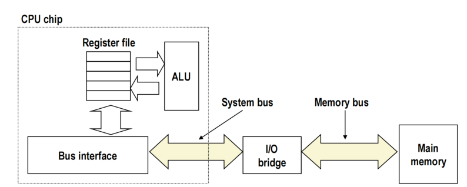

**内存读事务流程**
1. CPU将地址A放到内存总线
2. 主内存读取A，检索字x并放到总线
3. CPU从总线读取字x到寄存器

**内存写事务流程**
1. CPU放置地址A，内存等待数据
2. CPU放置数据字y到总线
3. 内存读取数据字y并存储到地址A

### 1.4 磁盘存储技术

**磁盘结构**
- **磁盘**由多个**盘片**构成
- 每个盘片有两个可用的**表面**，可独立读写数据
- 每个表面由一组**同心圆环**组成，称为**磁道**
- 每个磁道被划分为若干个**扇区**，扇区之间有**间隙区**用于同步和分隔

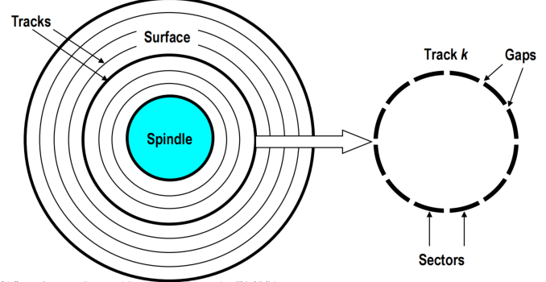

**多盘片视图**
- 多个盘片中相同编号的磁道彼此垂直对齐
- 这些对齐的磁道共同组成一个**柱面**
- 当磁头组同时定位在相同半径的磁道上时，它们便位于同一个柱面中

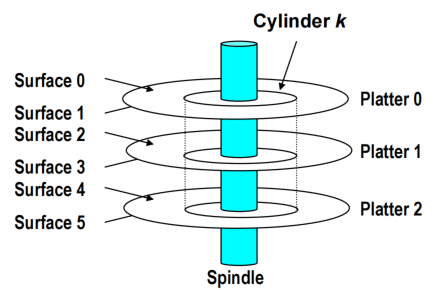

```
磁盘（Disk）
 └── 多个盘片（Platters）
       └── 每个盘片有两个表面（Surfaces）
             └── 每个表面包含多个磁道（Tracks）
                   └── 每个磁道划分为多个扇区（Sectors）
                         └── 相同编号的磁道形成柱面（Cylinder）
```

**磁盘容量**
- **容量**：磁盘能够存储的**最大比特数**
- **厂商标注方式**：通常以 **GB** 为单位，其中 $1GB = 10^9 Bytes$
  - 注意：这是**十进制GB**，而不是操作系统常用的二进制 $GiB（1 GiB = 2^{30} Bytes）$

**决定磁盘容量的技术因素**

| 因素 | 定义 | 含义 |
|------|------|------|
| **记录密度** | bits/inch | 每英寸磁道上可记录的比特数 |
| **磁道密度** | tracks/inch | 每英寸半径范围内的磁道数 |
| **面密度** | bits/in² | 记录密度 × 磁道密度 |

**记录区域**
- 定义：现代磁盘将磁道划分为互不重叠的子集，称为记录区
- 在同一个记录区中，每条磁道包含的扇区数量相同
- 不同记录区的每轨扇区数不同——外层记录区的每轨扇区数多于内层记录区
- 计算磁盘总容量时使用**每轨平均扇区数**

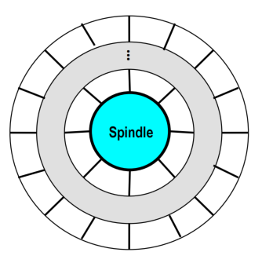

**计算磁盘容量**
- **公式**
  $$
  {Capacity} = ({bytes/sector}) \times ({avg.sectors/track}) \times ({tracks/surface}) \times ({surfaces/platter}) \times ({platters/disk})
  $$

- **示例**

| 参数 | 数值 |
|------|------|
| 每扇区字节数 | 512 Bytes |
| 每磁道平均扇区数 | 300 |
| 每表面磁道数 | 20,000 |
| 每盘片表面数 | 2 |
| 每磁盘盘片数 | 5 |

**计算**：
$$
512 \times 300 \times 20{,}000 \times 2 \times 5 = 30{,}720{,}000{,}000,Bytes = 30.72,GB
$$

📊 **直观理解**：外圈磁道更长 → 可放更多扇区 → 形成多个"记录区" → 容量计算需用平均值

### 1.5 磁盘操作

**单碟视图**
- 磁盘表面以**固定的旋转速度**旋转
- **磁臂**可以沿半径方向移动，把**读写磁头**定位到任何磁道上
- 读写磁头在磁盘表面上方通过**一层极薄的气垫**漂浮
- **主轴**驱动盘片旋转

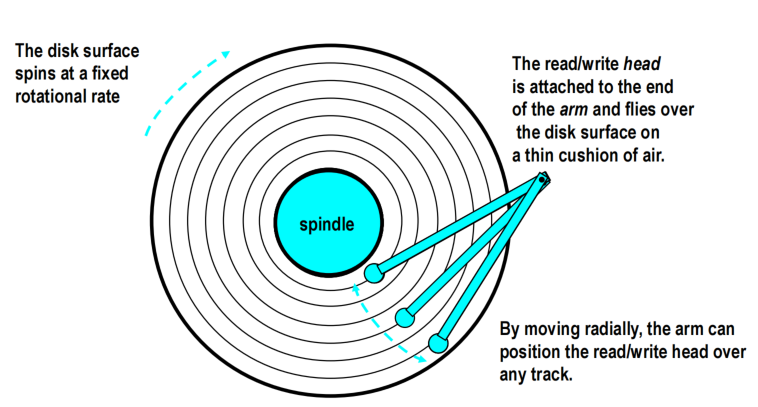

**多碟视图**
- 现代硬盘通常有多个盘片，上下叠放
- 每个盘面上都有一个读写磁头
- 所有磁头同时移动，位于同一条半径线上，形成一个柱面
- **Cylinder = 同一半径上所有盘面的磁道集合**

**磁盘访问时间组成**
$$
T_{access} = T_{avg\_seek} + T_{avg\_rotation} + T_{avg\_transfer}
$$

- **寻道时间**：磁头定位到目标柱面，典型 $3-9ms$
- **旋转延迟**：等待目标扇区转到磁头下，$T_{avg\_rotation} = 1/2 × 1/RPM × 60s/min$
- **传输时间**：读取目标扇区数据

**示例计算**（7200 RPM，平均寻道9ms，400扇区/磁道）：
- $T_{avg\_rotation} = 4ms$
- $T_{avg\_transfer} = 0.02ms$  
- $T_{access} = 9 + 4 + 0.02 = 13.02ms$

**重要结论**：
- 访问时间主要由"寻道时间 + 旋转延迟"决定
- 第一个位最贵，后续数据几乎"免费"
- SRAM ≈ 4ns；DRAM ≈ 60ns；磁盘 ≈ 13ms → 磁盘约比 SRAM 慢 40,000 倍，比 DRAM 慢 2,500 倍！

### 1.6 逻辑磁盘块

- **物理扇区映射为逻辑块序列**：现代磁盘提供逻辑块序列视图：
  ```
  Logical Blocks = [0, 1, 2, 3, ...]
  ```

- **磁盘控制器处理映射**：负责维护从逻辑块号 → 物理扇区 (surface, track, sector) 的映射关系

- **支持备用柱面设置**：控制器可为每个记录区分配备用柱面，以应对坏道
  - "最大容量"指原始物理容量
  - "格式化容量"指用户可见逻辑块总量（扣除了保留区）

### 1.7 I/O总线与磁盘访问

**I/O总线结构**
- CPU通过I/O桥连接各种设备
- 包括USB控制器、图形适配器、磁盘控制器等

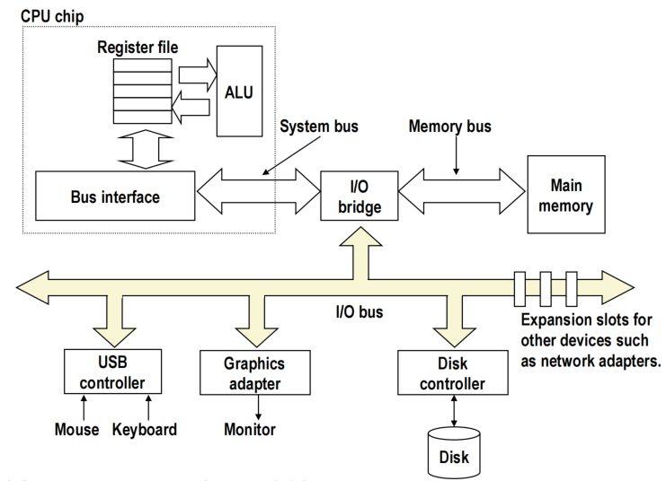

**读取磁盘扇区的三个阶段**

**阶段1：CPU 发起磁盘读取请求**
- CPU 通过 **I/O 总线**与**磁盘控制器**通信
- 将以下信息写入磁盘控制器的**控制寄存器**：
  - 要执行的操作
  - 要读取的逻辑块号
  - 数据在主存中的目标地址

👉 **CPU →（I/O 总线）→ 磁盘控制器**

> 发出读取命令 + 指定逻辑块号 + 指定目标内存地址

---

**阶段2：磁盘控制器执行 DMA 传输**
- 磁盘控制器执行寻道和旋转定位，找到目标扇区
- 通过 **DMA** 模式，**直接将数据写入主存**指定地址

👉 **磁盘控制器 →（DMA 总线）→ 主存**

> 通过 DMA 自动完成数据传输

---

**阶段3：DMA 完成后中断 CPU**
- DMA 传输完成后，磁盘控制器向 CPU 发出**中断信号**
- CPU 执行**中断处理程序**
- 操作系统确认数据传输完成，并唤醒等待该数据的进程

👉 **磁盘控制器 →（中断信号）→ CPU**

> 通知 CPU 数据读取与传输已完成

```scss
[应用程序 read()]
        ↓
      [CPU]
        ↓  发起命令 (command, block#, addr)
        ↓
 ┌──────────────────────────┐
 │ 磁盘控制器 Disk Controller │
 └──────────────────────────┘
        ↓  执行读操作 + DMA写内存
        ↓
     [主存 Memory]
        ↑
        │ DMA 直接传输
        ↓
 ┌──────────────────────────┐
 │ DMA完成 → 发出中断信号    │
 └──────────────────────────┘
        ↓
      [CPU中断处理]
        ↓
  OS确认 → 唤醒等待进程
```

### 1.8 固态硬盘

**基本结构**
- **页**：大小为 512 B – 4 KB
- **块**：由 32 – 128 页组成
- 数据的**读/写单位为页**
- **写入限制**：页只能在其所在块被擦除后才能重新写入
- **磨损寿命**：每个块在约 **100,000 次写入后会失效**

**控制与映射**
- SSD 内部有**闪存转换层**，负责将**逻辑块地址**映射到实际的**物理页**
- 读写命令通过 **I/O 总线**传输至 SSD 控制器

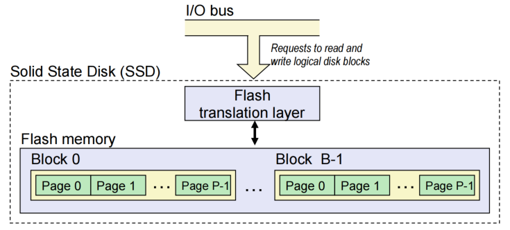

**SSD 性能特征**
- **顺序访问**比随机访问更快
- **随机写入较慢**，原因包括：
  - 擦除一个块需较长时间（约 **1 ms**）
  - 修改某个页需先将同块其他页复制到新块，再重新写入

**典型性能**（Intel SSD 730 示例）：

| 类型 | 吞吐量 (MB/s) | 平均延迟 |
|------|---------------|----------|
| 顺序读取 | 550 | 50 µs |
| 顺序写入 | 470 | 60 µs |
| 随机读取 | 365 | — |
| 随机写入 | 303 | — |

**SSD 与旋转磁盘的权衡**

| 项目 | SSD 优势 | SSD 劣势 |
|------|----------|----------|
| **机械结构** | 无机械部件 → 更快、更省电、更耐震 | — |
| **寿命** | 可能磨损（写入有限次） | 由**磨损均衡算法**缓解 |
| **耐久性** | Intel SSD 730 可承受 **128 PB 写入** | — |
| **成本** | — | 约比 HDD **贵 30 倍（按字节计）** |
| **典型应用** | MP3 播放器、智能手机、笔记本电脑 | 正逐步用于台式机与服务器 |

### 1.9 存储趋势与CPU-内存差距

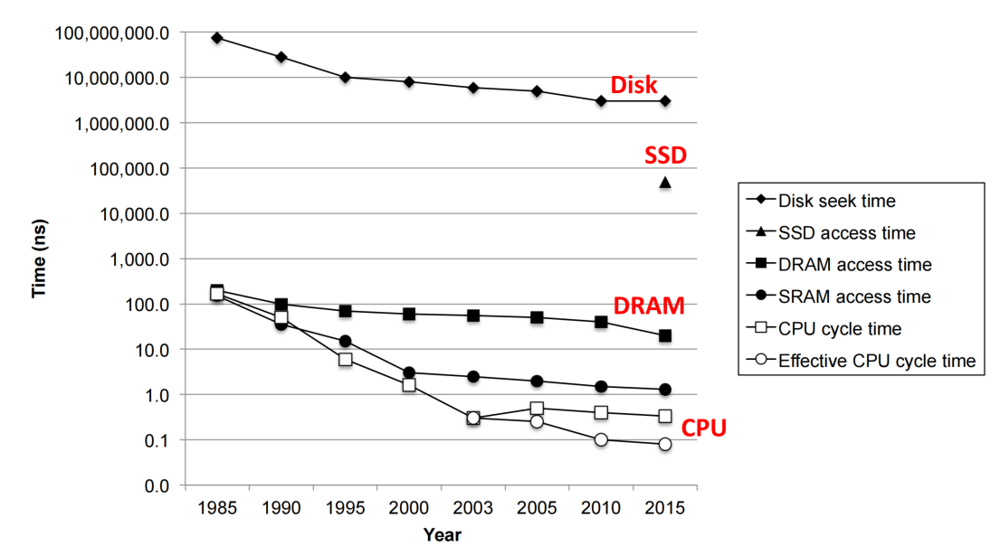

**性能差距扩大**
- CPU速度增长远快于内存和磁盘
- 有效CPU周期时间从1985年166ns降至2015年0.08ns

**存储技术趋势**（1985-2015）
- SRAM：成本下降116倍，访问时间改善115倍
- DRAM：成本下降44,000倍，容量增长62,500倍
- 磁盘：成本下降3,333,333倍，容量增长300,000倍

---

## 第二章：局部性原理

阐述程序访问内存的内在规律——局部性原理，这是缓存技术能够有效工作的理论基础，也是程序员编写高性能代码的关键考量。

### 2.1 局部性原理定义

**原理核心**：程序在运行时，往往倾向于访问**最近访问过的数据或指令**，或者**地址相邻的数据和指令**

**两种局部性**
- **时间局部性**：最近被访问的数据或指令，很可能在不久的将来再次被访问
- **空间局部性**：地址相邻的数据或指令，往往会在时间上被相继访问

### 2.2 局部性示例分析

**示例代码**
```c
sum = 0;
for (i = 0; i < n; i++)
    sum += a[i];
return sum;
```

**局部性分析**
- **数据引用**
  - 依次访问数组元素（**stride-1 访问模式**）：体现**空间局部性**
  - 每次迭代都访问变量 sum：体现**时间局部性**

- **指令引用**
  - 顺序执行连续的指令：体现**空间局部性**
  - 多次循环执行同一段代码：体现**时间局部性**

### 2.3 局部性定性评估

**核心技能**：通过查看代码获得其局部性的定性感觉是专业程序员的关键技能

**行优先访问示例**
```c
int sum_array_rows(int a[M][N]) {
    int i, j, sum = 0;
    for (i = 0; i < M; i++)
        for (j = 0; j < N; j++)
            sum += a[i][j];
    return sum;
}
```
**分析**：具有良好的空间局部性（步长1访问）

**列优先访问示例**
```c
int sum_array_cols(int a[M][N]) {
    int i, j, sum = 0;
    for (j = 0; j < N; j++)
        for (i = 0; i < M; i++)
            sum += a[i][j];
    return sum;
}
```
**分析**：空间局部性差（步长N访问）

**三维数组优化**
```c
int sum_array_3d(int a[M][N][N]) {
    int i, j, k, sum = 0;
    for (k = 0; k < N; k++)
        for (i = 0; i < M; i++)
            for (j = 0; j < N; j++)
                sum += a[k][i][j];  // 调整为a[k][i][j]获得步长1访问
    return sum;
}
```

---

## 第三章：内存层次结构与缓存


基于存储技术差异和局部性原理，构建多层次的内存体系，通过缓存机制弥合CPU与主存之间的性能鸿沟。

### 3.1 内存层次结构的理论基础

**硬件软件的基本属性**
1. 快速存储技术每字节成本更高、容量更小、功耗更大
2. CPU 与主存之间的速度差距正在不断扩大
3. 良好的程序往往能够展现出较强的局部性

**这些属性相互补充**，通过**分层的存储体系结构**来组织计算机的存储系统，使得：
- 程序运行时尽量在更快、更近的存储层中命中数据
- 同时保留较低成本和大容量的底层存储作为后备

### 3.2 内存层次结构示例

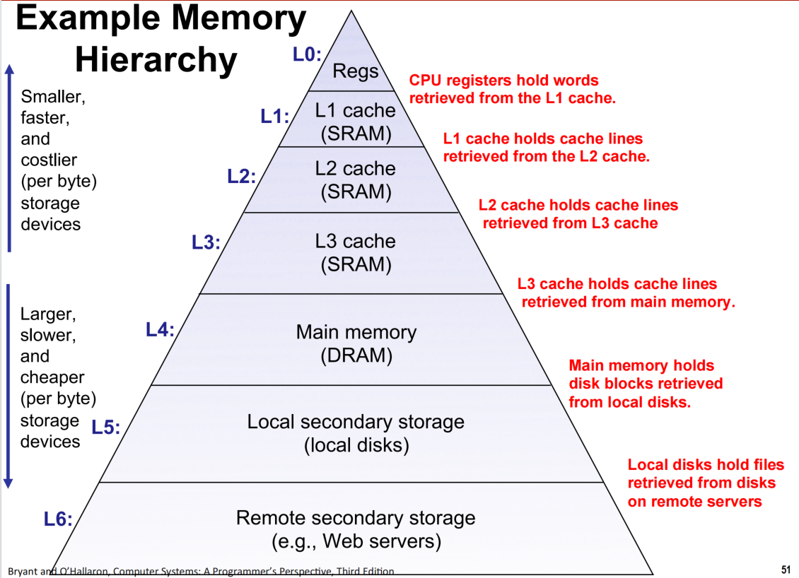

**典型层次**
1. L0 CPU 寄存器：保存当前运算所需的立即数据
2. L1缓存（SRAM）
3. L2缓存（SRAM） 
4. L3缓存（SRAM）
5. 主内存（DRAM）
6. 本地磁盘
7. 远程二级存储（如Web服务器）

### 3.3 缓存基本概念

**定义**：Cache 是一种小而快的存储设备，用于暂存来自更大、更慢设备的数据子集

**内存层次结构基本原理**
- 对于每个级别k，较快较小的设备作为较慢较大设备（级别k+1）的缓存

```sh
CPU寄存器 → L1 Cache → L2 Cache → L3 Cache → DRAM → SSD/HDD → Remote Server
          (k=0)        (k=1)        (k=2)         (k=3)     (k=4)       (k=5)
每一层都缓存其下一层的数据子集
```

**缓存为何有效**
- 由于局部性，程序访问级别k数据的频率高于级别k+1
- 因此级别k+1的存储可以更慢，从而更大、每比特更便宜

**核心思想**：内存层次结构创建了大的存储池，成本接近底部的廉价存储，但以顶部快速存储的速率向程序提供数据

### 3.4 通用缓存概念

**基本结构**
- **缓存**：较小、较快、较贵的存储器，缓存块的子集
- **内存**：较大、较慢、较便宜的存储器，划分为"块"
- 数据以块大小传输单位复制

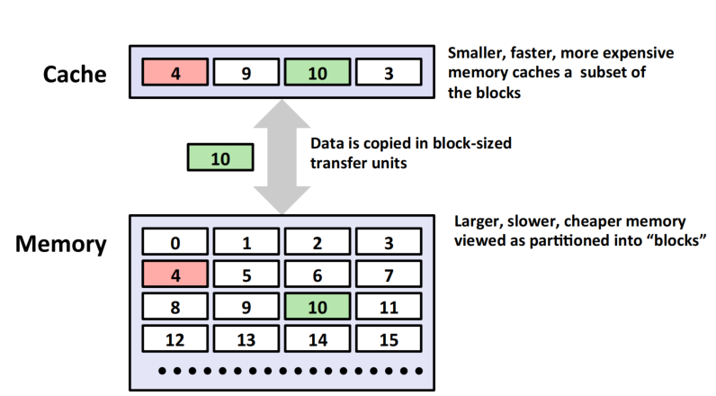

**缓存命中**
- 请求的数据块在缓存中
- 示例：请求块14，缓存中包含该块

**缓存未命中**
- 请求的数据块不在缓存中
- 块从内存获取并存储在缓存中
- 涉及放置策略（决定块存放位置）和替换策略（决定驱逐哪个块）

### 3.5 缓存未命中类型

| 类型 | 原因 | 举例 |
|------|------|------|
| **强制缺失** | 第一次访问缓存为空 | 程序刚启动时 |
| **冲突缺失** | 级别k+1的块被限制在级别k块位置的小子集中 | 访问地址 0, 8, 0, 8,... |
| **容量缺失** | 活跃数据总量超过缓存容量 | 当活动缓存块（工作集）大于缓存时发生 |

### 3.6 内存层次结构中的缓存示例

| 层级 | 被缓存内容 | 缓存位置 | 管理者 | 典型延迟（cycles） |
|------|------------|----------|--------|-------------------|
| **CPU寄存器** | 指令级操作数 | 编译器 | Compiler | **0** |
| **L1 Cache** | 64B Cache Line | 硬件 | Hardware | **4** |
| **L2 Cache** | 64B Cache Line | 硬件 | Hardware | **10** |
| **TLB** | 地址翻译项 | MMU芯片 | Hardware | **4** |
| **主存缓冲区** | 文件块 | 操作系统 | OS + Hardware | **100** |
| **磁盘缓存** | 扇区数据 | 磁盘控制器 | Firmware | **100,000** |
| **浏览器缓存** | 网页 | 本地磁盘 | Browser | **10,000,000** |
| **Web Cache** | 远程数据副本 | Web代理服务器 | Server | **1,000,000,000** |

### 3.7 总结

- CPU 与内存/存储的速度差距持续扩大
- 程序通过**时间与空间局部性**减少访问开销
- 缓存机制让系统以较低成本实现高效访问
- **Memory Hierarchy + Locality = 高性能系统的核心**

---

## 补充技术细节

### 常规 DRAM 组织 (Conventional DRAM Organization)

* **d × w DRAM**：总容量 (d \times w) 位，组织为 **d 个超单元 (supercells)**，每个超单元大小为 w 位。
* **示例**：16 × 8 DRAM 芯片 → 16 行 × 8 列，每行是一个 8 位超单元。

**读取 DRAM 超单元 (2,1) 流程**：

1. **行访问选通 (RAS, Row Access Strobe)**
   * 选择行 2，将整行数据从 DRAM 阵列复制到 **内部行缓冲区 (Internal Row Buffer)**。
    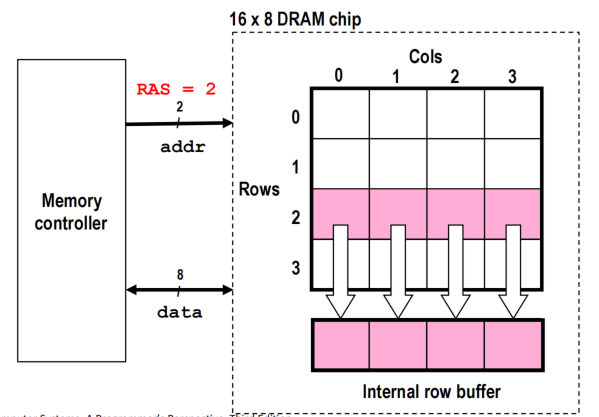

2. **列访问选通 (CAS, Column Access Strobe)**
   * 选择列 1，将超单元 (2,1) 从行缓冲区传送到数据线，并返回 CPU。
   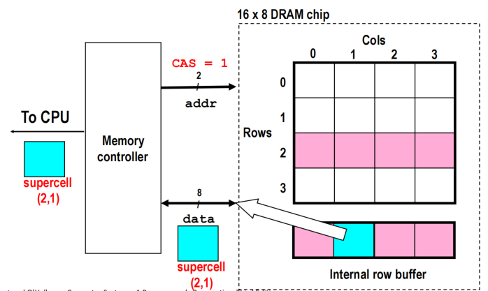


**DRAM 模块**：

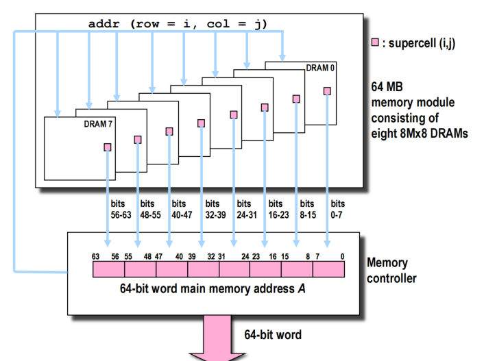
* 64 MB 内存模块由 8 个 8M×8 DRAM 芯片组成，每个芯片对应内存地址的一部分。
* 64 位主存访问可以从多个芯片并行读取数据，每个芯片提供 8 位。

---

### 增强型 DRAM (Enhanced DRAMs)

* **基本 DRAM 单元**自 1966 年发明以来未改变，1970 年由 Intel 商业化。
* **改进方向**：

  * **SDRAM (Synchronous DRAM)**

    * 使用同步时钟信号，替代异步控制。
    * 允许重用行地址（RAS → CAS → CAS → CAS）。
  * **DDR SDRAM (Double Data Rate SDRAM)**

    * 双倍数据率：每个时钟周期每引脚发送两位数据。
    * DDR → DDR2 → DDR3 → DDR4/DDR5，区别在 **预取缓冲区 (prefetch buffer)** 大小：

      * DDR：2 bits
      * DDR2：4 bits
      * DDR3：8 bits
* **2010 年**成为大多数服务器和桌面系统标准。
* **Intel Core i7** 仅支持 DDR3 SDRAM。

---

### 存储器成本与访问趋势

| Metric       | 1985  | 1990 | 1995 | 2000 | 2005  | 2010  | 2015   | 提升倍数 (2015:1985) |
| ------------ | ----- | ---- | ---- | ---- | ----- | ----- | ------ | ---------------- |
| DRAM $/MB    | 880   | 100  | 30   | 1    | 0.1   | 0.06  | 0.02   | 44,000           |
| DRAM 访问 (ns) | 200   | 100  | 70   | 60   | 50    | 40    | 20     | 10               |
| DRAM 容量 (MB) | 0.256 | 4    | 16   | 64   | 2,000 | 8,000 | 16,000 | —                |

* **SRAM / 磁盘**类似趋势，但访问延迟不同。

---

### CPU 时钟速率发展

| 年份   | CPU               | 时钟 (MHz) | 周期 (ns) | 核心数 | 有效周期 (ns) |
| ---- | ----------------- | -------- | ------- | --- | --------- |
| 1985 | 80286             | 6        | 166     | 1   | 166       |
| 1995 | Pentium           | 150      | 6       | 1   | 6         |
| 2003 | P-4               | 3,300    | 0.30    | 1   | 0.30      |
| 2010 | Core i7 (Nehalem) | 2,500    | 0.40    | 4   | 0.10      |
| 2015 | Core i7 (Haswell) | 3,000    | 0.33    | 4   | 0.08      |

* **2015 对比 1985**：有效周期时间提升约 **2,075 倍**。
* 2003 后达到 **功耗墙 (Power Wall)**，CPU 发展重点转向多核心设计。


