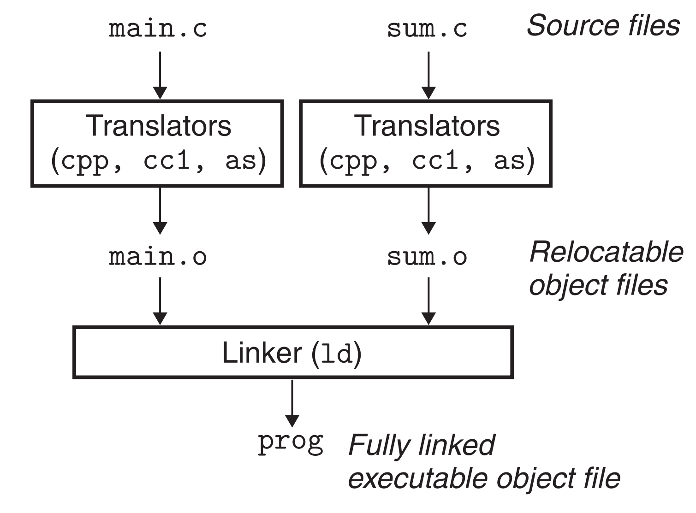
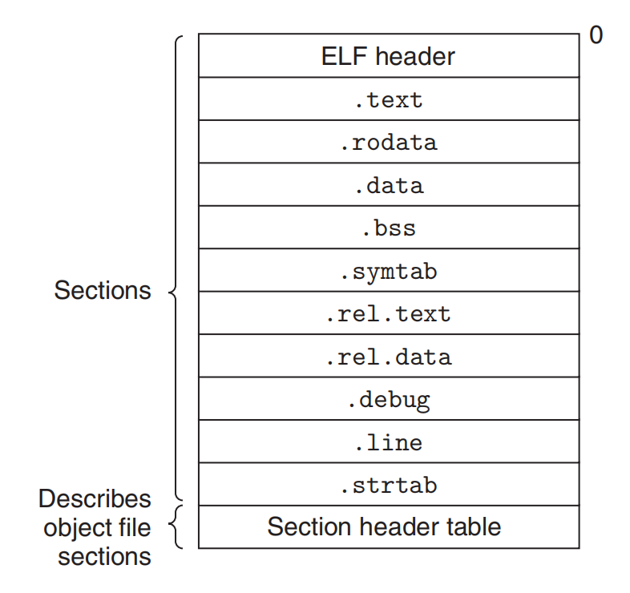
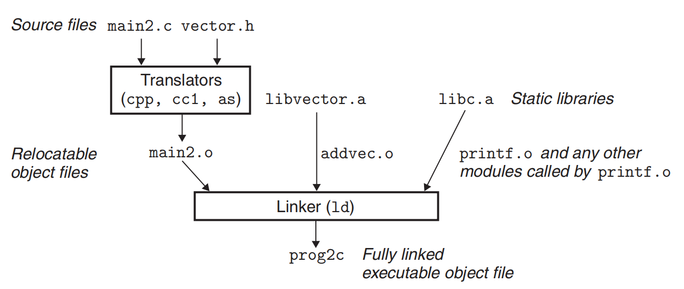
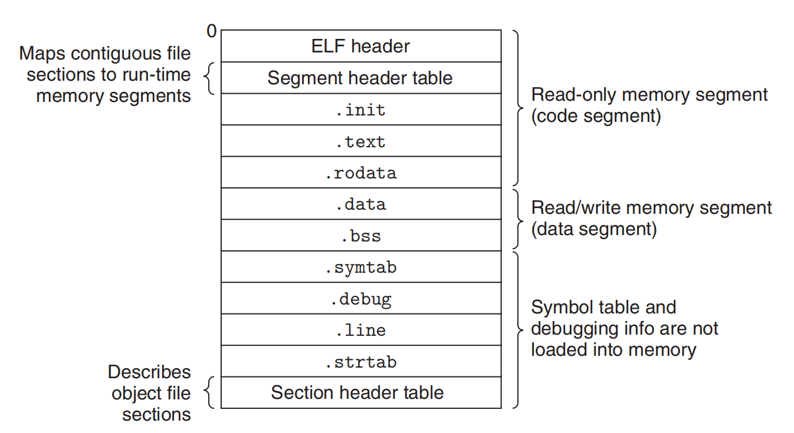
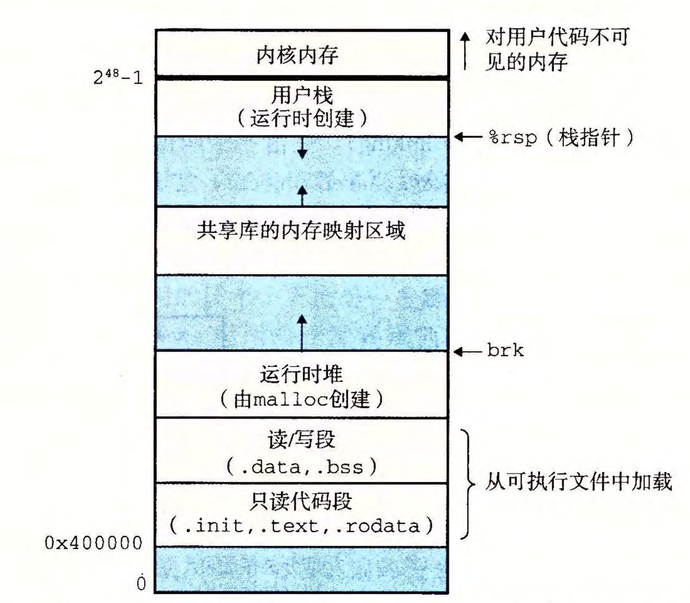
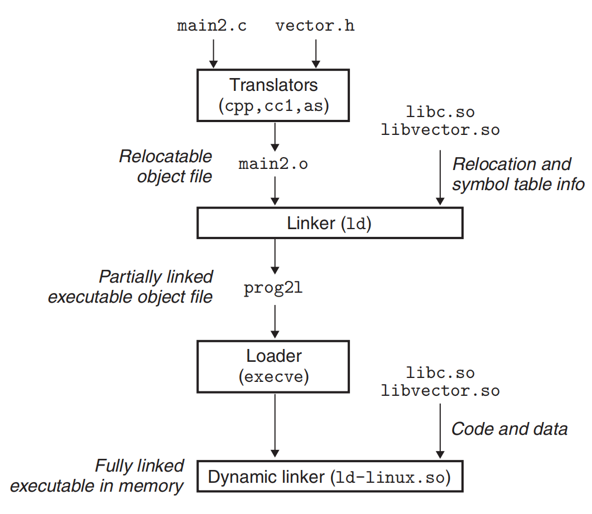

# 📝  Linking 

```css
源代码 → 预处理 → 编译 → 汇编 → .o 文件
      → 链接器解析符号 + 重定位 → 可执行 ELF
      → execve 加载 segments → 启动动态链接器
      → 动态装载共享库 → 动态符号绑定（GOT/PLT）
      → 程序运行 main()
      → （可选）dlopen 动态加载更多库
```


# 1. 编译器驱动程序

**核心概念总结**

- **编译器驱动程序**: 协调从源代码到可执行文件的整个流程。
- **静态链接**: 在程序运行之前，将所有必需的代码和数据合并到一个单一可执行文件中的过程。
- **链接器的核心作用**: 解决模块拼接与地址重定位问题。
- **加载器**: 负责将程序载入内存并启动运行。

## 1.1 编译驱动程序
大多数编译系统提供一个**编译器驱动程序**，它根据用户需要，调用**预处理器、编译器、汇编器和链接器**。

例如，使用GCC编译系统构建该程序，可以使用以下命令：
    ```bash
    gcc -Og -o prog main.c sum.c
    ```


示例程序

```c

// main.c
int sum(int *a, int n);

int array[2] = {1, 2};

int main() {
    int val = sum(array, 2);
    return val;
}

//  sum.c：

int sum(int *a, int n){
    int i, s = 0;
    for (i = 0; i < n; i++) {
        s += a[i];
    }
    return s;
}
```

### 1.2 静态链接的详细步骤

编译器驱动程序在**将源文件**转换为**可执行目标文件**的过程中，经历了以下几个关键步骤：



**预处理（C预处理器 (`cpp`)）**：处理源文件 `main.c` 中的宏定义、文件包含等指令，生成中间文件 `main.i` (一个ASCII文件)。
```bash
  cpp main.c /tmp/main.i
```

**编译（C编译器 (`cc1`)）**：将预处理后的高级语言文件 `main.i` 翻译成汇编语言文件 `main.s`。

```bash
  cc1 /tmp/main.i -Og -o /tmp/main.s
```

**汇编（汇编器 (`as`)）**：将人类可读的汇编文件 `main.s` 翻译成机器指令，生成**可重定位目标文件** `main.o` (一个二进制文件)。对 `sum.c` 重复此过程，生成 `sum.o`。

```bash
  as -o /tmp/main.o /tmp/main.s
```

**链接（链接器 (`ld`)）**:将多个**目标文件（.o）** 组合成单个程序的过程。
- 将多个可重定位目标文件 (`main.o`, `sum.o`) 合并。
- 解析文件间的符号引用（例如，`main.o` 中对 `sum` 函数的调用）。
- 加入必要的系统标准启动代码和库文件。
- 为代码和数据分配最终的内存地址，生成一个**可执行目标文件** (`prog`)。

```bash
  ld -o prog /tmp/main.o /tmp/sum.o ...
```

**执行**：在shell中输入可执行文件的路径 (`./prog`)。Shell调用操作系统的**加载器**。

- 加载器将可执行文件 `prog` 中的代码和数据复制到内存。
- 随后将CPU的控制权转移到程序的入口点，开始执行。

---

**Linking 是可以发生在三个时间点：**
* **编译时（Compile-time）**
* **加载时（Load-time）**
* **运行时（Run-time）**

掌握 Linking 有助于避免各种难定位的错误，并提升系统级理解能力。

---

# 2. 静态链接

静态链接器（如 Linux 的 `ld` 程序）以一组**可重定位目标文件**和命令行参数作为输入，生成一个完全链接的**可执行目标文件**作为输出，该文件可以被加载并运行。

**1. 输入文件的构成**
- 输入的可重定位目标文件由各种**节** 组成。每个**节**是一个连续的字节序列。
- 例如：指令在一个节（如 `.text`），已初始化的全局变量在另一个节（如 `.data`），未初始化的变量又在另一个节（如 `.bss`）。

**2. 链接器的主要任务**
为了构建可执行文件，链接器必须执行两个主要任务：

- **任务一：符号解析**
    - **描述**：目标文件定义和引用**符号**。每个符号对应一个函数、一个全局变量或一个静态变量（即用 `static` 属性声明的 C 变量）。
    - **目的**：将每个符号**引用**精确地关联到一个符号**定义**上。

- **任务二：重定位**
    - **描述**：编译器和汇编器生成的代码和数据节都是从地址 0 开始的。链接器通过以下步骤**重定位**这些节：
        1.  为每个符号定义分配一个内存地址。
        2.  修改所有对这些符号的引用，使它们指向这个内存地址。
    - **机制**：链接器根据汇编器生成的称为**重定位条目** 的详细指令，机械地执行这些地址修改。

**3. 关于链接器的重要事实**
- 目标文件本质上是**字节块的集合**。
- 链接器的工作是：**将块拼接在一起 -> 决定拼接后块的运行时内存位置 -> 修改代码和数据块中的各种地址**。
- 链接器对目标机器的理解是**非常有限**的。生成目标文件的大部分繁重工作已由编译器和汇编器完成。


## 7.3 目标文件

目标文件主要包含以下三种形式：

- **可重定位目标文件**  
  包含二进制代码与数据，可在链接时与其他同类型文件合并，生成可执行目标文件（通常以 `.o` 或 `.obj` 为扩展名）。

- **可执行目标文件**  
  包含已完成地址重定位的二进制代码与数据，可直接加载至内存并执行（例如 `.out` 文件或无扩展名的可执行文件）。

- **共享目标文件**  
  一种特殊类型的可重定位目标文件，能够在加载或运行时动态载入内存，并与程序进行链接（如 Linux 下的 `.so` 文件或 Windows 下的 `.dll` 文件）。

在编译过程中：
- **编译器和汇编器**负责生成可重定位目标文件（包括后续用于构建共享目标文件的中间文件）。
- **链接器**则将多个可重定位目标文件组合为最终的可执行目标文件。

各个系统的目标文件格式不同：
- 早期 **Unix** 系统使用 `a.out` 格式；
- **Windows** 使用可移植可执行（Portable Executable PE）格式
- **MaxOS-x** 使用 **Mach-O** 格式
- 现代 **x86-64 Linux** 系统和 **Unix** 系统使用 可执行可链接格式（**Executable and Linkable Format， ELF**）

# 4. 可重定位文件目标（ELF：Executable and Linkable Format）

ELF 是 Linux 统一的二进制格式，适用于：

* **可重定位文件**（.o）
* **可执行文件**（a.out）
* **共享库文件**（.so）

## 4.1 ELF 文件主要结构

ELF（可执行可链接格式）是可重定位目标文件的标准格式。其结构如图7.3所示，主要由三部分组成：**ELF头**、**各类型的节** 和**节头部表**。



**ELF头**：位于文件开头。
  - 一个16字节的序列，描述了生成该文件的系统的字长和字节顺序。
  - 剩余部分包含让链接器能够解析和解释该目标文件的信息，如：ELF头的大小、目标文件类型、机器类型、节头部表在文件中的偏移量以及节头部表条目的大小和数量。

**节头部表**：文件末尾。
- 描述了文件中各个**节**的位置和大小。其中目标文件中每个节都有一个固定大小的条目（Entry）

**各类型的节**
夹在ELF头和节头表之间的就是文件的核心——各种功能不同的节。

| 节名 | 内容描述 | 备注 |
| :--- | :--- | :--- |
| **.text** | 已编译程序的**机器代码**。 | |
| **.rodata** | **只读数据**，如`printf`中的格式字符串、`switch`语句的跳转表。 | |
| **.data** | 已初始化的**全局变量和静态C变量**。 | 局部变量在运行时保存在栈中，不在此处。 |
| **.bss** | **未初始化**的全局和静态C变量，以及**初始化为零**的全局或静态变量。 | **此节在目标文件中不占实际磁盘空间**，仅为一个占位符。目的是为了节省空间。运行时在内存中分配并初始化为0。 |
| **.symtab** | **符号表**，存放程序中定义和引用的函数和全局变量的信息。 | **注意**：即使不用`-g`选项编译，该表也存在（除非被`strip`命令移除）。它**不包含局部变量**的条目。 |
| **.rel.text** | **.text节的重定位信息**。记录在链接时，**.text节中需要修改**的指令的位置（如调用外部函数或引用全局变量的指令）。 | |
| **.rel.data** | **.data节的重定位信息**。记录被模块引用或定义的全局变量的重定位信息（如初始值为全局变量地址的变量）。 | |
| **.debug** | **调试符号表**，包含局部变量、类型定义、全局变量和源文件信息。 | **只有**使用`-g`选项编译时才会生成。 |
| **.line** | 原始C源文件中的**行号**与**.text节中机器指令**的映射关系。 | **只有**使用`-g`选项编译时才会生成。 |
| **.strtab** | **字符串表**，存放`.symtab`和`.debug`节中的符号名称以及节头表中的节名称。本质是一个以空字符结尾的字符串序列。 | |

**补充知识：.bss名称的由来**
- `.bss`这个名称源于IBM 704汇编语言的“块由符号开始”指令，并沿用至今。
- 一个简单的记忆方法是：将“bss”视为“**Better Save Space!**”的缩写，因为它确实节省了目标文件的磁盘空间。

---

# 5. 符号和符号表

**符号的三种类型**

在链接器的上下文中，每个可重定位目标模块（`.o` 文件）的符号表包含三种符号：

| 符号类型 | 定义与引用关系 | 对应的C实体 | 说明 |
| :--- | :--- | :--- | :--- |
| **全局符号** | 由**本模块定义**，可被**其他模块引用** | 非静态的C函数、非静态的全局变量 | 链接器的核心处理对象，需要解析和重定位。 |
| **外部符号** | 由**本模块引用**，但由**其他模块定义** | 在其他模块中定义的非静态C函数、全局变量 | 链接器需要找到其定义，否则会报"未定义引用"错误。 |
| **局部符号** | 由**本模块定义和引用**，对其他模块**不可见** | 带 `static` 属性的函数、带 `static` 属性的全局变量 | 仅在模块内部可见，链接器不需要处理它们与其他模块的关系。 |

**重要辨析**：
- **局部链接器符号** ≠ **局部程序变量（非静态）**。
- 局部非静态变量（在函数内部定义）在**运行时在栈上管理**，**不会出现在符号表**中。
- 用 `static` 定义的局部变量（静态局部变量）不在栈上，编译器在 `.data` 或 `.bss` 节为其分配空间，并生成一个**唯一的局部链接器符号**（例如 `x.1` 和 `x.2`）。

---

**ELF符号表结构**

- **位置**：ELF符号表位于 `.symtab` 节中。
- **构成**：是一个 `Elf64_Symbol` 结构体数组。
- **作用**：由汇编器根据编译器输出的符号信息构建。

**符号表条目（`Elf64_Symbol`）关键字段**：

| 字段名 | 描述 |
| :--- | :--- |
| `name` | 符号名称字符串在 `.strtab` 节中的**字节偏移量**。 |
| `value` | 符号的地址。在**可重定位文件**中，是**相对于所在节的偏移量**；在**可执行文件**中，是**绝对的运行时地址**。 |
| `size` | 符号所代表对象的大小（字节）。 |
| `type` | 符号类型，通常是数据或函数。 |
| `binding` | 符号绑定信息，表明是局部还是全局符号。 |
| `section` | 符号所在节的**节头表索引**。 |

---

**特殊的伪节**

有三个特殊的伪节在节头表中没有条目，但用于指引链接器：

| 伪节 | 全称 | 含义 |
| :--- | :--- | :--- |
| `ABS` | Absolute | 不应被重定位的符号。 |
| `UNDEF` | Undefined | **未定义的符号**，即在本模块引用但定义在其他模块的符号。 |
| `COMMON` | Common | 存放**未初始化的全局变量**。此时 `value` 字段给出对齐要求，`size` 给出最小大小。 |

**`COMMON` 与 `.bss` 节的微妙区别**：
- **`COMMON`**：存放**未初始化的全局变量**。
- **`.bss`**：存放**未初始化的静态变量**，以及**初始化为零的全局或静态变量**。

这种区分源于链接器执行符号解析的方式，目的是更灵活地处理来自不同模块的未初始化全局变量定义。

---

**实例分析**

使用 `readelf -s main.o` 查看示例程序 `main.o` 的符号表，最后三个条目如下：

```
Num:    Value  Size Type    Bind   Vis      Ndx Name
...
8:      000000 24   FUNC    GLOBAL DEFAULT    1 main
9:      000000 8    OBJECT  GLOBAL DEFAULT    3 array
10:     000000 0    NOTYPE  GLOBAL DEFAULT   UND sum
```

- **`main`**：是全局函数，位于 `.text` 节（`Ndx=1`），大小为24字节，节内偏移为0。
- **`array`**：是全局变量，位于 `.data` 节（`Ndx=3`），大小为8字节，节内偏移为0。
- **`sum`**：是外部符号，未定义（`Ndx=UND`），需要链接器解析。

---

**编程实践建议**

在C语言中，使用 `static` 属性可以隐藏模块内的变量和函数，这类似于Java和C++中的 `private`。将不需要对外暴露的全局变量和函数声明为 `static`，是一个良好的编程习惯，可以提高模块的封装性和避免命名冲突。


# 6. 符号解析（Symbol Resolution）


符号解析是链接器的核心任务之一，目的是**将每个符号引用精确地关联到一个符号定义**上。

**解析的难易程度**

*   **局部符号**：在**同一模块内**定义和引用，解析非常简单。编译器确保每个局部符号在模块内只有唯一定义。
*   **全局符号**：解析起来**非常棘手**，主要面临两个问题：
    1.  **未定义的符号**：如果链接器在所有输入模块中都找不到被引用符号的定义，会报错并终止（如 `undefined reference to 'foo'`）。
    2.  **重复定义的符号**：多个模块定义了同名的全局符号。

## 6.1 链接器如何解析多重定义的全局符号

为了解决重复定义问题，编译器和链接器引入了**强符号**和**弱符号**的概念：

*   **强符号**：函数和**已初始化**的全局变量。
*   **弱符号**：**未初始化**的全局变量。

**链接器处理重复符号名的规则如下**
| 规则 | 情况 | 链接器行为 |
| :--- | :--- | :--- |
| **规则1** | 多个同名的**强符号** | **不允许**。链接器会报错（`multiple definition`）。 |
| **规则2** | 一个**强符号**和多个**弱符号** | 选择**强符号**的定义。 |
| **规则3** | 多个同名的**弱符号** | **任意选择**其中一个弱符号的定义。 |

**规则2和规则3带来的严重问题**：

当同名符号在不同模块中被定义为不同类型时，规则2和3可能导致**极其隐蔽的运行时错误**。
*   **示例**：一个模块将 `x` 定义为 `int`（4字节），另一个模块将 `x` 定义为 `double`（8字节）。链接器按照规则选择其中一个定义后，对 `x` 的赋值可能会覆盖相邻内存区域，造成无法预料的后果。
*   **防范措施**：使用 `gcc -fno-common` 选项（遇到多重定义的全局符号时报错）或 `-Werror` 选项（将所有警告视为错误）。

**`COMMON` 与 `.bss` 的区别回顾**

这个看似随意的约定，正是为了配合链接器的符号解析规则：
*   **`COMMON`**：存放**未初始化的全局变量（弱符号）**。因为编译器不确定其他模块是否也定义了该变量，所以交由链接器最终决定。
*   **`.bss`**：存放**未初始化的静态变量**和**初始化为零的全局/静态变量（强符号）**。因为这些符号是唯一的，编译器可以自信地分配空间。

---

## 6.2 使用静态库链接

静态库是多个相关可重定位目标文件的集合，打包成单个文件（扩展名为.a），作为链接器的输入。

### 6.2.1 为什么需要静态库？
提供标准函数库的几种替代方案及其缺点：

| 方案 | 缺点 |
|------|------|
| **编译器直接识别标准函数** | 增加编译器复杂性，每次函数变更都需要新编译器版本 |
| **所有函数打包成单个目标文件** | 每个可执行文件都包含完整库副本，极度浪费磁盘和内存空间 |
| **每个函数独立的目标文件** | 程序员需手动链接每个所需模块，繁琐且易错 |

**静态库的优势**：
- **空间效率**：链接器**只复制被程序引用的模块**
- **使用简便**：程序员只需指定一个库文件名
- **维护方便**：库函数更新无需重新编译整个库

### 6.2.2 静态库的创建与使用

**创建静态库**：
使用 `ar` 工具将多个目标文件打包成静态库：
```bash
# 编译源文件生成目标文件
gcc -c addvec.c multvec.c

# 使用ar工具创建静态库
ar rcs libvector.a addvec.o multvec.o
```

**使用静态库**：
两种等效的使用方式：
```bash
# 方式1：直接指定库文件路径
gcc -static -o prog2c main2.o ./libvector.a

# 方式2：使用-l和-L选项
gcc -static -o prog2c main2.o -L. -lvector
```


**选项说明**：
- `-static`：生成完全链接的可执行文件，无需运行时链接
- `-lvector`：`libvector.a` 的简写形式
- `-L.`：指定库文件搜索路径（当前目录）



### 6.2.3 **链接器处理静态库的机制**

**智能选择机制**：
- 链接器分析程序的符号引用
- **只复制被引用的库成员**到最终可执行文件
- 未被引用的库成员被忽略

---

## 6.3 链接器解析库引用的算法

### 6.3.1 链接器解析算法

链接器在符号解析阶段，按照**从左到右的顺序**扫描命令行上指定的可重定位目标文件和静态库。在此过程中，它维护三个关键集合：

- **E**: 将被合并到最终可执行文件中的**目标文件集合**
- **U**: **未解析符号**的集合（已引用但尚未定义的符号）
- **D**: 在之前输入文件中**已定义符号**的集合

初始状态下，E、U和D均为空集。

**算法步骤**：

1. **对于每个输入文件f**：
   - 如果**f是目标文件**：将f加入E，根据f中的符号定义和引用更新U和D，然后处理下一个文件
   - 如果**f是静态库（存档文件）**：
     * 尝试将U中的未解析符号与库中成员定义的符号进行匹配
     * 如果某个库成员m定义了能解析U中符号的符号，则将m加入E，并更新U和D以反映m中的符号
     * 重复此过程，直到U和D不再变化（达到固定点）
     * 未包含在E中的库成员将被丢弃，链接器继续处理下一个文件

2. **扫描完成后**：
   - 如果U**非空**：链接器报错并终止
   - 如果U**为空**：链接器合并并重定位E中的所有目标文件，生成最终的可执行文件

---

### 6.3.2 命令行顺序的重要性

该算法导致**命令行中文件和库的顺序至关重要**。

**错误示例**：
```bash
linux> gcc -static ./libvector.a main2.c
/tmp/cc9XH6Rp.o: In function 'main':
/tmp/cc9XH6Rp.o(.text+0x18): undefined reference to 'addvec'
```

**原因分析**：
- 先处理`libvector.a`时，U为空，因此库中没有任何成员被加入E
- 后处理`main2.o`时，发现它引用`addvec`，但`libvector.a`已被处理完毕，无法再从中提取成员
- 最终U中仍有未解析符号，链接失败

---

### 6.3.3 库的放置规则

1. **基本原则**：将库放在**命令行末尾**

2. **独立库**：如果多个库彼此独立（没有交叉引用），可以按任意顺序放置在末尾
   ```bash
   gcc main.c libx.a liby.a libz.a
   ```

3. **依赖库**：如果库之间存在依赖关系，必须确保被依赖的库排在后面
   ```bash
   # libx.a 和 libz.a 依赖 liby.a
   gcc foo.c libx.a libz.a liby.a
   ```

4. **循环依赖**：如果库之间存在循环依赖，可以在命令行上重复库
   ```bash
   # libx.a 依赖 liby.a，liby.a 又依赖 libx.a
   gcc foo.c libx.a liby.a libx.a
   ```
   或者将相互依赖的库合并为一个存档文件

****

**核心总结**

- 链接器采用**贪婪的一次性扫描算法**，按顺序处理输入文件
- **库顺序错误**是常见的链接错误根源
- 遵循"**目标文件在前，库文件在后**"的原则
- 处理复杂依赖时，需要精心安排库的顺序，必要时重复库引用

这种机制解释了为什么在大型项目中，链接器命令行中库的顺序经常需要仔细调整，也是构建系统（如Makefile）需要正确处理库依赖关系的原因。

---
## 8.1 静态库结构

一个 `.a` 文件是多个 `.o` 文件通过 `ar` 打包而成：

```
libvector.a = { addvec.o , multvec.o }
```

示例使用流程：

```
gcc main2.c libvector.a
```

常见库：

* libc.a（1496 个 .o）
* libm.a（444 个 .o）

## 8.2 链接器解析静态库的算法

1. 按命令行顺序扫描 .o 和 .a
2. 维护当前未解析符号列表
3. 遇到新目标文件时尝试解析未解决符号
4. 扫描结束仍未解决 → 链接错误

注意：**静态库需要放在命令行的后面**。

---

# 7. 重定位（Relocation）

1. **重定位时机**：符号解析完成后进行
2. **关键数据结构**：重定位条目指导链接器如何修改引用
3. **两种基本寻址**：
   - **PC相对寻址**：用于函数调用，计算相对于下一条指令的偏移
   - **绝对寻址**：用于数据引用，直接使用绝对地址
4. **最终结果**：生成完全链接的可执行文件，加载器可直接复制到内存执行

重定位过程确保了程序中的所有符号引用都能正确指向其运行时内存位置，是多模块程序能够正确运行的关键环节。

## 7.1 **重定位概述**

重定位是链接过程的第二步，在符号解析完成后进行。主要任务是将输入模块合并，并为每个符号分配运行时地址。

**重定位的两个步骤**：

1. **重定位节和符号定义**
   - 合并所有相同类型的节（如所有 `.text` 节合并为一个）
   - 为新的聚合节、输入模块中的每个节和每个符号分配运行时内存地址
   - 完成后，每条指令和全局变量都有唯一的运行时地址

2. **重定位节内的符号引用**
   - 修改代码和数据节中的所有符号引用，使其指向正确的运行时地址
   - 依赖**重定位条目**这一关键数据结构

## 7.2 **重定位条目**

当汇编器生成目标模块时，不知道代码和数据的最终内存位置，也不知道外部定义函数的位置。因此，对于位置未知的引用，汇编器会生成重定位条目。

**ELF重定位条目结构**：
```c
typedef struct {
    long offset;    // 需要修改的引用的节内偏移量
    long type:32,   // 重定位类型
         symbol:32; // 符号表索引
    long addend;    // 用于调整修改后值的常数
} Elf64_Rela;
```

**重定位节**：
- `.rel.text`：代码的重定位条目
- `.rel.data`：数据的重定位条目

**基本重定位类型**：
- `R_X86_64_PC32`：重定位使用**32位PC相对地址**的引用
- `R_X86_64_32`：重定位使用**32位绝对地址**的引用

## 7.3 重定位符号引用

### 7.3.1 **重定位算法**

```c
foreach section s {
    foreach relocation entry r {
        refptr = s + r.offset; // 指向需要重定位的引用
        
        /* 重定位PC相对引用 */
        if (r.type == R_X86_64_PC32) {
            refaddr = ADDR(s) + r.offset; // 引用的运行时地址
            *refptr = (unsigned)(ADDR(r.symbol) + r.addend - refaddr);
        }
        
        /* 重定位绝对引用 */
        if (r.type == R_X86_64_32) {
            *refptr = (unsigned)(ADDR(r.symbol) + r.addend);
        }
    }
}
```

### 7.3.2 **实例分析：PC相对引用重定位**

**示例**：`main.o` 中对 `sum` 函数的调用
```assembly
e: e8 00 00 00 00 callq 13 <main+0x13> sum()
f: R_X86_64_PC32 sum-0x4  # 重定位条目
```

**重定位条目参数**：
- `r.offset = 0xf`
- `r.symbol = sum`
- `r.type = R_X86_64_PC32`
- `r.addend = -4`

**计算过程**：
- 假设：`ADDR(.text) = 0x4004d0`, `ADDR(sum) = 0x4004e8`
- `refaddr = 0x4004d0 + 0xf = 0x4004df`
- 新值 = `0x4004e8 + (-4) - 0x4004df = 0x5`

**重定位结果**：
```assembly
4004de: e8 05 00 00 00 callq 4004e8 <sum>
```

**运行时执行**：
- `call` 指令位于 `0x4004de`
- 执行时 PC = `0x4004e3`（下一条指令地址）
- 目标地址 = `0x4004e3 + 0x5 = 0x4004e8`（`sum` 函数地址）

### 7.3.3 **实例分析：绝对引用重定位**

**示例**：`main.o` 中对 `array` 的引用
```assembly
4: bf 00 00 00 00 mov $0x0,%edi
5: R_X86_64_32 array  # 重定位条目
```

**重定位条目参数**：
- `r.offset = 0xa`
- `r.symbol = array`
- `r.type = R_X86_64_32`
- `r.addend = 0`

**计算过程**：
- 假设：`ADDR(array) = 0x601018`
- 新值 = `0x601018 + 0 = 0x601018`

**重定位结果**：
```assembly
4004d9: bf 18 10 60 00 mov $0x601018,%edi
```

### 7.3.4 **重定位完成后的可执行文件**

**重定位后的.text节**：
```assembly
00000000004004d0 <main>:
  4004d0: 48 83 ec 08         sub $0x8,%rsp
  4004d4: be 02 00 00 00      mov $0x2,%esi
  4004d9: bf 18 10 60 00      mov $0x601018,%edi  # &array
  4004de: e8 05 00 00 00      callq 4004e8 <sum>  # sum()
  ...
```

**重定位后的.data节**：
```assembly
0000000000601018 <array>:
  601018: 01 00 00 00 02 00 00 00
```


---


目的：将所有引用转换为最终的虚拟地址。

重定位发生在链接阶段，用于：

* 填充全局变量地址
* 填充函数调用跳转目标

示例（main.o 的重定位项）：

```
a: R_X86_64_32 array          ; &array 地址
f: R_X86_64_PC32 sum-0x4      ; 调用 sum()
```

最终运行时地址如：

```
%edi = 0x601018  ; array 的实际地址
callq sum
```

---

# 8. 可执行目标文件

可执行目标文件是链接过程的最终产物，包含了程序加载和执行所需的全部信息。从多个ASCII源文件到单个二进制可执行文件的转换至此完成。

**ELF可执行文件结构**



1. **代码段**：
   - 只读权限，保护代码不被意外修改
   - 包含程序的主要执行指令
   - 通常位于较低的虚拟地址空间

2. **数据段**：
   - 读写权限，存储全局变量和静态数据
   - 包含已初始化数据（.data）和未初始化数据（.bss）
   - 通常位于较高的虚拟地址空间

3. **不加载到内存的部分**：
   - 符号表（.symtab）
   - 调试信息（.debug）
   - 这些信息对调试有用，但程序执行时不需要

**与可重定位文件的相似与差异**：

| 组成部分 | 在可执行文件中的特点 |
|---------|---------------------|
| **ELF头** | 描述文件总体格式，包含程序**入口点**（程序运行时执行的第一条指令地址） |
| **.text, .rodata, .data节** | 与可重定位文件类似，但已**重定位到最终的运行时内存地址** |
| **.init节** | 定义小函数`_init`，由程序初始化代码调用 |
| **.rel节** | **不需要**，因为文件已完全链接 |
| **程序头部表** | **新增**，描述如何将文件映射到内存段 |

**程序头部表与内存段映射**

ELF可执行文件设计为易于加载到内存，将文件的连续块映射到连续的内存段。

- **示例程序头表内容**：
  ```
  Read-only code segment
  1 LOAD off 0x0000000000000000 vaddr 0x0000000000400000 paddr 0x0000000000400000 align 2**21
  2 filesz 0x000000000000069c memsz 0x000000000000069c flags r-x

  Read/write data segment  
  3 LOAD off 0x0000000000000df8 vaddr 0x0000000000600df8 paddr 0x0000000000600df8 align 2**21
  4 filesz 0x0000000000000228 memsz 0x0000000000000230 flags rw-
  ```

- 通过程序头部标，可以看到根据可执行目标文件的内容初始化了**两个内存段**：

  1. **代码段（只读）**
     - **权限**：读/执行
     - **内存地址**：0x400000
     - **内存大小**：0x69c字节
     - **文件大小**：0x69c字节
     - **包含内容**：ELF头、程序头表、.init、.text和.rodata节

  2. **数据段（读/写）**
     - **权限**：读/写
     - **内存地址**：0x600df8
     - **内存大小**：0x230字节
     - **文件大小**：0x228字节
     - **包含内容**：.data节
     - **特殊处理**：剩余的8字节对应.bss数据，在运行时初始化为零

**地址对齐要求**：链接器必须为每个段选择起始地址`vaddr`，满足：
```
vaddr mod align = off mod align
```

- **示例计算**：
- 数据段：`vaddr = 0x600df8`, `align = 0x200000`
- `0x600df8 mod 0x200000 = 0xdf8`
- `off = 0xdf8`, `0xdf8 mod 0x200000 = 0xdf8`
- 满足对齐要求

**对齐优化的目的**：
- 使对象文件中的段在程序执行时能高效传输到内存
- 与虚拟内存的组织方式相关（虚拟内存被组织为大的连续2的幂字节块）

---

# 9. 加载可执行目标文件

**加载过程概述**

当在Linux shell中输入`./prog`时，shell会调用操作系统中的**加载器（Loader，execve）** 来运行该可执行文件。加载器负责将程序从磁盘复制到内存并启动执行。

**加载步骤**：
1. 加载器根据**程序头部表**的指导，将可执行文件的代码段和数据段复制到内存
2. 跳转到程序的**入口点**开始执行

**Linux x86-64运行时内存映像（虚拟地址空间）**

- 注意：
  - 图中各段相邻的表示是简化版，实际存在**间隙**（由于.data段对齐要求）
  - 链接器使用**地址空间布局随机化**，每次运行时的具体地址会变化，但相对位置保持不变

 


| 内存区域 | 位置 | 增长方向 | 内容 |
|---------|------|----------|------|
| **内核内存** | 地址2⁴⁸以上 | - | 操作系统内核的代码和数据 |
| **用户栈** | 最大合法用户地址(2⁴⁸-1)开始 | **向下**增长 | 函数调用栈，存储局部变量等 |
| **共享库区域** | 栈下方 | - | 内存映射的共享模块 |
| **运行时堆** | 数据段上方 | **向上**增长 | 通过`malloc`动态分配的内存 |
| **数据段** | 代码段上方 | - | 已初始化(.data)和未初始化(.bss)的全局变量 |
| **代码段** | 0x400000地址开始 | - | 程序代码(.text)、只读数据(.rodata)和初始化代码(.init) |


**程序启动过程**

1. **入口点**：加载器跳转到`_start`函数
   - 该函数定义在系统目标文件`crt1.o`中
   - 对所有C程序都相同

2. **系统初始化**：`_start`调用`__libc_start_main`函数
   - 该函数定义在`libc.so`中
   - 负责初始化执行环境

3. **用户程序执行**：
   - 调用用户定义的`main`函数
   - 处理`main`函数的返回值
   - 必要时将控制权返回给内核

---

# 10. Shared Library（动态链接共享库）

共享库通过动态链接机制，解决了静态库在内存使用、维护成本和系统资源利用方面的根本性问题，是现代操作系统软件生态系统的基石。


**静态库的局限性**

1. **维护困难**：库更新时，应用程序员需手动重新链接
2. **内存浪费**：每个进程都包含标准库函数的重复代码副本
3. **资源消耗**：在运行数百个进程的系统上，这会显著浪费稀缺的内存资源

**共享库的定义**
- 共享库是可在**运行时或加载时**加载到任意内存地址并与程序链接的目标模块
- 在Linux系统中称为共享对象（`.so`文件），在Windows中称为DLL

**两种共享方式**：
1. **磁盘层面**：文件系统中只有一个`.so`文件，被所有引用它的可执行文件共享
2. **内存层面**：共享库的`.text`节在内存中的单个副本可被不同进程共享

**创建共享库**：
```bash
gcc -shared -fpic -o libvector.so addvec.c multvec.c
```
- `-fpic`：生成**位置无关代码**
- `-shared`：指示链接器创建共享对象文件

**链接共享库**：
```bash
gcc -o prog2l main2.c ./libvector.so
```
- 此时不复制共享库的代码和数据到可执行文件中
- 只复制**重定位和符号表信息**，用于加载时解析引用

**动态链接过程**

  

  - **加载阶段**：
    - 加载器加载部分链接的可执行文件`prog2l`
    - 发现`.interp`节包含动态链接器路径（如`ld-linux.so`）
    - 加载并运行动态链接器，而非直接传递控制权给应用程序

  - **动态链接器的任务**：
    - 将`libc.so`的文本和数据重定位到内存段
    - 将`libvector.so`的文本和数据重定位到另一个内存段
    - 重定位`prog2l`中对`libc.so`和`libvector.so`符号的所有引用

  - **完成启动**：
    - 动态链接器完成链接后，将控制权传递给应用程序
    - 共享库的位置在执行期间保持固定

**动态链接的优势**

- **空间效率**：
   - 磁盘上：单个共享库文件服务多个应用程序
   - 内存中：共享库代码的单一副本服务多个进程

- **维护便利**：
   - 更新共享库时，无需重新编译或重新链接依赖它的程序
   - 自动使用最新版本的库

- **灵活性**：
   - 支持运行时加载和卸载库
   - 便于插件系统和模块化架构

---

# 11. 从应用程序中加载和链接共享库 Runtime Dynamic Linking（运行时动态链接）

运行时动态链接允许应用程序在**执行过程中**动态加载和链接共享库，无需在编译时进行链接。这为软件架构提供了前所未有的灵活性。

## 11.1  **应用场景**

**软件分发与更新**：`Windows`应用程序常用共享库分发软件更新，具体流程如下：
  1. 开发者发布新版共享库
  2. 用户下载替换现有版本
  3. 应用程序下次运行时自动加载新库无需重新安装整个应用程序

**高性能Web服务器**
- **传统方式**：使用`fork`和`execve`创建子进程运行CGI程序
- **现代方式**：基于动态链接的高效方案
- **实现机制**：
  - 将动态内容生成功能封装为共享库
  - 收到请求时动态加载对应函数库
  - 直接调用函数而非创建子进程
- **性能优势**：
  - 函数缓存在服务器地址空间，后续请求只需函数调用开销
  - 显著提升高流量站点吞吐量
  - 支持运行时更新和添加功能，无需重启服务器

## 11.2 **动态链接编程接口**

Linux 系统为动态链接器提供了一个简单的接口，允许应用程序在运行时加载和链接共享库。

- **核心函数集**（`#include <dlfcn.h>`）

- **库加载函数** `dlopen`：加载并链接指定共享库
   ```c
   #include <dlfcn.h>
   void *dlopen(const char *filename, int flag);
   ```
   - **flag参数取值为如下**：
     - `RTLD_NOW`：立即解析所有外部符号引用；可以与`RTLD_GLOBAL`取或
     - `RTLD_LAZY`：延迟符号解析至函数首次执行时；可以与`RTLD_GLOBAL`取或
     - `RTLD_GLOBAL`：使库符号对后续加载的库可见

- **符号解析函数** `dlsym`：获取已加载库中符号的地址；返回符号地址（成功）或`NULL`（失败）
   ```c
   #include <dlfcn.h>
   void *dlsym(void *handle, char *symbol);
   ```
- **库卸载函数** `dlclose`：卸载共享库（无其他引用时）；返回 0（成功）或-1（失败）
   ```c
   int dlclose(void *handle);
   ```

- **错误处理函数** `dlerror`：返回最近动态链接操作的错误描述，返回错误信息字符串或`NULL`（无错误）
   ```c
   const char *dlerror(void);
   ```

## 11.3 **编程实例**

**编译命令**
```bash
gcc -rdynamic -o prog2r dll.c -ldl
```

- `-rdynamic`：使可执行文件的全局符号可用于动态符号解析
- `-ldl`：链接动态链接库，提供`dlopen`等函数实现

**示例代码分析**
```c
#include <dlfcn.h>

int main() {
    void *handle;
    void (*addvec)(int *, int *, int *, int);
    char *error;
    
    /* 动态加载共享库 */
    handle = dlopen("./libvector.so", RTLD_LAZY);
    if (!handle) {
        fprintf(stderr, "%s\n", dlerror());
        exit(1);
    }
    
    /* 获取函数指针 */
    addvec = dlsym(handle, "addvec");
    if ((error = dlerror()) != NULL) {
        fprintf(stderr, "%s\n", error);
        exit(1);
    }
    
    /* 调用动态加载的函数 */
    addvec(x, y, z, 2);
    
    /* 卸载共享库 */
    if (dlclose(handle) < 0) {
        fprintf(stderr, "%s\n", dlerror());
        exit(1);
    }
    return 0;
}
```

1. **错误检查**：每次`dlopen`、`dlsym`、`dlclose`调用后检查错误
2. **资源管理**：及时卸载不再使用的库释放资源
3. **类型安全**：正确转换`dlsym`返回的函数指针类型

## 11.4  **扩展应用：Java本地接口**

**JNI机制**
- **定义**：Java本地接口标准，允许Java程序调用C/C++函数
- **实现方式**：
  1. 将本地函数编译为共享库（如`foo.so`）
  2. Java解释器使用`dlopen`接口动态加载库
  3. 直接调用本地函数

# 12. 位置无关代码

---

# 13. Library Interpositioning（库函数插桩）

插桩：拦截对任意函数的调用，并替换为自定义版本。

三种方式：

## 11.1 编译时打桩

使用宏替换对 malloc/free 的调用。

## 11.2 链接时打桩

使用 linker wrapper 技术：

* malloc → `__wrap_malloc`
* 原 malloc → `__real_malloc`

## 11.3 运行时插桩（最强）

环境变量：

```
LD_PRELOAD=mymalloc.so ./a.out
```

示例输出：

```
malloc(32) = 0xe60010
free(0xe60010)
```

用途：

* 调试 / Profiler
* 安全监控
* 内存泄漏检测

---

# 14. 处理目标文件的工具

**核心工具包：GNU Binutils**
*   在 Linux 系统编程和调试中至关重要。
*   提供了一套用于创建、检查和修改目标文件（.o）与可执行文件的工具。

**主要工具及其功能：**

| 工具 | 主要用途 |
| :--- | :--- |
| **ar** | **静态库管理**：创建、修改（增、删、列、取）`.a` 静态库文件。 |
| **nm** | **查看符号**：列出目标文件或库中定义的函数、变量等符号（地址、类型、名称）。 |
| **objdump** | **全能分析**：反汇编（-d）、查看节信息（-h）、查看所有头信息（-x）等。功能最强大。 |
| **readelf** | **ELF 专业分析**：专门详细解析 ELF 格式文件的结构（节、段、符号、重定位等），信息比 objdump 更规范。 |
| **size** | **节大小查看**：快速查看目标文件各节（.text, .data, .bss）的大小。 |
| **strings** | **提取字符串**：从二进制文件中提取出所有可打印的字符串常量，用于初步分析。 |
| **strip** | **删除符号**：移除目标文件中的符号表和调试信息，以减小文件体积，但会削弱可调试性。 |

**共享库相关工具：**

| 工具 | 主要用途 |
| :--- | :--- |
| **ldd** | **依赖查询**：列出一个可执行程序或共享库在运行时所需的全部共享库及其路径。 |

**使用场景提示：**
*   **初步分析**：先用 `file` 确定文件类型，再用 `nm`/`readelf -s` 看符号，用 `objdump -h`/`readelf -S` 看节信息。
*   **深入分析**：用 `readelf` 查看所有 ELF 结构细节，用 `objdump -d` 进行反汇编分析代码逻辑。
*   **库管理**：用 `ar` 处理静态库，用 `ldd` 排查共享库依赖问题。
*   **发布优化**：使用 `strip` 精简最终发布的可执行文件。

---

# 15. 总结

# 12. 全局变量与注意事项

全局变量若定义重复可能造成覆盖：

* 弱符号可能与强符号合并
* 不同编译器可能结构体布局不同 → 更危险

建议：

* 尽量避免全局变量
* 必要时使用 `static`
* 使用 `extern` 引用外部变量

---

# 13. 总结

* Linking 是构建程序的核心步骤，涉及符号解析+重定位。
* ELF 提供统一的目标、可执行、共享库格式。
* 静态库整个复制进可执行文件。
* 共享库通过动态链接减少空间浪费。
* Library interpositioning 提供强大调试能力。
* 理解 Linking 能有效避免运行时错误。


