# Lecture 8 异常控制流

## 8.0 概述

### 8.0.1 控制流

**控制流（Control Flow）**：PC（程序计数器）依次指向指令地址 a₀ → a₁ → …。平滑的顺序执行代表指令地址连续。
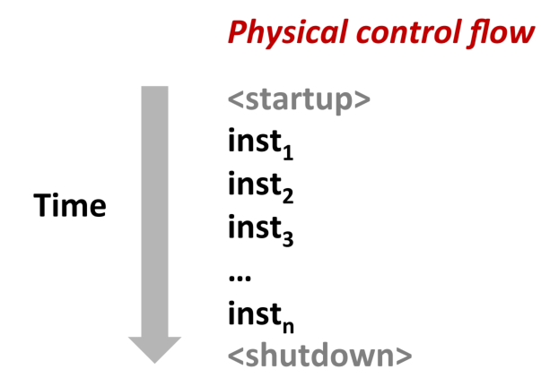

### 8.0.2 控制转移

**控制转移**：程序计数器（PC）从地址 aₖ 跳转到 aₖ₊₁ 的动作。

- 已知的两类控制流改变方式（传统控制流）
  - **跳转与分支（jumps and branches）**: 由程序内部条件触发，用于基本流程控制。
  - **调用与返回（call and return）**:用于过程调用，遵循调用栈结构。
  - 均用于**响应程序内部状态的变化**。


仅依赖上述机制，无法构建一个完整、可响应外部世界的现代系统，因为程序无法有效处理**系统状态的变化**，例如：

* 从磁盘或网络适配器到达的数据
* 指令发生除零错误（divide-by-zero）
* 用户按下 Ctrl-C
* 系统定时器到期（timer interrupt）

这些事件均发生在程序逻辑之外，程序变量无法捕获所有状态变化；系统事件（定时器、I/O、中断、进程终止等）必须触发程序控制流突变。

### 8.0.3 异常控制流

为处理上述“系统级事件”，系统必须具备一种能够**打断当前执行流**并跳转到特定处理逻辑的机制，即：**异常控制流（ECF）**

**ECF（异常控制流）**：非顺序执行的突变跳转，由硬件、操作系统、应用共同产生。

 异常控制流存在于**计算机系统的各个层次**。

低层机制（Low-level mechanisms）: **异常（Exceptions）**

* 当系统事件发生（即系统状态发生变化）时，引起控制流的改变。
* 由**硬件**与**操作系统软件**协同实现。

高层机制（Higher-level mechanisms）
  
* 进程上下文切换（Process Context Switch）: 由操作系统软件与硬件定时器共同实现。
* 信号（Signals）:由操作系统软件实现。
* 非局部跳转（Nonlocal jumps）
  * setjmp() 与 longjmp()
  * 由 C 语言运行库（C runtime library）实现。

---

**总结**

- **学习 ECF 的重要性**

1. 理解 OS 的基础机制：I/O、进程、虚拟内存均依赖 ECF。
2. 理解系统调用：应用与 OS 通信的唯一入口（trap）。
3. 能编写系统类工具：Shell、Web Server 等都依赖 ECF（fork/exec/wait/signal）。
4. 理解并发：异常处理、线程、信号触发的中断均属于并发的表现。
5. 理解软件异常：try/catch/throw 底层依赖非局部跳转，是 ECF 的高级形式。

- **本章内容结构**

1. **异常（Exception）**：硬件/OS 交界处
2. **系统调用（System Call）**：异常的一种，应用 → OS
3. **进程（Process）与信号（Signal）**：应用/OS 交界处
4. **非局部跳转（Nonlocal Jumps）**：应用层 ECF

---

## 8.1 异常

**异常：** 由于处理器状态发生变化（如除零、非法指令）或外部事件（如键盘中断）而导致的控制流的突然改变。

**事件：** 处理器状态变化被称为一个 事件（event）。

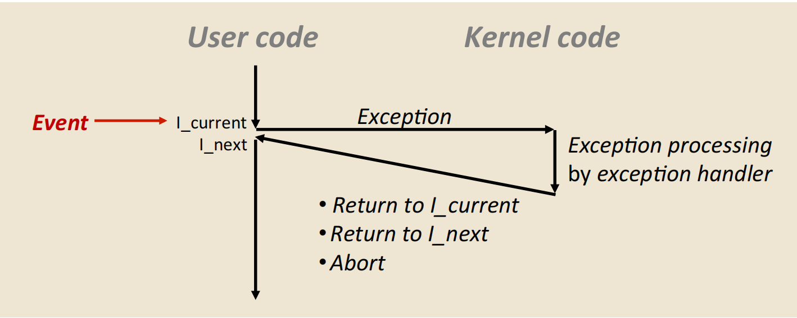


异常处理程序结束后，根据异常类型，系统将出现以下三种情况之一：

- 返回到当前指令 `Icurr`
- 返回到下一条指令 `Inext`
- 终止被中断的程序

> 举例：访问非法内存 → 触发 Page Fault → 若地址无效 → 内核发送 SIGSEGV → 程序崩溃。

### 8.1.1 异常处理

异常处理由软件和硬件共同实现。 

**异常号（Exception Number）**：系统中每一种可能发生的异常，都会被分配一个唯一的非负整数异常号。

- 一部分异常号由**处理器体系结构设计者定义**：
  - 除零
  - 缺页异常
  - 内存访问违规
  - 断点（breakpoint）
  - 算术溢出

- 另一部分异常号**由操作系统内核设计者定义**，例如：

  - 系统调用
  - 外部 I/O 设备产生的信号

**异常表（Exception Table）**：在系统启动时（计算机上电或复位），操作系统会在内存中分配并初始化一个跳转表，称为 异常表。
- **异常表结构**
  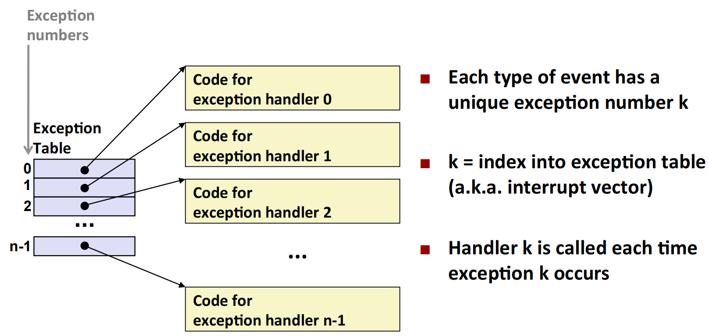
- **异常表的起始地址**保存在一个专用的 CPU 寄存器中，称为 **异常表基址寄存器**。
  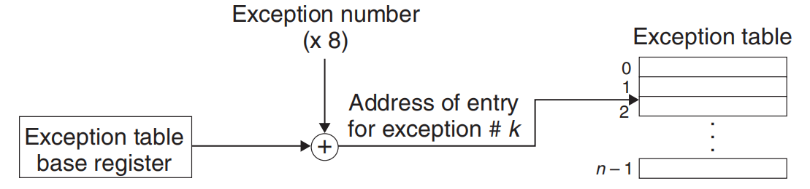

**运行时异常触发流程**

1. 处理器检测到某个事件发生
2. 确定对应的异常号 k
3. 通过异常表第 k 项，进行一次间接过程调用
4. 控制流转移到相应的异常处理程序

**异常与过程调用的异同**

1. **返回地址不同**

   - 与普通函数调用一样，处理器会在跳转前压入返回地址
   - 但根据异常类型，返回地址可能是：当前指令 `Icurr` 或下一条指令 `Inext`

2. **额外的处理器状态保存**：处理器会额外保存恢复程序所需的状态，例如在 x86-64 中，会将 EFLAGS 等寄存器压栈

3. **用户态到内核态的切换**
   - 若异常发生在用户程序中
   - 保存的状态会被压入内核栈，而不是用户栈

4. **异常处理程序的执行级别**
   - 异常处理程序在内核态运行
   - 拥有对系统全部资源的访问权限

---

### 8.1.2 异常类别

| 类别 | 原因 | 同步性 | 返回行为 |
|------|------|--------|----------|
| Interrupt | I/O 设备信号 | 异步 | 总是返回下一条指令 |
| Trap | 有意触发的异常 | 同步 | 总是返回下一条指令 |
| Fault | 可能可恢复的错误 | 同步 | 可能返回当前指令 |
| Abort | 不可恢复错误 | 同步 | 从不返回 |

#### 中断

由处理器外部 I/O 设备产生的异步异常，I/O 设备通过拉高处理器引脚并在系统总线上放置异常号来触发中断。
- 网络适配器
- 磁盘控制器
- 定时器芯片

处理中断的流程如图所示：

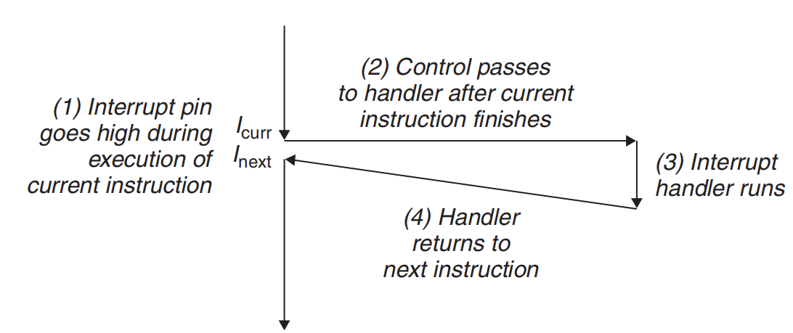

#### 陷阱和系统调用

**Trap（陷阱）** 是一种由执行某条指令**有意触发的同步异常**。其最重要用途是实现**系统调用（system call）**。

系统调用为用户程序提供了一种**受控的方式**来请求内核服务。典型的系统调用包括：

* `read`：读取文件
* `fork`：创建新进程
* `execve`：加载并执行程序
* `exit`：终止进程

处理器提供一条**特殊的陷阱指令**（如 `syscall n`）。用户程序通过执行该指令触发一个 Trap，处理器随即将控制流转移到内核态，由陷阱处理程序解析系统调用号及参数，并调用相应的内核例程。

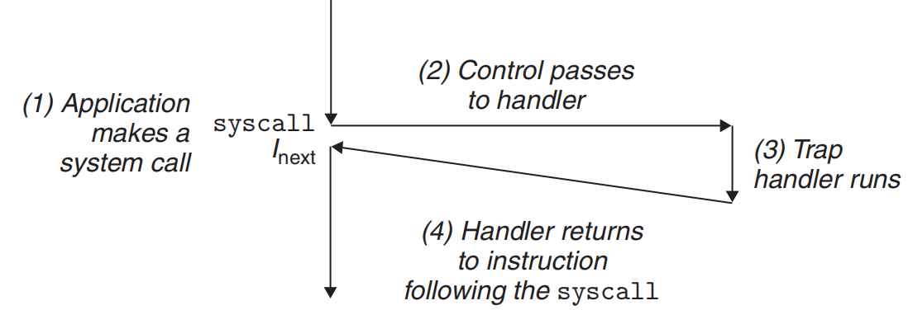

从程序员的角度看，系统调用在使用方式上类似于普通函数调用；但在实现机制上，二者存在本质区别：

* 普通函数调用在**用户态**执行，使用**用户栈**
* 系统调用通过 Trap 进入**内核态**执行，使用**内核栈**，并且能够执行**特权指令**

#### Fault（故障）

**Fault** 由**潜在可恢复的错误条件**引起，是一种同步异常。

当 fault 发生时，处理流程如下：

1. 控制流转移到 fault 处理程序
2. 如果错误能够被修复：

   * 返回到发生故障的指令 **Icurr**
   * **重新执行该指令**
3. 如果错误无法修复：

   * 控制流转入内核中的 **abort 例程**
   * 程序被终止

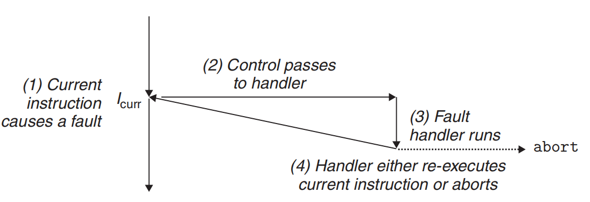


**典型示例：缺页异常（Page Fault）**

* 指令访问的虚拟页当前不在物理内存中
* fault 处理程序从磁盘中加载所需页面到内存
* 处理完成后返回，并重新执行触发异常的指令

#### Abort（终止）

**Abort** 由**不可恢复的致命错误**引起，通常与硬件故障有关，例如： DRAM / SRAM 位翻转导致的校验错误

Abort 的处理程序**永远不会返回到应用程序**。相反，它会将控制权交给内核中的终止例程，直接结束当前进程。

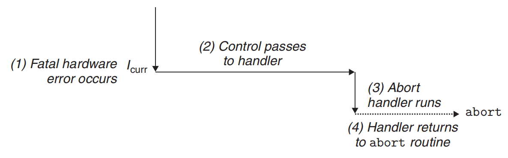

---

### 8.1.3 Exceptions in Linux/x86-64 Systems

在 x86-64 系统中，处理器最多支持 **256 种异常类型**：

* **0–31**：由 Intel 架构定义，在所有 x86-64 系统中保持一致
* **32–255**：由操作系统定义，通常用于中断和陷阱

| 异常编号 | 描述 | 异常类别 |
|-----------|------|-----------|
| 0 | 除法错误 | Fault（故障） |
| 13 | 一般保护故障 | Fault（故障） |
| 14 | 缺页异常 | Fault（故障） |
| 18 | 机器检查 | Abort（终止） |
| 32–255 | 操作系统定义的异常 | Interrupt（中断）或 Trap（陷阱） |


#### Linux/x86-64 中的 Fault 与 Abort 

* **Divide error（异常 0）**

  * 原因：除零或结果溢出
  * Unix 不尝试恢复
  * shell 报错：`Floating exception`

* **General protection fault（异常 13）**

  * 原因：非法内存访问或写只读段
  * shell 报错：`Segmentation fault`

* **Page fault（异常 14）**

  * 原因：访问的虚拟页不在内存中
  * 可恢复
  * 返回并重新执行故障指令

* **Machine check（异常 18）**

  * 原因：致命硬件错误
  * 不返回到应用程序


#### Linux/x86-64 系统调用

Linux 提供数百个系统调用。每个系统调用都对应一个**唯一的系统调用号**，该编号是内核中**系统调用表**的索引

| 系统调用编号 | 名称     | 描述                              | 系统调用编号 | 名称    | 描述                                  |
|--------------|---------|----------------------------------|--------------|--------|--------------------------------------|
| 0            | read    | 读取文件                          | 33           | pause  | 挂起进程直到信号到达                  |
| 1            | write   | 写文件                            | 37           | alarm  | 安排发送闹钟信号                      |
| 2            | open    | 打开文件                          | 39           | getpid | 获取进程 ID                           |
| 3            | close   | 关闭文件                          | 57           | fork   | 创建新进程                             |
| 4            | stat    | 获取文件信息                      | 59           | execve | 执行程序                               |
| 9            | mmap    | 将内存页映射到文件                | 60           | _exit  | 终止进程                               |
| 12           | brk     | 重置堆顶                          | 61           | wait4  | 等待进程结束                           |
| 32           | dup2    | 复制文件描述符                    | 62           | kill   | 发送信号给进程                         |


C 程序可以直接使用 `syscall` 指令调用系统调用，但在实际编程中，通常通过 **C 标准库提供的封装函数**来完成。

**系统调用指令与寄存器约定（x86-64）**

在 x86-64 体系结构中，系统调用遵循如下约定：

* `%rax`：系统调用号
* 参数寄存器（最多 6 个）：
  `%rdi`, `%rsi`, `%rdx`, `%r10`, `%r8`, `%r9`
* 返回值：`%rax`
* `%rcx` 与 `%r11` 在系统调用返回时会被破坏
* 返回值范围 `[-4095, -1]` 表示错误，对应 `errno`

---


### 术语说明

不同体系结构对“异常（exception）”和“中断（interrupt）”的术语划分并不完全一致。本书统一使用 **exception** 作为总称，并按如下方式分类：

* **异步异常**：Interrupt
* **同步异常**：Trap、Fault、Abort

尽管各系统在术语细节上可能存在差异，但其**基本思想在所有现代计算机系统中是相同的**。

---


## 8.2 进程（Processes）

异常是操作系统内核实现进程抽象的基础。

### 8.2.1 进程的定义

**进程（Process）**：正在执行的**程序实例**。  

每个**程序都在某个进程的上下文中运行**，该上下文包括：

- 程序代码和数据（存储在内存中）  
- 栈（stack）  
- 通用寄存器内容  
- 程序计数器（PC）  
- 环境变量  
- 打开的文件描述符集合  

每次用户通过 shell 输入可执行文件名启动程序时，shell 会创建一个新进程，并在该进程上下文中运行程序。应用程序也可以创建新进程，运行自己的代码或其他程序。

**进程提供的关键抽象**

1. **独立的逻辑控制流（Logical Control Flow）**  ：为程序提供独占处理器使用的错觉。  

2. **私有地址空间（Private Address Space）**  ：为程序提供独占内存使用的错觉。  

---
### 8.2.1 Logical Control Flow

**逻辑控制流（Logical Control Flow）**：进程为程序提供独占处理器使用的错觉。 

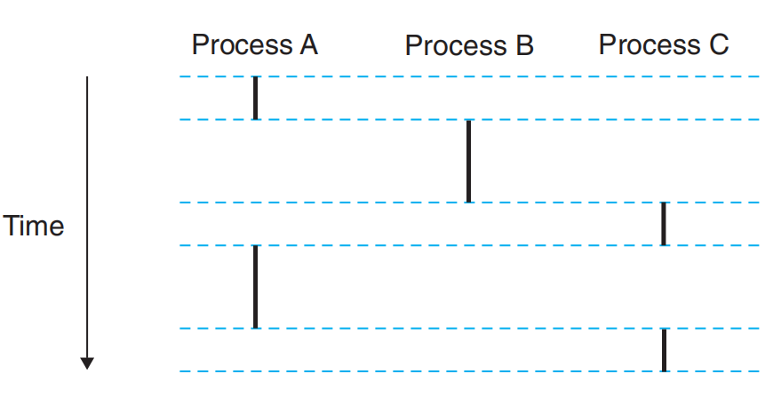

- 如果使用调试器单步执行程序，会观察到 PC 值序列仅对应程序自身指令或动态链接的共享对象指令，这就是逻辑控制流。  

- 多进程系统中，**单一物理控制流被划分为多个逻辑流**，每个进程对应一个逻辑流。  

- 对程序而言，它看似独占处理器，CPU 周期性中断时，程序状态（内存和寄存器）保持不变。  

---

### 8.2.2 并发流

**逻辑流形式**：异常处理程序、进程、信号处理程序、线程、Java 进程等。  

**并发流（Concurrent Flow）**：两条逻辑流在时间上重叠，即它们同时执行的时间区间有交集，如上图中的A和C， A和B。  

- 条件：流 X 与 Y 并发，当且仅当：
  - X 开始于 Y 开始之后且在 Y 结束之前  
  - 或 Y 开始于 X 开始之后且在 X 结束之前  

**并发（Concurrency）**：多个流同时执行的现象。  

**多任务/时间片（Multitasking/Time Slicing）**：进程轮流使用 CPU，每段执行称时间片。  

**并行流（Parallel Flow）**：在不同处理器核心或计算机上同时执行的并发流。  

---

### 8.2.3 私有地址空间

**私有地址空间（Private Address Space）**：进程为程序提供独占的虚拟内存空间，其他进程不能访问该空间。  

n 位地址系统中，地址空间为 `0, 1, ..., 2^n-1`。每个进程都有自己的地址空间。  

**x86-64 Linux 进程地址空间组织**：

- 低地址段：用户程序：代码段、数据段、堆、栈（代码段起始地址 0x400000） 
- 高地址段：内核空间：内核代码、数据、栈，用于处理系统调用等 

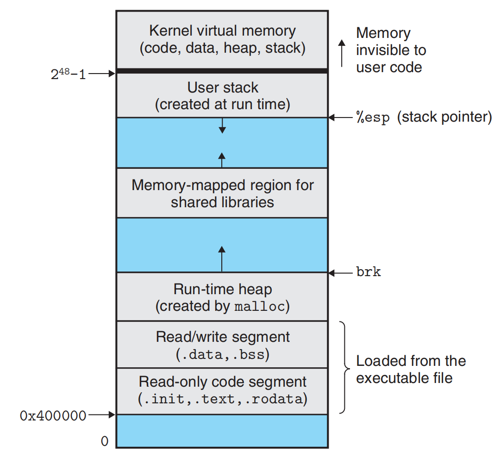


---

### 8.2.4 用户模式和内核模式

为了保证操作系统内核能够为进程提供严格、安全的抽象，**处理器必须提供一种机制来限制应用程序可以执行的指令以及能够访问的地址空间范围**。

#### 权限控制

处理器通过控制寄存器中的一个 **模式位** 来标识当前进程的执行权限级别。

**内核模式（Kernel Mode / Supervisor Mode）**
- **状态**：模式位被设置
- **权限**：
  - 可以执行指令集中的**任何指令**（包括特权指令）
  - 可以访问系统中的**任何内存地址**
- **运行主体**：操作系统内核代码

**用户模式（User Mode）**
- **状态**：模式位未被设置
- **限制**：
  - **禁止执行特权指令**，例如：停止处理器、直接修改模式位、发起I/O操作
  - **禁止直接访问**内核地址空间中的代码和数据
- **违规后果**：任何违反上述限制的操作都会触发**严重保护故障**，通常导致进程终止
- **访问内核的唯一途径**：必须通过受控的**系统调用接口**间接访问内核功能

#### 模式切换机制

**初始状态**：应用程序总是在用户模式下开始执行
**切换到内核模式的唯一途径**：发生**异常**
  - **中断**（如硬件I/O完成）
  - **故障**（如缺页异常）
  - **陷阱**（如系统调用请求）
**切换过程**：
  1. 异常发生时，控制权转移至对应的异常处理程序
  2. **处理器自动将模式从用户模式切换为内核模式**
  3. 处理程序在内核模式下执行
  4. 处理程序返回时，处理器将模式**切换回用户模式**

#### 用户态访问内核信息的机制：/proc 文件系统

为了在保持安全隔离的前提下向用户态提供有限的内核信息，Linux 引入了 **/proc 文件系统**。

- **虚拟文件系统**：并非真实磁盘文件，而是内核数据结构的动态映射
- **访问方式**：以**只读文本文件层级**的形式向用户空间导出内核内部信息
- **安全边界**：用户程序通过常规文件读取操作间接获取信息，无需直接访问内核内存

典型应用示例
| 文件路径 | 描述的信息 |
|----------|------------|
| `/proc/cpuinfo` | 处理器类型、型号、特性等 |
| `/proc/<pid>/maps` | 指定进程（PID）使用的内存映射区域 |
| `/proc/version` | 内核版本信息 |
| `/proc/meminfo` | 系统内存使用统计 |


扩展：/sys 文件系统
- **引入时间**：Linux 2.6 内核
- **主要目的**：更精细地导出**系统硬件和设备驱动**的低层信息
- **内容**：系统总线、设备树、内核模块、电源管理等动态信息

---

### 8.2.5 上下文切换（Context Switch）

**基本概念**
- 操作系统内核通过**上下文切换**这一高级异常控制流机制实现多任务处理
- 上下文切换建立在低级异常机制之上（如第8.1节所述）

**进程上下文（Process Context）**：内核为每个进程维护一个**上下文**，这是内核重启被抢占进程所需的状态信息，包括：

- **CPU状态**: 通用寄存器值、浮点寄存器值、程序计数器（PC）、状态寄存器（如EFLAGS）、用户栈指针
- **内核管理信息**：内核栈、页表（描述进程地址空间）、进程表项（包含进程当前状态信息）、文件表（记录进程已打开文件的信息）

**调度决策**
- 内核在特定时刻决定**抢占**当前进程并重启之前被抢占的进程
- 此决策称为**调度**，由内核中的**调度器**代码执行
- 当内核选择新进程运行时，称为**调度该进程**

**上下文切换三步操作**
1. **保存上下文**：将当前进程的上下文保存到其内核数据结构中
2. **恢复上下文**：从目标进程的数据结构中恢复其之前保存的上下文
3. **控制转移**：将CPU控制权传递给新恢复的进程

**触发上下文切换的场景**
- **系统调用期间的切换**
  - **阻塞型系统调用**：当系统调用因等待事件（如磁盘I/O）而阻塞时，内核可使当前进程睡眠并切换到其他进程
    - 示例：`read`系统调用等待磁盘数据时
    - 示例：`sleep`系统调用显式请求进程睡眠
  - **非阻塞系统调用**：即使系统调用未阻塞，内核也可决定进行上下文切换而非立即返回控制权

- **中断驱动的切换**
  - **定时器中断**：系统周期性地产生定时器中断（通常每1ms或10ms）
  - 每次定时器中断发生时，内核可判定当前进程已运行足够长时间并切换到新进程

**上下文切换示例**
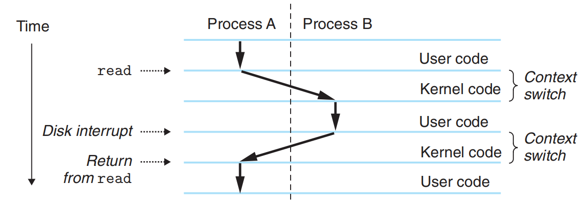

## 8.3 系统调用错误处理

**错误处理机制**：  
  - 当 Unix 系统调用遇到错误时，通常返回 `-1` 并设置全局整数变量 `errno`，指示错误类型。  
  - 程序员应始终检查错误，但很多人省略错误检查以简化代码阅读。  

**示例：fork 调用的错误检查**：
```c
if ((pid = fork()) < 0) {
    fprintf(stderr, "fork error: %s\n", strerror(errno));
    exit(0);
}
```

* `strerror(errno)` 返回与 `errno` 值对应的错误信息字符串。

**封装错误报告函数**：

```c
void unix_error(char *msg) /* Unix-style error */
{
    fprintf(stderr, "%s: %s\n", msg, strerror(errno));
    exit(0);
}
```

- 使用该函数，fork 调用简化为：

```c
if ((pid = fork()) < 0)
    unix_error("fork error");
```

**错误处理封装函数（Wrapper）**：

* 由 Stevens 提出，为每个基础函数 `foo` 定义一个首字母大写的封装函数 `Foo`。
* 封装函数：

  1. 调用基础函数
  2. 检查错误
  3. 遇到错误则终止程序

* **示例：fork 的封装函数**：

  ```c
  pid_t Fork(void)
  {
      pid_t pid;

      if ((pid = fork()) < 0)
          unix_error("Fork error");
      return pid;
  }
  ```

* 使用封装函数，调用只需一行：

  ```c
  pid = Fork();
  ```

* **优点**：

  * 保持示例代码简洁
  * 避免忽略错误检查
  * 书中讨论系统级函数时仍使用小写基础函数名
  * 封装函数定义在 `csapp.c`，原型在 `csapp.h`，可在 CS:APP 网站获取

---

## 8.4 进程控制

### 8.4.1 获取进程ID

**进程ID（PID）**
  每个进程都有一个唯一的正整数（非零）PID， 用于唯一标识系统中的每个进程，是进程控制和管理的重要依据。

**函数**：

```c
#include <sys/types.h>
#include <unistd.h>

pid_t getpid(void);   // 返回调用进程的PID
pid_t getppid(void);  // 返回父进程的PID（创建调用进程的进程）
```

**返回值类型**：
  `pid_t`，在 Linux 系统中通常被定义为 `int`。

---

### 8.4.2 创建和终止进程

从程序员的角度来看，进程可以处于三种状态之一：

**运行（Running）**：进程正在 CPU 上执行或等待执行，并最终会被内核调度。

**停止（Stopped）**：进程执行被挂起，不会被调度。

 * 进程停止的原因：收到 `SIGSTOP`、`SIGTSTP`、`SIGTTIN` 或 `SIGTTOU` 信号。
 * 恢复条件：收到 `SIGCONT` 信号后，进程变为运行状态。

> 注：信号是一种软件中断（后续章节 8.5 详细介绍）。

**终止（Terminated）**：进程永久停止，原因如下：

* 收到默认操作是终止进程的信号；
* `main` 函数返回；
*  调用 `exit` 函数。

  ```c
  #include <stdlib.h>
  void exit(int status);  // 终止进程，返回状态为 status（该函数不返回）
  ```


#### 创建子进程：`fork`

父进程通过调用 `fork` 创建一个新的运行子进程：

```c
#include <sys/types.h>
#include <unistd.h>
pid_t fork(void);
// 返回值：0 给子进程，子进程 PID 给父进程，出错返回 -1
```

**特点**：

* 子进程几乎与父进程完全相同，但 PID 不同。
* 子进程继承父进程的：

  * 用户级虚拟地址空间（代码段、数据段、堆、共享库、用户栈）
  * 打开的文件描述符（可以读写父进程打开的文件）
* **fork 返回两次**，通过返回值可以区分执行的是父进程还是子进程。
  * 父进程：返回子进程 PID
  * 子进程：返回 0

#### fork 的核心概念

**调用一次，返回两次**：对单个子进程容易理解；多次调用 `fork` 会生成多个进程，需要仔细分析执行顺序。

**并发执行**
 * 父子进程独立运行，内核可能以任意方式交错它们的指令。
 * 输出顺序不固定，例如父先打印或子先打印都可能发生。

**地址空间独立**
 * 父子进程的地址空间分开，修改本地变量不会影响对方。
 * 示例中变量 `x` 在父子进程中各自独立，打印结果不同。

  ```c
  int main() {
      pid_t pid;
      int x = 1;

      pid = fork();          // 创建子进程
      if (pid == 0) {        // 子进程分支
          printf("child : x=%d\n", ++x);
          exit(0);
      }

      /* 父进程分支 */
      printf("parent: x=%d\n", --x);
      exit(0);
  }
  ```

**文件共享**：子进程继承父进程打开的文件描述符，输出可以共享到屏幕或文件。

#### 进程图（Process Graph）

- 顶点表示程序语句执行
- 边表示“先发生后发生”的关系

对嵌套 `fork` 或多个 `fork` 的程序非常有帮助

**示例**：

* 一个 `fork` 生成两个进程

  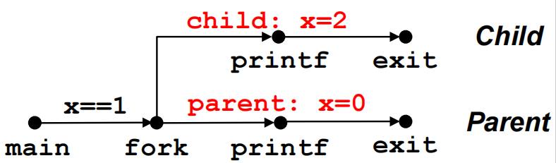

  ```c
  int main() {
      pid_t pid;
      int x = 1;

      pid = fork();          // 创建子进程
      if (pid == 0) {        // 子进程分支
          printf("child : x=%d\n", ++x);
          exit(0);
      }

      /* 父进程分支 */
      printf("parent: x=%d\n", --x);
      exit(0);
  }

  ```

* 两个 `fork` 生成四个进程

  ```c
    void fork2()
    {
      printf("L0\n");
      fork();
      printf("L1\n");
      fork();
      printf("Bye\n");
    }
  ```

  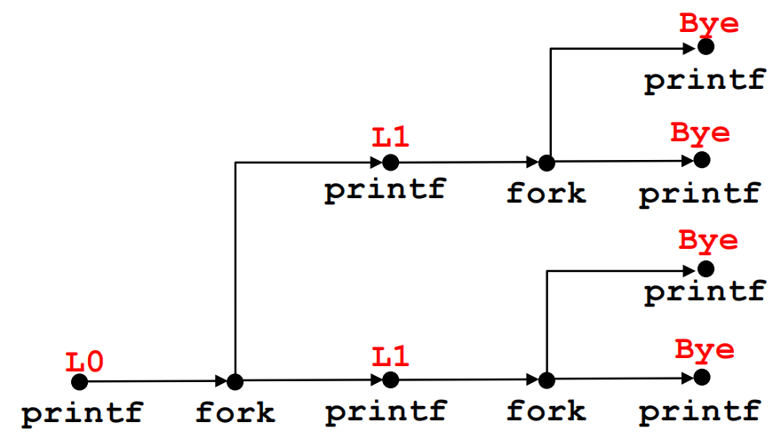

  * `printf` 的执行顺序可通过图分析任意可能的执行序列


---

### 8.4.3 回收子进程（Reaping Child Processes）

**进程终止与僵尸进程**

当一个进程终止（无论原因）时，内核不会立即从系统中删除它。进程会保留在 **终止状态（terminated state）**，直到其父进程将其回收（reap）。

**僵尸进程（Zombie）**：已经终止但尚未被父进程回收的子进程。僵尸进程仍占用系统内存（主要是 PCB 等内核数据结构），但不会占用 CPU。

**孤儿进程（Orphan Process）**：父进程在子进程结束前已经终止，内核会将孤儿进程的父进程设置为 **init 进程（PID = 1）**。init 进程不会终止，它负责收养孤儿进程并回收它们的资源。

---

**waitpid函数**

父进程可以调用 `waitpid` 等待子进程终止或暂停，并回收资源：

```c
#include <sys/types.h>
#include <sys/wait.h>

pid_t waitpid(pid_t pid, int *statusp, int options);
```

* **返回值**：

  * 成功：返回子进程 PID
  * `WNOHANG`：如果没有子进程终止，则返回 0
  * 出错：返回 -1，并设置 `errno`

#### 1. 判定等待集合的成员

* `pid > 0`：等待指定 PID 的子进程
* `pid = -1`：等待集合是由父进程的所有子进程组成
* 其他值：可用于进程组（本书不展开）


#### 2. 修改默认行为

通过将options设置为如下常量的各种组合来修改默认行为：

* `0`：默认，阻塞父进程直到子进程终止
* `WNOHANG`：非阻塞，立即返回
* `WUNTRACED`：等待终止或暂停的子进程
* `WCONTINUED`：等待收到 SIGCONT 信号而恢复运行的子进程
* 可组合使用，如 `WNOHANG | WUNTRACED`

---

#### 3. 检查子进程退出状态

如果 `statusp` 非 NULL，waitpid 会将子进程状态编码到 `*statusp`，可以用宏来解析：

* `WIFEXITED(status)`：子进程正常退出（调用 exit 或 main 返回）
* `WEXITSTATUS(status)`：正常退出的状态码
* `WIFSIGNALED(status)`：因信号终止
* `WTERMSIG(status)`：导致终止的信号编号
* `WIFSTOPPED(status)`：子进程暂停
* `WSTOPSIG(status)`：导致暂停的信号编号
* `WIFCONTINUED(status)`：收到 SIGCONT 恢复运行

---

#### 4. wait 函数

* 简化版 waitpid：

```c
#include <sys/types.h>
#include <sys/wait.h>

pid_t wait(int *statusp);
```

* 等价于 `waitpid(-1, &status, 0)`，等待任意子进程终止。

---

#### 5. 示例分析

父进程创建 N 个子进程，并回收它们（顺序不固定）：

```c
#include "csapp.h"   // CSAPP 提供的封装函数，包括 Fork() 和 unix_error()
#include <errno.h>   // 用于检查 errno 错误码

#define N 2  // 子进程数量

int main() {
    int status, i;
    pid_t pid;

    /* 父进程创建 N 个子进程 */
    for (i = 0; i < N; i++) {
        if ((pid = Fork()) == 0) {  // 子进程
            // 每个子进程用不同的退出码退出
            exit(100 + i);
        }
    }

    /* 父进程回收所有子进程，回收顺序不固定 */
    while ((pid = waitpid(-1, &status, 0)) > 0) {
        if (WIFEXITED(status)) {
            printf("child %d terminated normally with exit status=%d\n",
                   pid, WEXITSTATUS(status));
        } else {
            printf("child %d terminated abnormally\n", pid);
        }
    }

    /* 检查 waitpid 是否因错误结束 */
    if (errno != ECHILD) {
        unix_error("waitpid error");
    }

    // 父进程正常退出
    exit(0);
}

```

可通过存储子进程 PID 并按创建顺序回收来消除不确定性：

```c
#include "csapp.h"   // CSAPP 提供的封装函数，包括 Fork() 和 unix_error()
#include <errno.h>   // 用于检查 errno 错误码

#define N 2  // 子进程数量

int main() {
    int status, i;
    pid_t pid[N], retpid;

    /* 父进程创建 N 个子进程 */
    for (i = 0; i < N; i++) {
        if ((pid[i] = Fork()) == 0) {  // 子进程
            // 每个子进程用不同的退出码退出
            exit(100 + i);
        }
    }

    /* 父进程按创建顺序回收 N 个子进程 */
    i = 0;
    while ((retpid = waitpid(pid[i++], &status, 0)) > 0) {
        if (WIFEXITED(status)) {
            printf("child %d terminated normally with exit status=%d\n",
                   retpid, WEXITSTATUS(status));
        } else {
            printf("child %d terminated abnormally\n", retpid);
        }
    }

    /* 检查 waitpid 是否因错误结束 */
    if (errno != ECHILD) {
        unix_error("waitpid error");
    }

    // 父进程正常退出
    exit(0);
}

```

---

### 8.4.4 让进程休眠（Putting Processes to Sleep）

**sleep 函数**

```c
#include <unistd.h>
unsigned int sleep(unsigned int secs);
```

* 功能：暂停进程指定秒数
* 返回：

  * 0：已完成休眠
  * 剩余秒数：如果被信号打断
* 常用于延迟或定时任务

**pause 函数**

```c
#include <unistd.h>
int pause(void);
```

* 功能：暂停进程，直到收到信号
* 返回值：总是 -1

**示例**：封装 sleep 为 `wakeup` 函数：

```c
unsigned int wakeup(unsigned int secs);
```

* 功能：行为同 sleep，打印实际唤醒时间，例如：

  ```
  Woke up at 4 secs.
  ```


### 8.4.5 加载并运行程序


`execve` 函数**在当前进程的上下文中加载并执行一个新程序**。

```c
#include <unistd.h>
int execve(const char *filename, const char *argv[], const char *envp[]);
//  成功时：函数不返回。失败时：返回 -1（例如找不到指定的文件）。
```

参数说明：
* `filename`：可执行文件路径。
* `argv[]`：参数列表，`argv[0]` 通常是程序名。
* `envp[]`：环境变量列表，格式为 `name=value`，以 NULL 结尾。

**参数与环境变量的存储**

* **参数列表 argv 组织结构**：

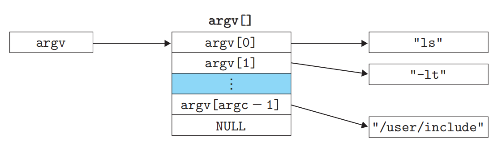

* **环境变量 envp 组织结构**：

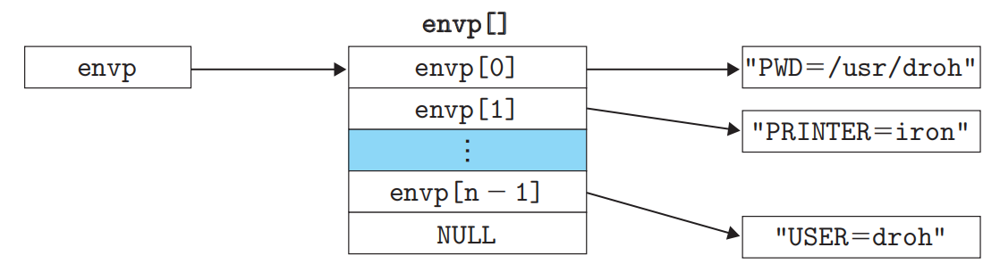


**`execve` 的执行流程**

1. `execve` 加载 `filename`。
2. 启动代码（`libc_start_main`）设置栈，并调用新程序的 `main(argc, argv, envp)`。
3. 用户栈典型结构（从高地址到底地址）：
   * 参数字符串和环境变量字符串。
   * 指向环境变量字符串的指针数组（`envp[]`）。
   * 指向参数字符串的指针数组（`argv[]`）。
   * `libc_start_main` 的栈帧。
   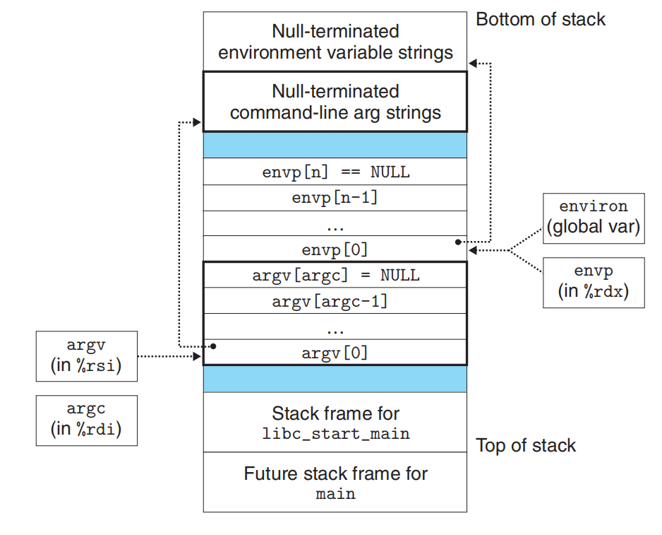

4. `main` 三个参数：

   * `argc`：非 NULL 参数数量。
   * `argv`：参数数组首地址。
   * `envp`：环境变量数组首地址。

**环境变量操作函数**

```c
#include <stdlib.h>
char *getenv(const char *name);       // 返回指向 name 的值，如果不存在返回 NULL
int setenv(const char *name, const char *newvalue, int overwrite); // 设置环境变量
void unsetenv(const char *name);      // 删除环境变量
```

* `setenv`：如果环境变量存在且 `overwrite` 为 0，则不修改；否则替换或新增。
* `unsetenv`：删除指定环境变量。

---

### 8.4.6 使用 `fork` + `execve` 运行程序

**Shell 的基本模型**  
Shell 是一个**交互式应用级程序**，用于代表用户运行其他程序。典型实现包括：`sh`、`csh`、`tcsh`、`ksh`、`bash` 等。

Shell 的核心循环是 **read/evaluate**：
- **Read**：从标准输入读取一行命令；
- **Evaluate**：解析命令并执行相应程序。

**主程序main**

```c
#include "csapp.h"
#define MAXARGS 128

void eval(char *cmdline);
int parseline(char *buf, char **argv);
int builtin_command(char **argv);

int main() {
    char cmdline[MAXLINE];
    while (1) {
        printf("> ");
        Fgets(cmdline, MAXLINE, stdin);
        if (feof(stdin)) exit(0);
        eval(cmdline);  // 评估并执行命令
    }
}
```

**命令求值函数 `eval`**

主要步骤：
1. 调用 `parseline` 解析命令行，构建 `argv`；
2. 检查是否为**内置命令**（如 `quit`）；
3. 若非内置命令，则：
   - 调用 `fork()` 创建子进程；
   - 子进程中调用 `execve()` 加载并运行新程序；
   - 父进程根据是否为后台任务决定是否调用 `waitpid()` 等待。

```c
void eval(char *cmdline) {
    char *argv[MAXARGS];
    char buf[MAXLINE];
    int bg;
    pid_t pid;

    strcpy(buf, cmdline);
    bg = parseline(buf, argv);
    if (argv[0] == NULL) return;  // 忽略空行

    if (!builtin_command(argv)) {
        if ((pid = Fork()) == 0) {        // 子进程
            if (execve(argv[0], argv, environ) < 0) {
                printf("%s: Command not found.\n", argv[0]);
                exit(0);
            }
        }

        // 父进程：前台任务需等待，后台任务不等待
        if (!bg) {
            int status;
            if (waitpid(pid, &status, 0) < 0)
                unix_error("waitfg: waitpid error");
        } else {
            printf("%d %s", pid, cmdline);
        }
    }
}
```

> **注意**：此简单 Shell **不会回收后台子进程**（即存在僵尸进程问题），需借助信号机制解决（后续章节介绍）。

---

**内置命令处理**

```c
int builtin_command(char **argv) {
    if (!strcmp(argv[0], "quit"))  // quit 命令：退出 Shell
        exit(0);
    if (!strcmp(argv[0], "&"))     // 单独的 &（无效命令）
        return 1;
    return 0;  // 非内置命令
}
```

---

**命令行解析函数 `parseline`**

功能：
- 将空格分隔的命令行拆分为 `argv` 数组；
- 若最后一个参数是 `&`，则返回 `1`（表示后台运行），并从 `argv` 中移除 `&`。

```c
int parseline(char *buf, char **argv) {
    char *delim;
    int argc = 0;
    int bg;

    buf[strlen(buf)-1] = ' ';  // 将末尾 '\n' 替换为空格
    while (*buf && (*buf == ' ')) buf++;  // 跳过前导空格

    // 分割参数
    while ((delim = strchr(buf, ' '))) {
        argv[argc++] = buf;
        *delim = '\0';
        buf = delim + 1;
        while (*buf && (*buf == ' ')) buf++;
    }
    argv[argc] = NULL;

    if (argc == 0) return 1;  // 空命令行

    // 检查是否后台运行
    if ((bg = (argv[argc-1][0] == '&')) != 0)
        argv[--argc] = NULL;

    return bg;
}
```

---

**关键概念区分：程序（Program） vs 进程（Process）**

| 概念 | 说明 |
|------|------|
| **程序（Program）** | 存在于磁盘上的可执行文件（代码 + 数据），或内存中的段。是静态的。 |
| **进程（Process）** | 程序的一次**运行实例**，拥有独立的地址空间、PID、文件描述符等。是动态的。 |

- **`fork()`**：在新进程中运行**同一个程序**（复制父进程）；
- **`execve()`**：在**当前进程**中加载并运行**新程序**，替换地址空间，但 PID 不变，继承打开的文件描述符。

> ⚠️ `execve` **不创建新进程**，它只是用新程序覆盖当前进程的内存映像。

## 8.5 信号

**信号（Signal）** 是一个小型消息，用于通知进程系统中发生了某种事件。全部有软件实现

- 类似于 **异常（exception）** 和 **中断（interrupt）**；
- 由 **内核** 发送给进程（有时是应其他进程请求）；
- 每种信号由 **1~30 的小整数 ID** 标识；
- 信号本身只包含：**信号编号** + **“有信号到达”这一事实**，无其他数据。


| ID  | 名称       | 默认动作                     | 触发事件                     |
|-----|------------|------------------------------|------------------------------|
| 2   | `SIGINT`   | 终止进程                     | 用户按下 `Ctrl-C`           |
| 9   | `SIGKILL`  | 终止进程（**不可忽略/捕获**）| `kill -9`                   |
| 11  | `SIGSEGV`  | 终止 + 转储 core             | 段错误（非法内存访问）       |
| 14  | `SIGALRM`  | 终止                         | 定时器到期                   |
| 17  | `SIGCHLD`  | 忽略                         | 子进程终止或停止             |

---

### 8.5.1 信号术语

传送信号到目标进程由如下步骤组成：
发送信号


接收信号：当目的进程被内核强迫以某种方式对信号的发送做出反应

待处理信号：一个发出而未被接收到的信号

阻塞的信号

阻塞的信号可以被接收，但阻塞解除前不会被调用

---

## 二、信号的发送（Sending a Signal）

内核在以下情况发送信号：

1. **检测到系统事件**：
   - 除零错误 → `SIGFPE`
   - 子进程退出 → `SIGCHLD`

2. **其他进程显式请求**：
   - 通过 `kill(pid, signum)` 系统调用；
   - 或命令行工具 `/bin/kill`

### 进程组（Process Group）

- 每个进程属于一个 **进程组**（由 `pgid` 标识）；
- Shell 使用进程组管理前台/后台作业；
- 向 **负 PID** 发送信号 → 发送给整个进程组。

```bash
# 向进程 24818 发送 SIGKILL
/bin/kill -9 24818

# 向进程组 24817 中所有进程发送 SIGKILL
/bin/kill -9 -24817
```

> **注意**：`Ctrl-C` / `Ctrl-Z` 会向 **前台进程组** 中所有进程发送信号：
- `Ctrl-C` → `SIGINT`（终止）
- `Ctrl-Z` → `SIGTSTP`（挂起）

---

## 三、信号的接收（Receiving a Signal）

当内核准备将控制权交还给用户进程时，会检查是否有 **未阻塞的待处理信号**：

- 计算：`pnb = pending & ~blocked`
- 若 `pnb ≠ 0`，则选择最小编号的信号 `k`，强制进程“接收”它；
- 接收信号会触发以下行为之一：

1. **忽略**（如 `SIGCHLD` 默认）
2. **终止进程**（可能带 core dump）
3. **执行用户定义的信号处理函数（handler）** ← “捕获信号”

> 信号处理函数的执行类似于硬件中断处理：  
> 1. 保存当前上下文 → 2. 执行 handler → 3. 恢复原程序流

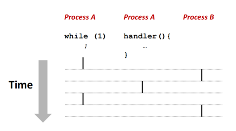

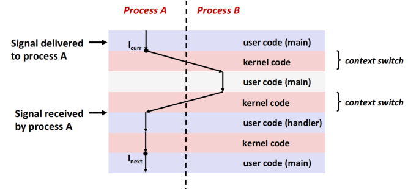
---

## 四、待处理（Pending）与阻塞（Blocked）信号

- **待处理（Pending）**：已发送但尚未接收的信号；
  - 每种信号类型 **最多只有一个待处理实例**（**信号不排队！**）；
  - 重复发送同类型信号会被丢弃。

- **阻塞（Blocked）**：进程可选择暂时屏蔽某些信号；
  - 阻塞的信号仍可被发送，但不会被接收，直到解除阻塞；
  - 内核为每个进程维护两个位向量：
    - `pending`：哪些信号待处理
    - `blocked`：哪些信号被阻塞（即“信号掩码”）

可通过 `sigprocmask()` 设置/清除阻塞信号集。

---

## 五、安装信号处理函数

使用 `signal(signum, handler)` 安装处理函数：

```c
void sigint_handler(int sig) {
    printf("Can't stop me with Ctrl-C!\n");
    exit(0);
}

int main() {
    signal(SIGINT, sigint_handler); // 安装 handler
    pause(); // 等待信号
}
```

`handler` 可为：
- `SIG_IGN`：忽略信号
- `SIG_DFL`：恢复默认行为
- 函数指针：自定义处理逻辑

> ⚠️ **注意**：传统 `signal()` 在不同 Unix 系统行为不一致（如是否自动恢复为默认、是否阻塞同类信号等）。

**推荐使用 `sigaction`**（见下文“可移植信号处理”）。

---

## 六、安全编写信号处理函数的准则（Safe Signal Handling）

信号处理函数与主程序并发执行，共享全局数据，极易引发竞态条件。编写时必须遵循：

### G0. 尽可能简单
> 例如：仅设置一个标志位后返回。

### G1. 只调用 **异步信号安全（async-signal-safe）** 函数
- **安全**：`_exit`, `write`, `kill`, `waitpid`, `sleep`
- **不安全（禁止使用）**：`printf`, `malloc`, `exit`, `sprintf`

> **原因**：`printf` 等函数内部使用全局缓冲区，可能被信号中断导致状态损坏。

### G2. 保存/恢复 `errno`
```c
int olderrno = errno;
// ... handler 逻辑 ...
errno = olderrno;
```

### G3. 访问共享数据时临时阻塞所有信号
```c
sigset_t mask, prev;
Sigfillset(&mask);
Sigprocmask(SIG_BLOCK, &mask, &prev);
// 访问共享变量
Sigprocmask(SIG_SETMASK, &prev, NULL);
```

### G4. 全局变量声明为 `volatile`
防止编译器将其缓存在寄存器中，导致 handler 修改后主程序看不到更新。

### G5. 全局标志使用 `volatile sig_atomic_t`
- 这是 POSIX 保证原子读写的最小类型；
- 适用于“设置/检查”类标志（如 `flag = 1`），**不可用于 `flag++`**。

---

## 七、安全输出：使用 SIO 库

由于 `printf` 不安全，CS:APP 提供安全 I/O 库（`csapp.c`）：

```c
void sigint_handler(int sig) {
    Sio_puts("Can't stop the bomb!\n");
    sleep(2);
    Sio_puts("OK. :-)\n");
    _exit(0); // 注意：用 _exit 而非 exit！
}
```

---

## 八、正确处理 SIGCHLD（回收子进程）

### ❌ 错误示例（信号不排队！）：
```c
void child_handler(int sig) {
    wait(NULL); // 仅回收一个子进程
    ccount--;
}
```
→ 若多个子进程同时退出，可能只触发一次 `SIGCHLD`，导致部分僵尸进程未被回收。

### ✅ 正确做法：**循环调用 `waitpid`**
```c
void child_handler(int sig) {
    pid_t pid;
    while ((pid = waitpid(-1, NULL, 0)) > 0) {
        ccount--;
        Sio_puts("Reaped child ");
        Sio_putl((long)pid);
    }
    if (errno != ECHILD) Sio_error("waitpid error");
}
```

---

## 九、可移植信号处理：使用 `sigaction`

为避免不同系统行为差异，封装 `Signal` 函数：

```c
handler_t *Signal(int signum, handler_t *handler) {
    struct sigaction action, old_action;
    action.sa_handler = handler;
    sigemptyset(&action.sa_mask);     // 自动阻塞同类信号
    action.sa_flags = SA_RESTART;     // 系统调用被中断后自动重启
    if (sigaction(signum, &action, &old_action) < 0)
        unix_error("Signal error");
    return old_action.sa_handler;
}
```

---

## 十、避免竞态条件：同步主程序与信号处理

### 问题场景（Shell 添加作业）：
```c
// 危险！子进程可能在 addjob() 前就退出
if ((pid = Fork()) == 0) {
    Execve(...);
}
addjob(pid); // 若子进程已退出，作业未被记录就可能丢失
```

### 解决方案：**在 fork 前阻塞 SIGCHLD**
```c
Sigprocmask(SIG_BLOCK, &mask_one, &prev_one); // 阻塞 SIGCHLD
if ((pid = Fork()) == 0) {
    Sigprocmask(SIG_SETMASK, &prev_one, NULL); // 子进程解除阻塞
    Execve(...);
}
// 父进程：确保 addjob 在子进程可能退出前完成
Sigprocmask(SIG_BLOCK, &mask_all, NULL);
addjob(pid);
Sigprocmask(SIG_SETMASK, &prev_one, NULL); // 解除阻塞
```

---

## 十一、高效等待信号：使用 `sigsuspend`

### ❌ 低效轮询：
```c
while (!pid) ; // 忙等待，浪费 CPU
```

### ❌ 有竞态的 `pause()`：
```c
// 信号可能在 pause() 前到达，导致永久阻塞
sigprocmask(SIG_BLOCK, &mask, &prev);
if (!pid) pause(); // 危险！
```

### ✅ 原子等待：`sigsuspend`
```c
// 原子地：解除阻塞 + 进入睡眠，直到信号到达
while (!pid)
    Sigsuspend(&prev);
```

> `sigsuspend` 的效果等价于：
> ```c
> sigprocmask(SIG_SETMASK, &mask, &old);
> pause(); // 但整个操作是原子的
> sigprocmask(SIG_SETMASK, &old, NULL);
> ```

---

## 总结

| 概念 | 要点 |
|------|------|
| **信号本质** | 异步通知机制，类似中断 |
| **发送方式** | 内核自动 / `kill()` / 键盘（Ctrl-C/Z）|
| **接收时机** | 内核从异常返回用户态前检查 |
| **关键限制** | 信号不排队 → 不能用于计数 |
| **安全 handler** | 只用 async-signal-safe 函数，用 `volatile sig_atomic_t`，保护共享数据 |
| **正确回收子进程** | `SIGCHLD` handler 中循环 `waitpid` |
| **避免竞态** | 在关键区阻塞信号 |
| **高效等待** | 用 `sigsuspend` 而非轮询或 `pause` |

> 信号是 Unix 进程控制的核心机制，但也因其异步性和并发性而极易出错。**谨慎设计、严格遵循安全准则**是编写可靠程序的关键。


## 8.6 非本地跳转


