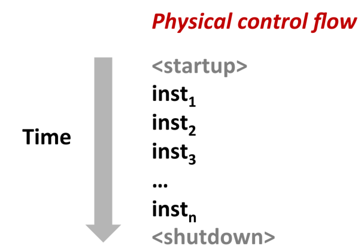

# Lecture 8 异常控制流

## 8.0 概述

### 8.0.1 控制流

**控制流（Control Flow）**：PC（程序计数器）依次指向指令地址 a₀ → a₁ → …。平滑的顺序执行代表指令地址连续。


### 8.0.2 控制转移

**控制转移**：程序计数器（PC）从地址 aₖ 跳转到 aₖ₊₁ 的动作。

- 已知的两类控制流改变方式（传统控制流）
  - **跳转与分支（jumps and branches）**: 由程序内部条件触发，用于基本流程控制。
  - **调用与返回（call and return）**:用于过程调用，遵循调用栈结构。
  - 均用于**响应程序内部状态的变化**。


仅依赖上述机制，无法构建一个完整、可响应外部世界的现代系统，因为程序无法有效处理**系统状态的变化**，例如：

* 从磁盘或网络适配器到达的数据
* 指令发生除零错误（divide-by-zero）
* 用户按下 Ctrl-C
* 系统定时器到期（timer interrupt）

这些事件均发生在程序逻辑之外，程序变量无法捕获所有状态变化；系统事件（定时器、I/O、中断、进程终止等）必须触发程序控制流突变。

### 8.0.3 异常控制流

为处理上述“系统级事件”，系统必须具备一种能够**打断当前执行流**并跳转到特定处理逻辑的机制，即：**异常控制流（ECF）**

**ECF（异常控制流）**：非顺序执行的突变跳转，由硬件、操作系统、应用共同产生。

 异常控制流存在于**计算机系统的各个层次**。

低层机制（Low-level mechanisms）: **异常（Exceptions）**

* 当系统事件发生（即系统状态发生变化）时，引起控制流的改变。
* 由**硬件**与**操作系统软件**协同实现。

高层机制（Higher-level mechanisms）
  
* 进程上下文切换（Process Context Switch）: 由操作系统软件与硬件定时器共同实现。
* 信号（Signals）:由操作系统软件实现。
* 非局部跳转（Nonlocal jumps）
  * setjmp() 与 longjmp()
  * 由 C 语言运行库（C runtime library）实现。

---

**总结**

- **学习 ECF 的重要性**

1. 理解 OS 的基础机制：I/O、进程、虚拟内存均依赖 ECF。
2. 理解系统调用：应用与 OS 通信的唯一入口（trap）。
3. 能编写系统类工具：Shell、Web Server 等都依赖 ECF（fork/exec/wait/signal）。
4. 理解并发：异常处理、线程、信号触发的中断均属于并发的表现。
5. 理解软件异常：try/catch/throw 底层依赖非局部跳转，是 ECF 的高级形式。

- **本章内容结构**

1. **异常（Exception）**：硬件/OS 交界处
2. **系统调用（System Call）**：异常的一种，应用 → OS
3. **进程（Process）与信号（Signal）**：应用/OS 交界处
4. **非局部跳转（Nonlocal Jumps）**：应用层 ECF

---

## 8.1 异常

- **定义**：由处理器状态变化（如除零、非法指令）或外部事件（如键盘中断）触发的内核转跳。
- 分为三类：
  - **Traps（陷阱）**：有意触发（如系统调用 syscall），执行完后返回下一条指令。
  - **Faults（故障）**：意外但可恢复（如缺页 Page Fault），可能重试当前指令。
  - **Aborts（终止）**：严重错误（如非法指令），直接终止程序。

> 举例：访问非法内存 → 触发 Page Fault → 若地址无效 → 内核发送 SIGSEGV → 程序崩溃。

### 8.1.1 异常处理

---

### 8.1.2 异常类别

---

### 8.1.3 Linux/x86-64 系统中的异常

---


## 8.2 进程


### 8.2.1 逻辑控制流

---

### 8.2.2 并发流

---

### 8.2.3 私有地址空间

---

### 8.2.4 用户模式和内核模式

---

### 8.2.5 上下文切换

---

## 8.3 系统调用错误处理

---

## 8.4 进程控制

### 8.4.1 获取进程ID

---

### 8.4.2 创建和终止进程

---

### 8.4.3 回收子进程

---

### 8.4.4 让进程休眠

---

### 8.4.5 加载并运行程序

---

### 8.4.6 利用 fork 和 execve 运行程序

---


## 第一部分：异常与进程（14-ecf-procs.pdf）

## Control Flow


### 1. 异常控制流（ECF）简介


### 2. 异常（Exceptions）


### 3. 进程（Process）
- **进程 = 正在运行的程序实例**。
- 提供两个关键抽象：
  - **逻辑控制流（Logical Control Flow）**：看似独占 CPU（通过上下文切换实现并发）。
  - **私有地址空间（Private Address Space）**：看似独占内存（通过虚拟内存实现）。

### 4. 进程控制
#### (1) 创建进程：`fork()`
- **特点**：调用一次，返回两次。
  - 子进程返回 0
  - 父进程返回子进程 PID
- 子进程几乎完全复制父进程（地址空间、打开的文件描述符等），但拥有独立 PID。

```c
// fork 示例
int main() {
    pid_t pid;
    int x = 1;
    pid = fork(); // 调用一次
    if (pid == 0) {          // 子进程
        printf("child: x=%d\n", ++x);
        exit(0);
    }
    printf("parent: x=%d\n", --x); // 父进程
    exit(0);
}
// 输出（顺序不确定）：
// parent: x=0
// child: x=2
```

#### (2) 终止进程
- 三种方式：
  - 从 `main` 返回
  - 调用 `exit(int status)`
  - 收到终止信号（如 SIGINT）

#### (3) 回收子进程（Reaping）
- 子进程终止后若未被回收 → 成为 **僵尸进程（Zombie）**，仍占用内核资源。
- 父进程调用 `wait()` 或 `waitpid()` 回收子进程，获取其退出状态。

```c
// wait 示例
void fork9() {
    if (fork() == 0) {
        printf("HC: hello from child\n");
        exit(0);
    } else {
        printf("HP: hello from parent\n");
        int status;
        wait(&status); // 阻塞等待子进程
        printf("CT: child has terminated\n");
    }
    printf("Bye\n");
}
```

#### (4) 加载新程序：`execve()`
- 用新程序**替换当前进程的代码、数据、堆栈**，但保留 PID、打开文件、信号上下文。
- 调用后**不返回**（除非出错）。

```c
if ((pid = fork()) == 0) {
    // 子进程执行 /bin/ls -lt /usr/include
    char *myargv[] = {"/bin/ls", "-lt", "/usr/include", NULL};
    if (execve(myargv[0], myargv, environ) < 0) {
        printf("Command not found.\n");
        exit(1);
    }
}
```

---

## 第二部分：信号与非局部跳转（15-ecf-signals.pdf）

### 1. 为什么需要信号？
- 简单 Shell 无法回收**后台作业（background jobs）** → 成为僵尸。
- **解决方案**：使用 **信号（Signals）** 通知父进程子进程已终止。

### 2. 信号基础
- **信号 = 小整数 ID（1~30）**，表示某类事件。
- 常见信号：
  - `SIGINT (2)`：Ctrl-C
  - `SIGKILL (9)`：强制终止（不可捕获/忽略）
  - `SIGSEGV (11)`：段错误
  - `SIGCHLD (17)`：子进程终止或停止（默认忽略）

### 3. 信号的发送与接收
- **发送**：
  - 内核自动发送（如子进程退出）
  - 进程调用 `kill(pid, sig)` 或使用 `/bin/kill`
  - 键盘：Ctrl-C → SIGINT；Ctrl-Z → SIGTSTP
- **接收**：
  - 忽略（`SIG_IGN`）
  - 终止（默认）
  - **捕获（Catch）**：执行用户定义的 **信号处理函数（signal handler）**

```c
// SIGINT 处理示例（不安全！）
void sigint_handler(int sig) {
    printf("So you think you can stop the bomb with ctrl-c?\n");
    sleep(2);
    printf("OK. :-)\n");
    exit(0);
}
int main() {
    signal(SIGINT, sigint_handler);
    pause(); // 等待信号
}
```

⚠️ **问题**：`printf`、`exit` 等**不是 async-signal-safe** 函数，不能在 handler 中安全使用！

### 4. 安全信号处理准则（G0–G5）
- **G0**：handler 尽量简单（如只设置全局 flag）
- **G1**：只调用 **async-signal-safe** 函数（如 `write`, `_exit`, `kill`）
  - ❌ 不安全：`printf`, `malloc`, `exit`
- **G2**：在 handler 入口/出口保存/恢复 `errno`
- **G3**：访问共享数据时临时阻塞信号
- **G4/G5**：全局变量用 `volatile`；标志变量用 `volatile sig_atomic_t`

> 替代方案：使用 CS:APP 提供的 **SIO（Safe I/O）库**，如 `Sio_puts()`、`Sio_putl()`

```c
// 安全的 SIGINT 处理
void sigint_handler(int sig) {
    Sio_puts("So you think...\n");
    sleep(2);
    Sio_puts("OK. :-)\n");
    _exit(0); // 注意：用 _exit() 而非 exit()
}
```

### 5. 信号的阻塞与待处理
- 每个进程有：
  - `pending` 位图：哪些信号已发送但未处理
  - `blocked` 位图（信号掩码）：哪些信号被阻塞（通过 `sigprocmask()` 设置）
- **关键特性**：**信号不排队**！同一类型信号多次发送 → 只保留一个 pending。

> 例：多个子进程同时退出 → SIGCHLD 只 pending 一次 → handler 必须用 `while(wait(...))` 回收所有子进程！

```c
// 正确的 SIGCHLD handler
void child_handler(int sig) {
    pid_t pid;
    while ((pid = waitpid(-1, NULL, 0)) > 0) {
        ccount--;
        Sio_puts("Reaped child ");
        Sio_putl((long)pid);
        Sio_puts("\n");
    }
}
```

### 6. 竞态条件与同步
- **问题**：父进程在 `fork()` 后立即 `addjob()`，但子进程可能先执行 → job list 尚未添加就收到 SIGCHLD！
- **解决方案**：在 `fork()` 前阻塞 SIGCHLD，子进程解除阻塞，父进程 addjob 后再解除。

```c
// procmask2.c：避免 race
Sigprocmask(SIG_BLOCK, &mask_one, &prev_one); // 阻塞 SIGCHLD
if ((pid = Fork()) == 0) {
    Sigprocmask(SIG_SETMASK, &prev_one, NULL); // 子进程解除
    Execve(...);
}
addjob(pid); // 父进程安全添加
Sigprocmask(SIG_SETMASK, &prev_one, NULL); // 父进程解除
```

### 7. 等待信号：`sigsuspend()`
- 替代忙等待（`while(!flag);`）的高效方式。
- 原子地：**解除阻塞 + 进入睡眠**，直到信号到达。

```c
Sigprocmask(SIG_BLOCK, &mask, &prev); // 阻塞 SIGCHLD
pid = 0;
while (!pid)
    Sigsuspend(&prev); // 原子解除阻塞并等待信号
```

### 8. 非局部跳转：`setjmp` / `longjmp`
- 允许从深层函数直接跳回上层（绕过正常 call/return）。
- 常用于错误恢复。

```c
jmp_buf buf;

void foo() {
    if (error1) longjmp(buf, 1);
    bar();
}
void bar() {
    if (error2) longjmp(buf, 2);
}

int main() {
    switch (setjmp(buf)) {
        case 0: foo(); break;
        case 1: printf("error1\n"); break;
        case 2: printf("error2\n"); break;
    }
}
```

> ⚠️ 限制：只能跳转到**尚未返回**的函数栈帧中。

---

## 总结
| 机制 | 作用 | 关键点 |
|------|------|--------|
| **异常** | 硬件/OS 响应事件 | Traps/Faults/Aborts |
| **进程** | 程序运行实例 | fork/execve/wait |
| **信号** | 进程间异步通知 | handler 安全性、阻塞、不排队 |
| **非局部跳转** | 异常控制流 | setjmp/longjmp，注意栈有效性 |

> 掌握 ECF 是理解 Shell、服务器、并发程序的基础！

--- 

如需对某一部分深入展开（如 `sigaction` vs `signal`、进程组等），欢迎继续提问！