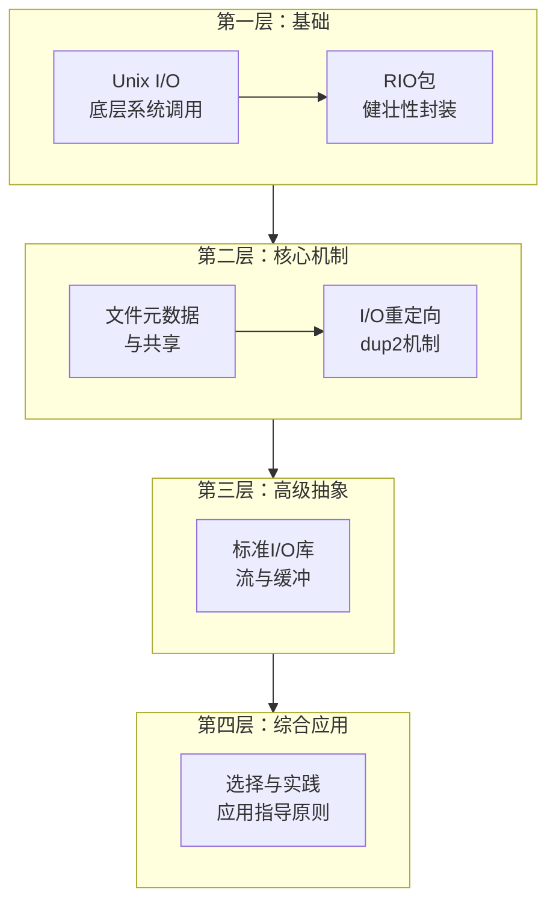

# Lecture 15 系统级 IO

## 一、第 10 章整体递进关系（Why this order）

第 10 章不是并列知识点，而是一条**"逐层抽象 + 逐步工程化"**的 I/O 学习链路。

### 逻辑主线与递进关系

**逻辑主线**：内核最原始接口 → 真实世界的问题 → 工程化解决方案 → 高级抽象 → 使用取舍

**第 10 章四层递进结构图**

**第 10 章递进关系总览表**

| 学习阶段 | 教材小节 | 角色定位 | 核心问题/目的 | 关键内容 |
|---------|---------|---------|-------------|---------|
| **第 1 阶段** | 10.1–10.4 Unix I/O | 机制层（Mechanism） | **I/O 的本质是什么** | • 揭示 I/O 的底层本质：文件描述符、系统调用、字节流抽象 • 文件描述符的概念 • 系统调用的直接使用 • 最底层、最直接的 I/O 接口 |
| **第 2 阶段** | 10.5 RIO | 工程补丁层（Engineering Fix） | **如何处理不足值（short counts）等实际问题** | • 发现 Unix I/O 的现实问题：short counts、信号中断、线程安全 • 处理 short counts 的健壮性 • 线程安全性 • 缓冲优化 • 网络编程中的实用性 |
| **第 3 阶段** | 10.6–10.9 Metadata / Sharing / Redirection | 系统语义层（Semantics） | **I/O 如何与系统其他部分协作** | • 深入理解 I/O 与进程、文件系统的交互 • 文件元数据和系统调用 • 进程间文件共享机制 • I/O 重定向的实现原理 • Shell 的工作机制 |
| **第 4 阶段** | 10.10 Standard I/O | 抽象层（Abstraction） | **为什么还需要 stdio？它能带来什么好处？** | • 理解更高级的抽象：缓冲、格式化、流 • 缓冲机制的效率提升 • 格式化 I/O 的便利性 • 高级抽象带来的易用性 • 适用场景和局限性 |
| **第 5 阶段** | 10.11 Closing Remarks | 决策层（Trade-off） | **如何在实际编程中做出正确的 I/O 函数选择** | • 综合应用：不同场景下的选择策略 • Unix I/O vs Standard I/O vs RIO • 性能、安全性、易用性的权衡 • 实际应用中的最佳实践 |

---

## 二、PPT 与教材第10章对应关系及核心要点

| PPT 16 大纲 | 教材第10章对应章节 | 核心要点 |
|------------|------------------|---------|
| **Unix I/O** | 10.1 Unix I/O 10.2 文件 10.3 打开和关闭文件 10.4 读和写文件 | • Unix I/O 是最底层的 I/O 接口 • 所有输入/输出设备都建模为文件 • 文件描述符（file descriptor）是内核返回的小整数，用于标识打开的文件 • 标准文件描述符：0 (stdin), 1 (stdout), 2 (stderr) • 基本操作：open(), read(), write(), close() • 提供统一的接口访问不同类型的I/O设备 |
| **RIO (Robust I/O) Package** | 10.5 用 RIO 包健壮的读写 | • RIO 提供了健壮的、线程安全的 I/O 函数 • 自动处理不足值（short counts）问题 • 无缓冲 I/O：`rio_readn()`, `rio_writen()` - 适用于二进制数据 • 带缓冲 I/O：`rio_readlineb()`, `rio_readnb()` - 适用于文本数据 • 内部缓冲区机制提高读取效率 • 处理信号中断和部分读/写的情况 |
| **Metadata, Sharing, and Redirection** | 10.6 读取文件元数据 10.7 读取目录内容 10.8 共享文件 10.9 I/O重定向 | • **元数据**：通过 `stat()` 和 `fstat()` 获取文件信息（大小、类型、权限等） • **共享文件**：理解描述符表、文件表、v-node表的三层结构 • fork() 后子进程继承父进程的文件描述符 • 同一文件可以被多个描述符引用（文件共享机制） • **I/O重定向**：使用 `dup2()` 函数实现重定向 • Shell 通过重定向实现 `>` 和 `<` 操作 |
| **Standard I/O** | 10.10 标准 I/O | • C 标准库提供的更高级的 I/O 函数 • 流（stream）抽象：`FILE*` 类型 • 使用 `fopen()`, `fread()`, `fwrite()`, `fclose()` 等函数 • 自动缓冲机制（全缓冲、行缓冲、无缓冲） • 格式化 I/O：`printf()`, `scanf()` 等 • 不能用于网络套接字（因为缓冲机制可能导致问题） • 适合处理文本文件 |
| **Closing Remarks** | 10.11 该使用哪些 I/O 函数 | • **选择原则**：   - Unix I/O：网络编程、二进制文件、需要精确控制   - Standard I/O：文本文件、磁盘文件、需要格式化I/O   - RIO：网络编程中的健壮 I/O，处理文本和二进制数据 • **性能考虑**：Standard I/O 的缓冲机制可能带来性能提升 • **线程安全**：Standard I/O 函数是线程安全的 • **信号处理**：Standard I/O 函数可能被信号中断，需要特殊处理 |

