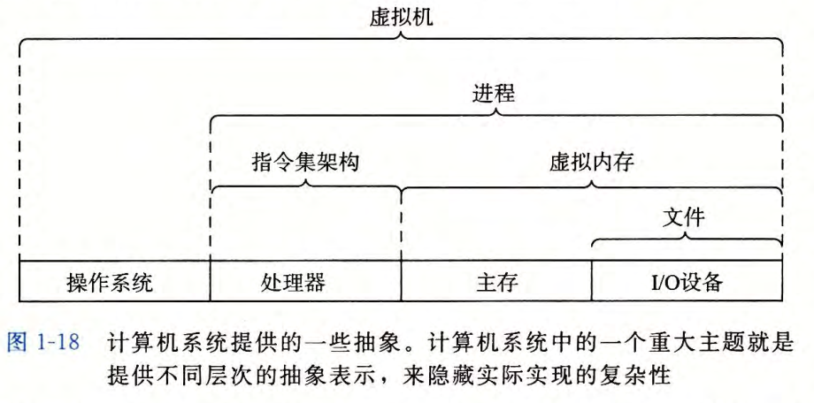

# 01. 计算机系统漫游

## 1.0 总结

- 计算机系统由硬件和软件系统组成，二者协作运行应用程序
- 计算机内部信息被表示成位
- 处理器读取并解释存放在主存里的二进制指令。
- 为了提高计算机运行速度，系统中存储设备被划分为层次结构
- 操作系统内核是应用程序和硬件之间的媒介，提供了三个基本抽象
  - 文件是对 I/0 设备的抽象；
  - 虚拟内存是对主存和磁盘的抽象；
  - 进程是处理器、主存和 I/0 设备的抽象。

## 1.1 信息就是上下位

以`hello`程序为例

> **源程序 hello.c**

源程序实际上就是一个由值 0 和 1 组成的位（又称
为比特）序列， 8 个位被组织成一组，称为**字节**。每个字节表示程序中的某些文本字符。

大部分的现代计算机系统都使用 `ASCII`标准来表示文本字符，这种方式实际上就是用一个唯一的单字节大小的整数值气来表示每个字符

如下所示为hello.c程序的ASCII码表示

```txt
#   i   n   c  l   u   d   e  SP <  s   t   d   i   o   .
35 105 110 99 108 117 100 101 32 60 115 116 100 105 111 46
h   >  \n \n i   n   t   SP m   a  i   n   (  )  \n {
104 62 10 10 105 110 116 32 109 97 105 110 40 41 10 123
\n SP SP SP SP p   r   i   n   t   f   (  "  h   e   l
10 32 32 32 32 112 114 105 110 116 102 40 34 104 101 108
l   o   ,  SP  w  o   r   l   d   \  n   "  )  ;  \n SP
108 111 44 32 119 111 114 108 100 92 110 34 41 59 10 32
SP SP SP r   e   t   u   r   n   SP 0  ;  \n }   \n
32 32 32 114 101 116 117 114 110 32 48 59 10 125 10
```

只由 ASCII 字符构成的文件称为**文本文件**，所有其他文件都称为**二进制文件** 。

> **基本思想**

系统中所有的信息 包括磁盘文件、内存中的程序、内存中存放的用户数据以及网络上传送的数据，都是由一串比特表示的。区别唯一的方法是读取到数据对象时的上下文。

## 1.2 程序被其他程序翻译成不同的格式

在Unix系统上，源文件到目标文件的转化是由*编译器驱动程序*完成的：


```shell
# 读取源文件程序hello.c 翻译成一个可执行的目标文件
linux > gcc -o hello hello.c
```

源文件翻译为可执行目标文件的四个阶段：

- 预处理阶段(预处理器)：预处理器 (cpp) 根据以字符＃开头的命令，读取头文件内容，并插入原始的 C 程序，得到`.i`作为文件扩展名。
- 编译阶段(编译器)：编译器 (eel) 将文本文件` hello.i` 翻译成文本文件 `hello.s`, 它包含一个汇编语言程序。
- 汇编阶段(汇编器)：汇编器 (as) 将 `hello.s` 翻译成机器语 言指令，把这些指令打包成一种叫做可重定位目标程序 (relocatable object program) 的格式，并将结果保存在目标文件 `hello.o` 中。
- 链接阶段(链接器):程序中`printf` 函 数 存在于一个名为 `printf.o` 的单独的预编译好了的目标文件中，而这个文件必须以某种方式合并到我们的 `hello.o` 程序中 。 链接器 (Id) 就负责处理这种合并。 结果就得到 hello 文件，它是一个可执行目标文件（或者简称为可执行文件），可以被加载到内存中，由系统执行。

## 1.3 了解编译系统如何工作是大有益处的

- 优化程序性能
- 理解链接时出现错误
- 避免安全漏洞

## 1.4 处理器读并解释存储在内存中的指令

### 1.4.1 系统的硬件组成


> **总线**

携带信息字节并负责在各个部件间传递。通常总线被设计成传送定长的字节块，也就是**宇 (word)** 。字中的**字节数（即字长）是一个基本的系统参数**，各个系统中都不尽相同。现在的大多数机器字长要么是 4 个字节 (32 位），要么是 8 个字节 (64 位）

> **I/O设备**

I/0( 输入／输出）设备是系统与外部世界的联系通道。如：键盘、鼠标、显示器、磁盘等。

每个 I/0 设备都通过一个控制器或适配器与 I/0 总线相连。控制器和适配器的区别在于：

- 控制器：是 I/0 设备本身或者系统的主印制电路板（通常称作
主板）上的芯片组
- 适配器：是一块插在主板插槽上的卡。

> **主存**

主存是一个临时存储设备，在处理器执行程序时，用来存放程序和程序处理的数据。

- 从物理角度：DRAM芯片组成
- 从逻辑角度：存储器是一个线性的字节数组，每个字节都有其唯一的地址（数组索引）

> **处理器**

中央处理单元 (CPU), 简称处理器，是解释（或执行）存储在主存中指令的引擎。**处理器的核心**是程序计数器 (PC) 。

处理器看上去是按照一个非常简单的指令执行模型来操作的，**这个模型是由指令集架构决定的**。在这个模型中，指令按照严格的顺序执行，而执行一条指令包含执行一系列的步骤。

- 处理器从PC指向的内存处读取指令
- 解释指令中的位
- 执行该指令指示的简单操作
- 更新 PC, 使其指向下一条指令，而这条指令并不一定和在内存中刚刚执行的指令相邻。

上述操作围绕下列元素进行：

- 主存
- 寄存器：寄存器文件是一个小的存储设备，由 一 些单个字长的寄存器组成，每个寄存器都有唯一的名字。
- ALU：计算新的数据和地址值

CPU 在指令的要求下可能会执行如下操作：

- 加载
- 存储
- 操作
- 跳转

### 1.4.2 运行hello程序

- 当我们在键盘上输入字符串`"./hello"` 后， shell 程序将字符逐一读入寄存器，再把它存放到内存中
- shell 执行一系列指令来加载可执行的 hello 文件，这些指令将 hello 目标文件中的代码和数据从磁盘复制到主存
- 目标文件hello中的代码和数据被加载到主存，处理器开始执行hello 程序的 main 程序中的机器语言指令

## 1.5 高速缓存至关重要

高速缓存存储器 (cache memory, 简称为 cache 或高速缓存），作为暂时的集结区域，存放处理器近期可能会需要的信息

Ll 和 L2 高速缓存是用一种叫做**静态随机访问存储器 (SRAM)**的硬件技术实现的。比较新的、处理能力更强大的系统甚至有 三级高速缓存： Ll 、 L2 和L3。

## 1.6 存储设备形成层次结构

**存储器层次结构的主要思想**是上一层的存储器作为低 一 层存储器的高速缓存。因此，寄存器文件就是 Ll 的高速缓存， Ll 是 L2 的高速缓存， L2 是 L3 的高速缓存， L3 是主存
的高速缓存，而主存又是磁盘的高速缓存。


## 1.7 操作系统管理硬件

操作系统看成是应用程序和硬件之间插入的一层软件


**操作系统的两个基本功能：**

- 防止硬件被应用程序滥用
- 向应用程序提供简单一致的机制来控制复杂而又通常大不相同的低级硬件设备。

**操作系统提供的抽象表示：**


### 1.7.1 进程

**进程**是操作系统对一个正在运行的程序的一种抽象。在一个系统上可以同时运行多个进程，而每个进程都好像在独占地使用硬件

**并发运行**说一个进程的指令和另一个进程的指令是交错执行的

**上下文**：操作系统保持跟踪进程运行所需的所有状态信息，这种状态就是上下文。

**上下文切换**：当操作系统决定要把控制权从当前进程转移到某个新进程时，就会进行上下文切换，即保存当前进程的上下文、恢复新进程的上下文，然后将控制权传递到新进程。

从一个进程到另一个进程的转换是由操作系统内核 (kernel) 管理的。


### 1.7.2 线程

一个进程实际上可以由多个称为**线程的执行单元组成**，每个线程都运行在进程的上下文中，并共享同样的**代码和全局数据**

### 1.7.3 虚拟内存

**虚拟内存**是一个抽象概念，它为每个进程提供了一个假象，即每个进程都在独占地使用主存。每个进程看到的内存都是一致的，称为**虚拟地址空间**

Linux内存的虚拟空间地址


- **程序代码和数据**。对所有的进程来说，代码是从同 一 固定地址开始，紧接着的是和 C 全局变量相对应的数据位置。代码和数据区是直接按照可执行目标文件的内容初始化的，在示例中就是可执行文件 hello 。
- **堆**。代码和数据区后紧随着的是运行时堆。代码和数据区在进程一开始运行时就被指定了大小，与此不同，当调用像 malloc 和 free 这样的 C 标准库函数时，堆可以在运行时动态地扩展和收缩。
- **共享库**。大约在地址空间的中间部分是一块用来存放像 C 标准库和数学库这样的共享库的代码和数据的区域。共享库的概念非常强大，也相当难懂。
- **栈**。位于用户虚拟地址空间顶部的是用户栈，编译器用它来实现函数调用。和堆一样，用户栈在程序执行期间可以动态地扩展和收缩 。 特别地，每次我们调用一个函数时，栈就会增长；从一个函数返回时，栈就会收缩。
- **内核虚拟内存**。地址空间顶部的区域是为内核保留的。不允许应用程序读写这个区域的内容或者直接调用内核代码定义的函数 。 相反，它们必须调用内核来执行这些操作。

### 1.7.4 文件

文件就是字节序列，仅此而已。每个 I/0 设备，包括磁盘、键盘、显示器，甚至网络，都可以看成是文件。文件向应用程序提供了一个统一的视图，来看待系统中可能含有的所有各式各样的 I/O设备

### 1.7.5 网络

从 一 个单独的系统来看，网络可视为一个I / 0 设备

## 1.8 系统之间利用网络通信

## 1.9 重要主题

### 1.9.1 Amdahl定律

该**定律的主要思想**，当我们对系统的某个部分加速时，其对系统整体性能的影响取决于该部分的重要性和加速程度。若系统执行某应用程序需要时间为 $T_{old}$ 。 假设系统某部分所需执行时间与该时间的比例为 $\alpha$, 而该部分性能提升比例为 $k$ 。即该部分初始所需时间为 $\alpha T_{old}$, 现在所
需时间为 $(\alpha T_{old}) /k$ 。因此，总的执行时间应为$T_{new} = (1-\alpha) T_{o1d} + (\alpha T_{old}) / k = T_{old}[(1-\alpha) +\alpha/ k]$
由此，可以计算加速比$S = T_{old} / T_{new}$ 为
$s = (1-\alpha) +\alpha/ k$

### 1.9.2 并发和并行

> **线程级并发**

构建在进程这个抽象之上，我们能够设计出同时有多个程序执行的系统，这就导致了并发 。 使用线程，我们甚至能够在**一个进程中执行多个控制流。**

**多核处理器：**

微处理器芯片有 4 个 `CPU` 核，每个核都有自己的 L1 和
L2 高速缓存，其中的 L1 高速缓存分为两个部分:

- L1数据高速缓存：保存最近取到的指令
- L指令高速缓存：存放数据。


超线程，有时称为同时多线程 (`simultaneous multi-threading`), 是一项允许一个 CPU
执行多个控制流的技术。它涉及 CPU 某些硬件有多个备份，比如程序计数器和寄存器文件，而其他的硬件部分只有一份，比如执行浮点算术运算的单元。

**多处理器的使用可以从两方面提高系统性能：**

- 它减少了在执行多个任务时模拟并发的需要
- 它可以使应用程序运行得更快

> **指令级并行**

在较低的抽象层次上，现代处理器可以**同时执行多条指令的属性**称为**指令级并行**。

在流水线中，将**执行一条指令所需要的活动划分成不同的步骤**，将处理器的硬件组织成一系列的阶段，每个阶段执行一个步骤。这些阶段可以并行地操作，用来处理不同指令的不同部分。我们会看到一个相当简单的硬件设计，它能够达到接近于 一个时钟周期一条指令的执行速率。

如果处理器可以达到比一个周期一条指令更快的执行速率，就称之为**超标量 (superscalar) 处理器。**

> **单指令、多数据并行**

在最低层次上，许多现代处理器拥有特殊的硬件，**允许一条指令产生多个可以并行执行的操作**，这种方式称为单指令、多数据，即 SIMD 并行

### 1.9.3 计算机系统中抽象的重要性

