# 第二章 信息的表示和处理

- 编码方式
- 三种数字表示
  - 无符号(unsigned)编码
  - 补码(two's-complement)编码
  - 浮点数(floating-point)编码
- overflow
- 整数的运算法则
- 浮点数由于精度有限无法结合
- 整数：范围小，精确表示
- 浮点数：范围大，近似表示

## 2.1 信息存储

计算机中的最小存储单位，8位/字节(byte)。

虚拟内存(virtual memory):机器级程序将内存视为一个非常大的字节数组。
地址(Address):内存的每个字节都由一个唯一的数字来标识,所有可能地址的集合就称为虚拟地址空间 (virtual address space)。这个虚拟地址空间只是一个展 现 给机器级程序的概念性映像

- Tips：C 语言中指针的作用，指针有两个方面：值和类型 
  - 值：表示某个对象的位置
  - 类型：表示那个位置上所存储对象的类型（比如整数或者浮点数）

### 2.1.1 十六进制表示法

> **十六进制**

十六进制（简写为 "hex")使用数字 'O'~'9' 以及字符 'A'~'F' 来表示 16 个可能的值

| 十六进制数字| 0   | 1   | 2   | 3   | 4   | 5   | 6   | 7   | 8   | 9   | A   | B   | C   | D   | E   | F   |
|----| --- | --- | --- | --- | --- | --- | --- | --- | --- | --- | --- | --- | --- | --- | --- | --- |
|十进制值|  0   |   1  |  2   |  3   |   4  |  5   |  6   |   7  |  8   |  9   |   10  | 11   | 12    | 13    |  14   |   15  |
|二进制值|  0000   |   0001  |  0010   |  0011   |  0100   |  0101   |  0110   |   0111  |  1000   |  1001   |   1010  | 1011   | 1100    | 1101    |  1110   |   1111  |

> **十六进制转二进制**

当值 x 是 2 的非负整数 n 次幕时，即 $x=2^n$，此时$x$的二进制表示为**1后边跟n个0**。当 n 表示成$i + 4j$的形式，其中 $0<=i<=3$, 我们可以把 $x$ 写成开头的十六进制数
字为 $1(i=O) 、 2(i= 1) 、 4(i=2) 或者 8(i=3)$, 后面跟随着）j个十六进制的 0。

> **十六进制和十进制转换**

10进制转16进制：十进制数除16取余数法

16进制转10进制：16的幂乘以每个16进制数字

### 2.1.2 字数据大小

每台计算机都有一个字长 (`word size`), 指明指针数据的标称大小 (`nominal size`)。字长决定的最重要的系统参数就是虚拟地址空间的最大大小。也就是说，对于一个字长为 w 位的机器而言，虚拟地址的范围为 $O~2^w-1$,程序最多访问$2^w$个字节。

32 位字长限制虚拟地址空间为 4 千兆字节（写作 4GB), ，刚刚超过$4x10^9$字节。扩展到 64 位字长使得虚拟地址空间为 16EB, 大约是 $1. 84X 10^19$字节。

因此，我们将程序称为 "32 位程序”或 "64 位程序”时，**区别在于该程序是如何编译的**，而不是其运行的机器类型。

> **C数据类型的典型大小(以字节为单位)**

| C声明 | C声明 |   字节数  |  字节数   |
| ----- | ------ | --- | --- |
|   有符号    |    无符号    |  32位   |  64位   |
|   (signed) char    |    unsigned char    |  1  |  1   |
|   short    |    unsigned short    |  2   |  2   |
|   int    |    unsigned int    |  4   |  4   |
|   long    |    unsigned long    |  4   |  8   |
|   int32_t    |    uint32_t    |  4   |  4   |
|   int64_t   |    uint64_t    |  8   |  8   |
|   char *   |        |  4   |  8   |
|   float   |        |  4   |  4   |
|   double   |        |  8   |  8   |

为了避免由于依赖＂典型”大小和不同编译器设置带来的奇怪行为， ISO C99 引入了int32_t 和 int64_t，其数据大小是固定的，不随编译器和机器设置而变化 。

### 2.1.3 寻址和字节顺序

对于跨越多字节的程序对象，我们必须建立**两个规则**：

- 这个对象的地址是什么
- 在内存中如何排列这些字节

> **内存中排列字节**

在几乎所有的机器上，多字节对象都被存储为连续的字节序列，对象的地址为所使用字节中最小的地址。

排列一个对象的字节**有两个通用的规则**。考虑一个 w 位的整数，其位表示为 $[x_{w-1},x_{w-2}, …, x_{1},x_{0}]$, 其中 $x_{w-1}$是最高有效位，而$x_{0}$是最低有效位 。 假设 $w$ 是 8 的倍数，这些位就能被分组成为字节，其中最高有效字节包含位 $[x_{w-1}, x_{w- 2}...,x_{w-8}]$, 而最低有效字节包含位 $[x_7,x_6,...,x_0]$

在字 0x01234567 中，高位字节的十六进制值为 0x01, 而低位字节值为 0x67 。地址范围 Ox100~ Ox103 的字节顺序依赖于机器的类型：

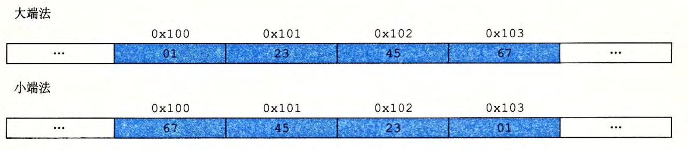

- 小端法(`little endian`)：最低有效字节在最前面的方式
- 大端法(`big endian`)：最高有效字节在最前面的方式
  
> **字节顺序会产生的问题**

- 不同类型的机器之间通过网络传送二进制数据时， 一个常见的问题是当小端法机器产生的数据被发送到大端法机器或者反过来时，接收程序会发现，字里的字节成了反序的。
- 当阅读表示整数数据的字节序列时字节顺序也很重要
- 当编写规避正常的类型系统的程序时。在 C 语言中，可以通过使用强制类型转换 (cast) 或联合 (union) 来允许以一种数据类型引用一个对象，而这种数据类型与创建这个对象时定义的数据类型不同

### 2.1.4 表示字符串

C 语言中字符串被编码为一个以 `null`( 其值为 0) 字符结尾的字符数组 。 每个字符都由某个标准编码来表示，最常见的是 `ASCII` 字符码。

在使用 ASCII 码作为字符码的任何系统上都将得到相同的结果，与字节顺序和字大小规则无关 。 因而，文本数据比二进制数据具有更强的平台独立性。

### 2.1.5 表示代码

考虑下面的C函数

```c
int sum(int x, int y) {
  return x + y;
}
```

在示例机器上编译时，生成如下字节表示的机器代码

**Linux** 32 55 89 e5 Sb 45 Oc 03 45 08 c9 c3
**Windows** 55 89 e5 Sb 45 Oc 03 45 08 5d c3
**Sun** 81 c3 eO 08 90 02 00 09
**Linux** 64 55 48 89 e5 89 7d fc 89 75 f8 03 45 fc c9 c3

我们发现指令编码是不同的。**不同的机器类型使用不同的且不兼容的指令和编码方式**。 即使是完全一样的进程，运行在不同的操作系统上也会有不同的编码规则，因此二进制代码是不兼容的。二进制代码很少能在不同机器和操作系统组合之间移植。

### 2.1.6 布尔代数简介

> **布尔代数的运算**

布尔注意到通过将逻辑值 TRUE( 真）和FALSE( 假）编码为二进制值 1 和 0, 能够设计出一种代数，以研究逻辑推理的基本原、则。

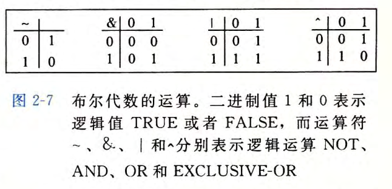

- 布尔运算 $～$ 对应于逻辑运算 `NOT`, 在命题逻辑中用符号$\neg$表示。
- 布尔运算 $＆$ 对应于逻辑运算 `AND`, 在命题逻辑中用符号 $\bigwedge$ 表示。
- 布尔运算 $ | $ 对应于逻辑运算`OR`, 在命题逻辑中用符号 $\bigvee$ 表示。
- 布尔运算$＾$对应于逻辑运算异或，在命题逻辑中用符号$\oplus$表示。当 P 或者 Q 为真但不同时为真时，我们说 $P\oplusQ$ 成立。

>**位向量**

我们可以将上述 4 个布尔运算扩展到位向量的运算。位向量的运算可以定义成参数的每个对应元素之间的运算。

我们可以用位向量 $[a_{w-1},...,a_1,a_0]$编码任何子集 $A\subseteq{0, 1,..., w-1}$, 其中 $a_i=1$ 当且仅当 $i\in A$ 。例如（记住我们是把$a_{w-1}$ 写在左边，而将 $a_0$写在右边），位向量 $a = [01101001]$ 表示集合 A=${O, 3, 5, 6}$,而 $b=[01010101]$ 表示集合 $B={O, 2, 4, 6}$ 。使用这种编码集合的方法，布尔运算 $|$ 和$
＆$分别对应千集合的并和交，而$～$对应于集合的补。

我们能够通过指定 一个位向最掩码，有选择地使能或是屏蔽一些信号，其中某一位位置上为 $1$ 时，表明信号 $1$ 是有效的（使能），而 $0$ 表明该信号是被屏蔽的。因而，这个掩码表示的就是设置为有效信号的集合。

### 2.1.7 C语言中的位级运算

C 语言支持按位布尔运算。

- $|$ 就是 `OR`( 或）
- $＆$ 就是 `AND`( 与）
- $～$ 就是 `NOT`(取反）
- $＾$ 就是 `EXCLUSIVE-OR`( 异或）

```c
void inplace_swap(int *x, int *y){
  *y = *x ^ *y;   // b = a ^ b 
  *x = *x ^ *y;   // a = a ^ a ^ b = b
  *y = *x ^ *y;   // b = b ^ a ^ b = a
}
```

位级运算的一个常见用法就是实现**掩码运算**，这里掩码是一个位模式，表示从一个字中选出的位的集合。

- 掩码 OxFF( 最低的 8 位为 1) 表示一个字的低位字节。位级运算 $x&OxFF$ 生成一个由 x 的最低有效字节组成的值，而其他的字节就被置为0 。
- 表达式 -0 将生成一个全1的掩码，不管机器的字大小是多少

### 2.1.8 C语言中的逻辑运算

C 语言还提供了一组逻辑运算符 $|| 、&& 和 !$ ，分别对应于命题逻辑中的 `OR` 、 `AND`和 `NOT` 运算。

逻辑运算与位级运算的区别：

- 逻辑运算认为所有非零的参数都表示 `TRUE`, 而参数 0 表示 `FALSE` 。它们返回 1 或者 0, 分别表示结果为 `TRUE` 或者为 `FALSE`。
- 逻辑运算符$&&$和 $||$ 与它们对应的位级运算$&$和 $|$ 之间第二个重要的区别是，如果对第一个参数求值就能确定表达式的结果，那么逻辑运算符就不会对第二个参数求值。

### 2.1.9 移位运算

C 语言还提供了一组移位运算，向左或者向右移动位模式。移位运算是从左至右可结合的，所以 $x<<j<<k$ 等价于$(x<<j)<<k$ 。

对于一个位表示为 $[x_{w- 1},x_{w-2},..., x_0]$的操作数 x。

- 左移运算
  - C 表达式 $x<<k$ 会生成一个值，其位表示为$[x_{w-k- 1} , x_{w-k- 2},...,x_{0}]$。
  - x 向左移动 k 位，丢弃最高的 k 位，并在右端补 k 个 0 。移位量应该是一个 $O~ w — 1$ 之间的值

- 右移运算
  - 逻辑右移：在左端补 k 个 0, 得到的结果是 $[O,..., 0,x_{w-1}, x_{w-2},..., x_k]$
  - 算术右移：在左端补 k 个最高有效位的值，得到的结果是 $[x_{w-1},...,x_{w-1},x_{w-1},x_{w-2},...,x_{k}]$

C 语言标准并没有明确定义对千有符号数应该使用哪种类型的右移——算术右移或者逻辑右移都可以。

实际上，几乎所有的编译器／机器组合都对**有符号数**使用算术右移，且许多程序员也都假设机器会使用这种右移。对于**无符号数**，右移必须是逻辑的。

Java 对于如何进行右移有明确的定义。表达是 $x>>k$ 会将 x 算术右移 k 个位置，而 $x>>>k$ 会对 x 做逻辑右移。

***

## 2.2 整数表示

编码整数的两种不同的方式 ：

- 一种只能表示非负数
- 另一种能够表示负数 、 零和正数

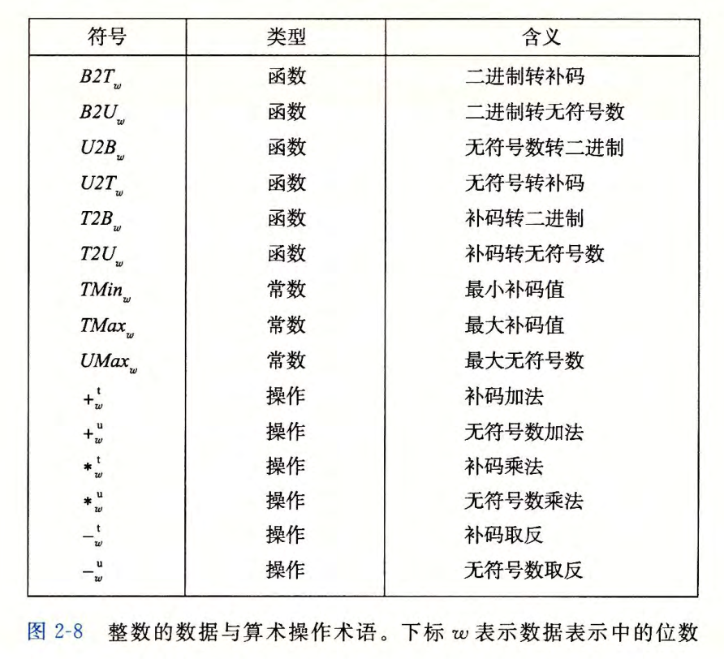

### 2.2.1 整型数据类型

C 语言支持多种整型数据类型表示有限范围的整数。数字可以是非负数（声明为 `unsigned`), 或者可能是**负数（默认）**

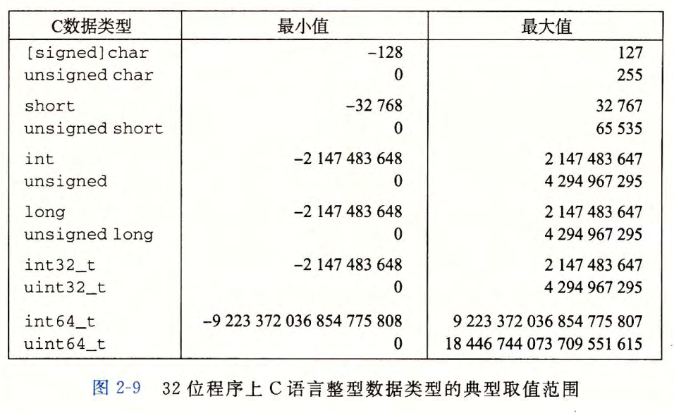

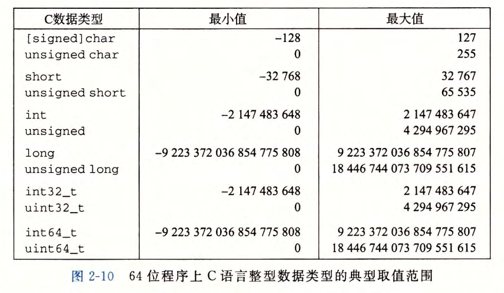

上图中值得注意的是取值范围不是对称的负数的范围比正数的范围大 1 。

**C 语言标准**定义了每种数据类型必须能够表示的最小的取值范围。

- 要求正数和负数的取值范围是对称的
- 数据类型 int 可以用 2 个字节的数字来实现，而这几乎回退到了 16 位机器的时代
- long 的大小可以用 4 个字节的数字来实现，对 32 位程序来说这是很典型的
- **固定大小的数据类型**保证数值的范围与图 2-9 给出的典型数值一致，包括负数与正数的不对称性。

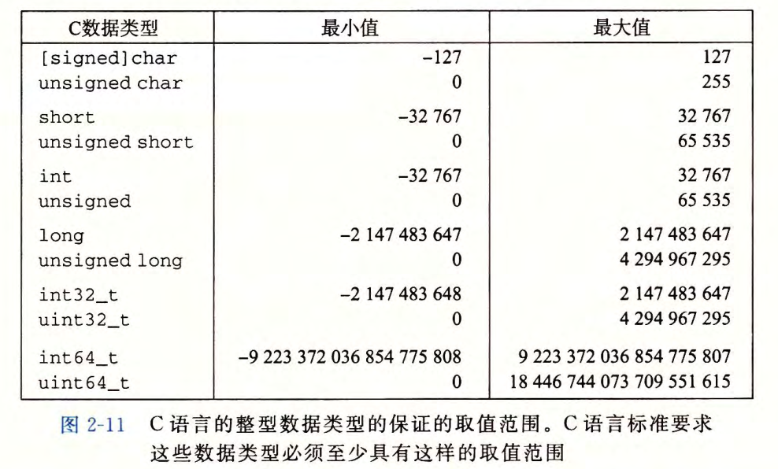

**C 和 C++ 都支持有符号（默认 ）和无符号数。 Java 只支持有符号数。**

### 2.2.2 无符号数的编码

### 2.2.3 补码编码

### 2.2.4 有符号数和无符号数之间的转换

### 2.2.5 C语言中的有符号数和无符号数

### 2.2.6 扩展一个数字的表示

### 2.2.7 截断数字

### 2.2.8 关于有符号数和无符号数的建议

***

## 2.3 整数运算

### 2.3.1 无符号加法

### 2.3.2 补码加法

### 2.3.3 补码的非

### 2.3.4 无符号乘法

### 2.3.5 补码乘法

### 2.3.6 乘以常数

### 2.3.7 除以2的幂

### 2.3.8 关于整数运算的最后思考

***

## 2.4 浮点数

浮点表示对形如$V = x * 2^y$的有理数进行编码。

### 2.4.1 二进制小数

> **十进制表示法**

$d_md_{m - 1} ...d_1d_0.d_{-1}d_{-2}...d_{-n}$ 其中$d_i$的取值范围为 $0~9$

上述表达描述的数值 $d$ 定义如下：
$d =\sum_{i=-n}^{m} 1O^i X d_i$

- 数字权的定义与十进制小数点符号('.')相关小数点左边的数字的权是 10的正幂，得到整数值
- 而小数点右边的数字的权是 10 的负幂，得到小数值。

> **二进制表示法**

$b_mb_{m - 1} ...b_1b_0.b_{-1}b_{-2}...b_{-n}$ 其中$b_i$的取值范围是0和1，如下图所示

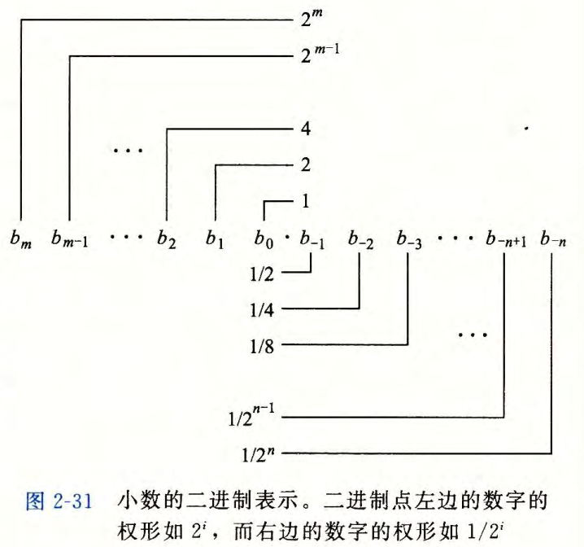

上述表达描述的数值 $d$ 定义如下：
$b =\sum_{i=-n}^{m} 2^i X b_i$

- 符号'.'现在变为了二进制的点，点左边的位的权是 2 的正幂，点右边的位的权是 2 的负幂。
- $101. 11_2$ 表示数字 $1 X 2^2 + 0 X 2^1 + 1 X 2^{0} + 1 X 2^{-1} + 1 X 2^{-2} = 4 + 0 + 1+ 1/2 + 1/4 =5 3/4$
- 二进制小数点向左移动一位相当于将这个数被 2 除
- 二进制小数点向右移动一位相当当于将这个数乘 2。

**注：**小数的二进制表示法只能表示那些能够被写成 $x X 2^{y}$ 的数。其他的值只能够被近似地表示，增加二进制表示的长度可以提高表示的精度

### 2.4.2 IEEE浮点表示

#### IEEE浮点表示

> **IEEE浮点表示**

IEEE 浮点标准用 $V=(—1)^s X M X 2^E$的形式来表示一个数：

- 符号(sign) s ：决定该数是负数(s = 1)还是正数(s = 0)，而**对于数值0的符号位解释作为特殊情况处理**。
- 尾数(significand) M：是一个二进制小数，他的范围是$1~2-\epsilon$，或者$0~1-\epsilon$
- 阶码 (exponent) E： 是对浮点数加权，这个权重是 2 的 E 次幂（可能是负数） 。

> **浮点数的位表示划分**

浮点数的位表示划分为三个字段，分别对这些值进行编码：

- 一个单独的符号位 s 直接编码**符号** s 。
- k 位的**阶码字段** $exp=e_{k - 1} … e_1e_0$。编码阶码 E 。
- n 位**小数字段** $frac= f_{n-1}...f_1f_0$编码尾数 M, 但是编码出来的值也依赖于**阶码字段**的值是否等于 0

图 2-32 给出了将这三个字段装进字中两种最常见的格式

- 在单精度浮点格式 (C 语言中的 `float`）中， $s 、exp 和 frac$字段分别为 1 位、 k = 8 位和 n=23 位，得到一个 32 位的表示。
- 在双精度浮点格式 (C 语言中的 `double`) 中， s 、 exp 和 frac 字段分别为 1 位、 k=11 位和 n=52 位，得到一个 64 位的表示。

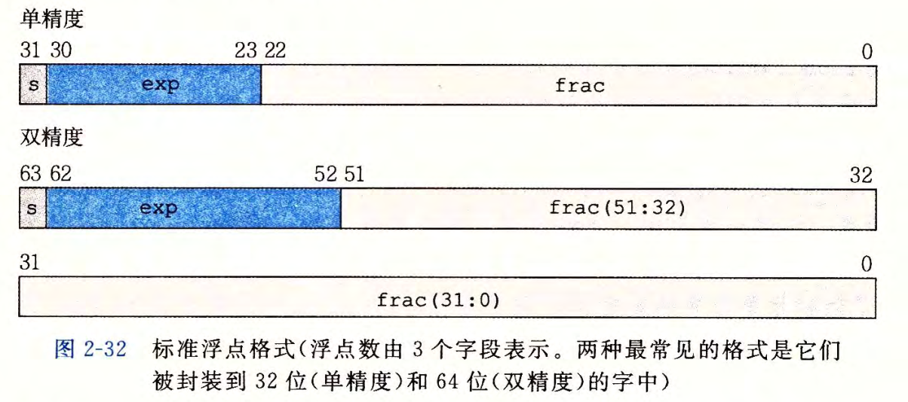

#### 根据`exp`的值，被编码的值可以分为三种不同的情况

> **单精度格式的情况**

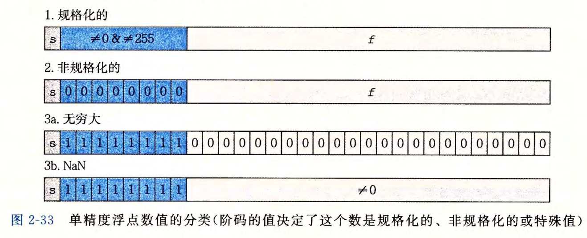

- **情况2:规格化值**
  - 当 `exp` 的位模式既不全为 0(数值 0), 也不全为 1 (单精度数值为`255`, 双精度数值为 `2047`) 时，都属于这类情况。在这种情况中，阶码字段被解释为以*偏置*`biased`) 形式表示的有符号整数。阶码的值是 `E = e - Bias`, 其中 e 是无符号数，其位表示为 $e_{k-1} … e_1e_0$，而 `Bias` 是一个等于 $2^{k-1} — 1$ (单精度是 127, 双精度是 1023) 的偏置值。由此产生指数的取值范围，对于单精度是`—126~ + 127`, 而对于双精度是 `—1022~+1023`。
  - 小数字段 frac 被解释为**描述小数值** `f`, 其中 $O<= f < 1$, 其二进制表示为 $0, f_{n-1}...f_1f_0$ 也就是二进制小数点**在最高有效位的左边**。尾数定义为 `M=1 + f`。有时，这种方式也叫做**隐含的以 1 开头的 (`implied leading 1`) 表示**，因为我们可以把 M 看成一个二进制表达式为$1.f_{n-1}f_{n-2}...f_0$的数字。既然我们总是能够调整阶码 E, 使得尾数 M 在范围$ 1<=M<2$ 之中（假设没有溢出），那么这种表示方法是一种轻松获得 一 个额外精度位的技巧。既然第一位总是等于 1, 那么我们就不需要显式地表示它 。

- **情况2:非规格化值**
  - 当阶码域为全 0 时，所表示的数是非规格化形式。在这种情况下，阶码值是`E=1-Bias`, 而尾数的值是 `M=f`, 也就是小数字段的值，不包含隐含的开头的 1 。
  - **非规格化的用途一：** 它们提供了一种表示数值 0 的方法，因为使用规格化数，我们必须总是使$M>=1$, 因此我们就不能表示 0 。实际上，$+0.0$ 的浮点表示的位模式为全 0: 符号位是 0, 阶码字段全为 0( 表明是一个非规格化值），而小数域也全为 0, 这就得到$M=f=O$ 。令人奇怪的是，当符号位为 1, 而其他域全为 0 时，我们得到值$—0.0 $。根据IEEE 的浮点格式，值 $+0.0$和$—0.0$在某些方面被认为是不同的，而在其他方面是相同的。
  - **非规格化的用途二：** 非规格化数的另外一个功能是表示那些非常接近于 $0.0$的数。它们提供了一种属性，称为逐渐溢出 (`gradual underflow`) , 其中，可能的数值分布均匀地接近于 $0.0$ 。

- **情况3:特殊值**，指阶码全为 1 的时候出现的
  - 当小数域全为 0 时，得到的值表示无穷，当 $ s=O $ 时是$+\infty$, 或者当$s = 1$ 时是 $-\infty$。
  - 当小数域为非零时，结果值被称为 `NaN`, 即“不是一个
数 `(Not a Number)` 的缩写。一些运算的结果不能是实数或无穷，就会返回这样的 `NaN` 值，比如当计算$\sqrt{1}$了或$\infty-\infty$时。在某些应用中，表示未初始化的数据时，它们也很有用处。

### 2.4.3 数字示例

> **6位格式浮点数**

下图展示了一组数值，它们可以用假定的 6 位格式来表示，有 $k=3$ 的阶码位和$n=2$的尾数位。偏置量是 $2^{3-1} — 1=3$

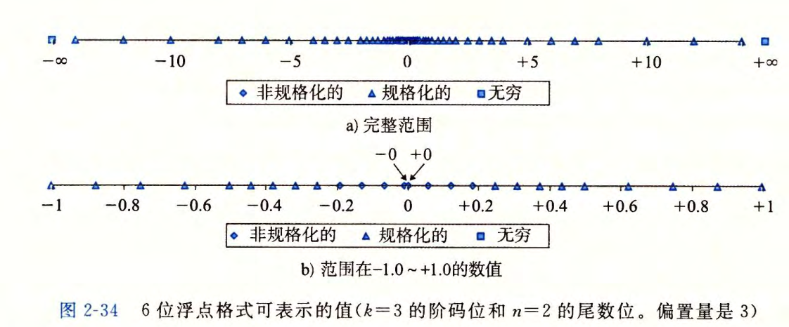

- 图a部分显示了所有可能的值(除了NaN),两个无穷值在两个末端。最大数蜇值的规格化数是土 14 。非规格化数聚集在 0 的附近
- 图b部分中只展示了介于$—1.0$ 和$+1.0$ 之间的数值，这样就能够看得更加清楚了。两个零是特殊的非规格化数。可以观察到，那些可表示的数并不是均匀分布的~越靠近原点处它们越稠密。

> **8位格式浮点数**

图 2-35 展示了假定的 8 位浮点格式的示例，其中有 $k=4$ 的阶码位和 $n=3$ 的小数位。偏置量是$2^{4-1}— 1=7$

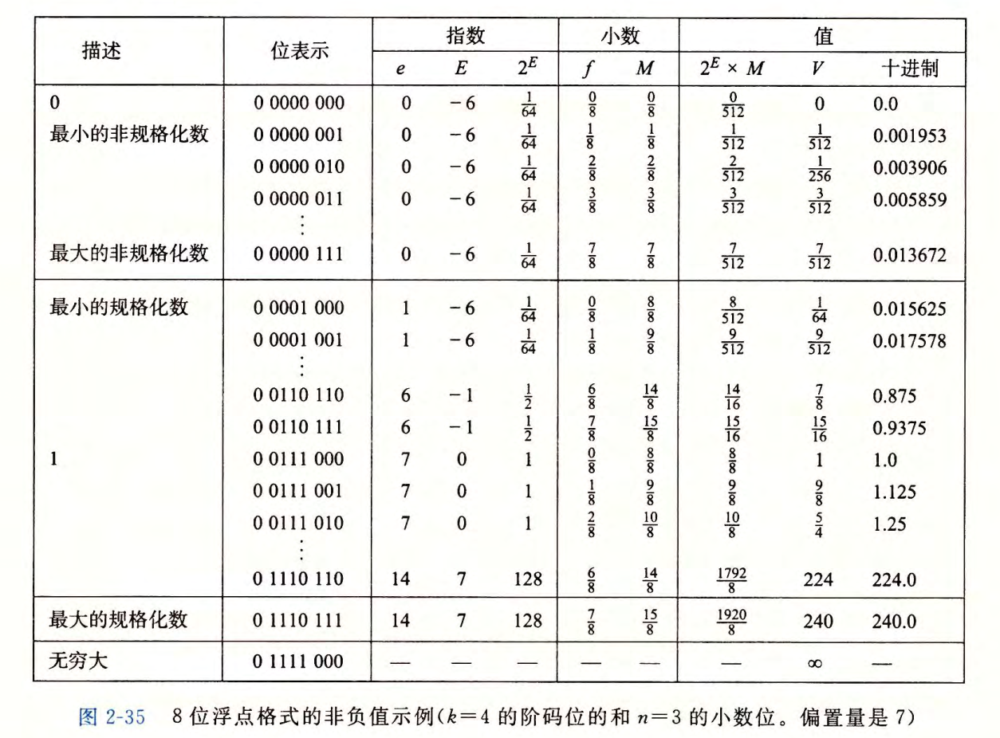

- 从 0 自身开始，最靠近 0 的是**非规格化数**。这种格式的非规格化数的$E= 1-7= —6$, 得到权 $2^E= 1/64$。 小数 f 的值的范围是$0,1/8,...7/8$, 从而得到数$V$的范围是$0~1/64X7/8=7/512$
- **最小规格化数**同样有$E=1—7= — 6$ 并且小数取值范围也为$0,1/8,...7/8$。然而，尾数在范围 $1+0=1$和 $1+7/8=15/8$之间，得出数 $V$ 在范围$8/512＝1/64和15/512$之间。
- 最大非规格化数$7/512$和最小规格化数$8/512$之间的平滑转变。这种平滑性归功于我们对非规格化数的 E 的定义。通过将 E 定义为 $1 — Bias$, 而不是$—Bias$, 我们可以补偿非规格化数的尾数没有隐含的开头的 1 。
- 当增大阶码时，我们成功地得到更大的规格化值，通过 1.0 后得到最大的规格化数。这个数具有阶码 $E=7$, 得到一个权$2^E = 128 。小数等于7/8 得到尾数 M=15/8 。因此，数值
是 V=240 。超出这个值就会溢出到$+\infty$。

> **非负浮点数**

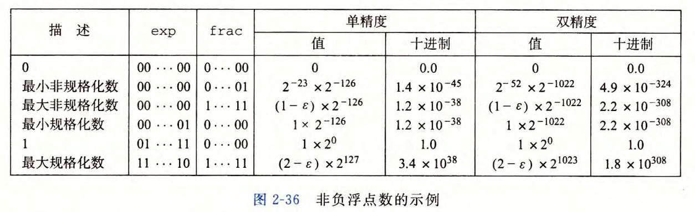

- 值 +0.0 总有一个全为 0 的位表示。
- **最小的正非规格化值的位表示**，是由最低有效位为 1 而其他所有位为 0 构成的。它具有小数（和尾数）值 $M=f=2^{-n}$ 和阶码值$E = -2^{k-1}+2 。因此它的数字值是$V=2^{-n-2^{k-1} + 2}$
- **最大的非规格化值**的位模式是由全为0的阶码字段和全为1的小数字段组成的 。 它有小数（和尾数）值 $M=f=1-2^{-n}$ (我们写成$1-\epsilon$) 和阶码值 $E= —2^{k-1} + 2$ 。因此，数值 $V=1-2^{-n-2^{k-1} + 2}$,这仅比最小的规格化值小一点。
- **最小的正规格化值**的位模式的阶码字段的最低有效位为 1, 其他位全为 0 。它的尾数值 $M=1$, 而阶码值$E=-2^{k-1}+2$ 。 因此，数值 $V=2^{-2^{k-1}+2}$
- 值 1.0 的位表示的阶码字段除了最高有效位等于 1 以外，其他位都等于 0 。它的尾数值是$M=1$, 而它的阶码值是$E=O$。
- **最大的规格化值**的位表示的符号位为 0, 阶码的最低有效位等于0, 其他位等于 1。它的小数值$f=1-2^{-n}$ , 尾数 $M= 2-2^{-n}$ ( 我们写作 $2-\epsilon$) 。它的阶码值$E=2^{k-1}-1$ 得到数值$V=(2-2^{-n}) X 2^{2^ {k-1}-1}=(1-2^{-n-1})x2^{2^{k-1} }$

### 2.4.4 舍入

因为表示方法限制了浮点数的范围和精度，所以浮点运算只能近似地表示实数运算。因此，对于值$x$, 我们一般想用一种系统的方法，能够找到"最接近的"匹配值 $x'$"" 它可以用期望的浮点形式表示出来。这就是舍入 (`rounding`) 运算的任务。

**一个关键问题是在两个可能值的中间确定舍入方向!**

IEEE浮点格式定义了**四种不同的舍入方式** 。默认的方法是找到最接近的匹配，而其他三种可用于计算**上界和下界**。

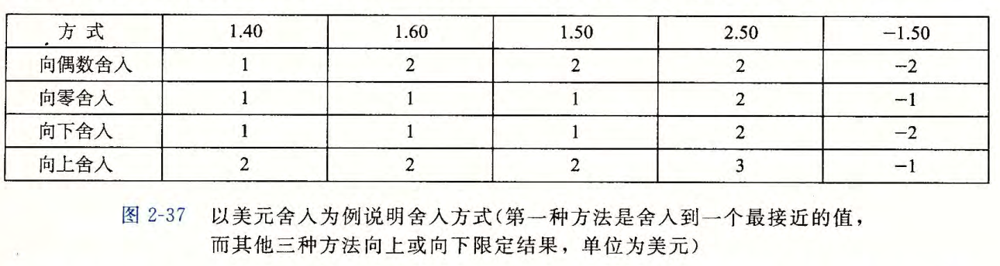

- **向偶数舍入方式(round-to-even)** ， 其默认的方式是向最接近的值舍入 (`round- to-nearest`)，确定两个可能结果中间数值，试图找到一个最接近的匹配值采用的方法是：它将数字向上或者向下舍入，使得**结果的最低有效数字是偶数。**这种方法舍入一组数值，会在计算这些值的平均数中引入统计偏差。我们采用这种方式舍入得到的一组数的平均值将比这些数本身的平均值略高一些。相反，如果我们总是把两个可表示值中间的数字向下舍入，那么舍入后的一组数的平均值将比这些数本身的平均值略低一些。向偶数舍入在大多数现实情况中避免了这种统计偏差。在 50% 的时间里，它将向上舍入，而在 50% 的时间里，它将向下舍入。
- 他三种方式产生实际值的确界 (`guaranteed bound`) 。这些方法在一些数字应用中是很有用的 。
- **向零舍入方式**把*正数向下舍入，把负数向上舍入*，得到值 $\hat{x}$, 使得$|\hat{x}| <= |x|$ 。
- **向下舍入方式**把正数和负数都向下舍入，得到值 $x^-$，使得 $x^- <= x$。
- **向上舍入方式**把正数和负数都向上舍入，得到值 $x^+$ ，满足$x<=x^+$。

### 2.4.5 浮点运算

IEEE 标准指定了一个简单的规则，来确定诸如加法和乘法这样的算术运算的结果：把浮点值 x 和 y 看成实数，而某个运算定义在实数上，计算将产生 Round(x（运算）y), 这是**对实际运算的精确结果进行舍入后的结果。**

> **浮点数的加法**

- 将 $x+_fy$ 定义为 $Round(x+y)$ 。这个运算的定义针对 x 和 y 的所有取值
- 由于溢出，该运算可能得到无穷值
- 这个运算是可交换的，即$x+^fy = y+^fx$
- 该运算是不可结合的
- 大多数值在浮点加法下都有逆元，也就是说 $x+^f — x=O$ 。无穷（因为$+\infty -\infty=NaN$) 和 NaN 是例外情况，因为对于任何 x, 都有 $NaN+^fx=NaN$
- 浮点加法满足了单调性属性：如果 $a>=b$, 那么对于任何 a 、 b 以及 x 的值，除了 NaN, 都有 $x+a>=x+b$ 。无符号或补码加法不具有这个实数（和整数）加法的属性。

> **浮点乘法**

- 定义 $X*^fy$ 为 $Round(x*y$)$ 。这运算在乘法中是封闭的（虽然可能产生无穷大或 NaN), 它是可交换的，而且它的乘法单位元为 1.0 。
- 由于可能发生溢出，或者由于舍入而失去精度，它不具有可结合性
- 浮点乘法在加法上不具备分配性
- 对千任何$a、b 和 c$, 并且$a、b 和 c$ 都不等于$NaN$, 浮点乘法满足下列单调性：
  - $a>=b$ 且 $c >= 0$  ⇒ $a*^fc>=b*^fc$
  - $a>=b$ 且 $c <= O$ ⇒  $a*^fc<=b*^fc$
  - 只要 $a!=NaN$, 就有 $a*^fa>=O$

### 2.4.6 C语言中的浮点数

所有的 C 语言版本提供了两种不同的浮点数据类型： flo社和 double。在支持 IEEE 浮点格式的机器上。这些数据类型就对应于单精度和双精度浮点。

另外，这类机器使用**向偶数舍入**的舍入方式

因为 C 语言标准不要求机器使用 IEEE 浮点，所以没有标准的方法来改变舍入方式或者得到诸如$—0 、+\infty、-\infty$或者 NaN 之类的特殊值。大多数系统提供 `include('.h')` 文件和读取这些特征的过程库，但是细节随系统不同而不同。

**tips:**不能使用任何 `include` 文件（例如 `math.h`), 但你能利用这样一个事实：双精度能够表示的最大的有限数，大约是 `1.8 X 10^{308}`。

> **在 int、 float 和 double 格式之间进行强制类型转换时，程序改变数值和位模式的原则**

- 从 int 转换成 float, 数字不会溢出，但是可能被舍入
- 从 int 或 float 转换成 double, 因为 double 有更大的范围（也就是可表示值的范围），也有更高的精度（也就是有效位数），所以能够保留精确的数值。
- 从 double 转换成 float, 因为范围要小一些，所以值可能溢出成$+\infty$或$-\infty$。另外，由于精确度较小，它还可能被舍入。
- 从 float 或者 double 转换成 int, 值将会**向零舍入**。例如， 1. 999 将被转换成 1,而$— 1.999$ 将被转换成-1 。进一步来说，值可能会溢出。 C 语言标准没有对这种情
况指定固定的结果。与 Intel 兼容的微处理器指定位模式 [10 … 00] (字长为 w 时的$TMin_w$) 为整数不确定 (integer indefinite) 值。 一 个从浮点数到整数的转换，如果不能为该浮点数找到一个合理的整数近似值，就会产生这样一个值。因此，表达式$(int) +lelO$ 会得到 -21483648, 即从一个正值变成了一个负值。

***

## 2.5 小结
