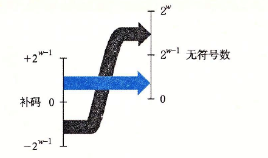
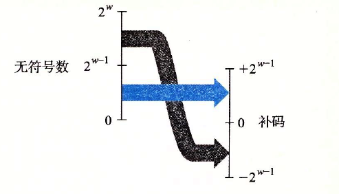
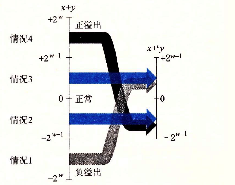
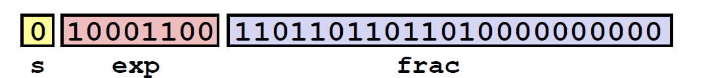

# 第二章 信息的表示和处理

- 为什么用二进制？
  - 物理层二值信号（高/低电压）可靠性高，逻辑电路简单，硅片集成度极高。
- **计算机的三种编码方式**：
  - 无符号(`unsigned`)编码：基于传统的二进制表示法，表示大于或者等于零的数字。
  - 补码(`two's-complement`)编码：表示有符号整数的最常见的方式，有符号整数就是可以为正或者为负的数字。
  - 浮点数(`floating-point`)编码：表示实数的科学记数法的以2为基数的版本。
- **整数&浮点数**
  - 溢出（overflow）
  - 整数运算：在计算机中，**整数的运算符合运算符的交换律和结合律**，溢出的结果会表示为负数。整数的编码范围比较小，但是其结果表示是精确的。
  - **浮点数由于精度有限是不可结合的**，并且其溢出会产生特殊的值——正无穷。浮点数的编码范围大，但是其结果表示是近似的。
  - **原因**：主要是因为计算机对于整数和浮点数的编码格式不同。整数：范围小，精确表示；浮点数：范围大，近似表示。

## 2.1 信息存储

计算机**使用8位的块，或者字节（byte）**，作为**最小可寻址的内存单位**，而不是访问内存中单独的位。


**虚拟内存(`virtual memory`)**：机器级程序将内存视为一个非常大的字节数组。
**地址(`Address`)**：内存的每个字节都由一个唯一的数字来标识,称之为地址。
**虚拟地址空间 (`virtual address space`)**：所有可能地址的集合。虚拟地址空间只是一个展现给机器级程序的概念性映像。

**指针**是由**数据类型**和**指针值**构成：
- 指针值：表示某个对象的位置，
- 数据类型表示那个位置上所存储对象的类型（比如整数或者浮点数）。

**C语言中任何一个类型的指针值对应的都是一个虚拟地址**。C语言编译器可以根据**不同类型的指针值生成不同的机器码来访问存储在指针所指向位置处的值**。但是它生成的**实际机器级程序并不包含关于数据类型的信息**。


### 2.1.1 十六进制表示法

**十六进制（简写为 `"hex"`）**：使用数字 'O'~'9' 以及字符 'A'~'F' 来表示 16 个可能的值

| 十六进制数字| 0   | 1   | 2   | 3   | 4   | 5   | 6   | 7   | 8   | 9   | A   | B   | C   | D   | E   | F   |
|----| --- | --- | --- | --- | --- | --- | --- | --- | --- | --- | --- | --- | --- | --- | --- | --- |
|十进制值|  0   |   1  |  2   |  3   |   4  |  5   |  6   |   7  |  8   |  9   |   10  | 11   | 12    | 13    |  14   |   15  |
|二进制值|  0000   |   0001  |  0010   |  0011   |  0100   |  0101   |  0110   |   0111  |  1000   |  1001   |   1010  | 1011   | 1100    | 1101    |  1110   |   1111  |

**二进制转十六进制（分组转换）**

**十进制转十六进制**

Gamma 公式展示$Γ(n)=(n−1)! ∀n∈N$ 是通过 `Euler integral`

当`x`为`2`的非负整数`n`次幂时，也就是 $x=2^n$。我们可以很容易地将x写成十六进制形式，只要记住$x$的二进制表示就是`1`后面跟`n`个`0`（比如$1024=2^10$，二进制为`10000000000`）。十六进制数字`0`代表`4`个二进制`0`。所以，当`n`表示成$i+4j$的形式，其中$0≤i≤3$，我们可以把x写成开头的十六进制数字为$1（i=0）、2（i=1）、4（i=2）或者8（i=3）$，后面跟随着`j`个十六进制的`0`。比如，$2048=2^11$，$n=11=3+4*2$，从而得到十六进制表示为`0x800`。下面再看几个例子。

| n | $2^n$(十进制) | $2^n$(十六进制) |
|--|--|--|
|  9 | 512 | 0x200 |
| 19（3+4*4）  | 524288 | 0x80000 |
| 14（2+4*2）  | 16384 | 0x4000 |
| 16（0+4*4）  | 65536 | 0x10000 |
| 17（1+4*4）  | 131072 |  0x20000|


十进制转十六进制还可以使用另一种方法：辗转相除法


**十六进制转十进制**


16进制转10进制：16的幂乘以每个16进制数字，比如给定数字`0x7AF`，转换为10进制则为$7*16^2 + 10*16 + 15 = $

### 2.1.2 字数据大小

每台计算机都有一个字长 (`word size`), 指明指针数据的标称大小 (`nominal size`)。字长决定的最重要的系统参数就是虚拟地址空间的最大大小。也就是说，对于一个字长为 w 位的机器而言，虚拟地址的范围为 $0 \sim 2^w-1$,程序最多访问$2^w$个字节。

```
16位字长机器的地址范围：0~65535(FFFF)

32位字长机器的地址范围：0~4294967296（FFFFFFFF,4GB）

64位字长机器的地址范围：0~18446744073709551616（1999999999999998,16EB）

32位编译指令：gcc -m32 main.c

64位编译指令：gcc -m64 main.c
```

**C数据类型的典型大小(以字节为单位)**

| C声明 | C声明 |   字节数  |  字节数   |
| ----- | ------ | --- | --- |
|   有符号    |    无符号    |  32位   |  64位   |
|   (signed) char    |    unsigned char    |  1  |  1   |
|   short    |    unsigned short    |  2   |  2   |
|   int    |    unsigned int    |  4   |  4   |
|   long    |    unsigned long    |  4   |  8   |
|   int32_t    |    uint32_t    |  4   |  4   |
|   int64_t   |    uint64_t    |  8   |  8   |
|   char *   |        |  4   |  8   |
|   float   |        |  4   |  4   |
|   double   |        |  8   |  8   |

**注意：基本C数据类型的典型大小分配的字节数是由编译器如何编译所决定的，并不是由机器位数而决定的。本表给出的是32位和64位程序的典型值。**


为了避免由于依赖"典型"大小和不同编译器设置带来的奇怪行为， ISO C99 引入了`int32_t` 和 `int64_t`，其数据大小是固定的，不随编译器和机器设置而变化 。

**注意：** 对关键字的顺序以及包括还是省略可选关键字来说，C语言允许存在多种形式。比如，下面所有的声明都是一个意思

```c
unsigned long 
unsigned long int 
long unsigned 
long unsigned int
```

### 2.1.3 寻址和字节顺序

对于跨越多字节的程序对象，必须建立**两个规则**：

- 这个对象的地址是什么
- 在内存中如何排列这些字节

**内存中排列字节（大端&小端）**

在几乎所有的机器上，多字节对象都被存储为连续的字节序列，对象的地址为所使用字节中最小的地址。

排列一个对象的字节**有两个通用的规则**。考虑一个 w 位的整数，其位表示为 $[x_{w-1},x_{w-2}, …, x_{1},x_{0}]$, 其中 $x_{w-1}$是最高有效位，而$x_{0}$是最低有效位 。 假设 $w$ 是 8 的倍数，这些位就能被分组成为字节，其中最高有效字节包含位 $[x_{w-1}, x_{w- 2}...,x_{w-8}]$, 而最低有效字节包含位 $[x_7,x_6,...,x_0]$

**大端（`big endian`）**：是指**数据的高字节保存在内存的低地址中**，而数据的低字节保存在内存的高地址中，这样的存储模式有点儿类似于把数据当作字符串顺序处理：地址由小向大增加，而数据从高位往低位放。

**小端（little endian）**：是指**数据的高字节保存在内存的高地址中**，而数据的低字节保存在内存的低地址中，这种存储模式将地址的高低和数据位权有效地结合起来，高地址部分权值高，低地址部分权值低，和我们的逻辑方法一致。

假设变量`x`的类型为`int`，位于地址`0x100`处，它的十六进制值为`0x01234567`。地址范围`0x100~0x103`的字节顺序依赖于机器的类型。


  
**字节顺序会产生的问题（大小端的意义）**

- 不同设备的数据传输：`A`设备为小端模式，`B`设备为大端模式。当通过网络将`A`设备的数据传输到`B`设备时，就会出现问题。即当小端法机器产生的数据被发送到大端法机器或者反过来时，接收程序会发现，字里的字节成了反序的。

- 阅读表示整数数据的字节序列时字节顺序也很重要。假设`Intel x86-64`(**x86都属于小端**)生成某段程序的反汇编码如下：
  ```c
  // 习惯的阅读顺序为最低位在左边，最高位在右边，0x00200b43。而小端模式生成的反汇编码最低位在右边，最高位在左边，01 05 43 0b 20 00.和我们的阅读顺序正好相反。
  4004d3:01 05 43 0b 20 00              add   %eax,0x200b43(%rip)
  ```

- **编写符合各种系统的通用程序：** 当编写规避正常的类型系统的程序时。在 C 语言中，可以通过使用强制类型转换 (`cast`) 或联合 (`union`) 来允许以一种数据类型引用一个对象，而这种数据类型与创建这个对象时定义的数据类型不同
  
  ```c
    /*打印程序对象的字节表示。这段代码使用强制类型转换来规避类型系统。很容易定义针对其他数据类型的类似函数*/
    #include <stdio.h>
    typedef unsigned char* byte_pointer;
    /*传递给 show_bytes一个指向它们参数x的指针&x，且这个指针被强制类型转换为“unsigned char*”。这种强制类型转换告诉编译器，程序应该把这个指针看成指向一个字节序列，而不是指向一个原始数据类型的对象。*/
    void show_bytes(byte_pointer start, size_t len){
        size-t i;
        for (i=0;i<len;i++)
            printf("%.2x",start [i]);
        printf("\n");
    }
    void show_int (int x){
    show_bytes ((byte_pointer)&x,sizeof(int));
    }
    void show_float (float x){
        show_bytes ((byte_pointer)&x,sizeof(float));
    }
    void show_pointer (void* x){
        show_bytes ((byte_pointer)&x,sizeof(void* x));
    }
    void test_show_bytes (int val){
        int ival = val;
        float fval =(float)ival;
        int *pval = &ival;
        show_int(ival);
        show_float(fval);
        show_pointer(pval);
    }
  ```
    以上代码打印示例数据对象的字节表示如下表：
    
    | 机器	| 值	| 类型	| 字节（十六进制）|
    | -- | -- | --| -- |
    |Linux32|	12345|	int|	39 30 00 00|
    |Windows|	12345|	int|	39 30 00 00|
    |Linux64|	12345|	int|	39 30 00 00|
    |Linux32|	12345.0|	float|	00 e4 40 46|
    |Windows|	12345.0|	float|	00 e4 40 46|
    |Linux64|	12345.0|	float|	00 e4 40 46|
    |Linux32|	&ival|	int *|	e4 f9 ff bf|
    |Windows|	&ival|	int *|	b4 cc 22 00|
    |Linux64|	&ival|	int *|	b8 11 e5 ff ff 7f 00 00|
      注：Linux64为x86-64处理器。

  - **除了字节顺序以外，`int`和 `float`的结果是一样的**。
  - **指针值却是完全不同的,不同的机器/操作系统配置使用不同的存储分配规则。**（ Linux32、 Windows机器使用4字节地址，而 Linux64使用8字节地址）
  - 尽管浮点型和整型数据都是对数值`12345`编码，但是它们有截然不同的字节模式：整型为`0x00003039`，而浮点数为`0x4640E400`。一般而言，这两种格式使用不同的编码方法。


### 2.1.4 表示字符串

**C 语言中字符串被编码为一个以 `null`( 其值为 0) 字符结尾的字符数组**。 每个字符都由某个标准编码来表示，最常见的是 `ASCII` 字符码。

在**使用 `ASCII` 码作为字符码的任何系统上都将得到相同的结果，与字节顺序和字大小规则无关**。 因而，文本数据比二进制数据具有更强的平台独立性。

### 2.1.5 表示代码

考虑下面的C函数

```c
int sum(int x, int y) {
  return x + y;
}
```

在示例机器上编译时，生成如下字节表示的机器代码

**Linux32** 55 89 e5 Sb 45 Oc 03 45 08 c9 c3
**Windows** 55 89 e5 Sb 45 Oc 03 45 08 5d c3
**Sun** 81 c3 eO 08 90 02 00 09
**Linux64** 55 48 89 e5 89 7d fc 89 75 f8 03 45 fc c9 c3

我们发现指令编码是不同的。**不同的机器类型使用不同的且不兼容的指令和编码方式**。 即使是完全一样的进程，运行在不同的操作系统上也会有不同的编码规则，因此**二进制代码是不兼容的**。二进制代码很少能在不同机器和操作系统组合之间移植。

### 2.1.6 布尔代数简介

**布尔代数的运算**

布尔注意到通过将逻辑值 `TRUE`(真)和FALSE(假)编码为二进制值 1 和 0, 能够设计出一种代数，以研究逻辑推理的基本原则。


- 布尔运算 $\sim$ 对应于逻辑运算 `NOT`, 在命题逻辑中用符号$\neg$表示。
- 布尔运算 $\And$ 对应于逻辑运算 `AND`, 在命题逻辑中用符号 $\bigwedge$ 表示。
- 布尔运算 $\mid$ 对应于逻辑运算`OR`, 在命题逻辑中用符号 $\bigvee$ 表示。
- 布尔运算`＾`对应于逻辑运算异或，在命题逻辑中用符号$\oplus$表示。当 P 或者 Q 为真但不同时为真时，我们说 $P\oplus Q$ 成立。

 > ^为异或运算符，有一个重要的性质：`a ^ a = 0，a ^ 0= a`。即**任何数和其自身异或结果为0，和0异或结果仍为原来的数**。利用这个性质，我们可以找出数组中只出现一次/两次/三次等的数字。如何找呢？
 > 例1：假设给定一个数组 arr，除了某个元素只出现一次以外，其余每个元素均出现两次。找出那个只出现了一次的元素。
 > **思路**：其余元素出现了都是两次，因此，将数组内的所有元素依次异或，最后的结果即为只出现一次的元素。比如，`arr = [0,0,1,1,8,8,12],0 ^ 0 ^ 1 ^ 1^ 8^ 8^ 12 = 12`。 感兴趣的可以自己编程试下。
 > 例2：给定一个整数数组 arr，其中恰好有两个元素只出现一次，其余所有元素均出现两次。 找出只出现一次的那两个元素。
 > 思路：首先可以通过异或获得两个出现一次的数字的异或值，该异或值中的为1的bit位肯定是来自这两个数字之中的一个。然后可以随便选一个为1的bit位，按照这个bit位，将所有该位为1的数字分为一组，所有该位为0的数字分为一组，这样就成了查找两个子数组中只出现了一次的数字。


**位向量**

上述 4 个布尔运算可以扩展到位向量的运算。位向量的运算可以定义成参数的每个对应元素之间的运算。

我们可以用位向量 $[a_{w-1},...,a_1,a_0]$编码任何子集 $A\subseteq{0, 1,..., w-1}$, 其中 $a_i=1$ 当且仅当 $i\in A$ 。例如（记住我们是把$ a_{w-1} $ 写在左边，而将 $a_0$写在右边），位向量 $a = [01101001]$ 表示集合 A=${0, 3, 5, 6}$,而 $b=[01010101]$ 表示集合 $B={O, 2, 4, 6}$ 。

使用这种编码集合的方法，布尔运算 $\mid$ 和$\And$ 分别对应集合的并和交，而$\sim$对应于集合的补。

我们能够通过指定 一个位向最掩码，有选择地使能或是屏蔽一些信号，其中某一位位置上为 $1$ 时，表明信号 $1$ 是有效的（使能），而 $0$ 表明该信号是被屏蔽的。因而，这个掩码表示的就是设置为有效信号的集合。

### 2.1.7 C语言中的位级运算

C 语言支持按位布尔运算。

- $\mid$ 就是 `OR`( 或）
- $\And$ 就是 `AND`( 与）
- $\sim$ 就是 `NOT`(取反）
- $＾$ 就是 `EXCLUSIVE-OR`( 异或）

```c
void inplace_swap(int *x, int *y){
  *y = *x ^ *y;   // b = a ^ b 
  *x = *x ^ *y;   // a = a ^ a ^ b = b
  *y = *x ^ *y;   // b = b ^ a ^ b = a
}
```

位级运算的一个常见用法就是实现**掩码运算**，这里掩码是一个位模式，表示从一个字中选出的位的集合。

- 掩码 `0xFF`( 最低的 8 位为 1) 表示一个字的低位字节。位级运算 $ x \And 0xFF$ 生成一个由 x 的最低有效字节组成的值，而其他的字节就被置为0 。
- 表达式 `~0` 将生成一个全1的掩码，不管机器的字大小是多少

### 2.1.8 C语言中的逻辑运算

C 语言还提供了一组逻辑运算符 ``||、&&、！``，分别对应于命题逻辑中的 `OR`、`AND`和 `NOT` 运算。

**逻辑运算与位级运算的区别：**

- 逻辑运算认为所有非零的参数都表示 `TRUE`, 而参数 0 表示 `FALSE` 。它们返回 1 或者 0, 分别表示结果为 `TRUE` 或者为 `FALSE`。
- 逻辑运算符`&&`和 `||`与它们对应的位级运算`&`和 `|` 之间第二个重要的区别是**具有短路求值性质**，如果对第一个参数求值就能确定表达式的结果，那么逻辑运算符就不会对第二个参数求值。

  ```c
  int main()
  {
      int a=3,b=3;
      (a=0)&&(b=5);
      printf("a=%d,b=%d\n",a,b); // a = 0 ,b = 3
      (a=1)||(b=5);
      printf("a=%d,b=%d",a,b); // a = 1 ,b = 3
  } 
  ```

### 2.1.9 移位运算

C 语言还提供了一组移位运算，向左或者向右移动位模式。**移位运算是从左至右可结合的**，所以 $x<<j<<k$ 等价于$(x<<j)<<k$ 。

对于一个位表示为 $[x_{w- 1},x_{w-2},..., x_0]$的操作数 x。

- **左移运算**
  - C 表达式 $x<<k$ 会生成一个值，其位表示为$[x_{w-k- 1} , x_{w-k- 2},...,x_{0}]$。
  - x 向左移动 k 位，丢弃最高的 k 位，并在右端补 k 个 0 。移位量应该是一个 $0\sim w — 1$ 之间的值

- **右移运算**
  - 逻辑右移：在左端补 k 个 0, 得到的结果是 $[0,..., 0,x_{w-1}, x_{w-2},..., x_k]$
  - 算术右移：在左端补 k 个最高有效位的值，得到的结果是 $[x_{w-1},...,x_{w-1},x_{w-1},x_{w-2},...,x_{k}]$

C 语言标准并没有明确定义对有符号数应该使用哪种类型的右移——算术右移或者逻辑右移都可以。

实际上，几乎所有的编译器／机器组合都对**有符号数**使用算术右移，且许多程序员也都假设机器会使用这种右移。对于**无符号数**，右移必须是逻辑的。

Java 对于如何进行右移有明确的定义。表达是 $x>>k$ 会将 x 算术右移 k 个位置，而 $x>>>k$ 会对 x 做逻辑右移。

**总结：**

- 逻辑左移(SHL)和算数左移(SAL)，规则相同，右边统一添0
- 逻辑右移(SHR)，左边统一添0
- 算数右移(SAR)，左边添加的数和符号有关 (正数补0，负数补1)


**举例：** `1010101010`，其中`[]`位是添加的数字

- 逻辑左移一位：010101010[0]
- 算数左移一位：010101010[0]
- 逻辑右移一位：[0]101010101
- 算数右移一位：[1]101010101

***

## 2.2 整数表示

编码整数的两种不同的方式 ：

- 一种只能表示非负数
- 另一种能够表示负数 、 零和正数


### 2.2.1 整型数据类型

C 语言支持多种整型数据类型表示有限范围的整数。数字可以是非负数（声明为 `unsigned`), 或者可能是**负数（默认）**


上图中值得注意的是取值范围不是对称的负数的范围比正数的范围大 1 。

**C 语言标准**定义了每种数据类型必须能够表示的最小的取值范围。

- 要求正数和负数的取值范围是对称的
- 数据类型 int 可以用 2 个字节的数字来实现，而这几乎回退到了 16 位机器的时代
- long 的大小可以用 4 个字节的数字来实现，对 32 位程序来说这是很典型的
- **固定大小的数据类型**保证数值的范围与图 2-9 给出的典型数值一致，包括负数与正数的不对称性。


**C 和 C++ 都支持有符号（默认 ）和无符号数。 Java 只支持有符号数。**

### 2.2.2 无符号数的编码

对向量 $\vec{x} = [x_{w-1}, x_{w-2}, \cdots, x_0]$，其无符号编码定义为：

$$
B2U_w(\vec{x}) = \sum_{i=0}^{w-1} x_i 2^i
$$

其中：
- $\vec{x}$ 是一个二进制表示的向量
- 每个位 $x_i$ 的取值为 0 或 1

**示例**

- 4位无符号数 `[0001]` 的转换：
   $$
   B2U_4([0001]) = 0 \times 2^3 + 0 \times 2^2 + 0 \times 2^1 + 1 \times 2^0 = 0 + 0 + 0 + 1 = 1
   $$

- 4位无符号数 `[1111]` 的转换：
   $$
   B2U_4([1111]) = 1 \times 2^3 + 1 \times 2^2 + 1 \times 2^1 + 1 \times 2^0 = 8 + 4 + 2 + 1 = 15
   $$

**无符号数能表示的最大值为：**
$$
UMax_w = \sum_{i=0}^{w-1} 2^i = 2^w - 1
$$


### 2.2.3 补码编码

**补码编码的定义**

对向量 $\vec{x} = [x_{w-1}, x_{w-2}, \cdots, x_0]$，其补码编码定义为：

$$
B2T_w(\vec{x}) = -x_{w-1} 2^{w-1} + \sum_{i=0}^{w-2} x_i 2^i
$$

其中：
- 最高有效位 $x_{w-1}$ 称为符号位
- 符号位的权重为 $-2^{w-1}$（是无符号表示中权重的负数）
- 符号位为1时表示负值，为0时表示非负值

**示例**

- 4位补码 `[0001]` 的转换：
   $$
   B2T_4([0001]) = -0 \times 2^3 + 0 \times 2^2 + 0 \times 2^1 + 1 \times 2^0 = 0 + 0 + 0 + 1 = 1
   $$

- 4位补码 `[1111]` 的转换：
   $$
   B2T_4([1111]) = -1 \times 2^3 + 1 \times 2^2 + 1 \times 2^1 + 1 \times 2^0 = -8 + 4 + 2 + 1 = -1
   $$

**补码表示范围：** `w`位补码能表示的范围：
$$
TMin_w = -2^{w-1}, \quad TMax_w = 2^{w-1} - 1
$$

**补码的特性**

- **不对称性**：
   - $|TMin| = |TMax| + 1$
   - 这种不对称性是因为：
     - 一半位模式（符号位为1）表示负数
     - 另一半（符号位为0）表示非负数
     - 由于0是非负数，导致能表示的正数比负数少一个

- **与无符号数的关系**：
   - 最大无符号数值 $UMax_w = 2TMax_w + 1$
   - **补码表示中所有表示负数的位模式在无符号表示中都变为正数**

> 注意：补码不是计算机表示负数的唯一方式，其他方式包括原码和反码。

**数据类型的大小可移植性**

ISO C99标准在`stdint.h`中定义了可移植的整数类型：
- `intN_t`：N 位有符号整数（N通常为8,16,32,64）
- `uintN_t`：N 位无符号整数

相关宏定义：
- `INTN_MIN`, `INTN_MAX`：有符号类型的最小/最大值
- `UINTN_MAX`：无符号类型的最大值

打印格式示例

```c
printf("x=%"PRId32", y=%"PRIu64"\n", x, y);
```

在64位系统中：
- `PRId32` 展开为 "d"
- `PRIu64` 展开为 "lu"

**补码转无符号数（T2U）**

对于 $TMin_w \leq x \leq TMax_w$：
$$
T2U_w(x) = 
\begin{cases} 
x + 2^w, & x < 0 \\
x, & x \geq 0 
\end{cases}
$$

从补码到无符号数的转换。函数T2U将负数转换为大的正数



转换示例（w=4）

| x  | T2U₄(x) | 解释 |
|----|--------|------|
| -8 | 8      | -8 < 0 → -8 + 16 = 8 |
| -3 | 13     | -3 < 0 → -3 + 16 = 13 |
| 0  | 0      | x ≥ 0 → 直接转换 |
| 5  | 5      | x ≥ 0 → 直接转换 |

**无符号数转补码（U2T）**

对于 $0 \leq u \leq UMax_w$：

$$
U2T_w(u) = 
\begin{cases} 
u, & u \leq TMax_w \\
u - 2^w, & u > TMax_w 
\end{cases}
$$

从无符号数到补码的转换。函数`U2T`把大于$2^{w−1}−1$的数字转换为负值



### 2.2.4 有符号数和无符号数之间的转换

**基本转换规则**

- 无符号数转有符号数：使用函数 `U2Tₐ`
- 有符号数转无符号数：使用函数 `T2Uₐ`

> 注意：在C语言中，当运算混合有符号和无符号数时，***会隐式地将有符号数强制转换为无符号数***。

**典型陷阱示例**
```c
-1 < 0U  // 等价于 4294967295U < 0U，结果为0（假）
```

### 2.2.5 C语言中的有符号数和无符号数

### 2.2.6 扩展一个数字的表示

**无符号数扩展（零扩展）**：在表示开头添加0
```
16位：0x00C  →  32位：0x0000000C
```

**补码数字扩展（符号扩展）**：扩展符号位
```
16位：0x8019  →  32位：0xFFFF8019
```

### 2.2.7 截断数字

**无符号数截断公式**

$$
x' = x \mod 2^k
$$

- 示例：将`int`型 9 截断为`short`：
  ```
  9 mod 65536 = 9
  ```

**有符号数截断公式**
$$
x' = U2T_k(x \mod 2^k)
$$

- 示例：将53791截断为short：
  ```
  53791 mod 65536 = 53791
  U2T₁₆(53791) = 53791 - 65536 = -12345
  ```

**无符号数截断（4位→3位）**

| 原始值 | 截断值 |
|--------|--------|
| 0      | 0      |
| 2      | 2      |
| 9      | 1      |
| 11     | 3      |
| 15     | 7      |

**有符号数截断（4位→3位）**
| 原始值 | 截断值 |
|--------|--------|
| 0      | 0      |
| 2      | 2      |
| -7     | 1      |
| -5     | 3      |
| -1     | -1     |


### 2.2.8 关于有符号数和无符号数的建议


1. 这些转换通常由计算机自动完成
2. 理解这些机制对调试至关重要
3. 不需要死记硬背，但要知道出现问题时的排查方向
4. 特别注意混合类型运算时的隐式转换

> 关键点：当位模式不变而解释方式改变时，数值可能发生意外变化，这是许多隐蔽bug的来源。


***

## 2.3 整数运算


### 2.3.1 无符号加法

对于满足 $ 0 <= x, y< 2 ^w$ 的 `x` 和 `y`有：

$$
x +_w^u y = 
\begin{cases} 
x + y,  x + y < 2^w & \text{正常情况} \\
x + y - 2^w, 2^w \le x + y < 2^{w+1}& \text{溢出情况} 
\end{cases}
$$

- **正常情况**：结果保持不变
- **溢出处理**：和减去 $2^w$
  
**示例：** 考虑一个4位数字表示（最大值为15），`x=9，y=12`，和为`21`，超出了范围。那么`x+y`的结果为`9+12-15=6`。


### 2.3.2 补码加法

对满足

$$
x +_w^t y = 
\left\{ 
\begin{array}{rl}
x + y - 2^w, & 2^{w-1} \leq x+y \\ 
x + y, & -2^{w-1} \leq x+y < 2^{w-1} \\ 
x + y + 2^w, & x + y < -2^{w-1} 
\end{array} 
\right.
$$


| 情况 | 条件 | 处理方式 |
|------|------|----------|
| 正溢出 | $x+y \geq 2^{w-1}$ | 结果 - $2^w$ |
| 负溢出 | $x+y < -2^{w-1}$ | 结果 + $2^w$ |
| 正常 | $-2^{w-1} \leq x+y < 2^{w-1}$ | 直接输出 |



**4位补码加法示例**：
| x (十进制) | y (十进制) | 实际和 | 结果 | 情况 |
|------------|------------|--------|------|------|
| -8 | -5 | -13 | 3 | 正溢出 |
| -8 | -8 | -16 | 0 | 正溢出 |
| 5 | 5 | 10 | -6 | 负溢出 |

### 2.3.3 补码的非

对于满足 $TMin_w ≤ x ≤ TMax_w$ 的补码数 $x$，其补码的非 $-^t_w x$ 由下式给出：

$$
-^t_w x = 
\begin{cases} 
TMin_w, & x = TMin_w \\
-x, & x > TMin_w 
\end{cases}
$$

也就是说，对`w`位的补码加法来说，$TMi{n_w}$ 是自己的加法的逆，而对其他任何数值`x`都有`-x`作为其加法的逆。

### 2.3.4 无符号乘法

对满足$0≤x,y≤UMax_w$ 的`x`和`y`有

$$ x *_w^u y = (x \times y) \mod 2^w $$

### 2.3.5 补码乘法

对满足$ TMi{n_w} \le {\rm{x}}{\rm{y}} \le TM{\rm{a}}{{\rm{x}}_{\rm{w}}}​$ 的`x`和`y`有

$$ x *_w^t y = U2T_w((x \times y) \mod 2^w) $$

**3位乘法示例**：
| 模式   | x  | x (二进制) | y  | y (二进制) | 精确结果 | 截断结果 |
|--------|----|------------|----|------------|----------|----------|
| 无符号 | 4  | 100        | 5  | 101        | 20       | 4        |
| 补码   | -4 | 100        | -3 | 101        | 12       | -4       |
| 无符号 | 2  | 010        | 7  | 111        | 14       | 6        |
| 补码   | 2  | 010        | -1 | 111        | -2       | -2       |
| 无符号 | 6  | 110        | 6  | 110        | 36       | 4        |
| 补码   | -2 | 110        | -2 | 110        | 4        | -4       |


### 2.3.6 乘以常数

在大多数机器上，整数乘法指令相当慢，需要10个或者更多的时钟周期，然而其他整数运算（例如加法、减法、位级运算和移位）只需要1个时钟周期。因此，编译器使用了一项重要的优化，试着用移位和加法运算的组合来代替乘以常数因子的乘法


由于整数乘法比移位和加法的代价要大得多，许多C语言编译器试图以移位、加法和减法的组合来消除很多整数乘以常数的情况。

- **乘以 14 的优化**：
  - 形式 A：`(x << 3) + (x << 2) + (x << 1)`（3 次移位 + 2 次加法）  
    （依据：\(14 = 2^3 + 2^2 + 2^1\)）
  - 形式 B：`(x << 4) - (x << 1)`（2 次移位 + 1 次减法）  
    （依据：\(14 = 2^4 - 2^1\)）

- **通用形式**：
  - 形式 A：\((x \ll n) + (x \ll (n-1)) + \cdots + (x \ll m)\)
  - 形式 B：\((x \ll (n+1)) - (x \ll m)\)

> **关键点**：无论有无符号或是否溢出，优化结果与原始乘法一致。

### 2.3.7 除以2的幂

 在大多数机器上，整数除法要比整数乘法更慢—需要30个或者更多的时钟周期。除以2的幂也可以用移位运算来实现，只不过我们用的是右移，而不是左移。无符号和补码数分别使用逻辑移位和算术移位来达到目的。

#### 无符号数的除法（逻辑右移）

移位操作：逻辑右移 \(k\) 位（高位补 0）。
结果：等价于 \(\lfloor x / 2^k \rfloor\)（向零舍入）。

**示例（12340 的 16 位表示）**：
  | \(k\) | `>>k` (二进制)       | 十进制 | \(12340 / 2^k\) |
  |-------|----------------------|--------|------------------|
  | 0     | `0011000000110100`   | 12340  | 12340.0          |
  | 1     | `0001100000011010`   | 6170   | 6170.0           |
  | 4     | `0000001100000011`   | 771    | 771.25           |
  | 8     | `0000000000110000`   | 48     | 48.203125        |

#### 补码的除法

**向下舍入**：

对于除以2的幂的补码运算来说，情况要稍微复杂一些。首先，为了保证负数仍然为负，移位要执行的是**算术右移**。

对于$x≥0$，变量`x`的最高有效位为`0`，所以效果与逻辑右移是一样的。因此，对于非负数来说，算术右移`k`位与除以$2^k$是一样的。

**示例（-12340 的 16 位表示）**：
| \(k\) | `>>k` (二进制)       | 十进制 | \(-12340 / 2^k\) |
|-------|----------------------|--------|-------------------|
| 0     | `1100111111001100`   | -12340 | -12340.0          |
| 1     | `1110011111100110`   | -6170  | -6170.0           |
| 4     | `1111110011111100`   | -772   | -771.25           |
| 8     | `1111111111001111`   | -49    | -48.203125        |

**向上舍入**：
- 策略：计算前添加偏置量 \((2^k - 1)\)，再算术右移 \(k\) 位。
- 结果：负数向零舍入（向上舍入）。
- **示例（-12340 + 偏置）**：

| \(k\) | 偏置量 | -12340 + 偏置       | `>>k` (二进制)     | 十进制 | \-12340 / 2^k\) |
|-------|---------|----------------------|--------------------|--------|-------------------|
| 0     | 0       | `1100111111001100`   | `1100111111001100` | -12340 | -12340.0          |
| 1     | 1       | `1100111111001101`   | `1110011111100110` | -6170  | -6170.0           |
| 4     | 15      | `1100111111011011`   | `1111110011111100` | -771   | -771.25           |
| 8     | 255     | `1101000011001011`   | `1111111111001111` | -48    | -48.203125        |


#### **总结**
| 运算类型         | 优化方法                          | 限制条件               |
|------------------|-----------------------------------|------------------------|
| **乘以常数 \(K\)** | 移位 + 加减组合（形式 A/B）      | \(K\) 为常数          |
| **除以 \(2^k\)**  | 无符号数 → 逻辑右移 \(k\) 位      | 仅适用于 \(2^k\)       |
|                  | 补码数 → 算术右移 \(k\) 位（需偏置） | 不能推广到任意常数除法 |

> **注意**：移位优化仅适用于乘以常数或除以 \(2^k\) 的情况，不适用于任意常数除法。


### 2.3.8 关于整数运算的最后思考

***

## 2.4 浮点数

浮点表示对形如$V = x * 2^y$的有理数进行编码。

### 2.4.1 二进制小数

> **十进制表示法**

$d_md_{m - 1} ...d_1d_0.d_{-1}d_{-2}...d_{-n}$ 其中$d_i$的取值范围为 $0\sim 9$

上述表达描述的数值 $d$ 定义如下：

$$d =\sum_{i=-n}^{m} 10^i X d_i$$

- 数字权的定义与十进制小数点符号('.')相关小数点左边的数字的权是 10的正幂，得到整数值
- 而小数点右边的数字的权是 10 的负幂，得到小数值。

> **二进制表示法**

$b_mb_{m - 1} ...b_1b_0.b_{-1}b_{-2}...b_{-n}$ 其中$b_i$的取值范围是0和1，如下图所示


上述表达描述的数值 $d$ 定义如下：
$$b =\sum_{i=-n}^{m} 2^i X b_i$$

- 符号'.'现在变为了二进制的点，点左边的位的权是 2 的正幂，点右边的位的权是 2 的负幂。
- $101. 11_2$ 表示数字 $1 X 2^2 + 0 X 2^1 + 1 X 2^{0} + 1 X 2^{-1} + 1 X 2^{-2} = 4 + 0 + 1+ 1/2 + 1/4 =5 3/4$
- 二进制小数点向左移动一位相当于将这个数被 2 除
- 二进制小数点向右移动一位相当当于将这个数乘 2。

**注：** 小数的二进制表示法只能表示那些能够被写成 $x X 2^{y}$ 的数。其他的值只能够被近似地表示，增加二进制表示的长度可以提高表示的精度

### 2.4.2 IEEE浮点表示


IEEE 浮点标准用 $V = (-1)^s \times M \times 2^E$ 的形式来表示一个数：

- **符号（sign）s**：决定数是负数（s=1）还是正数（s=0），数值0的符号位作为特殊情况处理。  
- **尾数（significand）M**：是一个二进制小数，范围是 $1 \sim 2 - \varepsilon$ 或 $0 \sim 1 - \varepsilon$。  
- **阶码（exponent）E**：对浮点数加权，权重为 $2^E$（可能是负数）。  

浮点数的位表示划分为三个字段，分别对这些值进行编码：

- 一个单独的符号位 s 直接编码**符号** s 。
- k 位的**阶码字段** $exp=e_{k - 1} … e_1e_0$。编码阶码 E 。
- n 位**小数字段** $frac= f_{n-1}...f_1f_0$编码尾数 M, 但是编码出来的值也依赖于**阶码字段**的值是否等于 0


图 2-32 给出了将这三个字段装进字中两种最常见的格式

| 格式              | s位 | exp位（k） | frac位（n） | 总位数 |  
|-------------------|-----|------------|-------------|--------|  
| 单精度（float）   | 1   | 8          | 23          | 32     |  
| 双精度（double）  | 1   | 11         | 52          | 64     |  


#### 浮点数的三种情况  

根据`exp`的值，被编码的值可以分为三种不同的情况


1. **规格化的值：**`exp`位模式不全为0（数值0）,也不全为1(（单精度数值为255，双精度数值为2047）)  
   - **阶码值**：$E = e - \text{Bias}$（偏置编码法）  
     - $e$ 是无符号数（单精度范围：1~ 254，双精度：1~ 2047）  
     - $\text{Bias} = 2^{k-1} - 1$（单精度：127，双精度：1023）  
     - $E$ 范围：单精度 -126~+127，双精度 -1022~+1023  
   - **尾数值**：$M = 1 + f$（隐式编码法，隐含的1使M无法表示0）  
     - $0 \leq f \leq 1.0$，$f$ 的二进制表示为 $0.f_{n-1}\cdots f_1 f_0$  
     - $M$ 范围：$1.0 \leq M \leq 2.0$  

> **为什么采用偏置编码？**  

补码需比较符号位和编码位，偏置编码只需比较一次无符号数 $e$ 的值。  **示例**：`float f = 15213.0`  

$15213_{10} = 11101101101101_2 = 1.1101101101101_2 \times 2^{13}$  
$M = 1.1101101101101_2$  
$\text{frac} = 11011011011010000000000_2$  
$E = 13$，$\text{Bias} = 127$，$\text{exp} = 140 = 10001100_2$  



2. **非规格化的值**（exp位模式全0）  
   - **阶码值**：$E = 1 - \text{Bias}$  
   - **尾数值**：$M = f$（无隐含1，可表示0）  
   - **用途**：  
     - 表示数值0（当 $M = 0$）  
     - 表示接近0.0的数  


3. **特殊值**（exp位模式全1）  
   - 小数域全0：表示无穷（$s=0$ 为 $+\infty$，$s=1$ 为 $-\infty$）  
   - 小数域非零：表示 `NaN`（Not a Number）  


### 2.4.3 数字示例

> **6位格式浮点数**

下图展示了一组数值，它们可以用假定的 6 位格式来表示，有 $k=3$ 的阶码位和$n=2$的尾数位。偏置量是 $2^{3-1} — 1=3$


- 图a部分显示了所有可能的值(除了NaN),两个无穷值在两个末端。最大数蜇值的规格化数是土 14 。非规格化数聚集在 0 的附近
- 图b部分中只展示了介于$—1.0$ 和$+1.0$ 之间的数值，这样就能够看得更加清楚了。两个零是特殊的非规格化数。可以观察到，那些可表示的数并不是均匀分布的~越靠近原点处它们越稠密。

> **8位格式浮点数**

图 2-35 展示了假定的 8 位浮点格式的示例，其中有 $k=4$ 的阶码位和 $n=3$ 的小数位。偏置量是$2^{4-1}— 1=7$


- 从 0 自身开始，最靠近 0 的是**非规格化数**。这种格式的非规格化数的$E= 1-7= —6$, 得到权 $2^E= 1/64$。 小数 f 的值的范围是$0,1/8,...7/8$, 从而得到数$V$的范围是$0~1/64X7/8=7/512$
- **最小规格化数**同样有$E=1—7= — 6$ 并且小数取值范围也为$0,1/8,...7/8$。然而，尾数在范围 $1+0=1$和 $1+7/8=15/8$之间，得出数 $V$ 在范围$8/512＝1/64和15/512$之间。
- 最大非规格化数$7/512$和最小规格化数$8/512$之间的平滑转变。这种平滑性归功于我们对非规格化数的 E 的定义。通过将 E 定义为 $1 — Bias$, 而不是$—Bias$, 我们可以补偿非规格化数的尾数没有隐含的开头的 1 。
- 当增大阶码时，我们成功地得到更大的规格化值，通过 1.0 后得到最大的规格化数。这个数具有阶码 $E=7$, 得到一个权$2^E = 128 。小数等于7/8 得到尾数 M=15/8 。因此，数值
是 V=240 。超出这个值就会溢出到$+\infty$。

> **非负浮点数**


- 值 +0.0 总有一个全为 0 的位表示。
- **最小的正非规格化值的位表示**，是由最低有效位为 1 而其他所有位为 0 构成的。它具有小数（和尾数）值 $M=f=2^{-n}$ 和阶码值$E = -2^{k-1}+2 。因此它的数字值是$V=2^{-n-2^{k-1} + 2}$
- **最大的非规格化值**的位模式是由全为0的阶码字段和全为1的小数字段组成的 。 它有小数（和尾数）值 $M=f=1-2^{-n}$ (我们写成$1-\epsilon$) 和阶码值 $E= —2^{k-1} + 2$ 。因此，数值 $V=1-2^{-n-2^{k-1} + 2}$,这仅比最小的规格化值小一点。
- **最小的正规格化值**的位模式的阶码字段的最低有效位为 1, 其他位全为 0 。它的尾数值 $M=1$, 而阶码值$E=-2^{k-1}+2$ 。 因此，数值 $V=2^{-2^{k-1}+2}$
- 值 1.0 的位表示的阶码字段除了最高有效位等于 1 以外，其他位都等于 0 。它的尾数值是$M=1$, 而它的阶码值是$E=O$。
- **最大的规格化值**的位表示的符号位为 0, 阶码的最低有效位等于0, 其他位等于 1。它的小数值$f=1-2^{-n}$ , 尾数 $M= 2-2^{-n}$ ( 我们写作 $2-\epsilon$) 。它的阶码值$E=2^{k-1}-1$ 得到数值$V=(2-2^{-n}) X 2^{2^ {k-1}-1}=(1-2^{-n-1})x2^{2^{k-1} }$

### 2.4.4 舍入

因为表示方法限制了浮点数的范围和精度，所以浮点运算只能近似地表示实数运算。因此，对于值$x$, 我们一般想用一种系统的方法，能够找到"最接近的"匹配值 $x'$"" 它可以用期望的浮点形式表示出来。这就是舍入 (`rounding`) 运算的任务。

**一个关键问题是在两个可能值的中间确定舍入方向!**

IEEE浮点格式定义了**四种不同的舍入方式** 。默认的方法是找到最接近的匹配，而其他三种可用于计算**上界和下界**。


- **向偶数舍入方式(round-to-even)** ， 其默认的方式是向最接近的值舍入 (`round- to-nearest`)，确定两个可能结果中间数值，试图找到一个最接近的匹配值采用的方法是：它将数字向上或者向下舍入，使得**结果的最低有效数字是偶数。** 这种方法舍入一组数值，会在计算这些值的平均数中引入统计偏差。我们采用这种方式舍入得到的一组数的平均值将比这些数本身的平均值略高一些。相反，如果我们总是把两个可表示值中间的数字向下舍入，那么舍入后的一组数的平均值将比这些数本身的平均值略低一些。向偶数舍入在大多数现实情况中避免了这种统计偏差。在 50% 的时间里，它将向上舍入，而在 50% 的时间里，它将向下舍入。
- 他三种方式产生实际值的确界 (`guaranteed bound`) 。这些方法在一些数字应用中是很有用的 。
- **向零舍入方式**把*正数向下舍入，把负数向上舍入*，得到值 $\hat{x}$, 使得$|\hat{x}| <= |x|$ 。
- **向下舍入方式**把正数和负数都向下舍入，得到值 $x^-$，使得 $x^- <= x$。
- **向上舍入方式**把正数和负数都向上舍入，得到值 $x^+$ ，满足$x<=x^+$。

### 2.4.5 浮点运算

IEEE 标准指定了一个简单的规则，来确定诸如加法和乘法这样的算术运算的结果：把浮点值 x 和 y 看成实数，而某个运算定义在实数上，计算将产生 Round(x（运算）y), 这是**对实际运算的精确结果进行舍入后的结果。**

> **浮点数的加法**

- 将 $x+_fy$ 定义为 $Round(x+y)$ 。这个运算的定义针对 x 和 y 的所有取值
- 由于溢出，该运算可能得到无穷值
- 这个运算是可交换的，即$x+_fy = y+_fx$
- 该运算是不可结合的
- 大多数值在浮点加法下都有逆元，也就是说 $x+_f - x=0$ 。无穷（因为$+\infty -\infty=NaN$) 和 NaN 是例外情况，因为对于任何 x, 都有 $NaN+_fx=NaN$
- 浮点加法满足了单调性属性：如果 $a>=b$, 那么对于任何 a 、 b 以及 x 的值，除了 NaN, 都有 $x+a>=x+b$ 。无符号或补码加法不具有这个实数（和整数）加法的属性。

> **浮点乘法**

- 定义 $X*_fy$ 为 $Round(x*y)$ 。这运算在乘法中是封闭的（虽然可能产生无穷大或 NaN), 它是可交换的，而且它的乘法单位元为 1.0 。
- 由于可能发生溢出，或者由于舍入而失去精度，它不具有可结合性
- 浮点乘法在加法上不具备分配性
- 对千任何$a、b 和 c$, 并且$a、b 和 c$ 都不等于$NaN$, 浮点乘法满足下列单调性：
  - $a>=b$ 且 $c >= 0$  ⇒ $a*^fc>=b*^fc$
  - $a>=b$ 且 $c <= O$ ⇒  $a*^fc<=b*^fc$
  - 只要 $a!=NaN$, 就有 $a*^fa>=O$

### 2.4.6 C语言中的浮点数

所有的 C 语言版本提供了两种不同的浮点数据类型： float 和 double。在支持 IEEE 浮点格式的机器上。这些数据类型就对应于单精度和双精度浮点。

另外，这类机器使用**向偶数舍入**的舍入方式

因为 C 语言标准不要求机器使用 IEEE 浮点，所以没有标准的方法来改变舍入方式或者得到诸如$—0 、+\infty、-\infty$或者 NaN 之类的特殊值。大多数系统提供 `include('.h')` 文件和读取这些特征的过程库，但是细节随系统不同而不同。

**tips:** 不能使用任何 `include` 文件（例如 `math.h`), 但你能利用这样一个事实：双精度能够表示的最大的有限数，大约是 `1.8 X 10^{308}`。

> **在 int、 float 和 double 格式之间进行强制类型转换时，程序改变数值和位模式的原则**

- 从 int 转换成 float, 数字不会溢出，但是可能被舍入
- 从 int 或 float 转换成 double, 因为 double 有更大的范围（也就是可表示值的范围），也有更高的精度（也就是有效位数），所以能够保留精确的数值。
- 从 double 转换成 float, 因为范围要小一些，所以值可能溢出成$+\infty$或$-\infty$。另外，由于精确度较小，它还可能被舍入。
- 从 float 或者 double 转换成 int, 值将会**向零舍入**。例如， 1. 999 将被转换成 1,而$— 1.999$ 将被转换成-1 。进一步来说，值可能会溢出。 C 语言标准没有对这种情
况指定固定的结果。与 Intel 兼容的微处理器指定位模式 [10 … 00] (字长为 w 时的$TMin_w$) 为整数不确定 (integer indefinite) 值。 一 个从浮点数到整数的转换，如果不能为该浮点数找到一个合理的整数近似值，就会产生这样一个值。因此，表达式$(int) +lelO$ 会得到 -21483648, 即从一个正值变成了一个负值。

***

## 2.5 小结

需重点掌握：  
1. **整数表示**：无符号数、补码、有符号数的编码方式、表示范围、转换规则和运算规则。  
2. **浮点数转换**：C语言中其他数据类型与浮点数的转换规则。  
3. **浮点数编码**：IEEE标准（了解即可，必要时深入）。