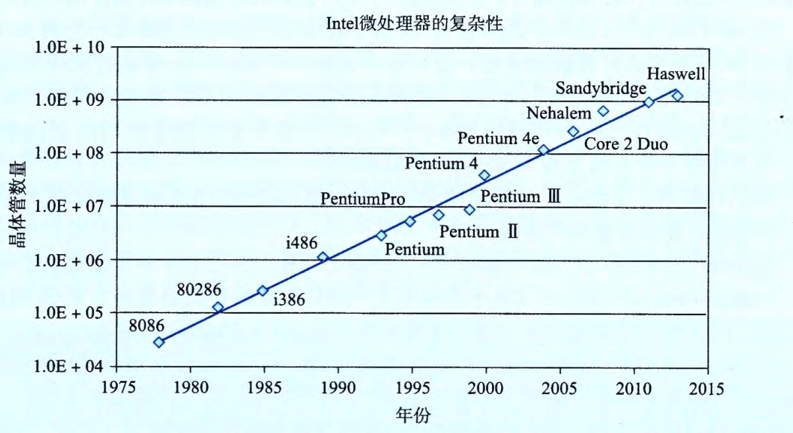
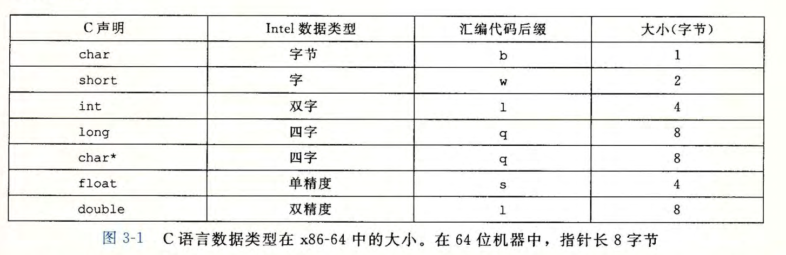
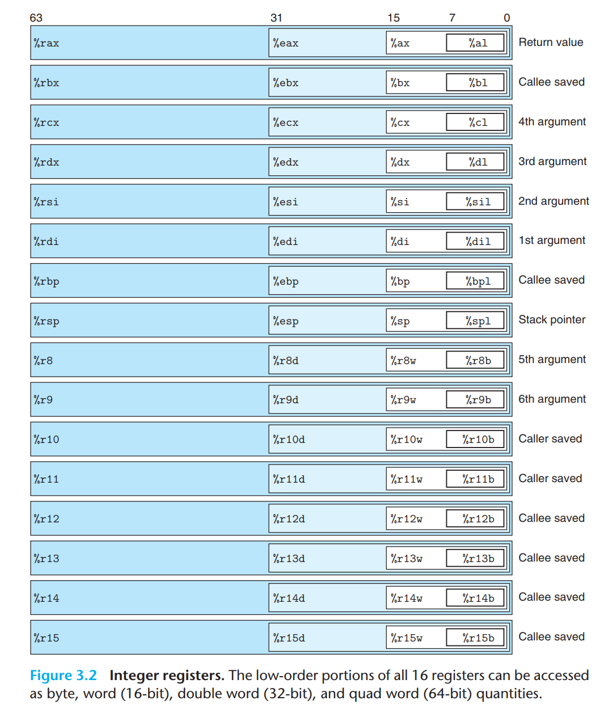
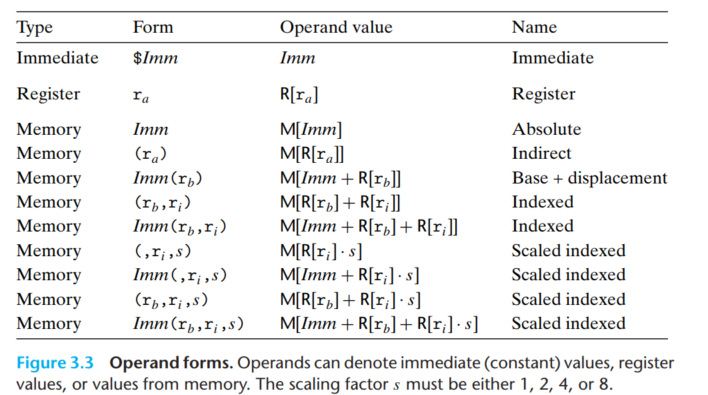
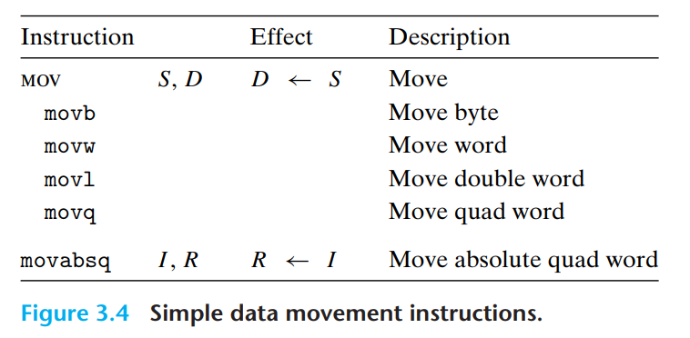
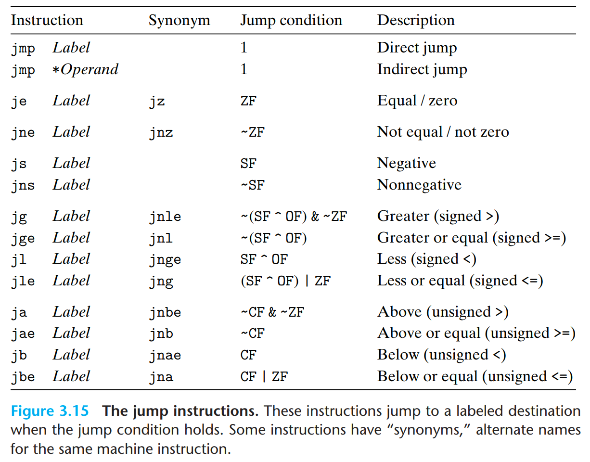

# 第三章 程序的机器级表示

计算机执行机器代码，用**字节序列编码低级的操作**，包括处理数据、管理内存、读写存储设备上的数据，以及利用网络通信。

编译器基于编程语言的规则、目标机器的指令集和操作系统遵循的惯例，经过一系列的阶段生成机器代码。

## 3.1 历史观点

> **Intel处理器模型**

- 8086(1978 年， 29K 个晶体管）
- 80286(1982 年， 134K 个晶体管）
- i386(1985 年， 275K 个晶体管）。将体系结构扩展到 32 位。增加了平坦寻址模式 (flat addressing model).Intel 系列中第一台全面支持 Unix 操作系统的机器。
- i486(1989 年， 1.2M 个晶体管）
- Pentium(l993 年， 3.1M 个晶体管）
- PentiumPro(l995 年， 5.5M 个晶体管）
- Pentium/MMX(1997 年， 4.5M 个晶体管）
- Pentium II(1997 年， 7M 个晶体管）
- Pentium III(1999 年， 8. 2M 个晶体管）
- Pentium 4(2000 年， 42M 个晶体管）。 SSE 扩展到了 SSE2, 增加了新的数据类型（包括双精度浮点数），以及针对这些格式的 144 条新指令
- Pentium 4E(2004 年， 125M 个品体管）。增加了超线程 (hyperthreading) 
- Core 2(2006 年， 291M 个晶体管）,Intel 的第一个多核微处理器，即多处理器实现在一个芯片上。但不支持超线程。
- Core i7, Nehalem(2008 年， 781M 个晶体管）
- Core i7, Sandy Bridge(2011 年， 1. 17G 个晶体管）
- Core i7, Haswell(2013 年， 1. 4G 个晶体管）

> **摩尔定理**

1965 年， Gordon Moore, Intel 公司的创始人，根据当时的芯片技术（那时他们能够在
一个芯片上制造有大约 64 个晶体管的电路 ） 做出推断，预测在未来 1 0 年，芯片上的晶体
管数量每年都会翻一番 。 这个预测就称为摩尔定律 。



***

## 3.2 程序编码

> gcc命令编译流程

- C 预处理器扩展源代码，插入所有用`#include` 命令指定的文件，并扩展所有用 `#define` 声明指定的宏
- 其次，编译器产生两个源文件的汇编代码，名字分别为 `p1.s` 和 `p2.s`
- 编器会将汇编代码转化成二进制目标代码文件 `p1.o` 和 `p2.o`。

### 3.2.1 机器级代码

计算机系统使用了多种不同形式的抽象，利用更简单的抽象模型来隐藏实现的细节。对于机器级编程来说，其中两种抽象尤为重要：

- **指令集体系结构或指令集架构** （Instruction Set Architecture, ISA) 来定义机器级程序的格式和行为，它定义了处理器状态、指令的格式，以及每条指令对状态的影响
- **机器级程序使用的内存地址是虚拟地址**，提供的内存模型看上去是一个非常大的字节数组。

> **对C语言程序员隐藏的处理器状态**

- 程序计数器（通常称为 "PC", 在 x86-64 中用`％rip` 表示）给出将**要执行的下一条指令在内存中的地址**。
- **整数寄存器文件**包含 16 个命名的位置，分别存储 64 位的值。这些寄存器可以存储地址（对应于 C 语言的指针）或整数数据。有的寄存器被用来记录某些重要的程序状态，而其他的寄存器用来保存临时数据，例如过程的参数和局部变量，以及函数的返回值。
- **条件码寄存器**保存着最近执行的算术或逻辑指令的状态信息。它们用来实现控制或数据流中的条件变化，比如说用来实现 if 和 while 语句。
- **一组向量寄存器**可以存放一个或多个整数或浮点数值。

汇编代码不区分有符号或无符号整数，不区分各种类型的指针，甚至于不区分指针和整数。

### 3.2.2 代码示例

- mstore.c

```c
long mult2(long, long);
void multstore(long x, long y, long *dest) {
    long t = mult2(x, y);
    *dest = t;
}
```

- 命令行上使用 "-S" 选项，就能看到 C 语言编译器产生的汇编代码：

```bash
linux> gcc -Og -S mstore.c # 产生一个汇编文件mstore.s
```

- 汇编代码

```asm
multstore:
    pushq   %rbx
    movq    %rdx, %rbx
    call    mult2
    movq    %rax, (%rbx)
    popq    %rbx
    ret
```

- 使用 "-c" 命令行选项， GCC 会编译并汇编该代码：
  
```bash
linux> gcc -Og -c mstore.c
```

- 产生目标代码文件 `mstore.o`

1368 字节的文件 mstore.o 中有一段 14 字节的序列，它的十六进制表示为：
53 48 89 d3 e8 00 00 00 00 48 89 03 5b c3

> **展示程序的字节表示**

- 反汇编器（后面会讲到）确定该过程的代码长度是 14 宇节 。 
- 然后，在文件 `mstore.o` 上运行 GNU 调试工具 GDB,输入命令：

```bash
(gdb) x/14xb multstore # 告诉GDB 显示（简写为 'x') 从函数 multstore 所处地址开始的 14 个十六进制格式表示（也简写为'x'）的字节（简写为 'b') 
```

> **反汇编器(disassembler)**

根据机器代码产生一种类似于汇编代码的格式，在 Linux 系统中，带`-d`扩命令行标志的程序 OBJDUMP( 表示 "object dump") 可以充当这个角色：

```bash
linux> objdump -d mstore.o
```

- 编译结果

```sh
Disassembly of function multstore in binary file mstore. o
1 0000000000000000 <multstore>:
# offset    Bytes                Equivalent assembly language
2 0:        53                       push %rbx
3 1:        48 89 d3                 mov %rdx,%rbx
4 4:        e8 00 00 00 00           callq 9 <multstore+Ox9>
5 9:        48 89 03                 mov %rax, (%rbx)
6 c:        5b                       pop %rbx
7 d:        c3                       retq
```

- **注意事项**
  - x86-64 的指令长度从 1 到 15 个字节不等。
  - 设计指令格式的方式是，从某个给定位置开始 ，可以将字节唯一 地解码成机器指令
  - 反汇编器只是基于机器代码文件中的**字节序列来确定汇编代码**。它不需要访问该程序的源代码或汇编代码。
  - 反汇编器使用的指令命名规则与 GCC 生成的汇编代码使用的有些细微的差别。例如GCC生成的汇编代码省略了结尾的`q`，反汇编器给 `call` 和 `ret` 指令添加了`q`后缀

### 3.2.3 关于格式的注解

> **带解释的汇编代码**

- 使用如下命令生成文件`mstore.s`

```sh
linux> gcc -Og -S mstore.c
```  

- `mstore.s`的完整内容如下：

```asm
# 所有以‘．’开头的行都是指导汇编器和链接器工作的伪指令。我们通常可以忽略这些
        .file
        .text
        .globl
        .type
multstore:
        pushq
        movq
        call
        movq
        popq
        ret
        .size multstore, .-multstore
        .ident "GCC: (Ubuntu 4.8.1-2ubuntu1-12.04) 4.8 . 1"
        .section .note.GNU-stack,1111,@progbits
```

- 带解释的汇编代码

```asm
# void multstore(long x, long y, long *dest)
# x in %rdi , y in %rsi , dest in %rdx
1   multstore:              
2   pushq %rbx              # Save %rbx
3   movq %rdx, %rbx         # Copy dest to %rbx
4   call mult2              # Call mult2(x, y)
5   movq %rax, (%rbx)       # Store result at *dest
6   popq %rbx               # Restore %rbx
7   ret                     # Return
```

> **网络旁注**

- 一个网络旁注描述的是 IA32 机器代码。
- 另外一个网络旁注简要描述了在 C 语言中插入汇编代码的方法
  - 一种方法是用汇编代码编写整个函数，在链接阶段把它们和 C 函数组合起来。
  - 另一种方法是利用 GCC 的支持，直接在 C 程序中嵌入汇编代码。

> **ATT 与 Intel 汇编代码格式**

ATT(根据 "AT&T" 命名的， AT&T 是运营贝尔实验室多年的公司）格式的汇编代码，这是 GCC 、 OBJDUMP 和其他一些我们使用的工具的默认格式 。

其他一些编程工具，包括 Microsoft 的工具，以及未自 Intel 的文档，其汇编代码都是Intel 格式的 。 

- **产生Intel格式的汇编代码**

```sh
linux> gcc -Og -S -masm=intel mstore.c
```

- 得到汇编代码

```asm
multstore:
    push rbx
    mov rbx, rdx
    call mult2
    mov QWORD PTR [rbx], rax
    pop rbx
    ret
```

- Intel 和 ATT 格式在如下方面有所不同：
  - Intel 代码省略了指示大小的后缀。我们看到指令 push 和 mov, 而不是 pushq 和 movq。
  - Intel 代码省略了寄存器名宇前面的`%`符号，用的是 `rbx`, 而不是 `% rbx` 。
  - Intel 代码用不同的方式来描述内存中的位置，例如是 `QWORD PTR [ rbx]` 而不是`( % rbx)` 
  - 在带有多个操作数的指令情况下，列出操作数的顺序相反。 当在两种格式之间进行转换的时候，这一点非常令人困惑。

> **将C程序与汇编代码结合起来**

- 笫一种是，我们可以编写完整的函数，放进一个独立的汇编代码文件中，让汇编器和链接器把它和用 C 语言书写的代码合并起来。
- 笫二种方法是，我们可以使用 GCC 的内联汇编 (inline assembly) 特性，用 asm 伪指令可以在 C 程序中包含简短的汇编代码。这种方法的好处是减少了与机器相关的代码量。
  
***

## 3.3 数据格式

由于是从 16 位体系结构扩展成 32 位的， Intel 用术语 **”字 (word)" 表示 16 位数据类型**

因此，称 32 位数为“双字 (double words)", 称 64 位数为“四字 (quad words)" 。

C 语言基本数据类型对应的 `x86-64` 表示



x86 家族的微处理器历史上实现过对一种特殊的 80 位 (10 字节）浮点格式进行全套的浮点运算。可以在 C 程序中用声明 `long double` 来指定这种格式。不过我们不建议使用这种格式。它不能移植到其他类型的机器上，而且实现的硬件也不如**单精度和双精度算术运算的高效**。

大多数 GCC 生成的汇编代码指令都有一个**字符的后缀，表明操作数的大小**。数据传送指令有四个变种： `movb`( 传送字节）、 `movw`( 传送字）、 `movl`( 传送双字）和 `movq`( 传送四字）。

后缀 'l' 表示 4 字节整数“长字 (longword)"和 8 字节双精度浮点数。

***

## 3.4 访问信息

一个 x86-64 的中央处理单元 (CPU) 包含一组 **16** 个**存储 64 位值**的通用目的寄存器。这些寄存器用来**存储整数数据和指针**，寄存器如下图所示



- 名字都以 `%r`开头，不过后面还跟着一些不同的命名规则的名字，这是由于指令集历史演化造成的
- 最初的 8086 中有 8 个 16 位的寄存器，即图 3-2 中的 `%ax` 到 `%bp`
- 扩展到 IA32 架构时，这些寄存器也扩展成 32位寄存器，标号从 `%eax` 到 `%ebp`
- 扩展到 x86-64 后，原来的 8 个寄存器扩展成 64 位，标号从 `%rax` 到 `%rbp`,还增加了 8 个新的寄存器，它们的标号是按照新的命名规则制定的：从 `%r8` 到 `%r15` 。
- 最特别的是栈指针 `%rsp`, 用来指明运行时栈的结束位置

### 3.4.1 操作数指示符

大多数指令有 **一个或多个操作数** (`operand`), 指示出执行一个操作中要使用的**源数据值**，以及放置**结果的目的位置**



> **x86-64 支持的操作数格式**

- 第一种类型是立即数 (immediate) , 用来表示常数值。书写方式是`$`后面跟一个用标准 C 表示法表示的整数，比如 `$-577,$0x1F`。汇编器会自动选择最紧凑的方式进行数值编码
- 第二种类型是寄存器 (`register`) , 它表示某个寄存器的内容， 16 个寄存器的低位 1 字节、 2 字节、 4 字节或 8 字节中的一个作为操作数，这些字节数分别对应于 8位、 16 位、 32 位或 64位。用符号 `ra` 来表示任意寄存器 `a`, 用引用 `R[ra]`来表示它的值，这是**将寄存器集合看成一个数组 `R`, 用寄存器标识符作为索引 。**
- 第三类操作数是内存引用，它会根据**计算出来的地址（通常称为有效地址）访问某个内存位置** 。用符号$M_{b}[Addr]$ 表示对存储在内存中从地址 `Addr` 开始的 `b` 个字节值的引用 。 为了简便，我们通常省去下标 `b` 。

> **寻址模式**

表中底部用语法$Imm(r_b, r_i, s)$ 表示的是最常用的形式，这样的引用有四个组成部分：

- 一个立即数偏移`Imm`
- 一个基址寄存器 $r_b$
- 一个变址寄存器 `r`
- 一个比例因子 `s`,这里`s`必须是 `1、2、4或者8`
- 基址和变址寄存器都必须是 64 位寄存器。有效地址被计算为 $Imm+R[r_b]+R[r_i]*s$

### 3.4.2 数据传送指令

最频繁使用的指令是**将数据从一个位置复制到另一个位置的指令**。操作数表示的通用性使得一条简单的数据传送指令能够完成在许多机器中要好几条不同指令才能完成的功能。

> **最简单形式的数据传送指令 - MOV 类**

MOV 类由四条指令组成： `movb 、 movw 、 movl 和 movq`



- 第一个是**源操作数**，**指定的值是一个立即数**，存储在寄存器中或者内存中
- 第二个是**目的操作数**，**指定一个位置**，要么是一个寄存器或者是一个内存地址。
- x86-64 加了一条限制，传送指令的**两个操作数不能都指向内存位置**。将一个值从一个内存位置复制到另一个内存位置需要两条指令：
  - 第一条指令将源值加载到寄存器中
  - 第二条将该寄存器值写入目的位置
- 指令的**寄存器操作数**可以是 16 个寄存器有标号部分中的任意一个（参考fig3.2），寄存器部分的大小必须与指令最后一个字符 `('b','w','l' 或 'q')` 指定的大小匹配。大多数情况中， `MOV` 指令只会更新目的操作数指定的那些寄存器字节或内存位置
- 最后一条指令是处理 **64 位立即数数据**。常规的 `movq` 指令只能以表示为 32 位补码数字的立即数作为源操作数，然后把这个值符号扩展得到 64 位的值，放到目的位置 。 `movabsq` 指令能够以任意 64 位立即数值作为源操作数，并且**只能以寄存器作为目的** 。
  
**MOV 指令示例给出了源和目的类型的五种可能的组合**

```asm
movl $0x4050,%eax     # Immediate--Register, 4 bytes
movw %bp,%sp          # Register--Register, 2 bytes
movb (%rdi,%rcx),%al  # Memory一Register, 1 byte
movb $-17, (%rsp)     # Immediate--Memory, 1 byte
movq %rax,-12(%rbp)   # Register--Memory, 8 bytes
```

> **MOVZ类 和 MOVS类**

两类数据移动指令，在**将较小的源值复制到较大的目的时使用**。所有这些指令都**把数据从源（在寄存器或内存中）复制到目的寄存器。**

每条指令名字的最后两个字符都是大小指示符：第一个字符指定源的大小，而第二个指明目的的大小

`MOVZ` 类中的指令把目的操作数中**剩余的字节填充为 0**


`MOVS` 类中的指令**通过符号扩展来填充**，把源操作数的最高位进行复制。

`cltq` 指令没有操作数：它总是以寄存器 `%eax` 作为源， `%rax` 作为符号扩展结果的目的。它的效果与指令 `movslq %eax, %rax` 完全一致，不过编码更紧凑。


> **理解数据传送如何改变目的寄存器**

```asm
1 movabsq $0x0011223344556677, %rax     # %rax = 0011223344556677
2 movb $-1, %al                         # %rax = 00112233445566FF
3 movw $-1, %ax                         # %rax = 001122334455FFFF
4 movl $-1, %eax                        # %rax = 00000000FFFFFFFF
5 movq $-1, %rax                        # %rax = FFFFFFFFFFFFFFFF
```

- 第 1 行的指令把寄存器 ％rax 初始化为位模式 0011223344556677 。剩下的指令的源头操作数值是立即数值 -1 。 -1 的十六进制表示形如 `FF … F`, 这里 F 的数量是表述中字节数量的两倍。
- 因此 movb 指令（第 2 行）把 %rax 的低位字节设置为 FF
- movw 指令（第 3 行）把低 2 位字节设置为 FFFF,剩下的字节保持不变。
- movl 指令（第 4 行）将低 4 个字节设置为 FFFFFFFF, 同时把高位 4 字节设置为 00000000
- movq 指令（第 5 行）把整个寄存器设置为 FFFFFFFFFFFFFFFF

> **字节传送指令比较**

下面这个示例说明了不同的数据传送指令**如何改变或者不改变目的的高位字节**

```asm
1 movabsq $0x0011223344556677, %rax     # %rax = 0011223344556677
2 movb $0xAA, %dl                       # %dl = AA
3 movb %dl,%al                          # %rax = 00112233445566AA
4 movsbq %dl,%rax                       # %rax = FFFFFFFFFFFFFFAA
5 movzbq %dl,%rax                       # %rax = 00000000000000AA
```

- 代码的头 2 行将寄存器 `%rax` 和 `%dl`分别初始化为 `0011223344556677` 和 `AA`。 
- 剩下的指令都是将 `%rdx` 的低位字节复制到 `%rax`的低位字节 。
- `movb` 指令（第 3 行）不改变其他字节节 。
- 根据源字节的最高位， `movsbq` 指令（第4行）将其他 7 个宇节设为全1 或全 0 。 由于十六进制 A 表示二进制值 1010, 符号扩展会把高位字节都设置为 FF。
- `movzbq` 指令（第 5 行）总是将其他 7 个字节全都设置为 0 。

***

### 3.4.3 数据传送示例

> **C源代码**

```c
long exchange(long *xp, long y)
{
    long x = *xp;
    *xp = y;
    return x;
}
```

> **Assembly code**

```asm
  #  long exchange(long *xp, long y)
  #  xp in %rdi, y in %rsi
1 exchange:
2   movq (%rdi), %rax     # Get x at xp. Set as return value.
3   movq %rsi, (%rdi)     # Store y at xp.
4   ret
```

- 程序开始执行时，过程参数 `xp` 和 `y` 分别存储在寄存器 `%rdi` 和 `%rsi` 中。
- 然后，指令 2 从内存中读出 x, 把它存放到寄存器 `%rax` 中，直接实现了 C 程序中的操作 x=*xp。
- 稍后，用寄存器 `%rax` 从这个函数返回一个值，因而返回值就是 `x` 。
- 指令 3 将 y 写入到寄存器 `%rdi` 中的 xp 指向的内存位置，直接实现了操作 *xp=y。
- 这个例子说明了如何用 MOV指令**从内存中读值到寄存器（第 2 行）**，**如何从寄存器写到内存（第 3 行）**。

> **注意事项**

- 首先，我们看到 C 语言中所谓的”指针”其实就是地址。间接引用指针就是将该指针放在一个寄存器中，然后在内存引用中使用这个寄存器。
- 其次，像 x 这样的局部变量通常是保存在寄存器中，而不是内存中。访问寄存器比访问内存要快得多。

### 3.4.4 压入和弹出数据

最后两个数据传送操作可以**将数据压入程序栈中**，以及**从程序栈中弹出数据**。通过 `push` 操作把数据压入栈中，通过 `pop` 操作删除数据。


栈是一种数据结构，可以添加或者删除值，不过要遵循 **“后进先出”** 的原则。弹出的值永远是最近被压入而且仍然在栈中的值。

栈可以实现为一个数组，总是从数组的一端插入和删除元素。这一端被称为栈顶。

如图 3-9 所示，栈向下增长，这样一来，**栈顶元素的地址是所有栈中元素地址中最低的**。（根据惯例，我们的栈是倒过来画的，栈“顶”在图的底部。）栈指针 `%rsp` 保存着栈顶元素的地址。


> **push 和 pop的等价指令**

将一个四字值压入栈中，首先要将栈指针减 8, 然后将值写到新的栈顶地址。因此，指令 `pushq %rbp` 等价于下面两条指令：

```asm
subq $8, %rsp    # Decrement stack pointer
movq %rbq,(%rsp) # Store %rbp on stack
```

弹出一个四字的操作包括从栈顶位置读出数据，然后将栈指针加 8 。因此，指令 `popq %rax` 等价于下面两条指令：

```asm
movq (%rsp),%rax # Read %rax from stack
addq $8,%rsp     # Increment stack pointer
```

## 3.5 算数和控制逻辑操作

图 3-10 列出了 x86-64 的一些整数和逻辑操作。大多数操作都分成了指令类，这些指令类有各种带不同大小操作数的变种（只有 leaq 没有其他大小的变种），给出的每个指令类都有对这四种不同大小数据的指令。

例如，指令类 `ADD` 由四条加法指令组成：`addb 、 addw 、 addl 和 addq`, 分别是字节加法、字加法、双字加法和四字加法。

指令类可以分以分为:

- 加载有效地址
- 一元操作
- 二元操作
- 移位


### 3.5.1 加载有效地址

加载有效地址 (**load effective address**) 指令 `leaq` 实际上是 `movq` 指令的变形。它的指令形式是从内存读数据到寄存器，但实际上**它根本就没有引用内存**。

它的**第一个操作数**看上去是一个内存引用，但该指令并不是从指定的位置读入数据，而是将有效地址写入到目的操作数。**目的操作数**必须是一个寄存器。

> **举例**

例如，如果寄存器 `%rdx` 的值为 `x`, 那么指令 `leaq 7 (%rdx, %rdx , 4)`, `%rax` 将设置寄存器 `%rax` 的值为 `5x+7` 。

**C code:**

```c
long scale(long x, long y, long z) {
  long t = x + 4 * y + 12 * z;
  return t;
}
```

**Assembly code:**

```asm
# long scale(long x, long y, long z)
# x in %rdi, y in %rsi, z in %rdx
scale:
leaq (%rdi,%rsi,4), %rax  # x + 4*y
leaq (%rdx,%rdx,2), %rdx  # z + 2*z = 3*z
leaq (%rax,%rdx,4), %rax  # (x+4*y) + 4*(3*z) = x + 4*y + 12*z
ret
```

### 3.5.2 一元和二元操作

> **一元操作**

**一元操作**，只有一个操作数，既是源又是目的。这个操作数可以是一个寄存器，也可以是一个内存位置。比如说，指令 `incq( % rsp)` 会使栈顶的 8 字节元素加 1 。

> **二元操作**

**二元操作**，

- 源操作数是第一个,第一个操作数可以是**立即数、寄存器或是内存位置**
- 目的操作数是第二个，第二个操作数既是源又是目的。第二个操作数可以是寄存器或是内存位置。注意，当第二个操作数为内存地址时，处理器必须从内存读出值，执行操作，再把结果写回内存。
- 这种语法让人想起 C 语言中的赋值运算符，例如 x-=y。
  
例如，指令 `subq %rax, %rdx` 使寄存器 `%rdx` 的值减去 `%rax` 中的值。（将指令解读成“从 `%rdx` 中减去 `%rax`" 会有所帮助。）

### 3.5.3 移位操作

最后一组是移位操作，先给出**移位量**，然后**第二项给出的是要移位的数**。

- 移位量可以是一个立即数，或者放在单字节寄存器 `%cl` 中。（这些指令很特别，因为只允许以这个特定的寄存器作为操作数。）原则上来说， 1 个字节的移位量使得移位量的编码范围可以达到 $2^8 — 1=255$。
- x86 - 64 中，移位操作对 w 位长的数据值进行操作，移位量是由 `%cl` 寄存器的低 m 位决定的，这里$2^m=w$ 。高位会被忽略。所以，例如当寄存器 `%cl` 的十六进制值为 `OxFF` 时，指令 `salb` 会移 7 位， `salw` 会移 15 位， `sall` 会移31 位，而 `salq` 会移 63 位。
- **移位操作的目的操作数**可以是一个寄存器或是一个内存位置

> **左移指令**

左移指令有两个名字： SAL 和 SHL 。两者的效果是一样的，都是将右边填上 0。

> **右移指令**

- SAR 执行算术移位（填上符号位）
- SHR 执行逻辑移位（填上 0)
- 图 3-10 中用 $>>_A$ (算术）和$>>_L$逻辑）来表示这两种不同的右移运算。

### 3.5.4 讨论

上述大多数指令，既可以用于无符号运算，也可以用于补码运算。只有右移操作要求区分**有符号和无符号数**。这个特性使得**补码运算**成为**实现有符号整数运算的一种比较好的方法的原因之一** 。

> **执行算术操作的函数示例**

- **C code**

```c
long arith(long x, long y, long z)
{
    long t1 = x ^ y;
    long t2 = z * 48;
    long t3 = t1 & 0x0F0F0F0F;
    long t4 = t2 - t3;
    return t4;
}
```

- Assembly Code

```asm
  #  long arith(long x, long y, long z)
  #  x in %rdi, y in %rsi, z in %rdx
1 arith:
2   xorq %rsi, %rdi           # t1 = x ^ y
3   leaq (%rdx,%rdx,2), %rax  # 3*z
4   salq $4, %rax             # t2 = 16 * (3*z) = 48*z
5   andl $252645135, %edi     # t3 = t1 & 0x0F0F0F0F
6   subq %rdi, %rax           # Return t2 - t3
7   ret
```

### 3.5.5 特殊的算术操作

x86-64 指令集对 128 位 (16 字节 ） 数的操作提供有限的支持。延续字 (2 字节）、双字 (4 字节）和四字 (8 字节）的命名惯例， Intel 把 16 字节的数称为八字 (`oct word`)。

图 3-12 描述的是支持产生两个 64 位数字的全 128 位**乘积以及整数除法**的指令。


- `imulq` 指令有两种不同的形式。其中一种，如图 3-10 所示 ，是 IMUL 指令类中的一种 。 这种形式的 `imulq` 指令是一个 **“双操作数＂乘法指令**。 它从两个 64 位操作数产生一个 64 位乘积，实现了 2.3.4 和 2.3.5 节中描述的操作 $*^u_64$ 和 $*^t_64$。(回想一下，当将乘积截取到 64 位时，无符号乘和补码乘的位级行为是一样的。）
- x86-64 指令集还提供了两条不同的 **“单操作数”乘法指令**，以计算两个 64 位值的全 128 位乘积
  - 一个是**无符号数乘法** (mulq), 而另一个是**补码乘法** (`imulq`) 。
  - 这两条指令都要求**一个参数必须在寄存器`%rax`** 中，而**另一个作为指令的源操作数给出**。
  - 然后乘积存放在寄存器 `%rdx`( 高 64 位）和 `%rax`( 低 64 位）中。
  - 虽然 `imulq` 这个名字可以用于两个不同的乘法操作，但是汇编器能够通过计算操作数的数目，分辨出想用哪条指令。

> **示例：如何从两个无符号 64 位数字 x 和 y 生成 128 位的乘积**

```c
#include <inttypes.h>       // 定义了一个数据类型 uintl28_t
typedef unsigned __int128 uint128_t;
void store_uprod(uint128_t *dest, uint64_t x, uint64_t y) {
    *dest = x * (uint128_t) y;
}
```

```asm
    # void store_uprod(uint128_t *dest, uint64_t x, uint64_t y)
    # dest in %rdi, x in %rsi, y in %rdx
1 store_uprod:
2   movq %rsi, %rax     # Copy x to multiplicand
3   mulq %rdx           # Multiply by y
4   movq %rax, (%rdi)   # Store lower 8 bytes at dest
5   movq %rdx, 8(%rdi)  # Store upper 8 bytes at dest+8
6   ret
```

**存储乘积需要两个 movq 指令**：一个存储低 8 个字节（第 4 行），一个存储高 8 个字节（第 5 行）。由于生成这段代码针对的是小端法机器，所以高位字节存储在大地址，正如地址 8(%rdi) 表明的那样。

> **除法**

上述算术运算表没有列出除法或取模操作，这些操作是由**单操作数除法指令**来提供的，类似于单操作数乘法指令

有符号除法指令`idivl`将寄存器 `%rdx`(高64位）和 `%rax`(低64位)中的 128 位数作为**被除数**，而**除数作为指令的操作数给出**。指令将**商存储在寄存器 `%rax` 中**，将**余数存储在寄存器 `%rdx` 中**。

对于大多数 **64 位除法应用**来说，除数也常常是一个 64 位的值。这个值应该存放在`％rax` 中， `%rdx` 的位应该设置为**全0(无符号运算）或者 `%rax` 的符号（有符号运算）**。后面这个操作可以用指令 `cqto` 包来完成。这条指令不需要操作数一一它隐含读出 `%rax` 的符号位，并将它复制到 `%rdx` 的所有位。

> **x86-64 如何实现除法**

下列C函数计算了两个 64 位有符号数的商和余数

```c
void remdiv(long x, long y,long *qp, long *rp) {
  long q = x/y;
  long r = x%y;
  *qp = q;
  *rp = r;
}
```

```asm
    # void remdiv(long x, long y, long *qp, long *rp)
    # x in %rdi, y in %rsi, qp in %rdx, rp in %rcx
1 remdiv:
2   movq %rdx, %r8    # Copy qp
3   movq %rdi, %rax   # Move x to lower 8 bytes of dividend
4   cqto              # Sign-extend to upper 8 bytes of dividend
5   idivq %rsi        # Divide by y
6   movq %rax, (%r8)  # Store quotient at qp
7   movq %rdx, (%rcx) # Store remainder at rp
8   ret
```

在上述代码中，必须首先把参数 `qp` 保存到另一个寄存器中（第 2 行），因为除法操作要使用参数寄存器 `%rdx` 。
第 3~4 行准备被除数，复制并符号扩展 x 。除法之后，寄存器 `%rax` 中的商被保存在 `qp`( 第 6 行），而寄存器 `%rdx` 中的余数被保存在 `rp`( 第 7 行）。

***

## 3.6 控制

机器代码提供两种基本的低级机制来实现有条件的行为：测试数据值，然后根据测试的结果来改变控制流或者数据流。

### 3.6.1 条件码

除了整数寄存器， CPU 还维护着一组单个位的条件码 (**condition code**) 寄存器，它们描述了最近的算术或逻辑操作的属性。可以检测这些寄存器来执行条件分支指令。最常用的条件码有：

- CF: 进位标志。最近的操作使最高位产生了进位。可用来检查无符号操作的溢出。
- ZF: 零标志。最近的操作得出的结果为 0。
- SF: 符号标志。最近的操作得到的结果为负数。
- OF: 溢出标志。最近的操作导致一个补码溢出——正溢出或负溢出。

假设我们用一条 ADD 指令完成等价千 C 表达式 t=a+ b 的功能，这里变量a、b 和 t 都是整型的。然后，根据下面的 C 表达式来设置条件码：

- CF (unsigned) t < (unsigned) a Unsigned overflow
- ZF (t == 0) Zero
- SF (t < 0) Negative
- OF (a < 0 == b < 0) && (t < 0 != a < 0) Signed overflow

> **设置条件码指令**

图3-10中整数算数指令中，leaq 指令不改变任何条件码，其他所有指令都会设置条件码。

- 对于逻辑操作，例如 XOR, 进位标志和溢出标志会设置成 0。
- 对于移位操作，进位标志将设置为最后一个被移出的位，而溢出标志设置为 0 。
- INC 和 DEC 指令会设置溢出和零标志，但是不会改变进位标志。

除3-10中指令会设置条件码外，还有两类指令（有 8、16、32 和 64位形式），它们**只设置条件码而不改变任何其他寄存器**


- CMP 指令根据两个操作数之差来设置条件码。除了只设置条件码而不更新目的寄存器之外， CMP 指令与 SUB 指令的行为是一样的。
- 在 ATT 格式中，列出操作数的顺序是相反的，这使代码有点难读。
- 如果两个操作数相等，这些指令会将零标志设置为 1, 而其他的标志可以用来确定两个操作数之间的大小关系。
- TEST 指令的行为与 AND 指令一样，除了它们只设置条件码而不改变目的寄存器的值。

### 3.6.2 访问条件码

条件码通常不会直接读取，常用的使用方法有三种：

- 可以根据条件码的某种组合，将一个字节设置为 0 或者 1
- 可以条件跳转到程序的某个其他的部分
- 可以有条件地传送数据

> **SET指令**

下图中描述的指令根据条件码的某种组合，将一个字节设置为 0 或者 1。我们将这一整类指令称为 `SET` 指令。
它们**之间的区别**就在于它们考虑的条件码的组合是什么，这些**指令名字的不同后缀指明了它们所考虑的条件码的组合**。这些后缀表示**不同的条件而非不是操作数大小**。


某些底层的机器指令可能有多个名字，我们称之为“**同义名 (synonym)**" 。

**SET指令，会执行比较指令，根据计算 `t =a-b`设置条件码**:
- 溢出(`OF`)和符号位(`SF`)的 `EXCLUSIVE-OR` 提供了 `a<b` 是否为真的测试。
- 其他的有符号比较测试基于 `SF ^ OF` 和 `ZF` 的其他组合。

无符号比较的测试中，使用的是进位标志(`CF`)和零标志(`ZF`)的组合。

### 3.6.3 跳转指令

**跳转 (`jump`) 指令**:会导致执行切换到程序中一个全新的位置。跳转的目的地通常用一个标号(`label`) 指明。

如下图列举了不同的跳转指令



表中所示的其他跳转指令都是有条件的 它们根据条件码的某种组合，或者跳转，或者继续执行代码序列中下一条指令

### 3.6.4 跳转指令的编码

### 3.6.5 用条件控制来实现条件分支

### 3.6.6 用条件传送来实现条件分支

### 3.6.7 循环

### 3.6.8 switch语句

***

## 3.7 过程

### 3.7.1 运行时栈

### 3.7.2 转移控制

### 3.7.3 数据传送

### 3.7.4 栈上的局部存储

### 3.7.5 寄存器中的局部存储空间

### 3.7.6 递归过程

***

## 3.8 数组分配和访问

### 3.8.1 基本原则

### 3.8.2 指针运算

### 3.8.3 嵌套的数组

### 3.8.4 定长数组

### 3.8.5 变长数组

***

## 3.9 异数的数据结构

### 3.9.1 结构体

### 3.9.2 联合

### 3.9.3 数据对齐

***

## 3.10 在机器级程序中将控制与数据结合起来

### 3.10.1 理解指针

### 3.10.2 应用：使用 GDB 调试器

### 3.10.3 内存越界引用和缓冲区溢出

### 3.10.4 对抗缓冲区溢出攻击

### 3.10.5 支持变长栈帧

***

## 3.11 浮点代码

### 3.11.1 浮点传送和转换操作

### 3.11.2 过程中的浮点代码

### 3.11.3 浮点运算操作

### 3.11.4 定义和使用浮点常数

### 3.11.5 在浮点代码中使用位级操作

### 3.11.6 浮点比较操作

### 3.11.7 对浮点代码的观察结论

***
