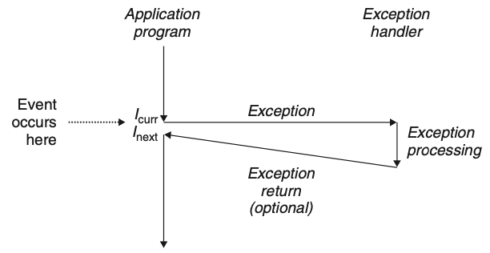

# 第八章 异常控制流

处理器按照一定的序列的地址执行对应的指令，从这一个地址过渡到下一个地址称为**控制转移**，这样的控制转移序序列称为处理器的**控制流（flow of control 或者 control flow）**。

系统必须能够对系统状态的变化做出反应，这些系统状态不是被内部程序变量捕获的，而且也不一定要和程序的执行相关。比如，一个硬件定时器定期产生信号，这个事件必须得到处理。当子进程终止时，创造这些子进程的父进程必须得到通知。

现代系统通过**使控制流发生突变**来应对上述情况。这些突变称为**异常控制流(Exceptional Control Flow, ECF)**。异常控制流发生在计算机系统的各个层次，如：

- 在硬件层，硬件检测到的事件会触发控制突然转移到异常处理程序。
- 在操作系统层，内核通过上下文转换将控制从一个用户进程转移到另一个用户进程。
- 在应用层，一个进程可以发送信号到另一个进程，而接受者会将控制突然转移到它的一个信号处理程序。一个程序可以通过回避通常的栈规则，并执行到其他函数中任意位置的非本地跳转来对错误做出反应。

理解ECF的重要性：

- 理解 ECF 将帮助**理解重要的系统概念**。 ECF 是操作系统用来实现 I/0、进程和虚拟内存的基本机制。
- 理解 ECF 将帮助**理解应用程序是如何与操作系统交互的** 。应用程序通过使用一个叫做陷阱(trap)或者系统调用 (system call)的 ECF形式，向操作系统请求服务。 比如，向磁盘写数据、从网络读取数据、创建一个新进程，以及终止当前进程，都是通过应用程序调用系统调用来实现的。
- 理解 ECF 将帮助**编写有趣的新应用程序**。操作系统为应用程序提供了强大的 ECF 机制，用来创建新进程、等待进程终止、通知其他进程系统中的异常事件，以及检测和响应这些事件。如果理解了这些 ECF 机制，那么你就能用它们来编写如 Unix shell 和 Web 服务器之类的有趣程序了。
- 理解 ECF 将帮助**理解并发**。 ECF 是计算机系统中实现并发的基本机制。在运行中的并发的例子有:中断应用程序执行的异常处理程序，在时间上重叠执行的进程和线程，以及中断应用程序执行的信号处理程序。
- 理解 ECF 将帮助**理解软件异常如何工作**。像 C++ 和 Java 这样的语言通过 try、 catch 以及 throw 语句来提供软件异常机制。软件异常允许程序进行非本地跳转 (即违反通常的调用 /返回栈规则的跳转)来响应错误情况。非本地跳转是一种应用层 ECF, 在 C 中是通过 setjmp 和 longjmp 函数提供的。理解这些低级函数将帮助理解高级软件异常如何得以实现。

本章重点：**学习应用如何与操作系统交互（围绕 ECF）**

- 异常：位于硬件与操作系统交界的部分
- 系统调用：为应用程序提供到操作系统的入口点的异常
- 进程和信号：位于应用和操作系统的交界处
- 非本地跳转：ECF的一种应用形式

## 8.1 异常

**异常（Exception）：**就是控制流中的突变，**用来响应处理器状态中的某些变化**，而将控制权转移到操作系统内核。

- 内核是操作系统的内存驻留部分
- 事件的例子：一条指令试图除以0，算术溢出，虚拟内存缺页，

**异常剖析**

处理器检测到有事件发生后，通过异常表的跳转表，进行一个间接过程调用（异常），到异常处理程序（操作系统子程序），异常处理程序处理完成后，根据引起异常的事件类型，会发生以下三种情况的一种：

- 处理程序将控制返回给当前指令${I_cur}$
- 处理程序将控制返回给${I_next}$
- 处理程序终止被中断的程序。

****

## 8.2 进程

进程：一个执行中程序的实例。系统中的每个程序都运行在某个进程的上下文中。

本节关注进程提供给应用程序的关键抽象：

- 一个独立的逻辑控制流
- 一个私有的地址空间

### 8.2.1 逻辑控制流

### 8.2.2 并发流

一个逻辑控制流的执行在时间上与另一个流重叠，称为并发流。

### 8.2.3 私有地址空间

### 8.2.4 用户模式和内核模式

处理器提供的，用于**限制应用程序****可执行的指令**以及其**可以访问的地址空间**

### 8.2.5 上下文切换

上下文切换：一种较高层级的异常流控制，用于实现多任务。

****

## 8.3 系统调用错误处理

Fork 调用

****

## 8.4 进程控制

### 8.4.1 获取进程ID

getpid

getppid

### 8.4.2 创建和终止进程

fork函数

### 8.4.3 回收子进程

进程终止时，内核并未立即将其从系统中清除，而是保持在已终止状态，直到被父进程回收。

waitpid 函数

### 8.4.4 让进程休眠

sleep 函数

pause 函数

### 8.4.5 加载并运行程序

execve 函数在当前进程的上下文中加载并运行一个新的程序

### 8.4.6 利用 fork 和 execve 运行程序

****

## 8.5 信号

信号：一种更高层的软件形式的异常，允许进程和内核中断其他进程。其本质就是一条小消息，通知进程系统中发生了一个某种类型的事件。

### 8.5.1 信号术语

发送信号

接收信号

### 8.5.2 发送信号

进程组

用/bin/kill 程序发送信号

从键盘发送信号

用 kill 函数发送信号

用 `alarm` 函数发送信号

### 8.5.3 接收信号

### 8.5.4 阻塞和解除阻塞信号

### 8.5.5 编写信号处理程序

安全的信号处理：

正确的处理信号

可移植的信号处理

### 8.5.6 同步流以避免讨厌的并发错误

1️以某种方式同步并发流，从而得到最大的可行的交错的集合

### 8.5.7 显式地等待信号

****

## 8.6 非本地跳转

c 语言提供了一种用户级异常控制流形式，成为非本地跳转(nonlocal jump)，它将控制直接从一个函数转移到另一个当前正在执行的函数。

****

## 8.7 操作进程的工具

STRACE：打印一个正在运行的程序和它的的子程序调用的每个系统的轨迹

PS：列出当前系统中进程(包括僵死进程)

TOP：打印出关于当前进程资源的使用信息

PMAP：显示进程的内存映射

/proc：一个虚拟文件系统，以ASCII文本格式输出大量内核数据结构的内容。

****

## 8.8 小结