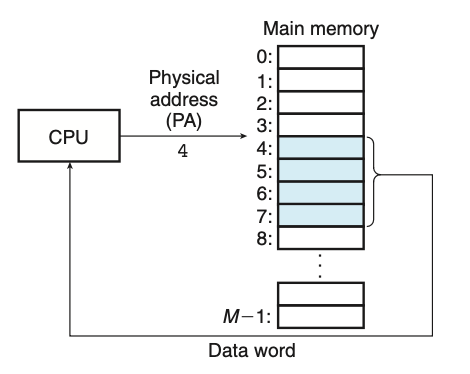
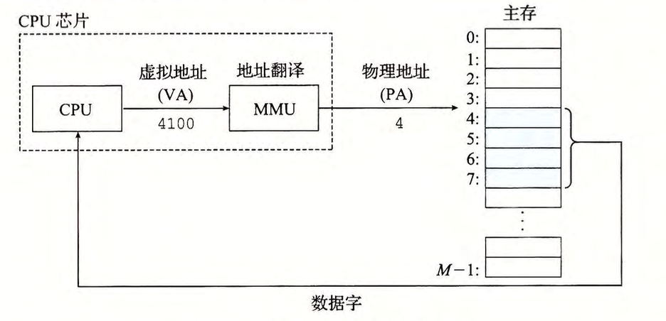

# 第九章 虚拟内存

虚拟内存：为了更加有效地管理内存并且减少出错，现代操作系统提供的**对主存的一种抽象概念**。

虚拟内存是硬件异常、硬件地址翻译、主存、磁盘文件和内核软件的完美交互，**为每一个进程提供了一个大的、一致的和私有的地址空间。**

三个重要能力：

- 虚拟内存将**主存视为存储在磁盘上的地址空间的高速缓存**。在主存中只保存活动区域，并根据需要在磁盘和主存之间来回传递数据。
- 为每个进程提供**一致的地址空间**，简化内存管理。
- **保护**每个进程的地址空间不被其他进程破坏。

本章视角：

- 描述虚拟内存如何工作
- 应用程序如何使用与管理虚拟内存

****

## 9.1 物理和虚拟寻址

物理地址（Physical Address）：计算机主存被组织成一个由 M 个连续的字节大小的单元组成的数组。每个字节都有一个唯一的物理地址。

物理寻址（Physical Addressing）：CPU 通过物理地址访问内存的方式称为物理寻址。

虚拟寻址(virtual addressing)：CPU通过虚拟地址(Virtual Address)来访问主存的寻址方式。

CPU --> 虚拟地址(VA) --> 地址翻译(MMU) --> 物理地址(PA)

地址翻译(address transalation)：虚拟地址转换为物理地址的任务

内存管理单元(Memory Management Unit, MMU)：CPU芯片上的硬件，利用存放在主存中的查询表来动态翻译虚拟地址。查询表的内容由操作系统管理。

****

## 9.2 地址空间

**地址空间**(address space)：非负整数地址的有序集合：
${\{0,1,2,...\}}$

如果地址空间中的整数是连续的，则称其为线性地址空间(linear address space)。为了简化讨论，总是假设使用的是线性地址空间。

**虚拟地址空间**(virutal address space)：CPU从有 ${N=2^n}$ 个地址的地址空间中生成虚拟地址， 这个地址空间称为虚拟地址空间(virtual address space)：${0,1,2...N-1}$。

**物理地址空间**：对应于系统中物理内存的 M 个字节：${0,1,2...M-1}$。

**地址空间的大小**：由表示最大地址所需要的位数来描述。如包含 ${N=2^n}$ 个地址的虚拟地址空间就叫做一个 n 位地址空间。对于一个物理地址空间，M 不要求是 2 的幂，为了简化讨论假设${M=2^m}$

**地址空间的意义**：地址空间清楚地区分了数据对象（字节）和它们的属性（地址）。基于这种区别，就可以将其推广，**允许每个数据对象有多个独立的地址，其中每个地址选自一个不同的地址空间**。这也是虚拟内存的基本思想。

主存中每个数据对象都有两个地址，一个是选自虚拟地址空间的虚拟地址，一个是选自物理地址空间的物理地址。

****

## 9.3 虚拟内存作为缓存的工具

虚拟内存利用DRAM缓存来自通常更大的虚拟地址空间的页面

### 9.3.1 DRAM 缓存的组织结构

### 9.3.2 页表

页表：存放在物理内存中的数据结构，负责将虚拟页映射到物理页

### 9.3.3 页命中

### 9.3.4 缺页（缓存不命中）

### 9.3.5 分配页面

### 9.3.6 又是局部性救了我们

****

## 9.4 虚拟内存作为内存管理的工具

9.3 节讲述了虚拟内存利用DARM缓存虚拟地址空间页面的机制。

本节重点讲述在于虚拟内存简化内存管理的机制
****

## 9.5 虚拟内存作为内存保护的工具

****

## 9.6 地址翻译

内存管理单元MMU实现地址翻译功能

本节讲述了硬件在支持虚拟内存中的角色

### 9.6.1 结合高速缓存和虚拟内存

### 9.6.2 利用 TLB 加速地址翻译

### 9.6.3 多级页表

### 9.6.4 综合：端到端的地址翻译

****

## 9.7 案例研究：Intel Core i7/Linux 内存系统

### 9.7.1 Core i7 地址翻译

### 9.7.2 Linux 虚拟内存系统

Linux 虚拟内存区域

Linux 缺页异常处理

****

## 9.8 内存映射

现代系统通过将虚拟内存片和磁盘上的对象（文件片）关联起来，来初始化虚拟内存片，这个过程称为内存映射。

内存映射为共享数据、创建新的进程以及加载程序提供了一种高效的机制。

### 9.8.1 再看共享对象

### 9.8.2 再看 fork 函数

### 9.8.3 再看 execve 函数

### 9.8.4 使用 mmap 函数的用户级内存映射

****

## 9.9 动态分配内存

动态内存分配器

### 9.9.1 malloc 和 free 函数

### 9.9.2 为什么要使用动态内存分配

### 9.9.3 分配器的要求和目标

### 9.9.4 碎片

### 9.9.5 实现问题

### 9.9.6 隐式空闲链表

### 9.9.7 放置已分配的块

### 9.9.8 分割空闲块

### 9.9.9 获取额外的堆内存

### 9.9.10 合并空闲块

### 9.9.11 带边界标记的合并

### 9.9.12 实现一个简单的分配器

### 9.9.13 显式空闲链表

### 9.9.14 分离的空闲链表

****

## 9.10 垃圾收集

### 9.10.1 垃圾收集器的基本知识

### 9.10.2 Mark & Sweep 垃圾收集器

### 9.10.3 C 程序的保守 Mark & Sweep

****

## 9.11 C 程序中常见的与内存有关的错误

### 9.11.1 间接引用坏指针

### 9.11.2 读取未初始化的内存

### 9.11.3 允许栈缓冲区溢出

### 9.11.4 假设指针和它们指向的对象是相同大小

### 9.11.5 造成错位错误

### 9.11.6 引用指针，而不是它所指向的对象

### 9.11.7 误解指针运算

### 9.11.8 应用不存在的变量

### 9.11.9 引用空闲堆块中的数据

### 9.11.10 引起内存泄漏